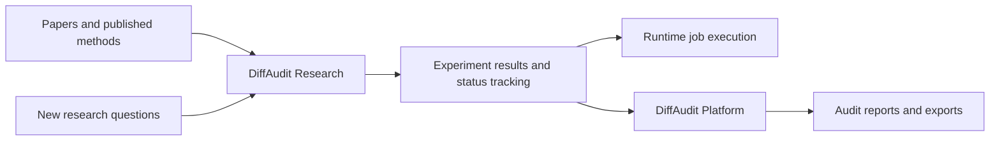

<div align="center">


# DiffAudit Research

**Privacy risk auditing for diffusion models.**

[English](README.md) | [中文](README.zh-CN.md)

[](https://github.com/DeliciousBuding/DiffAudit-Research/actions/workflows/tests.yml)


[](LICENSE)

[DiffAudit Platform](https://github.com/DeliciousBuding/DiffAudit-Platform) ·
[Documentation](docs/README.md) ·
[Getting Started](docs/start-here/getting-started.md) ·
[Data And Assets](docs/assets-and-storage/data-and-assets-handoff.md) ·
[Experiment Status](docs/evidence/reproduction-status.md) ·
[Security](SECURITY.md)

</div>

---

DiffAudit Research implements membership inference attacks and defenses for
diffusion models. It covers three attacker knowledge levels — black-box,
gray-box, and white-box — and tracks each method from paper review through
reproducible experiments.

This repository is part of the [DiffAudit](https://github.com/DeliciousBuding/DiffAudit-Platform)
system. It focuses on research code and experiment tracking; the product UI
lives in [DiffAudit Platform](https://github.com/DeliciousBuding/DiffAudit-Platform),
and job scheduling lives in Runtime-Server.

Each research direction is tracked through a consistent set of stages:

| Track | Role |
| --- | --- |
| Paper baselines | Reproduce or adapt known attack and defense methods as reference points. |
| New method exploration | Test new ideas with explicit hypotheses and conclusions. |
| Verified results | Only reviewed, reproducible experiments are promoted to this level. |

## How It Fits



## Quick Start

```powershell
git clone https://github.com/DeliciousBuding/DiffAudit-Research.git
cd DiffAudit-Research
conda env create -f environment.yml
conda activate diffaudit-research
python scripts/bootstrap_research_env.py --install
python scripts/verify_env.py
python -m diffaudit --help
```

Large datasets and model weights are not stored in Git. See
[docs/assets-and-storage/data-and-assets-handoff.md](docs/assets-and-storage/data-and-assets-handoff.md)
for how to set up local data paths.

## Documentation

| Need | Start here |
| --- | --- |
| New contributor setup | [docs/start-here/getting-started.md](docs/start-here/getting-started.md) |
| Environment setup | [docs/start-here/teammate-setup.md](docs/start-here/teammate-setup.md) |
| Datasets and model weights | [docs/assets-and-storage/data-and-assets-handoff.md](docs/assets-and-storage/data-and-assets-handoff.md) |
| CLI commands | [docs/start-here/command-reference.md](docs/start-here/command-reference.md) |
| Experiment status | [docs/evidence/reproduction-status.md](docs/evidence/reproduction-status.md) |
| Platform integration | [docs/product-bridge/README.md](docs/product-bridge/README.md) |
| Repository structure | [docs/start-here/repo-map.md](docs/start-here/repo-map.md) |
| Full documentation index | [docs/README.md](docs/README.md) |

## Repository Layout

| Path | What's inside |
| --- | --- |
| `src/diffaudit/` | Python package and CLI — attack methods, defense methods, metrics, utilities. |
| `configs/` | Experiment configs and local path templates. |
| `tests/` | Test suite. |
| `scripts/` | Setup, validation, and experiment scripts. |
| `docs/` | Contributor guide, experiment status, platform integration docs. |
| `workspaces/` | Current research state for each direction. |
| `legacy/` | Archived experiment notes and history. |
| `external/` | Upstream code clones (git-ignored). |
| `third_party/` | Vendored upstream code subsets with license notices. |

## Experiment Tracking

Each research direction has a tracking status indicating its maturity:

| Status | Meaning |
| --- | --- |
| `research-ready` | Paper, upstream code, and data requirements reviewed. |
| `code-ready` | Commands, configs, and tests exist in this repository. |
| `asset-ready` | Required datasets or model weights are available locally. |
| `evidence-ready` | A reviewed experiment summary exists. |
| `benchmark-ready` | Paper-level benchmarks can be reproduced. |

Smoke tests and dry runs are engineering checks, not benchmark results.
Negative results are kept to avoid repeating failed experiments.

## Citation and License

To cite DiffAudit Research, use [CITATION.cff](CITATION.cff). Upstream papers,
datasets, and third-party code should be cited under their own terms.

Source code, configs, tests, scripts, and original documentation are licensed
under the [Apache License 2.0](LICENSE). See
[docs/governance/licensing.md](docs/governance/licensing.md) and
[NOTICE](NOTICE) for third-party license details.
