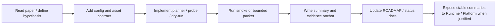

# DiffAudit Research

DiffAudit Research is the research repository for privacy-risk auditing of diffusion models. It contains the attack and defense prototypes, reproducibility scaffolding, experiment evidence, and research notes used by the DiffAudit project.

The goal is not to improve image generation quality. The goal is to test whether diffusion models memorize training samples, measure that risk under black-box / gray-box / white-box assumptions, and keep the resulting evidence reproducible enough for teammates, reviewers, Runtime, and Platform consumers.

## Start Here

If you just cloned this repository:

```powershell
conda env create -f environment.yml
conda activate diffaudit-research
python scripts/bootstrap_research_env.py --install
python scripts/verify_env.py
python -m diffaudit --help
```

Then set up assets:

```powershell
Copy-Item configs/assets/team.local.template.yaml configs/assets/team.local.yaml
python scripts/render_team_local_configs.py
```

`configs/assets/team.local.yaml` is ignored by git. Put your own absolute paths there, not in shared configs.

The expected portable layout is:

```text
<DIFFAUDIT_ROOT>/
  Research/        # this git repository
  Download/        # local datasets, weights, supplementary bundles, manifests
  Runtime-Server/  # sibling runtime service repository, when needed
  Platform/        # sibling product/platform repository, when needed
```

`<DIFFAUDIT_ROOT>` can be any directory on any machine. It is not tied to a drive letter or an author laptop.

## What Lives Where

| Location | Purpose |
| --- | --- |
| `src/diffaudit/` | Shared Python package and CLI implementation |
| `configs/` | Versioned attack, benchmark, and local-template configs |
| `tests/` | Unit tests and smoke-level contract tests |
| `experiments/` | Small committed summaries and replay/debug traces |
| `workspaces/` | Lane plans, evidence anchors, admitted artifacts, and research notes |
| `docs/` | Stable project documentation and status/navigation pages |
| `references/` | Literature index and mirrored reading material |
| `third_party/` | Minimal vendored upstream subsets committed to this repo |
| `external/` | Ignored local upstream code clones |
| `<DIFFAUDIT_ROOT>/Download/` | Ignored raw datasets, model weights, supplementary zips, and large assets |

Do not put datasets or model checkpoints in `Research/external/`. `external/` is for code clones only.

## Research Tracks

| Track | Current role | Main examples |
| --- | --- | --- |
| Black-box | Main external-observation risk line | `recon`, `variation`, `CLiD` |
| Gray-box | Mature attack + defense loop | `PIA`, `SecMI`, `SimA`, defense probes |
| White-box | Stronger internal-signal and upper-bound line | `GSA`, `DPDM/W-1`, feature/gradient probes |
| Cross-box | Evidence fusion and system-consumable summaries | unified attack-defense table, intake manifests |

Use the status docs for the latest truth. Do not infer current claims from old run folders or historical notes.

## Reproducibility Model

DiffAudit separates three states:

| State | Meaning |
| --- | --- |
| `code-ready` | The command, config, and tests exist |
| `asset-ready` | Required local datasets / weights / supplementary files are present and probed |
| `experiment-ready` | A bounded run has produced reviewed evidence and a canonical anchor |

Smoke tests and dry-runs are useful, but they are not benchmark claims.

## Core Workflow



## Documentation Map

| Need | Read |
| --- | --- |
| Teammate setup | [docs/teammate-setup.md](docs/teammate-setup.md) |
| Data and weights | [docs/data-and-assets-handoff.md](docs/data-and-assets-handoff.md) |
| Download naming rules | [docs/download-naming-policy.md](docs/download-naming-policy.md) |
| Environment details | [docs/environment.md](docs/environment.md) |
| Command recipes | [docs/command-reference.md](docs/command-reference.md) |
| Current reproduction state | [docs/reproduction-status.md](docs/reproduction-status.md) |
| One-page progress view | [docs/comprehensive-progress.md](docs/comprehensive-progress.md) |
| Research narrative and claim boundaries | [docs/mainline-narrative.md](docs/mainline-narrative.md) |
| Repo directory map | [docs/repo-map.md](docs/repo-map.md) |
| Storage boundary | [docs/storage-boundary.md](docs/storage-boundary.md) |
| GitHub collaboration | [docs/github-collaboration.md](docs/github-collaboration.md) |
| Research agent protocol | [AGENTS.md](AGENTS.md) |
| Roadmap ledger | [ROADMAP.md](ROADMAP.md) |

## Fast Validation

Run the local quality gate:

```powershell
python scripts/run_local_checks.py
```

Or run the minimum checks manually:

```powershell
python scripts/verify_env.py
python -m diffaudit --help
python -m pytest tests/test_cli_module_entrypoint.py tests/test_render_team_local_configs.py -q
```

If `pytest` is not installed in the active environment, use the environment setup command above or run with `conda run -n diffaudit-research`.

## Asset Setup

New machines should either copy a trusted project `Download/` mirror or recreate the first-wave assets listed in [docs/research-download-master-list.md](docs/research-download-master-list.md). The most important first-wave locations are:

```text
Download/shared/datasets/cifar-10-python.tar.gz
Download/shared/datasets/celeba/
Download/shared/weights/stable-diffusion-v1-5/
Download/shared/weights/clip-vit-large-patch14/
Download/shared/weights/blip-image-captioning-large/
Download/shared/weights/google-ddpm-cifar10-32/
Download/black-box/supplementary/recon-assets/
Download/black-box/supplementary/clid-mia-supplementary/
Download/gray-box/weights/secmi-cifar-bundle/
```

After downloading, bind paths through `configs/assets/team.local.yaml` and run probes before making reproduction claims.

## External Code Clones

These ignored code clones are commonly used:

```powershell
git clone https://github.com/kong13661/PIA.git external/PIA
git clone https://github.com/zhaisf/CLiD external/CLiD
git clone https://github.com/py85252876/Reconstruction-based-Attack external/Reconstruction-based-Attack
git clone https://github.com/facebookresearch/DiT.git external/DiT
git clone https://github.com/nv-tlabs/DPDM.git external/DPDM
```

Large raw assets still belong in `<DIFFAUDIT_ROOT>/Download/`.

## Collaboration Rules

- Keep shared configs portable.
- Put machine-specific paths only in ignored `*.local.yaml` files.
- Use branches and PRs for shared changes.
- Update `ROADMAP.md` and the relevant evidence anchor when a verdict changes.
- Use `Runtime-Server/` for active runtime service work and `Platform/` for UI/API product work.
- Keep research claims honest: state `blocked`, `negative`, `smoke-only`, or `admitted` explicitly.

## License And Upstream Work

This repository does not currently ship a top-level `LICENSE` file. Before redistributing code or materials, confirm the intended project license and the licenses of upstream papers, third-party code, weights, datasets, and supplementary bundles.
