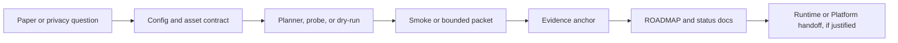

<div align="center">

# DiffAudit Research

**Reproducible research scaffolding for privacy-risk auditing of diffusion models.**

[](https://github.com/DeliciousBuding/DiffAudit-Research/actions/workflows/tests.yml)


[](LICENSE)

[Quick Start](#quick-start) ·
[Teammate Setup](docs/teammate-setup.md) ·
[Data And Assets](docs/data-and-assets-handoff.md) ·
[Command Reference](docs/command-reference.md) ·
[Current Status](docs/comprehensive-progress.md)

</div>

DiffAudit Research is the model-research repository for the DiffAudit project.
It turns diffusion-model privacy papers and attack ideas into portable configs,
CLI contracts, bounded probes, smoke tests, and reviewed evidence anchors.

This repository is not a product runtime and it does not claim that every paper
has been fully reproduced. Its job is narrower: keep the research line
auditable enough that a teammate, reviewer, Runtime service, or Platform UI can
understand what has been tested, what is only scaffolded, and what still needs
real assets or GPU time.

## What You Get

| Surface | What it provides | Where to verify |
| --- | --- | --- |
| Research CLI | Planning, probing, dry-run, and smoke commands for attack lanes | [src/diffaudit/](src/diffaudit/) and [docs/command-reference.md](docs/command-reference.md) |
| Reproduction contracts | Separation between code readiness, asset readiness, and reviewed experiment evidence | [docs/reproduction-status.md](docs/reproduction-status.md) |
| Asset handoff | Portable rules for datasets, weights, supplementary bundles, and local path binding | [docs/data-and-assets-handoff.md](docs/data-and-assets-handoff.md) |
| Evidence ledger | Admitted summaries, progress state, and claim boundaries | [docs/comprehensive-progress.md](docs/comprehensive-progress.md) and [docs/mainline-narrative.md](docs/mainline-narrative.md) |
| Cross-repo boundary | Research outputs shaped for Runtime and Platform consumers when justified | [docs/runtime.md](docs/runtime.md) and [docs/asset-registry-local-api.md](docs/asset-registry-local-api.md) |

## Reader Paths

| If you are... | Start here | Goal |
| --- | --- | --- |
| Joining the project | [docs/teammate-setup.md](docs/teammate-setup.md) | Build the environment and bind local assets without hard-coded paths |
| Reproducing a run | [docs/command-reference.md](docs/command-reference.md) | Run the exact probe, dry-run, smoke, or bounded packet that matches a lane |
| Reviewing claims | [docs/reproduction-status.md](docs/reproduction-status.md) | Check whether a result is blocked, smoke-only, negative, or admitted |
| Preparing materials | [docs/mainline-narrative.md](docs/mainline-narrative.md) | Use defensible language for the current research story |
| Integrating systems | [docs/asset-registry-local-api.md](docs/asset-registry-local-api.md) | Consume stable Research metadata from Runtime or Platform |

## Quick Start

From a fresh clone:

```powershell
conda env create -f environment.yml
conda activate diffaudit-research
python scripts/bootstrap_research_env.py --install
python scripts/verify_env.py
python -m diffaudit --help
```

Then create your ignored local asset binding:

```powershell
Copy-Item configs/assets/team.local.template.yaml configs/assets/team.local.yaml
python scripts/render_team_local_configs.py
```

Put machine-specific absolute paths only in
`configs/assets/team.local.yaml`. Shared configs, docs, and examples must stay
portable.

## Portable Layout

The expected project layout is a sibling-directory layout, not a personal drive
layout:

```text
<DIFFAUDIT_ROOT>/
  Research/        # this git repository
  Download/        # ignored datasets, weights, supplementary bundles, manifests
  Runtime-Server/  # sibling runtime service repository, when needed
  Platform/        # sibling product/platform repository, when needed
```

`<DIFFAUDIT_ROOT>` can be any directory on any machine. Do not commit paths that
depend on a local username, drive letter, or workstation.

## Research Tracks

| Track | Role | Representative methods |
| --- | --- | --- |
| Black-box | External-observation privacy risk | `recon`, `variation`, `CLiD` |
| Gray-box | Mature attack and defense loop | `PIA`, `SecMI`, `SimA`, defense probes |
| White-box | Internal-signal and upper-bound exploration | `GSA`, `DPDM/W-1`, feature and gradient probes |
| Cross-box | Evidence fusion and system-consumable summaries | unified attack-defense tables, intake manifests |

Use [docs/comprehensive-progress.md](docs/comprehensive-progress.md) and
[ROADMAP.md](ROADMAP.md) for the latest research truth. Do not infer current
claims from old run folders or historical notes.

## Reproducibility Contract

DiffAudit separates readiness into three states:

| State | Meaning |
| --- | --- |
| `code-ready` | The command, config, and tests exist |
| `asset-ready` | Required local datasets, weights, or supplementary files are present and probed |
| `experiment-ready` | A bounded run has produced reviewed evidence and a canonical anchor |

Smoke tests and dry-runs are useful engineering signals, but they are not
benchmark claims.



## Repository Surface

| Location | Purpose |
| --- | --- |
| [src/diffaudit/](src/diffaudit/) | Shared Python package and CLI implementation |
| [configs/](configs/) | Versioned attack, benchmark, and local-template configs |
| [tests/](tests/) | Unit tests and smoke-level contract tests |
| [experiments/](experiments/) | Small committed summaries and replay/debug traces |
| [workspaces/](workspaces/) | Lane plans, evidence anchors, admitted artifacts, and research notes |
| [docs/](docs/) | Stable project documentation and status/navigation pages |
| [references/](references/) | Literature index and mirrored reading material |
| [third_party/](third_party/) | Minimal vendored upstream subsets committed to this repo |
| `external/` | Ignored local upstream code clones |
| `<DIFFAUDIT_ROOT>/Download/` | Ignored raw datasets, model weights, supplementary bundles, and large manifests |

Do not put datasets or model checkpoints in `Research/external/`. `external/`
is for code clones only; large assets belong in `<DIFFAUDIT_ROOT>/Download/`.

## Validation

Run the local quality gate:

```powershell
python scripts/run_local_checks.py
```

Or run the minimum checks manually:

```powershell
python scripts/verify_env.py
python -m diffaudit --help
python -m pytest tests/test_cli_module_entrypoint.py tests/test_render_team_local_configs.py -q
```

If `pytest` is not installed in the active environment, use the setup command
above or run through `conda run -n diffaudit-research`.

## Assets And External Code

New machines should either copy a trusted project `Download/` mirror or recreate
the first-wave assets listed in
[docs/research-download-master-list.md](docs/research-download-master-list.md).
The naming policy is documented in
[docs/download-naming-policy.md](docs/download-naming-policy.md).

Common first-wave asset locations:

```text
Download/shared/datasets/cifar-10-python.tar.gz
Download/shared/datasets/celeba/
Download/shared/weights/stable-diffusion-v1-5/
Download/shared/weights/clip-vit-large-patch14/
Download/shared/weights/blip-image-captioning-large/
Download/shared/weights/google-ddpm-cifar10-32/
Download/black-box/supplementary/recon-assets/
Download/black-box/supplementary/clid-mia-supplementary/
Download/gray-box/weights/secmi-cifar-bundle/
```

Common ignored upstream code clones:

```powershell
git clone https://github.com/kong13661/PIA.git external/PIA
git clone https://github.com/zhaisf/CLiD external/CLiD
git clone https://github.com/py85252876/Reconstruction-based-Attack external/Reconstruction-based-Attack
git clone https://github.com/facebookresearch/DiT.git external/DiT
git clone https://github.com/nv-tlabs/DPDM.git external/DPDM
```

Bind real local paths through `configs/assets/team.local.yaml` and run probes
before making reproduction claims.

## Documentation

| Need | Read |
| --- | --- |
| Full docs index | [docs/README.md](docs/README.md) |
| New teammate setup | [docs/teammate-setup.md](docs/teammate-setup.md) |
| Data and weights | [docs/data-and-assets-handoff.md](docs/data-and-assets-handoff.md) |
| Environment details | [docs/environment.md](docs/environment.md) |
| Command recipes | [docs/command-reference.md](docs/command-reference.md) |
| Current reproduction state | [docs/reproduction-status.md](docs/reproduction-status.md) |
| One-page progress view | [docs/comprehensive-progress.md](docs/comprehensive-progress.md) |
| Claim boundaries | [docs/mainline-narrative.md](docs/mainline-narrative.md) |
| Directory map | [docs/repo-map.md](docs/repo-map.md) |
| Storage boundary | [docs/storage-boundary.md](docs/storage-boundary.md) |
| GitHub workflow | [docs/github-collaboration.md](docs/github-collaboration.md) |
| Licensing scope | [docs/licensing.md](docs/licensing.md) |
| Contribution guide | [CONTRIBUTING.md](CONTRIBUTING.md) |

## Collaboration Rules

- Keep shared configs portable.
- Put machine-specific paths only in ignored `*.local.yaml` files.
- Use branches and pull requests for shared changes.
- Update [ROADMAP.md](ROADMAP.md) and the relevant evidence anchor when a verdict changes.
- Use `Runtime-Server/` for active runtime service work and `Platform/` for UI/API product work.
- Keep research claims honest: state `blocked`, `negative`, `smoke-only`, or `admitted` explicitly.

## License And Upstream Work

First-party DiffAudit Research source code, configuration templates, tests,
scripts, and original project documentation are licensed under the
[Apache License 2.0](LICENSE).

The project license does not relicense third-party code, paper PDFs, extracted
figures, datasets, model weights, supplementary bundles, or ignored upstream
clones. See [docs/licensing.md](docs/licensing.md) and [NOTICE](NOTICE) for the
license scope and retained third-party notices.
