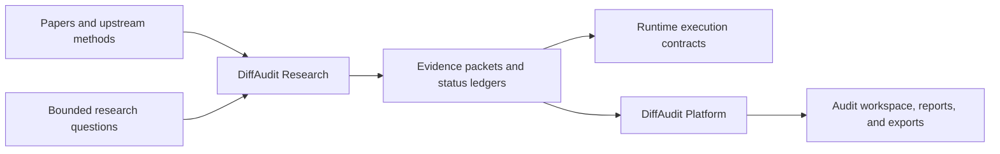

<div align="center">


# DiffAudit Research

**Evidence engine for diffusion-model privacy auditing.**

[](https://github.com/DeliciousBuding/DiffAudit-Research/actions/workflows/tests.yml)


[](LICENSE)

[DiffAudit Platform](https://github.com/DeliciousBuding/DiffAudit-Platform) ·
[Documentation](docs/README.md) ·
[Getting Started](docs/start-here/getting-started.md) ·
[Data And Assets](docs/assets-and-storage/data-and-assets-handoff.md) ·
[Evidence](docs/evidence/reproduction-status.md) ·
[Security](SECURITY.md)

</div>

---

DiffAudit Research is the research and evidence layer behind **DiffAudit**, a
privacy-audit system for diffusion models. It turns papers, attacks, defenses,
experiments, and negative findings into reviewed evidence that can be consumed
by researchers, Runtime jobs, and the
[DiffAudit Platform](https://github.com/DeliciousBuding/DiffAudit-Platform).

This repository is not just a paper-reproduction archive and not a free-form
experiment dump. Its job is to keep three things separate:

| Layer | Meaning | Product value |
| --- | --- | --- |
| Paper baselines | Reproduce or adapt known attacks and defenses. | Ground the audit in comparable research instead of custom-only metrics. |
| Bounded exploration | Test new hypotheses with explicit budgets and verdicts. | Find candidate innovation without overstating weak or negative results. |
| Admitted evidence | Promote only reviewed, status-labeled results. | Feed Platform and reports with claims that have known limits. |

## How It Fits



## Quick Start

```powershell
git clone https://github.com/DeliciousBuding/DiffAudit-Research.git
cd DiffAudit-Research
conda env create -f environment.yml
conda activate diffaudit-research
python scripts/bootstrap_research_env.py --install
python scripts/verify_env.py
python -m diffaudit --help
```

Large datasets, model weights, supplementary bundles, and local upstream clones
are not stored in Git. Start with
[docs/assets-and-storage/data-and-assets-handoff.md](docs/assets-and-storage/data-and-assets-handoff.md)
to rebuild the same asset layout.

## Read This First

| Need | Start here |
| --- | --- |
| New contributor setup | [docs/start-here/getting-started.md](docs/start-here/getting-started.md) |
| Machine/environment setup | [docs/start-here/teammate-setup.md](docs/start-here/teammate-setup.md) |
| Data, weights, and external code | [docs/assets-and-storage/data-and-assets-handoff.md](docs/assets-and-storage/data-and-assets-handoff.md) |
| CLI commands | [docs/start-here/command-reference.md](docs/start-here/command-reference.md) |
| Reproduction status | [docs/evidence/reproduction-status.md](docs/evidence/reproduction-status.md) |
| Product-facing evidence | [docs/product-bridge/README.md](docs/product-bridge/README.md) |
| Repository map | [docs/start-here/repo-map.md](docs/start-here/repo-map.md) |
| Full documentation map | [docs/README.md](docs/README.md) |

## Repository Layout

| Path | Role |
| --- | --- |
| `src/diffaudit/` | Python package and CLI implementation. |
| `configs/` | Versioned configs and local path templates. |
| `tests/` | Contract tests and smoke checks. |
| `scripts/` | Reusable validation, setup, and replay helpers. |
| `docs/` | Public onboarding plus internal research documentation. |
| `workspaces/` | Current lane status and active research coordination. |
| `legacy/` | Archived evidence notes and execution history. |
| `external/` | Ignored upstream clones for local exploration. |
| `third_party/` | Minimal vendored upstream subsets with notices. |

## Evidence Discipline

DiffAudit uses status labels instead of vague claims:

| Status | Meaning |
| --- | --- |
| `research-ready` | Paper, upstream code, and required assets have been reviewed. |
| `code-ready` | Commands, configs, and tests exist. |
| `asset-ready` | Required local datasets or weights have been probed. |
| `evidence-ready` | A reviewed summary or verdict exists. |
| `benchmark-ready` | The lane can reasonably claim paper-level benchmark execution. |

Dry runs and smoke tests are engineering checks, not scientific claims.
Negative and blocked results are retained because they prevent repeated
low-value GPU work and keep product claims honest.

## Citation And License

If you use DiffAudit Research as a research artifact or reproducibility
scaffold, cite [CITATION.cff](CITATION.cff). Cite upstream papers, datasets,
weights, and third-party code separately under their own terms.

First-party DiffAudit Research source code, configuration templates, tests,
scripts, and original documentation are licensed under the
[Apache License 2.0](LICENSE). See
[docs/governance/licensing.md](docs/governance/licensing.md) and
[NOTICE](NOTICE) for third-party boundaries.
