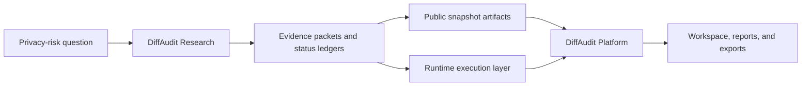

<div align="center">

# DiffAudit Research

**Evidence engine for diffusion-model privacy auditing.**<br>
**扩散模型隐私审计的研究证据引擎。**

[](https://github.com/DeliciousBuding/DiffAudit-Research/actions/workflows/tests.yml)


[](LICENSE)

[DiffAudit Platform](https://github.com/DeliciousBuding/DiffAudit-Platform) ·
[English](#diffaudit-research) ·
[简体中文](#简体中文速览) ·
[Documentation](docs/README.md) ·
[Reproducibility](docs/reproduction-status.md) ·
[Data And Assets](docs/data-and-assets-handoff.md) ·
[Security](SECURITY.md)

</div>

---

DiffAudit Research is the experiment and evidence layer for **DiffAudit**, a
privacy-audit system for evaluating whether diffusion models expose
training-data membership signals.

The product-facing workspace lives in
[DiffAudit Platform](https://github.com/DeliciousBuding/DiffAudit-Platform).
This repository supplies the research side of that system: attack and defense
methods, reproducibility contracts, reviewed evidence anchors, and the
claim-boundary language needed to turn model-risk experiments into audit
material that can be inspected by researchers, reviewers, and product users.

## 简体中文速览

DiffAudit Research 是 **DiffAudit** 的研究证据引擎，用于把扩散模型隐私风险问题转化为可复现命令、证据锚点、数据/权重契约和可被产品层消费的结论边界。

[DiffAudit Platform](https://github.com/DeliciousBuding/DiffAudit-Platform) 是产品化工作台，负责展示审计流程、报告、导出和评审体验；本仓库负责支撑这些展示背后的实验、方法和证据。

| 你关心的问题 | DiffAudit Research 提供的能力 |
| --- | --- |
| 研究结论从哪里来？ | 维护攻击/防御方法、实验脚本、证据状态和结论边界。 |
| 新成员能否接手复现？ | 提供环境、命令、资产清单和复现状态文档。 |
| 哪些结果可以放进产品展示？ | 只把有明确状态和证据锚点的结果作为 Platform 或报告材料的输入。 |
| 数据集和模型权重怎么办？ | 大文件不进入 Git；通过资产交接文档和 manifest 说明如何获取与绑定。 |

## How It Fits



| Layer | Role |
| --- | --- |
| [DiffAudit Research](https://github.com/DeliciousBuding/DiffAudit-Research) | Produces attack/defense methods, bounded experiments, evidence status, and reproducibility contracts. |
| [DiffAudit Platform](https://github.com/DeliciousBuding/DiffAudit-Platform) | Presents selected evidence through a product workspace, report views, exports, and reviewer-facing workflows. |
| Runtime integration | Runs live audit jobs when a deployment connects the research contracts to an execution service. |

## Research Capabilities

| Capability | What this repository provides |
| --- | --- |
| Attack-lane scaffolding | Configured entry points for black-box, gray-box, white-box, and cross-box privacy-risk studies. |
| Evidence discipline | Clear separation between implemented code, available assets, smoke checks, negative results, and reviewed evidence. |
| Reproducible commands | CLI contracts and testable scripts for planning, probing, dry-runs, and bounded experiment packets. |
| Asset contracts | Documentation for datasets, model weights, supplementary bundles, and external code required to reproduce selected lanes. |
| Platform handoff | Research summaries and metadata shaped so selected results can be published into Platform snapshots or reports. |

Representative research tracks include reconstruction-style membership
inference, CLiD-style black-box studies, gray-box attack and defense probes,
white-box upper-bound exploration, and cross-box evidence fusion. Current
status is tracked in [docs/comprehensive-progress.md](docs/comprehensive-progress.md)
and [docs/reproduction-status.md](docs/reproduction-status.md).

## Evidence Model

DiffAudit does not treat every configured paper or smoke test as a validated
benchmark. The canonical reproduction ladder is maintained in
[docs/reproduction-status.md](docs/reproduction-status.md):

| State | Meaning |
| --- | --- |
| `research-ready` | Papers, upstream code, and asset requirements have been reviewed. |
| `code-ready` | Commands, configs, and tests are present. |
| `evidence-ready` | The repository contains a submit-ready summary or equivalent run evidence. |
| `asset-ready` | Required datasets, weights, or supplementary files are available and probed. |
| `benchmark-ready` | The lane can reasonably claim paper-level benchmark execution or recomputation. |

This boundary matters for presentation: dry-runs and smoke tests are useful
engineering signals, but they are not scientific claims. Qualifiers such as
`blocked`, `negative`, or `smoke-only` are verdict language attached to a
specific lane, not replacements for the reproduction ladder.

## Quick Start

```powershell
git clone https://github.com/DeliciousBuding/DiffAudit-Research.git
cd DiffAudit-Research
conda env create -f environment.yml
conda activate diffaudit-research
python scripts/bootstrap_research_env.py --install
python scripts/verify_env.py
python -m diffaudit --help
```

For datasets, model weights, supplementary bundles, and external upstream code,
start with [docs/data-and-assets-handoff.md](docs/data-and-assets-handoff.md).
The repository keeps large or third-party artifacts outside Git while retaining
the manifests and setup contracts needed for another teammate to reproduce the
same research environment.

## Repository Tour

| Location | Purpose |
| --- | --- |
| [src/diffaudit/](src/diffaudit/) | Python package and CLI surface. |
| [configs/](configs/) | Versioned research configs and local-template examples. |
| [tests/](tests/) | Contract tests and smoke-level validation. |
| [experiments/](experiments/) | Small committed summaries and replay/debug traces. |
| [workspaces/](workspaces/) | Lane plans, evidence anchors, admitted artifacts, and research notes. |
| [docs/](docs/) | Stable documentation for setup, evidence, assets, status, and handoff. |
| [references/](references/) | Literature index and reading material. |
| [third_party/](third_party/) | Minimal vendored upstream subsets retained with their own notices. |

## Documentation

| Need | Read |
| --- | --- |
| Project documentation map | [docs/README.md](docs/README.md) |
| New teammate onboarding | [docs/teammate-setup.md](docs/teammate-setup.md) |
| Data, weights, and external assets | [docs/data-and-assets-handoff.md](docs/data-and-assets-handoff.md) |
| Command recipes | [docs/command-reference.md](docs/command-reference.md) |
| Reproduction and evidence status | [docs/reproduction-status.md](docs/reproduction-status.md) |
| Current progress snapshot | [docs/comprehensive-progress.md](docs/comprehensive-progress.md) |
| Presentation-safe research story | [docs/mainline-narrative.md](docs/mainline-narrative.md) |
| Research-to-system boundary | [docs/research-boundary-card.md](docs/research-boundary-card.md) |
| Licensing scope | [docs/licensing.md](docs/licensing.md) |
| Contribution workflow | [CONTRIBUTING.md](CONTRIBUTING.md) |

## Validation

Run the standard local gate before publishing changes:

```powershell
python scripts/run_local_checks.py
```

For a lightweight command-path check:

```powershell
python scripts/verify_env.py
python -m diffaudit --help
python -m pytest tests/test_cli_module_entrypoint.py tests/test_render_team_local_configs.py -q
```

## Citation And License

If you use DiffAudit Research as a research artifact or reproducibility
scaffold, cite the repository metadata in [CITATION.cff](CITATION.cff). Cite
upstream papers, datasets, weights, and third-party code separately under their
own terms.

First-party DiffAudit Research source code, configuration templates, tests,
scripts, and original documentation are licensed under the
[Apache License 2.0](LICENSE). The project license does not relicense
third-party code, paper PDFs, extracted figures, datasets, model weights,
supplementary bundles, or ignored upstream clones. See
[docs/licensing.md](docs/licensing.md) and [NOTICE](NOTICE) for details.
