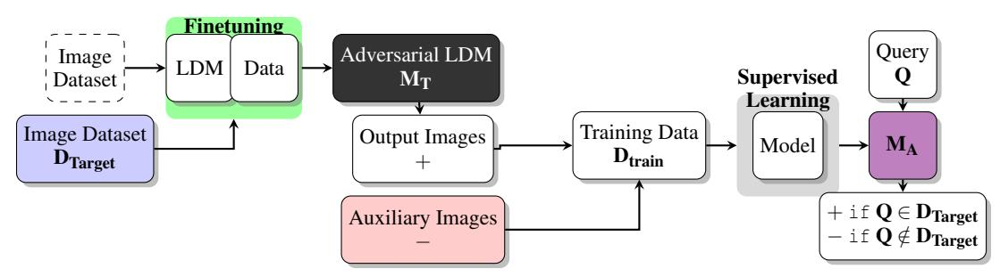
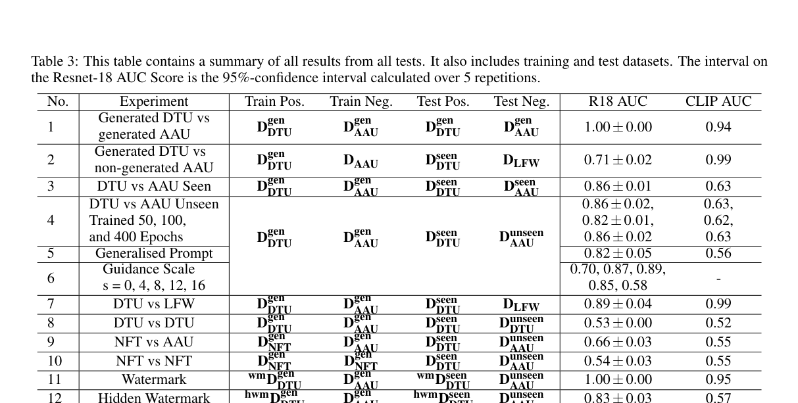

# 人脸微调潜变量扩散模型成员推断攻击论文报告

Membership Inference Attacks for Face Images Against Fine-Tuned Latent Diffusion Models

## 文献信息

- 英文标题：Membership Inference Attacks for Face Images Against Fine-Tuned Latent Diffusion Models
- 中文标题：面向人脸微调潜变量扩散模型的成员推断攻击
- 作者：Lauritz Christian Holme, Anton Mosquera Storgaard, Siavash Arjomand Bigdeli
- 发表信息：VISAPP 2025
- 论文主问题：当 Stable Diffusion v1.5 被一批人脸照片微调后，黑盒攻击者能否仅凭文本查询和生成结果判断该批照片是否属于训练集
- 威胁模型类别：`black-box`、数据集级成员推断、面向人脸域微调模型
- 材料索引路径：`references/materials/black-box/2025-visapp-membership-inference-face-fine-tuned-latent-diffusion-models.pdf`
- 上游来源 URL：见 `references/materials/manifest.csv` 中对应的 `source_url` 字段
- 原文 Markdown 精修版链接：[OCR精修版：Membership Inference Attacks for Face Images Against Fine-Tuned Latent Diffusion Models](https://www.feishu.cn/docx/Vmrzdsvo3oDbTHxXng1cGUJXn5d)
- 飞书原生 PDF：[2025-visapp-membership-inference-face-fine-tuned-latent-diffusion-models.pdf](https://ncn24qi9j5mt.feishu.cn/file/FVslb3Bbzo2Nb7xDylpcF5TKn2c)
- 开源实现：[osquera/MIA_SD](https://github.com/osquera/MIA_SD)
- 报告状态：`draft-for-feishu`

## 1. 论文定位

这篇论文属于黑盒成员推断路线中的场景化案例论文。它不追求给出适用于所有扩散模型的统一攻击，而是把问题收缩到更敏感也更现实的人脸域微调场景，考察外部审计者能否判断某批人脸是否被用于微调 Stable Diffusion v1.5。对 DiffAudit 而言，它更像黑盒路线中的风险示例和条件分析材料，而不是主线算法论文。

## 2. 核心问题

论文试图回答两个相连的问题。第一，在只能调用文本到图像接口的条件下，目标模型是否会泄露其微调数据分布。第二，这种泄露究竟能支持多细粒度的成员判断。作者给出的结论是，数据集级判断可以成立，但单张图像级判断基本失败。

## 3. 威胁模型与前提

攻击者只能像普通用户一样输入 prompt 并接收生成图像，无法访问模型权重、梯度、中间噪声预测或训练日志。攻击者还需要一个同域但不与目标训练集重合的辅助数据源，用于构造攻击模型的负样本。论文结论的适用边界很窄，只覆盖人脸域、Stable Diffusion v1.5 和微调后模型，不适用于未微调模型，也没有证明样本级成员归因可行。

## 4. 方法总览

作者没有直接对查询图像和目标模型做逐样本距离匹配，而是先让目标模型生成一批人脸图像，把这些输出当作“成员分布代理正样本”，再配合同域辅助负样本训练一个 ResNet-18 二分类器。方法直觉是，如果目标模型对微调集过拟合，那么生成分布会带出训练集的统计特征，攻击分类器就能据此区分“更像目标训练域”的样本集合。

## 5. 方法概览 / 流程

完整流程可以概括为四步：先收集公开的人脸照片并切分为 `seen` 与 `unseen`；再用 `seen` 子集微调 Stable Diffusion v1.5，得到目标模型 `M_T`；随后固定 prompt、采样步数和 guidance scale 生成 `D_gen` 作为攻击训练正样本；最后将 `D_gen` 与 auxiliary negatives 组合，训练 ResNet-18 攻击模型 `M_A`。这条路线与直接做重构误差阈值的黑盒方法不同，它把成员推断转化成“生成分布代理监督分类”。

上图把论文的闭环压缩得很清楚：目标模型并不直接输出成员判定，而是先生成可用于训练攻击器的替身正样本。对 DiffAudit 来说，这张图的价值在于提醒我们，这篇论文需要额外训练一个攻击分类器，而不是沿用当前 `recon` 路线的单阈值推断。

## 6. 关键技术细节

论文先把目标模型和攻击模型形式化为

$$
M_T:\mathcal{T}\rightarrow \mathbb{R}^{H\times W\times 3}, \qquad
M_A:\mathbb{R}^{H\times W\times 3}\rightarrow \mathcal{P}.
$$

这个定义看似简单，但它明确了信号来源只能是生成接口暴露出的图像分布，而不是模型内部表征。也正因为如此，作者必须借助 `D_gen` 作为正样本代理，否则无法在黑盒条件下直接获得带标签的成员样本。

论文还强调 classifier-free guidance 会改变生成分布，因此攻击效果与推理超参数绑定：

$$
\varepsilon_t=\varepsilon_{t,\mathrm{uncond}}+s\cdot\left(\varepsilon_{t,\tau(y)}-\varepsilon_{t,\mathrm{uncond}}\right).
$$

作者报告 `s` 位于 `4` 到 `12` 时 AUC 最强，`s=16` 时出现明显伪影且攻击下降。这个现象说明成员信号不是抽象存在于任何输出中，而是依赖目标模型仍然稳定贴近训练分布。如果生成质量已经因为过强 guidance 发生失真，攻击器反而更难学习稳定边界。

## 7. 实验设置

实验数据主要来自 DTU 与 AAU 公开头像，二者均被切分为 `seen` 与 `unseen` 子集；额外负样本集合使用 `LFW`。目标模型统一为 Stable Diffusion v1.5，不同实验改变微调轮数、水印、混合集和推理 guidance。攻击模型为替换末层的 ResNet-18，训练正样本通常是目标模型生成的 2,500 张人脸图像，评估指标以 AUC 为主，并对攻击模型重复训练 5 次报告置信区间。

## 8. 主要结果

最重要的结论是，这篇方法对数据集级成员推断有效。`D^seen_{DTU}` 对 `D^unseen_{AAU}` 在 50、100、400 epochs 下的 AUC 分别约为 `0.86 ± 0.02`、`0.82 ± 0.01`、`0.86 ± 0.02`，说明信号并不只依赖极端长时间训练。与此同时，`D^seen_{DTU}` 对 `D^unseen_{DTU}` 的 AUC 只有 `0.53 ± 0.00`，几乎等于随机猜测，直接表明该攻击无法支撑单样本级判定。

第二个值得注意的结果是，辅助数据构造和水印会显著放大或扭曲成员信号。作者发现 generated auxiliary negatives 明显优于直接使用真实图像；visible watermark 可把 AUC 提升到 `1.00 ± 0.00`，hidden watermark 则只有 `0.83 ± 0.03`。因此论文最有价值的不是“黑盒一定能打成”，而是“哪些生成条件会放大这类数据集级泄露”。

这张总表把论文所有关键结论放在同一张图上：数据集级攻击可行、样本级攻击失败、guidance 和 watermark 会显著改变 AUC、未微调模型对照接近随机。它比单独挑一条曲线更适合展示稿，因为读者能直接看到这条路线真正稳固的边界在哪里。

## 9. 优点

- 威胁模型定义克制，明确限定为真实黑盒文本到图像访问。
- 实验变量覆盖较全，同时检查训练轮数、prompt、guidance、辅助数据和水印。
- 作者主动承认单样本级攻击失败，也指出部分实验会被分布重合人为放大。

## 10. 局限与有效性威胁

这篇论文的局限同样非常明确。首先，结论几乎全部建立在人脸域和 SD v1.5 上，外推到通用图像域、DiT 或更大规模基础模型都缺乏证据。其次，攻击成功依赖辅助负样本构造，如果训练负样本与测试负样本共享分布，指标会出现人工增益，这会削弱“纯成员性信号”的说服力。最后，它只能判断某批数据是否参与过微调，不能给出可提交的样本级证据。

## 11. 对 DiffAudit 的价值

对 DiffAudit 来说，这篇论文最直接的价值是补充“敏感人脸数据也可能在黑盒接口下泄露训练参与信息”的叙事。它不适合直接替换当前主线黑盒实现，因为仓库尚未具备人脸抓取、BLIP 标注、SD v1.5 人脸微调和攻击分类器训练流水线；但它非常适合指导黑盒实验分层，尤其是记录目标域是否为人脸、是否存在水印、以及 guidance 设置是否会放大成员信号。

## 12. 关键图使用方式

本报告正文只保留两张图。方法图负责解释这篇论文与当前黑盒主线的根本差异，即它需要先生成代理正样本再训练攻击分类器；主结果表负责展示攻击有效性的真实边界，即数据集级有效、样本级无效、且多项实验条件会显著改变结果。这样的图文组织足以支撑展示稿，不需要再堆叠额外截图。

## 13. 复现评估

若要忠实复现，至少需要四类资产：可微调的 SD v1.5 环境、面向 DTU/AAU 风格的人脸数据和 `seen/unseen` 划分、BLIP 自动标注流程、以及 ResNet-18 攻击训练脚本。当前仓库可以复用黑盒项目的实验组织方式，但缺少 face-specific 数据准备、微调和代理分类器训练能力，所以这篇论文更接近 `research-ready` 参考材料，而非短期可落地实现。

## 14. 写回总索引用摘要

这篇论文研究黑盒人脸成员推断问题，关注点不是恢复具体训练照片，而是判断某批人脸是否参与了 Stable Diffusion v1.5 的微调。它把问题限定在 face-image fine-tuning 场景，因此是一篇高敏感领域的案例论文。

方法上，作者先用目标模型生成图像，把这些输出当作成员分布代理正样本，再配合同域辅助负样本训练 ResNet-18 攻击器。结果表明，数据集级攻击通常有效，代表性设定下 AUC 约为 `0.82` 到 `0.86`；visible watermark 会显著放大信号；但同分布的单样本级识别接近随机。

它对 DiffAudit 的价值不在于直接给出一条可复用的主线算法，而在于补充了面向敏感人脸数据的黑盒风险叙事，并揭示了 guidance、辅助数据构造和水印这些条件变量会显著改变成员信号强度。
