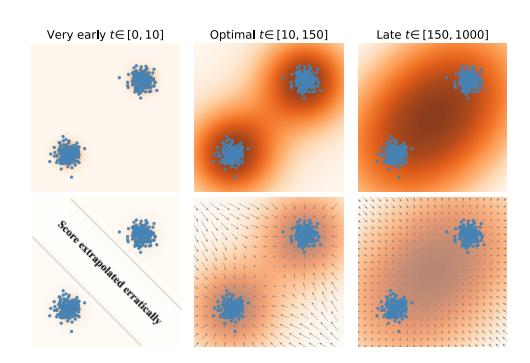

# 扩散模型的基于 score 的成员推断
SCORE-BASED MEMBERSHIP INFERENCE ON DIFFUSION MODELS

## 文献信息

- 英文标题：SCORE-BASED MEMBERSHIP INFERENCE ON DIFFUSION MODELS
- 中文标题：扩散模型的基于 score 的成员推断
- 作者：Mingxing Rao, Bowen Qu, Daniel Moyer
- 发表 venue / year / version：arXiv preprint，2025，本文核对版本为 arXiv:2509.25003v1
- 论文主问题：在 gray-box 条件下，攻击者是否只靠单次读取 denoiser 的预测噪声，就能判断一张图像是否属于扩散模型训练集
- 威胁模型类别：gray-box，score-based membership inference，single-query attack
- 材料索引路径：`references/materials/gray-box/2025-arxiv-sima-score-based-membership-inference-diffusion-models.pdf`
- 上游来源 URL：见 `references/materials/manifest.csv` 中对应的 `source_url` 字段
- 飞书原生 PDF：[2025-arxiv-sima-score-based-membership-inference-diffusion-models.pdf](https://ncn24qi9j5mt.feishu.cn/file/DxgtbkEpmo6nkkxRH94cQcEsn8d)
- OCR 精修版链接：[OCR精修版：SCORE-BASED MEMBERSHIP INFERENCE ON DIFFUSION MODELS](https://www.feishu.cn/docx/LH2Md0AYIox0p1xHGRhc9Gn6nmz)
- 开源实现：[mx-ethan-rao/SimA](https://github.com/mx-ethan-rao/SimA)
- 报告状态：已完成

## 1. 论文定位

这是一篇典型的 gray-box 扩散模型成员推断攻击论文，同时又兼具一部分机制解释工作。它不是去设计更复杂的多轮查询流程，而是反过来论证：对扩散模型而言，很多已有成员推断方法其实都在间接测量同一件事，即查询点处的 denoiser 或 score 是否更像训练样本邻域中的局部极值。作者据此提出 SimA，把攻击压缩成单时间步、单次查询、单个范数统计量。

因此，这篇论文在 DiffAudit 里的位置不只是“又一个 gray-box 方法”，而是 gray-box 主线里的极简基线论文。它一方面提供最短路径实现，另一方面还给出一个非常重要的分叉结论：像素空间 DDPM / Guided Diffusion 与潜空间 LDM / Stable Diffusion 在成员泄露上表现出明显不同的脆弱性。

## 2. 核心问题

论文试图回答两个紧密相关的问题。第一，若攻击者能够对目标扩散模型在指定时间步查询预测噪声 $\hat{\epsilon}_{\theta}(x,t)$，那么预测噪声的范数本身是否已经足够构成有效的成员分数。第二，如果这个分数确实有效，那么它捕获的到底是训练记忆带来的局部几何偏置，还是只是在某些模型和数据集上的经验巧合。

作者的回答是偏肯定的，但边界也说得比较清楚：在像素空间扩散模型上，这个单查询分数已经能达到很强效果；而在 latent diffusion 上，同类分数整体退化，说明泄露机制并不只由 diffusion process 单独决定。

## 3. 威胁模型与前提

论文设定的是 gray-box 攻击。攻击者能访问目标模型的 denoiser 接口，输入查询图像 $x$ 和时间步 $t$，读取对应的预测噪声向量 $\hat{\epsilon}_{\theta}(x,t)$。攻击者看不到训练集本身，也不要求重新训练影子模型，但需要知道扩散时间步接口、噪声日程，并拥有一组成员 / 非成员验证样本来标定阈值。

这篇论文的结论不适用于只有最终采样 API 的弱黑盒服务，也不打算覆盖明显离群的 OOD 查询。作者明确指出，极早时间步会遇到低密度区域的 score 外推问题，极晚时间步又会被高斯平滑抹掉成员差异，因此方法有效性依赖于中早期时间步的可查询性和数据分布支持。

## 4. 方法总览

SimA 的直觉非常直接：如果一张图像真的是训练成员，那么在中早期扩散时间步上，它更像是训练样本邻域中的局部中心点，模型预测出的去噪方向更短，因而预测噪声范数更小；如果它只是同分布但未出现在训练集中的 held-out 图像，那么局部核均值一般不会与该点完全重合，预测噪声范数就会更大。

作者把这一观察写成单个统计量 $A(x,t)=\|\hat{\epsilon}_{\theta}(x,t)\|_p$。攻击时只需挑一个时间步 $t$，对样本做一次前向查询，计算范数，再与阈值比较即可。与 PIA、PFAMI、SecMI、Loss 等方法相比，SimA 的贡献不在于引入一个全新信号，而在于指出这些方法大多是在不同采样设定下间接测量同一类 score-based 泄露，而 SimA 取的是其中最直接、查询成本最低的版本。

## 5. 方法概览 / 流程

实际流程可以压缩成三步。第一步，在验证集上扫描时间步并确定阈值，论文对需要时间步的攻击统一扫描了 $t=0:300$。第二步，对待测图像查询一次 denoiser，得到 $\hat{\epsilon}_{\theta}(x,t)$ 并计算范数。第三步，将该分数与阈值比较，较小者判为成员。

对实现最有帮助的不是公式本身，而是时间步选择规律。论文指出，最早几个时间步处在低密度外推区，score 场会不稳定；太晚时又会因为平滑过强而向全局均值塌缩。作者给出的经验结论是，真正有区分度的往往是中早期时间步，而不是直觉上的 $t=0$。

上图展示了作者对时间步选择的解释：过早时 score 在模式间隙中会出现外推误差，过晚时数据分布接近各向同性高斯，成员信号被抹平；只有中早期时间步既保留局部结构，又有足够平滑的 score 场，才最适合做成员推断。这张图对 DiffAudit 的直接价值，是告诉我们实现时应把“时间步扫描”视为核心配置，而不是附属调参。

## 6. 关键技术细节

论文把攻击统计量定义为

$$
A(x,t)=\left\|\hat{\epsilon}_{\theta}(x,t)\right\|_p.
$$

这里的关键不是范数本身，而是 $\hat{\epsilon}_{\theta}(x,t)$ 与局部 denoising mean 的关系。在 VP forward process 下，

$$
x_t=\sqrt{\bar{\alpha}_t}x_0+\sigma_t\epsilon,\qquad \epsilon\sim\mathcal{N}(0,I),
$$

而模型预测噪声可近似写成

$$
\hat{\epsilon}_{\theta}(x,t)\approx
\frac{x-\sqrt{\bar{\alpha}_t}\mu_t(x)}{\sigma_t}
=-\sigma_t \nabla_x \log p_t(x).
$$

因此，预测噪声实际上是在衡量“查询点 $x$ 离局部核均值 $\mu_t(x)$ 有多远”。有限训练集情况下，这个局部均值又可写为训练样本的核加权平均：

$$
\mu_t^{\mathrm{finite}}(x)=\sum_{i=1}^{N}w_i(x,t)x^{(i)},\qquad
w_i(x,t)\propto \exp\!\left(-\frac{\|x-\sqrt{\bar{\alpha}_t}x^{(i)}\|_2^2}{2\sigma_t^2}\right).
$$

若 $x=x^{(k)}$ 本身就是训练成员，那么当 $t\to 0$ 时，权重会塌缩到第 $k$ 个训练样本，因而 $\mu_t^{\mathrm{finite}}(x^{(k)})\to x^{(k)}$，进而得到 $\|\hat{\epsilon}_{\theta}(x^{(k)},t)\|\to 0$。若 $x^{\dagger}$ 只是同分布 held-out 点，则局部核均值通常不等于该点本身，范数会保持非零。作者实验上最终多用 $\ell_4$ 范数，但理论主线并不依赖必须取哪一个 $p$。

## 7. 实验设置

主实验覆盖四类像素空间 DDPM 数据集：CIFAR-10、CIFAR-100、STL10-U、CelebA；成员 / 非成员划分分别为 25k/25k、25k/25k、50k/50k、30k/30k，分辨率统一为 $32\times 32$。进一步，作者在公开 Guided Diffusion 的 ImageNet-1K 检查点上，以 ImageNetV2 作为 held-out，对 3k / 3k 样本进行比较。

基线包括 PIA、PFAMIMet、SecMIstat 和 Loss。评估指标为 ASR、AUC、TPR@1%FPR 与查询次数。对需要时间步的攻击，作者统一扫描 $t=0:300$ 并报告最优结果；PFAMIMet 因为与时间步无关，不需要额外扫描。

附录还把同类攻击迁移到 LDM 和 Stable Diffusion，覆盖 ImageNet-1K 条件 LDM、Pokemon / COCO / Flickr30k 微调的 Stable Diffusion，以及 LAION-Aesthetics v2 5+ 预训练模型。这里的目的不是宣称全面胜出，而是验证同一类 score-based MIA 在 latent diffusion 上是否仍然成立。

## 8. 主要结果

在像素空间 DDPM 上，SimA 基本可以视为当前论文里的强基线。作者报告的 AUC 分别为 CIFAR-10 `90.45`、CIFAR-100 `89.85`、STL10-U `96.34`、CelebA `82.85`；对应的 TPR@1%FPR 为 `35.86`、`38.84`、`72.75`、`20.86`。这些结果的共同特点是：SimA 只需 `1` 次查询，却能在大多数指标上达到最佳或并列最佳。

在 Guided Diffusion 的 ImageNet-1K 实验上，SimA 的优势更清楚，ASR 为 `85.73`、AUC 为 `89.77`，显著高于 PIA、PFAMIMet、Loss，也高于 SecMI 的 AUC；但在 TPR@1%FPR 上，SecMI 仍略高。这说明 SimA 的主要长处是整体排序质量和查询效率，而不是在所有 operating point 上都绝对碾压。

这篇论文最值得记住的结果其实是负结果。对同样 ImageNet 分布下的 LDM，SimA 的 ASR / AUC / TPR@1%FPR 只有 `55.78 / 56.14 / 1.97`，其他方法也大都接近随机。作者进一步通过调节 CIFAR-10 上 $\beta$-VAE 的 KL 权重发现，随着信息瓶颈增强，MIA AUC 会下降，但 FID 在一段区间内并未同步恶化。这个结果表明：Diffusion process 本身并不是全部问题，latent auto-encoder 才可能是决定泄露强弱的关键环节。

## 9. 优点

这篇论文最强的优点是把一个看似复杂的攻击族压缩成了可解释、可扫描、可单查询的统一形式。对于需要构建基线的研究或工程项目，这比再增加一个复杂多步攻击更有价值。

第二个优点是理论和实验闭环完整。作者没有只给出经验曲线，而是把 score、局部核均值、训练成员的局部极值性质串成一条可核查的推导链，并且用 DDPM、Guided Diffusion、LDM、Stable Diffusion 多种模型验证哪一部分结论能迁移、哪一部分不能。

## 10. 局限与有效性威胁

这篇论文的首要局限是访问假设偏强。只要目标系统不暴露任意时间步的 denoiser 输出，SimA 就无法直接落地。其次，阈值标定仍依赖成员 / 非成员验证集，这意味着它更像研究型审计，而不是完全零先验的实战攻击。

另一个需要克制解读的点是，作者虽然把 LDM 的弱脆弱性归因于潜空间信息瓶颈，但这个结论目前还是机制性假说，不是完全隔离变量后的因果证明。尤其在 Stable Diffusion 上，SimA 在 Pokemon 微调集上还能有 `93.0` 的 AUC，但在 COCO 预训练设定上只剩 `53.7`，说明 latent diffusion 的成员泄露机制仍然高度依赖数据和训练方式。

## 11. 对 DiffAudit 的价值

对 DiffAudit 来说，这篇论文最直接的价值是提供 gray-box 路线的最短路径基线。若仓库需要先搭一条可运行、可解释、查询成本最低的扩散模型成员推断主线，SimA 几乎就是最合适的起点，因为它只需要读取 $\hat{\epsilon}_{\theta}(x,t)$、做时间步扫描、再算一个范数。

更重要的是，它给路线分层提供了证据。当前 gray-box 叙事不应再把 DDPM 与 LDM 简单并列，而应至少拆成 pixel-space 与 latent-space 两条支线。SimA 在前者上说明“score norm 已足够强”，在后者上则说明“真正的阻塞可能在 VAE 编码器，而不在 diffusion sampler”。

## 12. 关键图使用方式

本报告只保留 1 张图，且把它放在方法流程部分，而不是堆到文末。原因是这张图既解释了为什么不能盲目取最小时间步，也直接服务于实现决策：任何复现实验都应把时间步扫描当成主配置项，并优先检查中早期区间的分离效果。

如果后续还需要再加一张图，最合适的候选不是更多流程示意，而是论文 Figure 3 中关于 DDPM vs LDM 与 $\beta$-VAE 信息瓶颈的对照图，因为那张图决定了 gray-box 路线是否要拆分成 pixel-space / latent-space 两类。

## 13. 复现评估

从工程角度看，SimA 的复现门槛不高。最少需要的资产是：目标扩散模型权重、对任意时间步查询 denoiser 的接口、成员 / 非成员划分、ROC 与阈值评估代码，以及时间步扫描脚本。由于作者已公开数据划分、检查点和测试代码，这篇论文比很多依赖辅助分类器或 Monte Carlo 重采样的方法更容易走通。

真正的结构性阻塞有两个。第一，仓库当前若只具备最终采样接口，而没有中间 denoiser 查询接口，SimA 就无法直接接入。第二，latent diffusion 路线即便复现了论文数字，也不意味着已经解释了漏洞来源；若要继续往 Stable Diffusion 深挖，必须把 VAE 编码器、潜空间重构误差和 diffusion attack 分开审计。

## 14. 写回总索引用摘要

这篇论文解决的是扩散模型的 gray-box 成员推断问题，核心问题是攻击者能否只靠单次读取预测噪声，就判断一张图像是否属于训练集。

论文提出 SimA，把成员分数定义为预测噪声范数 $A(x,t)=\|\hat{\epsilon}_{\theta}(x,t)\|_p$，并用局部核均值与 score 函数之间的关系解释其有效性。实验表明，SimA 在 DDPM 与 Guided Diffusion 上以单次查询取得很强结果，但在 LDM 与部分 Stable Diffusion 设定上明显退化。

对 DiffAudit 而言，这篇论文既是 gray-box 路线里最适合先实现的极简基线，也是把扩散模型审计拆分为 pixel-space 与 latent-space 两条支线的重要证据。它的价值不只是“方法强”，更是“告诉我们哪里还能直接打，哪里已经不能沿用同一泄露假设”。
