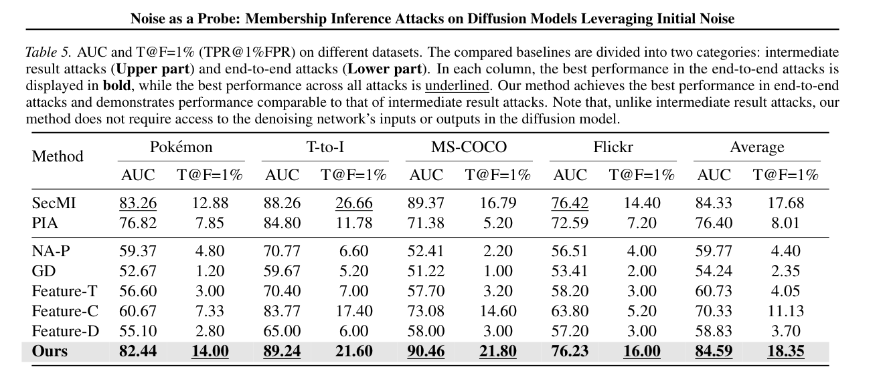

# 初始噪声作为探针：利用起始噪声对扩散模型做成员推断
Noise as a Probe: Membership Inference Attacks on Diffusion Models Leveraging Initial Noise

- 英文标题：Noise as a Probe: Membership Inference Attacks on Diffusion Models Leveraging Initial Noise
- 中文标题：初始噪声作为探针：利用起始噪声对扩散模型做成员推断
- 作者：Puwei Lian，Yujun Cai，Songze Li，Bingkun Bao
- 发表 venue / year / version：arXiv 预印本，2026，`arXiv:2601.21628v1`
- 论文主问题：当攻击者只能控制初始噪声和 prompt、只能观察最终生成图像时，能否仍对微调扩散模型执行有效成员推断
- 威胁模型类别：gray-box，text-to-image diffusion membership inference with controllable initial noise
- 材料索引路径：`references/materials/gray-box/2026-arxiv-noise-as-a-probe-membership-inference-diffusion-models.pdf`
- 上游来源 URL：见 `references/materials/manifest.csv` 中对应的 `source_url` 字段
- OCR / born-digital 精修版链接：[OCR精修版：Noise as a Probe: Membership Inference Attacks on Diffusion Models Leveraging Initial Noise](https://www.feishu.cn/docx/PiYudfHppo0h5wxigvncTsK3ncf)
- 飞书原生 PDF：[2026-arxiv-noise-as-a-probe-membership-inference-diffusion-models.pdf](https://ncn24qi9j5mt.feishu.cn/file/KxRYbKM5rooeg0xU43VcLCZEnBe)
- 开源实现：论文正文表示将公开实现，但 PDF 未给出仓库链接，当前记为暂未找到
- 报告状态：已完成

## 1. 论文定位

这篇论文属于 gray-box 路线上的攻击论文，研究对象是微调后的文生图扩散模型。它与 `SecMI`、`PIA` 这类典型灰盒工作的分界点很明确：作者不再要求读取中间去噪结果，也不训练 shadow model，而是把攻击入口前移到采样起点，只利用“可控初始噪声 + 最终生成图像”来恢复成员信号。

从 DiffAudit 的路线划分看，它不是纯黑盒论文，因为攻击者仍需知道对应的预训练底座，并且接口必须允许直接传入初始噪声；但它也明显弱于传统可读中间轨迹的灰盒设定。因此，这篇工作最适合被视为 gray-box 向更受限部署接口过渡时的桥接主论文。

## 2. 核心问题

论文要回答两个连在一起的问题。第一，扩散模型在最大噪声步是否真的把图像语义完全擦除；如果没有，残留语义是否会在微调后被模型继续利用。第二，如果攻击者不能访问中间去噪网络，只能控制 prompt 和初始噪声，能否把这种残留语义转换成稳定的成员推断信号。

作者的答案是肯定的。论文认为“初始噪声”在常见日程下并不是严格纯高斯，而是仍带有与原图相关的微弱语义；一旦模型在微调集中见过相同样本，这些语义更容易被重新放大到最终生成结果中。

## 3. 威胁模型与前提

攻击者持有候选图像与对应 caption，能调用目标微调模型的端到端生成接口，并显式设定初始噪声。攻击者看不到目标模型参数，也不能读取任何中间去噪步的输入输出。论文进一步假设攻击者知道目标模型是从哪个预训练模型微调而来，或者至少能找到足够接近的预训练底座，用它来做 DDIM inversion。

这个前提集合决定了论文结论的边界。只要系统不暴露自定义初始噪声接口，或者攻击者无法获得可用的预训练底座，方法就很难按论文原样落地。相反，在本地 diffusers 管线、图像编辑接口、latent/noise engineering 场景中，这个威胁模型就具有现实性。

## 4. 方法总览

方法分成两步。第一步，作者不直接反演目标微调模型，而是先用公开预训练模型对候选样本做 DDIM inversion，得到带有样本语义的“语义化初始噪声”。第二步，把同一 prompt 和该噪声一并送入目标微调模型，观察生成图像与原图的距离。如果样本是成员，模型更可能沿着噪声中的残留语义重建出接近原图的结果；若样本不是成员，生成结果通常偏离更大。

与已有方法相比，这篇论文真正换掉的是信号位置。它不再从中间分数、轨迹误差或去噪网络输出中读泄露，而是把“模型是否会响应带成员语义的起始噪声”当成隐式成员证据。

## 5. 方法概览 / 流程

这条攻击链路可以概括为：候选图像 \(x_0\) 与文本条件 \(c\) 先进入预训练模型的 inversion 过程，得到语义噪声 \(\tilde{x}_t\)；随后目标模型从 \(\tilde{x}_t\) 出发完成生成，输出 \(\tilde{x}_0\)；最后攻击者计算 \(D(x_0,\tilde{x}_0)\) 并与阈值比较，给出成员判定。这里最关键的不是 inversion 本身，而是作者证明了“预训练 inversion 得到的语义噪声仍能被微调模型识别”，这使攻击者无需访问目标模型的中间结构。

## 6. 关键技术细节

论文先回到前向扩散过程：

$$
x_t=\sqrt{\bar{\alpha}_t}x_0+\sqrt{1-\bar{\alpha}_t}\,\epsilon.
$$

如果最终时间步真的完全无语义，那么 \(\bar{\alpha}_T\) 应非常接近零。作者改用信噪比

$$
\mathrm{SNR}(t)=\frac{\bar{\alpha}_t}{1-\bar{\alpha}_t}
$$

来刻画这个问题，并指出常见噪声日程在 \(T\) 处的 \(\mathrm{SNR}(T)\) 并不为零，尤其 Stable Diffusion 日程残留更明显，因此最大噪声步仍保留了原图信号的痕迹。

在攻击构造上，作者把 inversion 与生成串成两段：

$$
\tilde{x}_t=Inv_{\theta_{\mathrm{pre}}}^{t}(x_0 \mid c,\gamma_2), \qquad
\mathcal{A}(x_i,\theta)=\mathbf{1}\!\left[D\!\left(x_0,G_\theta(\tilde{x}_t \mid c,\gamma_1)\right)\le \tau\right].
$$

其中 \(\gamma_2\) 是 inversion guidance scale，\(\gamma_1\) 是生成 guidance scale，默认距离 \(D\) 取 \(\ell_2\)。这组公式的含义很直接：成员样本在语义噪声驱动下会生成更接近原图的结果，所以距离越小越像成员。

实现层面有一个必须记录的歧义。正文公式和方法描述都说明“距离小于阈值时判成员”，但附录 Algorithm 1 却把 `Score > τ` 写成成员，这与主文符号方向相反。后续若进入复现，实现时必须优先核对作者代码或自行验证阈值方向。

## 7. 实验设置

论文在 Pokemon、T-to-I、MS-COCO、Flickr 四个数据集上评估方法，均使用 `Stable Diffusion v1-4` 微调模型，图像分辨率统一为 `512`。数据规模分别约为 `416/417`、`500/500`、`2500/2500` 和 `1000/1000` 的 member / non-member 划分。基线覆盖两类：一类是 `SecMI`、`PIA` 等可读中间结果的灰盒攻击，另一类是 `NA-P`、`GD`、`Feature-T/C/D` 等只看端到端输出的方法。

默认超参数为 inversion 步数 `100`、\(\gamma_2=1.0\)，生成步数 `50`、\(\gamma_1=3.5\)，硬件为单张 `RTX 4090 24GB`。阈值部分不训练 shadow model，而是用一批先验非成员样本做分位数校准，附录给出的默认设置是取非成员分数的第 `15` 百分位。

## 8. 主要结果

主表结论很清楚：该方法在四个数据集上的平均 `AUC=84.59`、平均 `TPR@1%FPR=18.35`，在所有端到端方法中最好；其中 `MS-COCO` 上达到 `90.46 / 21.80`，不仅明显优于 `Feature-C` 等端到端基线，也在部分场景接近甚至超过 `SecMI`、`PIA` 这类中间结果攻击。论文因此证明，仅靠最终生成结果也能承载很强的成员性信号，前提是初始噪声里注入了正确语义。

这张结果表最值得保留，因为它把论文的核心主张压缩得最完整：方法不需要 shadow model，不需要中间去噪访问，但在 end-to-end 组内稳定最优。附加实验也支持主结论。与 naive 随机噪声方案相比，语义化初始噪声让平均 AUC 再提高 `21.57%`；即使在未知架构、缺少原始 caption、存在 `SSei` 与数据增强防御时，攻击性能仍然没有塌到接近随机。

## 9. 优点

这篇工作的优点主要在方法视角与论证结构。它没有沿着既有灰盒论文继续追求“如何更好利用中间轨迹”，而是重新定位了一个此前被忽略的泄露面，即初始噪声接口本身。其次，作者把这一点串成了相对完整的证据链：先用 \(\mathrm{SNR}(T)\) 解释噪声不纯，再用 inversion 重建和 cross-attention 相似性说明微调模型确实会利用这些残留语义，最后才落到主表结果。实验覆盖也比较完整，除了主表还有超参数、未知架构、防御和 caption 缺失分析。

## 10. 局限与有效性威胁

局限同样明显。第一，接口假设并不弱，论文依赖“攻击者可直接设定初始噪声”，这在很多商用 API 上并不成立。第二，方法默认拥有候选样本 caption，并且知道或能近似猜到对应预训练底座。第三，正文未给出公开仓库，很多工程细节只能靠论文文字和附录拼接。第四，主实验集中在 `SD-v1-4` 微调场景，尚不足以说明它对更封闭的商业系统或完全不同的扩散架构是否仍然稳定成立。

## 11. 对 DiffAudit 的价值

对 DiffAudit 来说，这篇论文最直接的价值是把 gray-box 路线的观测点从“中间去噪结果”扩展到了“采样起点是否可控”。它不必替代 `SecMI`、`PIA`，但非常适合作为同一条路线里的并行主论文：前者代表轨迹访问型灰盒，后者代表起始噪声访问型灰盒。这样在后续产品叙事里，DiffAudit 可以更明确地区分不同泄露接口，而不是把所有非白盒攻击都混成一类。

从工程角度，这篇论文也给出了一条很具体的实现启发：只要系统允许用户控制 latent、seed 或更底层的噪声张量，审计逻辑就不必绑定中间层输出，而可以退化为“预训练 inversion + 最终图像距离”的两阶段流程。这对受限部署环境尤其重要。

## 12. 关键图使用方式

本稿当前只保留 1 张主结果表，放在“主要结果”之后，不额外插入第二张方法图。这样做的目的很直接：先让展示稿把核心贡献和结果站稳，再在后续细修时决定是否补进 Figure 3 作为流程图。现阶段这张表已经足够支撑“它在 end-to-end 组内最强、且接近灰盒基线”的结论。

## 13. 复现评估

要忠实复现这篇论文，至少需要四类资产：可微调或已微调的 `SD-v1-4` 模型、对应预训练底座、带 caption 的 member / non-member 划分，以及支持自定义初始噪声的生成接口。若要完整复现附录分析，还需要 cross-attention 可视化、架构替换实验和防御训练版本。仓库当前最缺的不是阅读材料，而是把 DDIM inversion、噪声注入生成、阈值标定和距离评估串成统一流水线的实现骨架。

结构性阻塞主要有两个。其一，很多真实目标系统不会暴露初始噪声接口，因此论文方法未必能迁移到线上闭源服务。其二，阈值方向在主文与附录间存在冲突，若后续没有作者代码或额外验证，复现实现需要先做一次最小正确性校准。

## 14. 写回总索引用摘要

这篇论文研究的是微调扩散模型中的成员推断问题，但它不再依赖中间去噪结果，而是把攻击入口转移到初始噪声。作者指出，常见噪声日程在最大噪声步仍保留非零语义信号，因此“初始噪声”本身可以成为成员推断探针。

论文提出的核心方法是：先用公开预训练模型对候选样本做 DDIM inversion，得到带有样本语义的初始噪声，再把该噪声送入目标微调模型，比较生成结果与原图的距离。实验表明，这一做法在多个数据集上都显著优于既有端到端攻击，并在部分场景接近或超过传统灰盒基线。

对 DiffAudit 而言，这篇工作的重要性在于明确提出了另一类 gray-box 接口，即“可控起始噪声”。它既是现有轨迹访问型灰盒工作的补充，也为后续面向受限部署环境的审计实现提供了更短路径的攻击框架。
