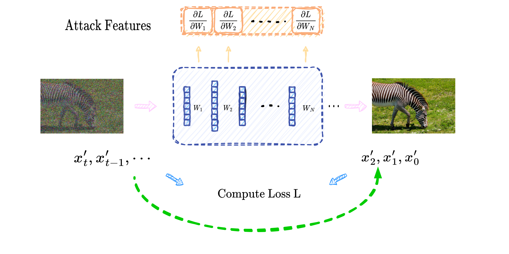
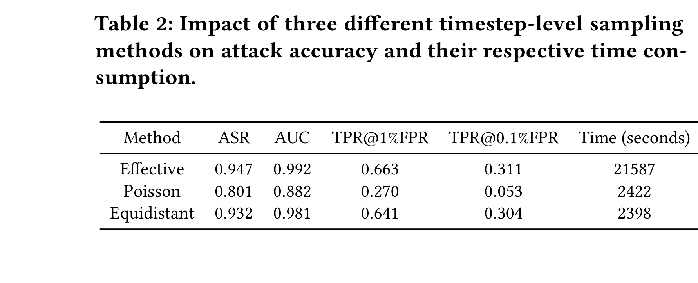

# 扩散模型白盒成员推断攻击论文报告

**英文标题**：White-box Membership Inference Attacks against Diffusion Models

## 文献信息

- 作者：Yan Pang, Tianhao Wang, Xuhui Kang, Mengdi Huai, Yang Zhang
- 发表信息：Proceedings on Privacy Enhancing Technologies, 2025(2)
- 材料索引路径：`references/materials/white-box/2025-popets-white-box-membership-inference-diffusion-models.pdf`
- 上游来源 URL：见 `references/materials/manifest.csv` 中对应的 `source_url` 字段
- 飞书原生 PDF：见文末附件
- 开源实现：<https://github.com/py85252876/GSA>
- 报告状态：sample-review-v3

## 一、论文定位

这篇论文讨论的是扩散模型在**白盒权限**下的成员推断攻击问题。相比黑盒或灰盒场景，它假设攻击者已经能够访问目标模型的参数、结构，并对单个查询样本执行反向传播。在这个前提下，论文关心的不是“能否恢复训练图像内容”，而是更基础也更强的问题：模型是否会对训练成员和非成员产生稳定可分的内部响应差异。

它在 DiffAudit 的文献体系里应被视为白盒路线的主论文，而不是补充阅读材料。原因很直接：这篇论文既给出了方法论上的新判断，即**梯度特征优于单纯的 loss 特征**；也给出了工程层面很明确的执行路线，即如何在多个时间步和多个网络层之间做采样与聚合，从而把理论上的白盒攻击变成一个可以落地训练的攻击流水线。

## 二、核心问题

论文的核心问题可以拆成两个连续的问题。

第一，在扩散模型的白盒成员推断里，单个时间步的 loss 是否足够表达成员信息。作者的回答是否定的。因为扩散模型训练本身跨越多个时间步，而不同时间步上的 loss 会受到样本复杂度、训练阶段和噪声水平的共同影响。如果仅拿某个时间步的 loss 去做成员与非成员判别，那么“训练成员的典型响应”与“困难非成员的偶然低 loss”可能会被混在一起。

第二，如果 loss 不够，那么应该选择什么更稳定的特征。论文给出的答案是梯度。作者认为，梯度不仅反映误差大小，还反映模型在该输入点附近的局部响应结构。也就是说，梯度中同时包含“拟合得好不好”和“模型为这个样本调整了哪些参数方向”这两层信息。论文试图证明，正是这第二层局部响应，使白盒成员推断的判别能力显著强于传统 loss 路线。

## 三、威胁模型与前提

论文采用的威胁模型很强，但并不虚构。作者假设攻击者可以获得目标扩散模型的结构和参数，并能够对查询样本执行前向与反向传播；在条件模型场景下，攻击者还知道与样本对应的全部条件模态，例如图像对应的文本提示。这种设定对商业闭源 API 不成立，但对公开 checkpoint、研究代码和本地复现实验环境是成立的，因此它适合作为 white-box 场景下的能力上界。

在这个威胁模型里，攻击者拥有的输入包括原始查询样本 `x_0`、扩散时间步选择集合 `K`、目标模型的参数、以及训练出的影子模型和攻击分类器。攻击者最终可观察的不是单纯的 loss，而是按时间步、按层提取出来的梯度范数特征。论文不讨论权限更弱的环境，因此它的结论不能直接外推到只暴露生成接口的黑盒系统。

## 四、方法总览

方法总览可以概括成一句话：**不要只找某个“最有效时间步”的 loss，而要在多个时间步上提取样本级梯度，再把这些梯度压缩成稳定的攻击特征。**

作者提出的总体框架名为 `GSA`，即 Gradient-based Step-wise Aggregation。它先从总扩散步数中选择一个时间步集合 `K`，再在每个 `t∈K` 上构造带噪样本、计算 loss、反向传播提取梯度。由于原始梯度维度极高，论文并不直接使用参数矩阵本身，而是对每层梯度取 `\ell_2` 范数，把高维对象压缩成按层排列的统计向量。之后，这些向量会在时间步和层两个维度上进一步聚合，并送入攻击分类器。

论文给出两个具体实例。`GSA1` 的思路是：先把多个时间步的 loss 求平均，再只做一次反向传播。它牺牲一部分时间步细节，但能显著节省计算成本。`GSA2` 则对每个时间步分别反向传播，再对梯度表示做平均，因此保留更多信息，但运行时间更长。作者用这两个实例说明：白盒成员推断不仅要考虑特征有没有信息，还必须考虑多时间步梯度提取在工程上能否承受。

## 五、方法流程图

## 六、关键技术细节

扩散模型的前向加噪过程满足：

$$
x_t = \sqrt{\bar{\alpha}_t}x_0 + \sqrt{1-\bar{\alpha}_t}\,\epsilon_t.
$$

在这个定义下，第 `t` 个时间步上的标准噪声预测损失为：

$$
L_t(\theta)=\mathbb{E}_{x_0,\epsilon_t}\left[\left\|\epsilon_t-\epsilon_\theta(x_t,t)\right\|_2^2\right].
$$

如果只看这个 loss，本质上只得到一个标量。标量虽然能反映当前样本在特定时间步上的误差大小，但它无法描述模型在该输入邻域中“朝哪个方向”响应、哪些层响应更剧烈、不同时间步之间是否存在一致的成员模式。作者认为，这正是传统 loss-based white-box 攻击的主要瓶颈。

因此论文进一步考察 loss 对模型参数的梯度：

$$
\nabla_\theta L_t(\theta, x)=2\left(\epsilon_\theta(x_t,t)-\epsilon_t\right)^\top \nabla_\theta \epsilon_\theta(x_t,t).
$$

这条公式之所以关键，是因为它不仅包含误差项 `\epsilon_\theta(x_t,t)-\epsilon_t`，还包含模型对输入的局部响应项 `\nabla_\theta \epsilon_\theta(x_t,t)`。当前报告对作者论证的理解是：成员样本与非成员样本的差异，不只是“loss 更低”，而是“跨时间步的梯度结构更稳定、更像模型已经见过并学过的样本”。也正因为如此，梯度比 loss 更适合作为 white-box 成员推断的核心特征。

但是，直接保留所有梯度仍然不可行。一个扩散模型的参数规模往往极大，若对多个时间步都保留全量梯度，计算和存储成本都无法接受。论文的解决办法是对每层梯度取 `\ell_2` 范数，把原始梯度张量压缩为按层的标量集合。这一步不是单纯为了省空间，而是把“层级响应模式”保留下来，同时把原始特征降到可供攻击分类器使用的维度。

## 七、实验设置

论文的实验覆盖无条件扩散模型与条件扩散模型两大类：

- 数据集：CIFAR-10、ImageNet、MS COCO
- 模型：DDPM、Imagen
- 指标：ASR、AUC、`TPR@1%FPR`、`TPR@0.1%FPR`
- 训练设置：CIFAR-10 和 ImageNet 训练 `400` epochs，Imagen 训练 `600000` steps
- 默认超参：扩散步数 `1000`、学习率 `1e-4`、batch size `64`

基线方面，论文不是只和最弱的 threshold loss 方法比较，而是同时比较了 Baseline、LiRA、Strong LiRA，以及在相同采样设置下仍然只使用 loss 特征的 `LSA*`。这样的对照安排很关键，因为它把“梯度优于 loss”的结论建立在公平比较之上，而不是建立在人为削弱基线的前提下。

此外，论文还单独比较了三类对结果影响显著的因素：时间步采样策略、layer-wise 选择策略，以及不同防御手段对攻击结果的压制能力。这使得这篇论文的实验部分不是单一数字展示，而是一套完整的 white-box 路线分析。

## 八、主要结果

### 8.1 梯度特征显著优于 loss 特征

在 CIFAR-10 上，`GSA1` 和 `GSA2` 的 AUC 都达到 `0.999`，而在相同采样条件下只使用 loss 的 `LSA*` 只有 `0.909`。这说明在扩散模型的 white-box 成员推断中，梯度不是对 loss 的轻微改进，而是明显更强的一类特征。

### 8.2 低误报区间仍然很强

论文给出的 `TPR@1%FPR` 结果中，`GSA1` 达到 `99.7%`，`GSA2` 达到 `97.88%`。这意味着该攻击并不只是 ROC 曲线“整体好看”，而是在低误报场景下也有较高实用性。

### 8.3 等距采样是非常重要的工程折中

论文中最值得做成样板图的结果之一，就是不同时间步采样策略之间的效果与时间成本比较。`effective sampling` 精度略高，但时间开销约 `21587s`；而 `equidistant sampling` 的 AUC 只有小幅下降到 `0.981`，时间却降到 `2398s`。这说明如果 DiffAudit 后续要做原型实现，完全没有必要从最重的采样方案开始。

## 九、优点

- 问题定义准确：它抓住了 white-box 扩散 MIA 中最值得问的那个问题，即特征设计而不是阈值调参。
- 方法贡献清晰：`GSA1` 与 `GSA2` 的差别、适用性和代价都说得很清楚。
- 实验有工程价值：不仅有主指标，还有采样代价、层级选择和防御效果。
- 适合作为主论文：读完之后不仅知道“它有效”，还知道“为什么有效”和“实现代价在哪里”。

## 十、局限与有效性威胁

- 威胁模型过强：样本级梯度接口在生产环境里通常拿不到。
- 论文结论主要建立在实验观察和机制解释上，而不是严格的最优判别理论。
- 复现成本高：需要 checkpoint、影子模型、梯度提取和较长训练过程。
- 高精度结论与训练充分、无强隐私正则的设定高度相关，不宜直接外推到所有扩散模型。

## 十一、对 DiffAudit 的价值

对 DiffAudit 来说，这篇论文的第一价值是“上界参考”。如果项目需要回答“在足够高的权限下，扩散模型成员泄露能有多强”，这篇论文提供了最直接的证据之一。

第二价值是“实现优先级建议”。从论文看，white-box 路线最先要补的不是新攻击分数，而是下面三类基础能力：

- per-sample gradient extraction
- timestep sampling
- layer selection

第三价值是“边界澄清”。它提醒团队不要把 white-box 的强数值直接当作 black-box 风险描述，而应把它视为高权限条件下的能力上界，用来与灰盒、黑盒路线做清晰分层。

## 十二、关键图解读

### 图 1：GSA 白盒攻击流程图

这张图适合作为报告里的第一张图，因为它承担的是“建立方法直觉”的任务。图中左侧是查询样本，中央是目标扩散模型，顶部是攻击特征，底部是通过 loss 反传得到梯度再做聚合的过程。它把整篇论文的方法闭环压缩成一个可视化结构，读者即使不先看公式，也能先明白方法是“多时间步 loss -> 梯度 -> 聚合 -> 攻击分类”这条链路。

### 图 2：不同时间步采样策略的效果与成本

第二张图我故意没有再选 t-SNE 散点，而是改成了 `Table 2`。原因很明确：对样板报告来说，结果图最该承担的功能不是“好看”，而是“让读者马上知道论文最重要的工程结论是什么”。这张表直接告诉读者：effective sampling 的效果最好，但时间最贵；equidistant sampling 虽然略差一点，却把成本压到了可接受范围。因此它能直接回答“为什么论文最后推荐等距采样”，比散点图更适合作为审阅版报告的第二张图。

## 十三、复现评估

如果要在 DiffAudit 里做 faithful reproduction，真正的阻塞项并不是“没读懂论文”，而是执行资产不齐。至少需要：

1. 可访问的 DDPM / Imagen checkpoint
2. 成员 / 非成员数据划分
3. 样本级梯度提取接口
4. 影子模型和攻击模型训练管线

当前仓库把 white-box 路线标成 `research-ready` 是合理的，因为这篇论文最依赖的正是目前还缺失的那些高权限实验资产。

## 十四、写回总索引用摘要

这篇论文研究扩散模型的白盒成员推断问题，目标是在攻击者掌握目标模型参数、结构以及条件模态信息时，判断某个查询样本是否属于训练集。作者把这一问题放在公开 checkpoint 已普遍可得的现实背景下讨论，并将其视为扩散模型隐私风险分析的强权限场景。

论文提出 `GSA` 框架，用梯度而不是 loss 作为攻击特征，并通过 timestep subsampling 与 layer-wise aggregation 降低维度和成本。作者给出 `GSA1` 与 `GSA2` 两个实例化方法，并报告在 DDPM 和 Imagen 上都能取得很高的成员推断精度；在 CIFAR-10 上，`GSA1/GSA2` 的 AUC 达到 `0.999`，显著高于同条件下的 loss-based 对照。

它对 DiffAudit 的价值在于为 white-box 路线提供了强上界参考，同时也明确指出复现该路线所需的关键资产是 checkpoint、训练配置和样本级梯度接口。换言之，这篇论文既是 white-box 方向的重要文献支点，也把后续工程工作的真实阻塞项暴露得很清楚。
