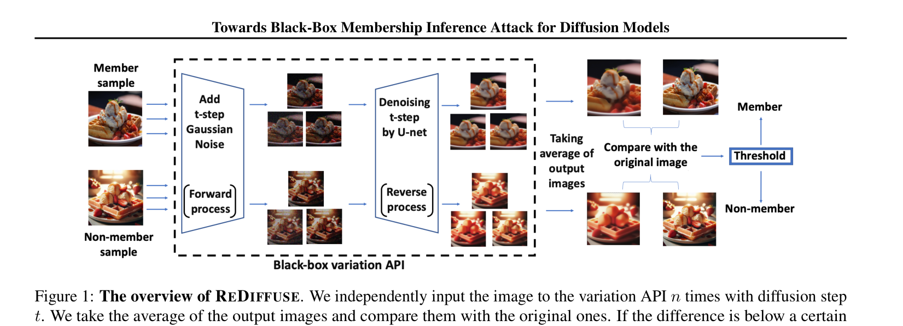
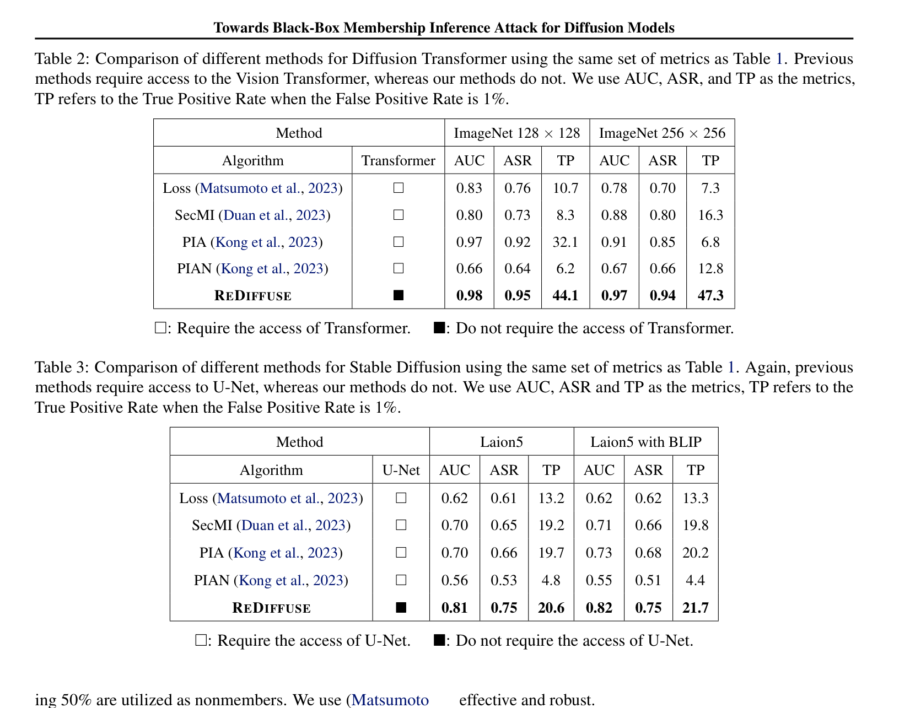

# 面向扩散模型的黑盒成员推断攻击
Towards Black-Box Membership Inference Attack for Diffusion Models

## 文献信息

- 中文题目：面向扩散模型的黑盒成员推断攻击
- 英文题目：Towards Black-Box Membership Inference Attack for Diffusion Models
- 作者：Jingwei Li，Jing Dong，Tianxing He，Jingzhao Zhang
- 发表信息：arXiv 2405.20771，对应 ICML 2025（PMLR 267）
- 论文主问题：当攻击者只能调用图像变体 API 时，能否判断一张图像是否出现在扩散模型训练集中
- 威胁模型类别：`black-box`，仅可访问 variation API，不可访问 U-Net、Transformer 中间状态、梯度或训练损失
- 本地 PDF 路径：`D:/Code/DiffAudit/Research/references/materials/black-box/2024-arxiv-towards-black-box-membership-inference-diffusion-models.pdf`
- GitHub PDF：[2024-arxiv-towards-black-box-membership-inference-diffusion-models.pdf](https://github.com/DeliciousBuding/DiffAudit-Research/blob/main/references/materials/black-box/2024-arxiv-towards-black-box-membership-inference-diffusion-models.pdf)
- OCR/Markdown 精修版链接：[OCR精修版：Towards Black-Box Membership Inference Attack for Diffusion Models](https://www.feishu.cn/docx/OdTkdukm4ojA5vx9PhOcaUbInId)
- 飞书原生 PDF：[2024-arxiv-towards-black-box-membership-inference-diffusion-models.pdf](https://ncn24qi9j5mt.feishu.cn/file/ANFUbPmGRoEDZWx586icD8isnde)
- 开源实现：[lijingwei0502/diffusion_mia](https://github.com/lijingwei0502/diffusion_mia)
- 报告状态：已完成

## 1. 论文定位

这篇论文是 DiffAudit `black-box` 路线中的主线文献。它研究的不是可访问中间噪声预测结果的灰盒攻击，而是更接近商业服务接口的严格黑盒场景：攻击者只拥有图像变体 API，无法看到 U-Net、DiT 或任意 timestep 的内部量。论文希望回答的核心问题是，外部 API 的可观察输出本身是否已经携带足够强的成员信号。

## 2. 核心问题

作者把问题压缩成一个很具体的判别任务。给定待测图像 `x`，攻击者在固定扩散步 `t` 下多次调用 variation API，得到若干重建结果，再判断这些结果在平均后是否会比普通非成员更稳定地回到原图附近。若这种“平均后仍贴近原图”的现象成立，就说明模型在该点附近的去噪偏差更小，而这被作者解释为训练成员留下的可观测痕迹。

## 3. 威胁模型与前提

论文假设攻击者能够反复调用同一个 variation API，并持有待测图像本身；但攻击者拿不到任何内部噪声预测值、梯度、loss、latent 中间量，也不能直接访问采样轨迹。对 DDIM 与 DiT 实验，作者还允许攻击者训练一个基于差异图的代理分类器；对 Stable Diffusion 则要求已知文本，或能用 BLIP 自动生成文本提示。论文结论因此适用于“有图像、可重复调用黑盒接口、并可在离线侧做后处理”的场景，不适用于完全无查询预算或只有单次输出的极弱攻击者。

## 4. 方法总览

REDIFFUSE 的设计很直接。作者先把图像变体接口形式化为 `V_\theta(x,t)`，即先向输入图像注入 `t` 步高斯噪声，再用目标扩散模型做逆过程重建。随后，对同一张图像独立调用该接口 `n` 次，取平均得到 `\hat{x}`，再比较 `\hat{x}` 与原图 `x` 的差异。如果差异足够小，就判为成员；否则判为非成员。和 SecMI、PIA 这类方法相比，它不再围绕内部噪声预测误差做判别，而是把攻击信号完全转移到黑盒可见的重建图像差异上。

这张方法图把论文的黑盒攻击闭环交代得很清楚：成员图像与非成员图像都先进入同一个变体接口，但作者关心的不是单次输出，而是多次独立重建后的平均结果是否仍然靠近原图。对 DiffAudit 来说，这意味着黑盒路线的关键变量不再是“取哪些 timestep 的内层信号”，而是查询次数、扩散步和差异函数的选择。

## 5. 关键技术细节

作者先定义黑盒可调用的 variation API：

$$
x_t = \sqrt{\bar{\alpha}_t}x + \sqrt{1-\bar{\alpha}_t}\,\epsilon
$$

$$
V_{\theta}(x,t) = \Phi_{\theta}(x_t,0)
$$

这一步的重要性在于，它把商业接口抽象成“前向加噪 + 逆向重建”的统一对象，使后续分析可以脱离具体服务实现，直接围绕接口输出做成员推断。

随后，REDIFFUSE 用多次查询的平均结果做判别：

$$
\hat{x} = \frac{1}{n}\sum_{i=1}^{n}V_{\theta}(x,t), \qquad f(x)=\mathbf{1}[D(x,\hat{x})<\tau]
$$

这里的核心不是阈值本身，而是“平均化”操作。论文认为，若图像属于训练集，则模型在该点附近更容易给出近似无偏的噪声预测，因此多次重建的随机扰动会互相抵消，平均结果更贴近原图。非成员则更容易留下稳定偏差。

对应的理论支撑是一个重建误差收缩上界：

$$
\mathbb{P}(\|\hat{x}-x\|\ge\beta)\le d\exp\!\left(-n\min_i\Psi_{X_i}^{*}\!\left(\frac{\beta\sqrt{\bar{\alpha}_t}}{\sqrt{d(1-\bar{\alpha}_t)}}\right)\right)
$$

这不是对所有非成员都成立的严格最优检验，而是说明在“成员附近误差近似零均值”的假设下，增加查询次数 `n` 可以让成员样本的平均重建误差以指数速度收缩。对实际实现而言，这个公式给出的不是闭式攻击器，而是一个非常明确的工程信号：黑盒查询预算确实有价值。

## 6. 实验设置

实验覆盖三类模型。DDIM 在 CIFAR-10、CIFAR-100、STL10 上评估，固定 `t=200`、`n=10`；DiT 在 ImageNet `128x128` 与 `256x256` 上评估，固定 `t=150`、`k=50`、`n=10`；Stable Diffusion 使用 `stable-diffusion-v1-4`，成员来自 LAION-5B，非成员来自 COCO2017-val，并分别测试真实文本与 BLIP 生成文本。对 DDIM/DiT，作者使用差异图配合 ResNet-18 分类；对 Stable Diffusion，作者直接使用 SSIM 作为差异函数。

## 7. 主要结果

结果最值得关注的是“访问权限更弱但指标仍领先”。DDIM 上，REDIFFUSE 在 CIFAR-10、CIFAR-100、STL10 的 AUC 分别达到 `0.96`、`0.98`、`0.96`；DiT 在 ImageNet `128x128` 与 `256x256` 上达到 `0.98` 与 `0.97`；Stable Diffusion 在已知文本与 BLIP 文本场景下分别达到 `0.81` 与 `0.82`。论文同时表明，多次平均对 DDIM 和 DiT 确有帮助，而 Stable Diffusion 的收益较小，因为其重建本身已经更稳定。

这张结果表最重要的价值不是单纯展示数值更高，而是把“无需访问 U-Net 或 Transformer”与“仍然优于 Loss、SecMI、PIA、PIAN”直接放在同一页里。它说明这篇论文不是把灰盒方法简单弱化，而是提出了一条独立成立的黑盒攻击路线。

## 8. 优点

- 问题定义克制，真正把攻击面限制在 variation API，而不是退回到灰盒输出。
- 方法链路直接，核心变量是查询次数、扩散步和重建差异，易于和工程接口对齐。
- 实验覆盖 DDIM、DiT、Stable Diffusion 三类模型，足以支撑“黑盒路线独立成立”的主结论。

## 9. 局限与有效性威胁

论文的薄弱点主要有三处。第一，理论分析依赖训练成员附近近似无偏噪声预测、Jacobian 满秩和有限 cumulant-generating function 等较强假设，这些在现代大模型里并未被严格验证。第二，DDIM 与 DiT 场景下的最终分数并非单纯阈值化像素误差，而是还依赖额外训练的 ResNet-18 代理分类器，因此攻击能力并不完全来自 API 信号本身。第三，DALL-E 2 在线实验把名画近似当作成员，只能作为启发性证据，不能等同于严格可控的成员标签实验。

## 10. 对 DiffAudit 的价值

这篇论文为 DiffAudit 明确了一条真正面向闭源接口的 `black-box` 主线。若目标系统只暴露图像变体或图像编辑接口，而不暴露任何 timestep 中间量，那么 SecMI、PIA 一类方法就不再适用，REDIFFUSE 这类“重复查询 + 平均重建 + 差异判别”的框架就成为更自然的起点。

它的第二个价值是帮助产品叙事落地。论文把成员性泄露解释为外部接口行为差异，而不是内部参数异常，这更容易被映射到“API 是否泄露训练数据使用痕迹”的现实审计语言。对后续路线规划而言，这篇论文应被放在黑盒实验与对外展示的核心位置，用来区分灰盒上界和真正黑盒可达性。

## 11. 复现评估

从复现角度看，这篇论文优于“无代码”文献，因为作者公开了 `diffusion_mia` 仓库。但要忠实复现论文结果，仍需要可控的 DDIM、DiT、Stable Diffusion 权重，成员/非成员划分数据集，以及可反复调用的 variation API 或等价本地实现。当前 DiffAudit 仓库已经覆盖灰盒主线文献，但还没有和 REDIFFUSE 对齐的黑盒执行层，因此它更适合被当作黑盒路线的参考主论文，而不是现成可跑通的本地基线。

## 12. 写回总索引用摘要

这篇论文研究严格黑盒条件下的扩散模型成员推断问题，核心设定是攻击者只能反复调用图像变体 API，而无法访问模型参数、中间噪声预测或训练损失。论文希望回答的是，API 最终输出本身是否已经携带足够强的成员信号。

论文提出 REDIFFUSE，核心做法是在固定扩散步下多次调用 variation API，对返回图像求平均后再与原图比较；若平均重构更接近原图，则更可能是训练成员。实验表明，该方法在 DDIM、Stable Diffusion、Diffusion Transformer 上都优于 Loss、SecMI、PIA、PIAN 等对照。

对 DiffAudit 来说，这篇论文的价值在于它明确提供了一条真正面向闭源接口的黑盒路线。相比当前仓库已覆盖的灰盒主线材料，REDIFFUSE 更适合作为后续黑盒实验和对外展示叙事的基础文献。
