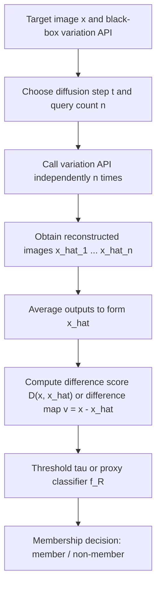
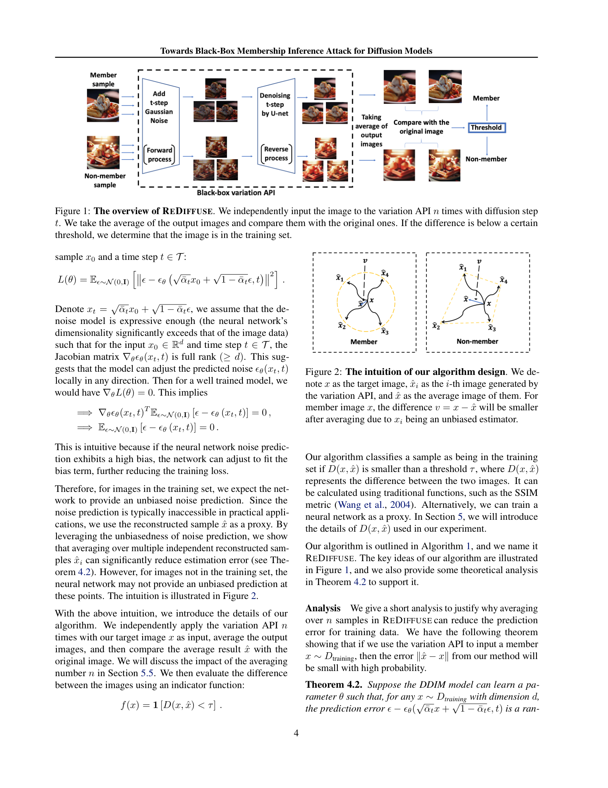

# Towards Black-Box Membership Inference Attack for Diffusion Models

- Title: Towards Black-Box Membership Inference Attack for Diffusion Models
- Material Path: `references/materials/black-box/2024-arxiv-towards-black-box-membership-inference-diffusion-models.pdf`
- Primary Track: `black-box`
- Venue / Year: ICML 2025 (PMLR 267); source entry is arXiv:2405.20771
- Threat Model Category: Black-box membership inference against diffusion models via image variation API
- Core Task: Determine whether a target image was used in diffusion-model training when the attacker can only call a variation API
- Open-Source Implementation: No official code link is stated in the paper; the current DiffAudit repository does not expose a REDIFFUSE implementation path
- Report Status: Complete

## Executive Summary

这篇论文讨论的核心问题是：当攻击者无法访问扩散模型内部的 U-Net 或 Transformer 噪声预测器，只能调用图像变体 API 时，是否仍然能够进行成员推断。作者给出的答案是肯定的，并据此提出黑盒攻击算法 `REDIFFUSE`。其目标并不是恢复训练样本，而是检测某张图像是否更像“训练中见过的点”，从而支撑版权取证和训练数据使用审计。

方法上的关键转折是把传统依赖中间噪声估计的灰盒信号，替换为“多次调用 variation API 后的平均重构误差”。论文的直觉是：若目标图像属于训练集，则模型在该点附近的噪声预测偏差更小，因此多次独立变体再求平均后，结果会更稳定地回到原图附近；若图像不是成员，则这一平均结果与原图之间会保留更大的系统性差异。攻击最终只需基于 `D(x, \hat{x})` 与阈值比较，或将差异图输入代理分类器即可。

实验部分覆盖 DDIM、Stable Diffusion 以及 Diffusion Transformer。论文报告在 DDIM 的 CIFAR10/100、STL10 上，`REDIFFUSE` 的 AUC 分别达到 `0.96/0.98/0.96`；在 DiT 的 ImageNet `128x128` 与 `256x256` 上达到 `0.98/0.97`；在 Stable Diffusion 的 LAION5 设置上达到 `0.81`，带 BLIP 文本时为 `0.82`。这些结果大多优于 Loss、SecMI、PIA、PIAN 等基线，同时显著降低了攻击所需的访问权限。对 DiffAudit 而言，这篇论文的重要性在于它给出了“真正黑盒”路线的一条明确主线：不依赖 timestep 中间状态，只利用外部 API 的行为差异进行成员判断。

## Bibliographic Record

- Title: Towards Black-Box Membership Inference Attack for Diffusion Models
- Authors: Jingwei Li, Jing Dong, Tianxing He, Jingzhao Zhang
- Venue / year / version: Proceedings of the 42nd International Conference on Machine Learning, PMLR 267, 2025; repository source URL points to arXiv:2405.20771
- Local PDF path: `D:/Code/DiffAudit/Project/references/materials/black-box/2024-arxiv-towards-black-box-membership-inference-diffusion-models.pdf`
- Source URL: <https://arxiv.org/abs/2405.20771>

## Research Question

论文试图回答两个相互关联的问题。第一，在扩散模型成员推断中，是否能够摆脱对内部噪声预测网络的访问要求，只用公开可调用的 variation API 完成攻击。第二，这种黑盒攻击是否不仅适用于 DDIM，也能迁移到 Stable Diffusion 与 Diffusion Transformer。

其威胁模型是假设攻击者持有待测图像，可以重复调用目标模型的图像变体接口，并观察输出图像，但看不到 U-Net、DiT、latent 中间量或 loss。该设定明显比 SecMI、PIA 一类方法更弱，更接近商业 API 的实际可达权限。

## Problem Setting and Assumptions

- Access model: 黑盒，仅可多次调用 variation API；不可见内部噪声预测器、梯度、loss、latent 中间状态。
- Available inputs: 目标图像 `x`，扩散步数或与 variation API 对应的扰动强度 `t`，可重复查询次数 `n`。
- Available outputs: 每次 variation API 返回的变体图像 `\hat{x}_k`，以及由这些输出构造的平均图像与差异统计。
- Required priors or side information: 需要知道如何调用 variation API；在 DDIM/DiT 设置中，作者还训练了差异图代理分类器 `f_R`；在 Stable Diffusion 设置中需要目标文本，或用 BLIP 自动生成文本。
- Scope limits: 论文主张的是成员可分性而非逐像素重构；理论分析主要建立在 DDIM 及“无偏噪声预测”假设上；DALL-E 2 评估使用“名画近似成员”而非真实已知训练集标签。

## Method Overview

`REDIFFUSE` 的流程很直接。给定目标图像 `x`，攻击者在固定扩散步 `t` 下独立调用 `n` 次 variation API，得到多个变体图像 `\hat{x}_1, \ldots, \hat{x}_n`。然后对这些输出取均值，形成平均重构图像 `\hat{x}`，再计算其与原图之间的差异 `D(x, \hat{x})`。如果差异小于阈值 `\tau`，则判为成员；否则判为非成员。

论文声称该信号来源于训练成员附近更小的系统偏差。作者先从 DDPM/DDIM 的标准噪声预测损失出发，论证在模型充分表达且训练收敛的前提下，训练点附近的噪声预测误差期望接近零。由于黑盒场景拿不到噪声估计，作者改用重构图像作为代理观测，并通过多次独立调用降低随机误差。于是，成员图像的平均变体更接近原图，非成员则更可能偏离。

方法实现上分三种情况。对于 DDIM 和 DiT，核心是差异图 `v = x - \hat{x}`；对于 DDIM/DiT 实验，作者再用 ResNet-18 对差异图做二分类并将负成员概率作为分数。对于 Stable Diffusion，作者不再训练代理网络，而是直接使用 SSIM 衡量原图与平均重构之间的相似度。论文因此将“可观察信号”统一为外部图像差异，而不是内部 timestep 误差。

## Method Flow

## Key Technical Details

论文的技术核心由三个层次组成。第一层是标准扩散模型的噪声预测训练目标，作者借此说明训练成员附近更可能满足“近似无偏噪声估计”。第二层是将黑盒可观察量改写为多次 variation API 的平均重构误差。第三层是一个集中不等式：若误差项满足零均值和有限 cumulant-generating function，则均值化后的重构误差会以指数速度收缩。

对报告复用最重要的公式是下列三项。第一，DDPM/DDIM 的噪声预测损失：

$$
L(\theta)=\mathbb{E}_{\epsilon \sim \mathcal{N}(0,I)}
\left[\left\|\epsilon-\epsilon_\theta\!\left(\sqrt{\bar{\alpha}_t}x_0+\sqrt{1-\bar{\alpha}_t}\epsilon,\ t\right)\right\|^2\right].
$$

第二，`REDIFFUSE` 的黑盒判别量：

$$
\hat{x}=\frac{1}{n}\sum_{k=1}^{n} V_\theta(x,t), \qquad
f(x)=\mathbf{1}[D(x,\hat{x})<\tau].
$$

第三，论文给出的平均化误差上界：

$$
\mathbb{P}\!\left(\|\hat{x}-x\|\ge \beta\right)
\le d \exp\!\left(
-n \min_i \Psi_{X_i}^{*}\!\left(
\frac{\beta \sqrt{\bar{\alpha}_t}}{\sqrt{d(1-\bar{\alpha}_t)}}
\right)
\right).
$$

这三个公式对应三种不同层面的含义：训练目标、攻击规则、以及为何多次查询有理论价值。需要注意的是，论文并没有证明所有非成员一定产生有偏误差；它只说明在训练成员附近，平均化误差更可能收缩，从而为阈值判别提供依据。这一点决定了该方法本质上仍是经验性统计攻击，而不是严格可证的最优检验。

## Experimental Setup

- Datasets:
  - DDIM: CIFAR-10, CIFAR-100, STL10-Unlabeled。
  - DiT: ImageNet，分辨率 `128x128` 与 `256x256`。
  - Stable Diffusion: LAION-5B 作为成员集，COCO2017-val 作为非成员集，各抽样 2500 张。
  - Online API case: DALL-E 2，以 30 幅名画近似成员，用 Stable Diffusion 3 基于画作标题生成非成员。
- Model families:
  - DDIM 训练步数 `T=1000`，采样间隔 `k=100`。
  - DiT 跟随 `Peebles & Xie (2023)` 的训练设定，使用 10 万张 ImageNet 训练图像。
  - Stable Diffusion 使用 `stable-diffusion-v1-4`，不额外微调。
- Baselines: Loss-based method, SecMI, PIA, PIAN。
- Metrics: AUC, ASR, TP@FPR=1%，并在附录中给出 ROC 曲线。
- Evaluation conditions:
  - DDIM 主实验固定 `t=200`，`n=10`。
  - DiT 主实验固定 `t=150`，`k=50`，`n=10`。
  - Stable Diffusion 主实验固定 `t=10`；已知文本与 BLIP 生成文本两种设置。
  - DDIM/DiT 采用 ResNet-18 对差异图分类；Stable Diffusion 直接用 SSIM 作为差异函数。

## Main Results

最强的一组结果来自“权限更弱但精度不降反升”的对比。在 DDIM 上，`REDIFFUSE` 在 CIFAR-100 达到 `AUC 0.98 / ASR 0.93 / TP 48.2`，优于表中所有基线；在 CIFAR-10 与 STL10 上分别达到 `AUC 0.96` 与 `0.96`，也保持领先或并列领先。对 Diffusion Transformer，作者报告 ImageNet `128x128` 上 `AUC 0.98 / ASR 0.95 / TP 44.1`，`256x256` 上 `AUC 0.97 / ASR 0.94 / TP 47.3`，显著优于多数改造后的灰盒基线。

在 Stable Diffusion 上，黑盒路线的优势仍然存在但绝对指标更低。已知真实文本时 AUC 为 `0.81`，BLIP 文本时为 `0.82`；相比最佳灰盒基线大约高出 `0.09` 到 `0.12`。这说明对大规模文本图像预训练模型，外部可观察图像差异仍然携带成员信息，但信号强度明显弱于小尺度闭集数据集。

最依赖设定的结论出现在 DALL-E 2 在线 API 部分。论文用名画作为近似成员、用 SD3 生成图作为非成员，得到 `AUC 76.2/88.3` 与 `ASR 74.5/81.4`（分别对应 `L1/L2` 距离）。该结果支持“真实在线 API 也可能泄露成员性”的命题，但其证据强度弱于前述封闭数据集实验，因为成员标签和分布匹配都不是严格受控的。

## Strengths

- 贡献点明确，真正把攻击访问模型从“可见内部噪声预测”降低到“只能重复调用 variation API”。
- 方法结构简洁，核心步骤只有重复查询、求均值、计算差异，便于后续工程化封装。
- 覆盖 DDIM、Stable Diffusion、DiT 三类扩散范式，说明方法并非绑定单一架构。
- 给出关于平均化误差收缩的理论说明，虽然较弱，但足以解释为什么 `n` 增大会提升性能。
- 在线 DALL-E 2 例子提供了面向真实商业 API 的论证入口，这一点对黑盒路线尤其关键。

## Limitations and Validity Threats

- 理论分析依赖较强假设，包括训练成员附近的无偏噪声预测、Jacobian 满秩以及有限 cumulant-generating function；这些在现代大模型中并未被严格验证。
- 对 DDIM/DiT，攻击分数并非纯阈值化像素误差，而是依赖额外训练的 ResNet-18 代理分类器；这意味着攻击性能部分来自监督式后处理，而非 variation API 信号本身。
- Stable Diffusion 需要文本条件，未知文本时依赖 BLIP 自动生成；因此文本误差会耦合进成员推断结果。
- DALL-E 2 评估不具有标准成员标签，名画“可能在训练集内”的设定只能视为启发式近似，不能等同于严格黑盒基准。
- 论文承认当 diffusion step 过高时攻击性能会下降，因此方法并非对所有 API 参数设置都稳定成立。

## Reproducibility Assessment

忠实复现需要至少以下资产：可控的 DDIM、DiT、Stable Diffusion 模型权重，成员与非成员划分数据集，variation API 或等价本地重构接口，外加 DDIM/DiT 所需的差异图代理分类器训练代码。论文附录给出了较详细的训练轮数、步数、采样间隔和数据规模，但正文未给出官方代码仓库链接，因此复现入口不如 `SecMI` 或 `PIA` 明确。

从当前 DiffAudit 仓库看，已有 `SecMI` 与 `PIA` 的规划、探针与 smoke 路径，但没有发现面向 `REDIFFUSE` 的现成实现、配置模板或 runtime 适配层。这意味着仓库已覆盖相关对照基线，却尚未覆盖该黑盒路线的执行层。

当前最实际的阻塞项有三个。第一，商业模型的 variation API 往往限流且不可控，不利于系统性 sweep `t` 与 `n`。第二，真实成员标签难以获得，尤其是 DALL-E 2 类在线服务。第三，若要复现论文数值，必须精确重建差异函数实现细节，例如 DDIM/DiT 的 ResNet-18 训练划分与 Stable Diffusion 的文本条件处理。

## Relevance to DiffAudit

这篇论文与 DiffAudit 的关系非常直接。它定义了一条区别于 `SecMI`、`PIA` 的黑盒主线：不再请求中间 timestep 或噪声预测，只利用外部生成接口的可观察行为差异做成员审计。对于需要面向商业 API、闭源平台或第三方 SaaS 目标的工作，这条路线具有不可替代性。

同时，它也为当前仓库的路线图提供了一个清晰的比较轴。灰盒路线可以继续以 `SecMI -> PIA` 为精度上界和工程参考，而黑盒路线则可以以 `REDIFFUSE` 为代表，重点研究 query budget、差异函数、代理分类器需求以及真实 API 可操作性。换言之，这篇论文不是灰盒方法的简单降级版，而是访问约束改变后的独立攻击范式。

对报告叙事而言，这篇论文还能补足“商业可达性”维度。若未来 DiffAudit 需要向外部读者解释为什么仅凭公开接口也可能泄露训练成员，这篇论文提供了最合适的文献支点；但在工程优先级上，应把它视为尚待实现的黑盒执行路线，而不是当前仓库已经打通的复现链。

## Recommended Figure

- Figure page: 4
- Crop box or note: Cropped `Figure 1` only, using PDF clip box `35 35 575 225`; this isolates the method diagram and avoids most surrounding正文
- Why this figure matters: 该图是全文最直接的算法示意图，完整展示了“重复调用 variation API、平均输出、与原图比较、阈值判决”的黑盒攻击闭环，比页 8 的 DALL-E 2 现象图更适合作为方法总览
- Local asset path: `docs/paper-reports/assets/black-box/2024-arxiv-towards-black-box-membership-inference-diffusion-models-key-figure-p4.png`

## Extracted Summary for `paper-index.md`

这篇论文研究扩散模型的黑盒成员推断问题，目标是在看不到 U-Net、DiT 或中间 timestep 输出的情况下，仅凭图像变体 API 判断某张图像是否出现在训练集中。论文将该问题定位为版权审计和训练数据使用取证的现实需求，尤其面向商业化闭源扩散服务。

作者提出 `REDIFFUSE`，核心做法是在固定扩散步下多次调用 variation API，对返回图像求平均后再与原图比较；若平均重构更接近原图，则更可能是训练成员。论文同时给出平均化误差收缩的理论解释，并在 DDIM、Stable Diffusion、Diffusion Transformer 上报告了优于 Loss、SecMI、PIA、PIAN 等基线的结果。

它对 DiffAudit 的价值在于明确提供了一条独立的黑盒路线：当目标系统只暴露公开生成接口而不暴露内部噪声估计时，仍然可以围绕 query budget、差异函数和代理分类器设计成员审计流程。相较当前仓库已覆盖的 `SecMI`、`PIA` 灰盒链路，这篇论文更适合作为未来黑盒实验与产品叙事的基础文献。
