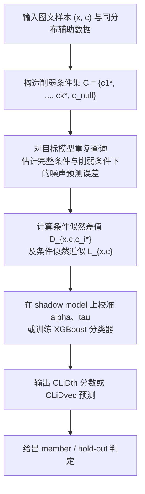
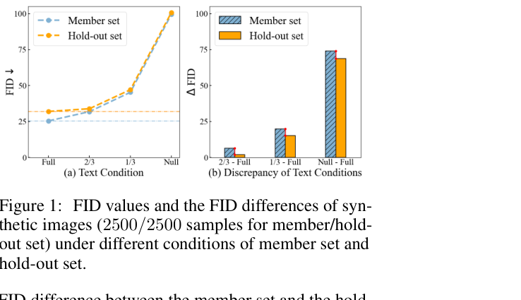

# Membership Inference on Text-to-image Diffusion Models via Conditional Likelihood Discrepancy

- Title: Membership Inference on Text-to-image Diffusion Models via Conditional Likelihood Discrepancy
- Material Path: `D:/Code/DiffAudit/Project/references/materials/black-box/2024-neurips-clid-membership-inference-text-to-image-diffusion.pdf`
- Primary Track: `black-box`
- Venue / Year: NeurIPS 2024
- Threat Model Category: 灰盒查询式成员推断；与黑盒数据使用审计路线相邻，但不是严格 API-only 黑盒
- Core Task: 利用图文条件信息对文本到图像扩散模型执行成员推断，以支持未授权训练数据使用审计
- Open-Source Implementation: 论文正文未给出作者实现链接；实验依赖公开的 Stable Diffusion 与公开基线实现
- Report Status: complete

## Executive Summary

这篇论文研究文本到图像扩散模型中的成员推断问题，目标是判断一条图文样本 `(x, c)` 是否出现在目标模型的训练集中。作者指出，现有扩散模型成员推断方法要么依赖代价高昂的 shadow models，要么只利用图像侧的过拟合信号，因此在文本到图像模型上会被更强的泛化能力和扩散训练损失的随机性削弱。

论文的核心观察是“条件过拟合”现象：文本到图像扩散模型对条件分布 `p(x|c)` 的过拟合，比对图像边缘分布 `p(x)` 的过拟合更明显。作者据此提出 Conditional Likelihood Discrepancy, CLiD，将同一样本在完整文本条件与削弱文本条件下的似然差异作为成员性信号，并给出阈值版 `CLiDth` 与特征向量版 `CLiDvec` 两种攻击实现。

实验覆盖 Pokemon、MS-COCO、Flickr 的微调场景，以及基于处理后 LAION 子集的预训练场景。论文报告，在更接近真实训练步数且包含默认数据增强的设定下，基线方法的 AUC 大多接近随机，而 CLiDth/CLiDvec 仍能在 MS-COCO 与 Flickr 上达到约 `0.95` 左右的 AUC。对 DiffAudit 而言，这篇论文的重要性不在于它已经解决严格黑盒问题，而在于它清晰证明了图文条件本身就是比纯图像误差更强的审计信号。

## Bibliographic Record

- Title: Membership Inference on Text-to-image Diffusion Models via Conditional Likelihood Discrepancy
- Authors: Shengfang Zhai, Huanran Chen, Yinpeng Dong, Jiajun Li, Qingni Shen, Yansong Gao, Hang Su, Yang Liu
- Venue / year / version: NeurIPS 2024, arXiv:2405.14800v3
- Local PDF path: `D:/Code/DiffAudit/Project/references/materials/black-box/2024-neurips-clid-membership-inference-text-to-image-diffusion.pdf`
- Source URL: `https://arxiv.org/abs/2405.14800`

## Research Question

论文试图回答两个紧密相关的问题。第一，面向文本到图像扩散模型时，是否存在比“图像重构误差更低”更稳定的成员信号。第二，如果确实存在这种信号，是否可以在不训练大量 shadow models 的前提下，以可扩展的查询式方式完成成员推断，并在更接近真实训练步数和默认数据增强的条件下仍优于既有方法。

论文采用的部署设定并不是严格黑盒。攻击者需要访问模型在扩散过程中的中间噪声预测输出，并能以完整文本、空文本和削弱文本条件重复查询同一样本。因此它更准确地属于灰盒查询式成员推断；论文将其定位为数据集版权所有者执行未授权使用审计的技术基础。

## Problem Setting and Assumptions

攻击对象是文本到图像扩散模型，具体包括 Stable Diffusion v1-4 微调模型和 Stable Diffusion v1-5 预训练模型。输入样本是图像与对应文本条件 `(x, c)`，输出不是最终生成图像，而是扩散过程中的噪声预测误差或由其构成的 ELBO 近似量。

攻击者的可用输入包括目标样本、其匹配文本、同分布辅助数据集，以及对目标模型和 shadow model 的多次查询能力。论文强调，攻击者只知道整体数据分布，不知道真实的 member/hold-out 划分；因此阈值、组合权重 `α` 与 `CLiDvec` 的分类器都在辅助数据上得到，而不是直接窥视目标数据划分。

论文还考虑两个扩展条件。其一是训练端防御，包括默认图像增强与自适应文本扰动。其二是更弱假设，即攻击者拿不到原始文本，只能先用 BLIP 为图像生成 pseudo-text 再执行推断。范围限制也很明确：正文主要验证微调场景；预训练部分只有一个处理后的 LAION 设定，证据强度弱于微调结论。

## Method Overview

方法从经验现象出发，而不是先给出攻击器。作者先在 MS-COCO 上比较 member 与 hold-out 样本在不同文本条件下生成图像与真实分布之间的 FID 差异，观察到当文本条件完整时，member/hold-out 的分布差距更大；当文本被截断甚至置空时，这种差距变弱。作者将其解释为模型更容易记住“文本到图像”的对应关系，而不是无条件图像分布本身。

基于这一点，CLiD 不直接问“样本在模型下是否高似然”，而是问“完整条件相对削弱条件，给这个样本带来了多大额外解释力”。如果一个样本来自训练集，那么正确文本通常能更明显地降低噪声预测误差；如果样本不在训练集，这个优势会更小。论文把这种条件与非条件之间的似然落差定义为成员性指标。

在实现上，作者用 ELBO 近似对数似然，用 Monte Carlo 在若干时间步上估计差值。为了进一步降低随机性，他们不只使用空文本 `c_null`，还构造多个“削弱条件” `c_i^*`，包括简单截断、高斯噪声和基于词重要性的 clipping，最后发现 importance clipping 最稳定。最终输出既可以是均值加条件似然组合后的单一分数，也可以是由多个差值和条件似然拼接成的向量，再交给 XGBoost 判别。

## Method Flow

## Key Technical Details

论文首先把“条件过拟合强于边缘过拟合”写成可比较的不等式。这里 `q_mem` 与 `q_out` 分别表示 member 与 hold-out 分布，`p` 是目标模型分布，`D` 是距离度量。该式不是最终攻击器，而是后续推导的出发点：

$$
\mathbb{E}_c\!\left[D\!\left(q_{out}(x|c), p(x|c)\right) - D\!\left(q_{mem}(x|c), p(x|c)\right)\right]
\ge
D\!\left(q_{out}(x), p(x)\right) - D\!\left(q_{mem}(x), p(x)\right).
$$

当距离度量取 KL 散度后，作者得到单样本指标

$$
I(x, c) = \log p(x|c) - \log p(x),
$$

并用扩散模型 ELBO 的 Monte Carlo 近似将其实现为

$$
I(x, c)
=
\mathbb{E}_{t,\epsilon}
\left[
\|\epsilon_\theta(x_t, t, c_{null}) - \epsilon\|_2^2
-
\|\epsilon_\theta(x_t, t, c) - \epsilon\|_2^2
\right].
$$

这一定义很关键，因为它把两次独立似然估计改写为一次“误差差值”估计，直接降低了查询成本。进一步地，阈值版攻击将多个削弱条件下的差值均值与条件似然 `L_{x,c}` 融合：

$$
M_{CLiDth}(x,c)
=
\mathbf{1}
\left[
\alpha \cdot S\!\left(\frac{1}{k}\sum_{i=1}^{k} D_{x,c,c_i^*}\right)
+
(1-\alpha)\cdot S(L_{x,c})
>
\tau
\right].
$$

论文的工程要点主要有三点。第一，时间步选择集中在 `440, 450, 460`，作者认为这是高分辨率扩散模型上更稳定的估计区间。第二，默认使用 `k=4` 的削弱条件集，其中 importance clipping 比简单截断和高斯噪声更稳。第三，`CLiDvec` 没有使用神经网络，而是用 XGBoost 避免在低维特征上过拟合。

## Experimental Setup

微调实验使用三个数据集：Pokemon `416/417` 个 member/hold-out 样本，MS-COCO `2500/2500`，Flickr `10000/10000`。目标模型为 Stable Diffusion v1-4。预训练实验则使用 Stable Diffusion v1-5，并从处理后的 LAION 数据中构造成员与留出集合，以减少分布偏移。

训练条件分为两类。其一是沿用既有工作的 over-training 设定，例如 Pokemon 上 `15000` steps、MS-COCO 与 Flickr 上 `150000` steps。其二是作者认为更接近真实使用的设定，按官方脚本的 step/image ratio 约为 `20` 重新设定训练步数，并启用默认图像增强 Random-Crop 与 Random-Flip。

基线包括 Loss-based inference、SecMI、PIA、PFAMI，以及直接对条件似然做 Monte Carlo 估计的方法。评估指标为 ASR、AUC 和 `TPR@1%FPR`。需要注意的是，作者刻意避免一种更乐观但不现实的实现假设：直接知道目标模型的 member/hold-out 子集以便设阈值或训练分类器，而是先训练 shadow model 再迁移到目标模型。

## Main Results

在 over-training 设定下，几乎所有方法都因为目标模型严重过拟合而得到较高分数，CLiD 也接近完美。例如在 MS-COCO 上，`CLiDth` 报告 `99.08` ASR、`99.94` AUC 与 `99.12` 的 `TPR@1%FPR`。论文认为这一设定会夸大基线效果，因此不应作为成员推断优劣的主要证据。

在更接近真实训练且带默认数据增强的设定下，差异才真正拉开。表 2 中，MS-COCO 上的基线 AUC 基本落在 `0.55` 到 `0.65`，而 `CLiDth` 与 `CLiDvec` 分别达到 `0.9613` 与 `0.9630`；Flickr 上两者也分别达到 `0.9474` 与 `0.9533`。这说明“利用文本条件造成的额外解释力”比“只看图像误差”稳定得多。

论文还给出三类补充证据。第一，训练步数轨迹图表明 CLiD 在更早阶段就能暴露成员性，而基线往往要到极高训练步数后才显著上升。第二，数据增强会削弱所有方法，但 CLiD 的跌幅最小。第三，在拿不到原始文本、只能用 BLIP 生成 pseudo-text 时，CLiD 仍明显优于基线，不过幅度小于完整文本场景。

## Strengths

论文最强的部分是把“条件过拟合”从经验直觉推进到了可推导的指标设计。它没有停留在“文本有帮助”这一口头结论，而是先做 Fig. 1 的分布级验证，再用 KL 推导把现象转成单样本打分。

实验设计也比一些早期成员推断论文更严格。作者明确批评 over-training 带来的“幻觉成功”，并专门给出更接近官方脚本的训练步数与默认图像增强设置。对于 DiffAudit，这种反对虚高实验设定的态度比单纯刷新数值更有价值。

工程实现兼顾了效率与稳定性。通过直接估计差值、复用条件似然结果以及选用简单分类器，作者把查询数控制在可接受范围，同时在附录中分析了时间步与 reduction 方法的影响，而不是把这些选择留成黑箱。

## Limitations and Validity Threats

最重要的限制是威胁模型并不严格黑盒。方法需要访问扩散过程中的中间噪声预测，并能在完整文本、空文本和多种削弱文本之间切换查询；如果目标系统只暴露最终生成 API，这套方法无法直接落地。

预训练结论的证据强度不足。正文只给出一个处理后的 LAION 设定，`CLiDth` 在该设定下虽然仍优于基线，但绝对优势远小于微调场景。作者在结论中也承认，对预训练模型的验证不充分。

另外，部分实现假设仍偏向学术环境。攻击者需要同分布辅助数据、shadow model、文本重要性估计，以及较为稳定的多次查询预算。对于真实平台审计，这些条件可能不总是满足。伪文本实验虽然缓解了文本缺失问题，但仍需要额外的图像描述模型。

## Reproducibility Assessment

忠实复现实验至少需要公开的 Stable Diffusion 权重、Pokemon/MS-COCO/Flickr 与处理后的 LAION 子集、默认训练脚本、shadow model 训练流程、importance clipping 的具体实现，以及多种基线代码。论文正文给出了主要超参数、时间步选择、查询数和 reduction 方法，但没有在正文中给出作者仓库链接，因此实现细节仍有缺口。

对当前 DiffAudit 仓库而言，论文中的核心思想可以被吸收，但不能直接视为现成复现实验模块。尤其是 `CLiD` 依赖扩散过程误差访问和条件裁剪机制，这些都需要与现有审计路线对齐后重新实现。真正的阻塞点是：当前报告所对应的路线是 black-box，而论文本身要求的是灰盒查询接口。

如果只做“方法理解级复现”，论文已经足够；如果要做“数字对齐级复现”，还缺公开代码、预处理细节以及处理后 LAION 划分方式的完整说明。

## Relevance to DiffAudit

这篇论文与 DiffAudit 的关系是“方法信号高度相关，接口假设不完全对齐”。它最值得吸收的不是具体的 `CLiDth` 阈值器，而是一个更本质的判断：在文本到图像模型里，条件文本会把成员信息放大，而这种放大在真实训练步数下仍然存在。

对于 black-box 路线，这一结果意味着未来若只能观察最终生成或有限辅助输出，仍应优先设计“条件扰动前后响应差异”类审计信号，而不是退回纯图像重构误差。论文本身没有解决 API-only black-box，但它为 black-box 信号设计提供了明确方向。

同时，报告也应明确标注边界：如果 DiffAudit 需要严格黑盒证据，这篇论文更适合作为邻近路线参考，而不是黑盒主线方法本身。

## Recommended Figure

- Figure page: `4`
- Crop box or note: `295 282 590 452`（PDF points），裁切了右栏 Figure 1 及其图注；之所以不保留整页，是为了去掉大量正文并突出“条件过拟合”证据
- Why this figure matters: 该图直接展示了 member 与 hold-out 在完整文本、截断文本和空文本下的 FID 与 FID 差值变化，是整篇论文提出 CLiD 的经验起点；相比仅展示最终表格，它更能解释为什么“条件似然差”应当成为成员信号
- Local asset path: `../assets/black-box/2024-neurips-clid-membership-inference-text-to-image-diffusion-key-figure-p4.png`

我直接查看了渲染后的 PNG。图中左侧子图显示，在完整文本条件下，member 与 hold-out 的 FID 差距明显大于文本逐步截断后的情况；右侧子图则把这种差距写成更直观的 `ΔFID` 柱状对比。这个视觉证据与正文中的 Assumption 3.1 完全对应，因此比单独截表 2 或表 4 更适合作为报告主图。

## Extracted Summary for `paper-index.md`

这篇论文讨论文本到图像扩散模型的成员推断，核心问题是判断一条图文样本是否参与过模型训练。作者指出，已有扩散模型成员推断方法主要依赖图像侧误差或高成本 shadow models，在文本到图像模型上会受到更强泛化能力和扩散训练随机性的影响，因此在更真实的训练步数与默认数据增强条件下效果明显下降。

论文提出 Conditional Likelihood Discrepancy（CLiD），其出发点是文本到图像模型对条件分布 `p(x|c)` 的过拟合强于对边缘分布 `p(x)` 的过拟合。作者用完整文本、空文本和多种削弱文本条件之间的 ELBO 近似差值构造成员性指标，并实现了阈值版 `CLiDth` 与向量版 `CLiDvec`。在 Pokemon、MS-COCO、Flickr 微调场景以及一个处理后的 LAION 预训练场景中，CLiD 在 AUC、ASR 和 `TPR@1%FPR` 上普遍优于 Loss、SecMI、PIA 和 PFAMI 等基线，且对默认数据增强更稳健。

对 DiffAudit 而言，这篇论文最重要的价值是证明“条件扰动前后的响应差异”是比纯图像误差更强的审计信号。不过论文本身采用的是灰盒查询设定，需要访问扩散过程中的中间噪声预测，因此不能直接当作严格 black-box 方法复用。它更适合作为 black-box 路线的邻近理论支点和信号设计参考。
