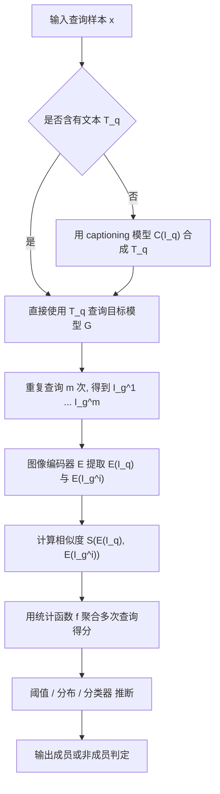
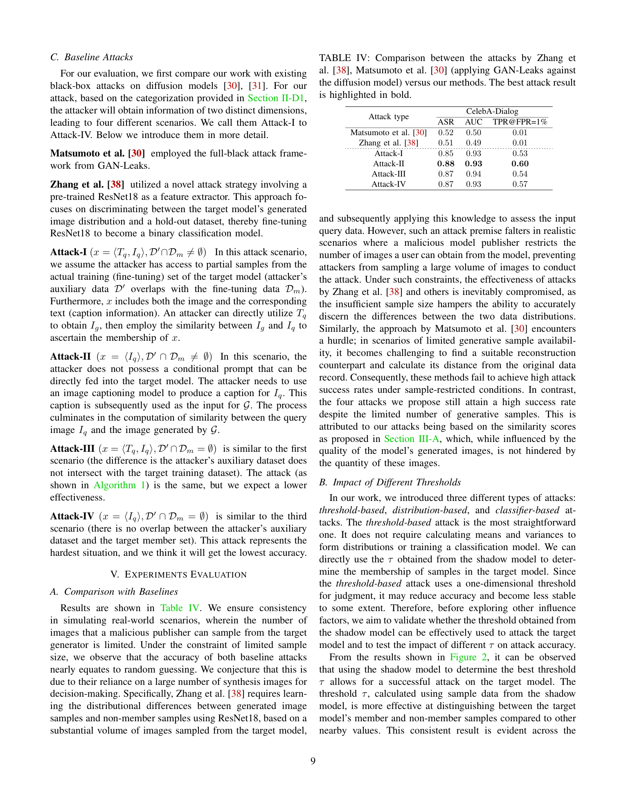

# Black-box Membership Inference Attacks against Fine-tuned Diffusion Models

- Title: Black-box Membership Inference Attacks against Fine-tuned Diffusion Models
- Material Path: `D:/Code/DiffAudit/Project/references/materials/black-box/2025-ndss-black-box-membership-inference-fine-tuned-diffusion-models.pdf`
- Primary Track: `black-box`
- Venue / Year: `NDSS 2025`
- Threat Model Category: 黑盒成员推断攻击，目标为下游微调后的条件扩散模型
- Core Task: 在仅有查询接口的条件下，判断给定样本是否属于目标模型的微调训练集
- Open-Source Implementation: `https://github.com/py85252876/Reconstruction-based-Attack`
- Report Status: complete

## Executive Summary

本文研究的问题是：当攻击者只能通过文本到图像接口访问目标扩散模型时，是否仍然能够判断某个图文样本是否参与了该模型的微调训练。论文聚焦于现实的黑盒场景，而不是依赖参数、梯度或中间去噪轨迹的白盒/灰盒设定。作者将目标限定为“微调数据集成员关系”，明确不讨论预训练数据泄漏，这一选择与当前 Stable Diffusion 类模型的大规模预训练、少样本下游微调实践相匹配。

论文的核心方法是把“成员样本更容易被模型复现”具体化为“查询图像与模型生成图像在特征空间中的相似度更高”。攻击流程并不直接估计扩散模型的似然，而是多次查询目标模型，得到若干生成图像，再通过图像编码器提取嵌入，用余弦相似度等距离函数计算查询图像与生成图像之间的相似度，最后以阈值、分布检验或分类器三种推断器输出成员判定。作者进一步把攻击条件拆成四种场景，分别覆盖“是否已知文本提示”和“攻击者辅助数据是否与成员集重叠”两个维度。

论文报告的主结果较强。在受限采样预算下，两个既有黑盒基线在 CelebA-Dialog 上几乎退化为随机猜测，而作者提出的四种攻击在同页 Table IV 中达到 `0.93-0.94` 的 AUC，`0.85-0.88` 的攻击成功率，以及 `0.53-0.60` 的 `TPR@FPR=1%`。摘要还给出跨 CelebA-Dialog、WIT、MS COCO 三个数据集的高 ROC-AUC，分别约为 `0.95`、`0.85`、`0.93`。作者同时表明 DP-SGD 可显著削弱攻击效果，使若干设置接近随机猜测。

对 DiffAudit 而言，这篇论文的重要性在于它给出了一个更贴近真实部署接口的黑盒基线：攻击者只需访问生成接口、有限辅助数据、以及在部分场景下可用的图像描述模型，即可实现对微调数据成员关系的审计。它不仅有助于组织黑盒路线中的威胁分层，也能为“模型输出接口是否足以泄露训练参与信息”这一产品叙事提供直接证据。

## Bibliographic Record

题目为 *Black-box Membership Inference Attacks against Fine-tuned Diffusion Models*，作者为 Yan Pang 与 Tianhao Wang。当前本地材料路径为 `D:/Code/DiffAudit/Project/references/materials/black-box/2025-ndss-black-box-membership-inference-fine-tuned-diffusion-models.pdf`。文件名显示其归档为 `NDSS 2025` 版本；论文参考文献中同时给出完整版本 `arXiv:2312.08207`，因此可将公开来源记录为 `https://arxiv.org/abs/2312.08207`。摘要和附录均给出开源实现仓库 `https://github.com/py85252876/Reconstruction-based-Attack`，制品附录还提到实验资产上传至 Zenodo。

## Research Question

论文试图回答的精确问题是：在黑盒访问条件下，针对经过下游数据微调的条件扩散模型，攻击者能否仅凭有限次生成查询和辅助数据，可靠地区分成员样本与非成员样本。这里的威胁模型不是传统分类器 MIA，而是面向文本到图像生成器，且重点关注微调阶段的数据隐私。

作者假设的部署环境包含两个关键维度。第一，查询样本可能是完整的图文对 `(T_q, I_q)`，也可能只有图像 `I_q` 而没有原始文本描述。第二，攻击者持有的辅助数据集 `D` 可能与目标模型成员集 `D_m` 部分重叠，也可能完全不重叠。由此形成 Attack-I 到 Attack-IV 四种黑盒场景。

## Problem Setting and Assumptions

访问模型方面，攻击者只能向目标条件生成器 `G` 提交文本提示并收集输出图像，无法读取参数、损失、梯度或中间去噪状态。输入方面，查询样本至少包含待判定图像 `I_q`；在较强场景下还额外包含文本 `T_q`。若缺失文本，攻击流程将调用图像描述模型为 `I_q` 合成提示词。输出方面，攻击需要对同一查询执行 `m` 次生成，以便形成相似度得分向量，而不是依赖一次输出。

作者还要求存在辅助数据与影子模型。辅助数据用于训练影子生成器、构造阈值或成员/非成员分布，并在分类器攻击中产生监督信号。论文明确说明其关注微调数据，而不关注 Stable Diffusion 预训练集，因此推断目标是“某样本是否被用于 LoRA/下游微调”。此外，文本仅作为条件输入而非单独的成员推断对象，文本-only 查询未被认为是现实场景。

从当前报告作者的角度看，论文还有两个重要隐含条件。其一，攻击效果与目标模型输出质量正相关，因此攻击成败并不只由统计判决器决定，也受生成质量制约。其二，Attack-II 与 Attack-IV 对图像描述模型质量高度敏感，这意味着“只有图像、没有原始提示词”的黑盒攻击并非完全无条件成立。

## Method Overview

方法的理论起点是扩散模型训练目标与样本复现之间的联系。作者并不直接估计难以计算的生成似然，而是从扩散训练损失和 ELBO 近似出发，论证成员样本在去噪/重建意义下更接近模型生成的对应图像。因此，在黑盒条件下，可以把“查询图像与生成图像的相似度”当作成员性信号。

具体流程如下。若查询样本包含文本 `T_q`，攻击者直接以 `T_q` 调用目标模型；若不包含文本，则先用 BLIP2 之类的 captioning 模型从 `I_q` 合成文本。随后，对目标模型重复查询 `m` 次，得到生成图像序列 `I_g^1, \dots, I_g^m`。再用预训练图像编码器 `E` 提取 `I_q` 与各 `I_g^i` 的嵌入，通过余弦相似度、`L_1`、`L_2` 或 Hamming 等距离函数计算相似度向量。最后用统计函数 `f` 聚合多次查询结果，并交给三类推断器之一：阈值攻击、基于成员/非成员分布的似然比攻击、以及基于多层感知机的分类器攻击。

## Method Flow

## Key Technical Details

论文的技术特征是把扩散模型训练目标与黑盒相似度攻击连接起来。由于 PDF 文本抽取会破坏部分数学排版，下面公式采用标准扩散记号重写，但语义对应论文中的 Equation (1)、(2)、(3) 与 Stable Diffusion 的 latent 版本公式。

扩散前向过程与训练损失可写为：

$$
x_t = \sqrt{\bar{\alpha}_t} x_0 + \sqrt{1-\bar{\alpha}_t}\,\epsilon,
\qquad
\mathcal{L}_t(\theta)
=
\mathbb{E}_{x_0,\epsilon,t}
\left[
\left\|
\epsilon - U_\theta\!\left(
\sqrt{\bar{\alpha}_t} x_0 + \sqrt{1-\bar{\alpha}_t}\,\epsilon, t
\right)
\right\|_2^2
\right].
$$

作者据此主张：若样本属于训练集，则模型更容易生成与该样本接近的复现图像，因此可用简单阈值攻击表示为

$$
A_{\text{base}}(x,\tau)
=
\mathbf{1}\!\left\{ S(I_q, I_g) \ge \tau \right\}.
$$

对于 Stable Diffusion 的 latent diffusion 版本，论文把优化目标重写为潜变量重建：

$$
\mathcal{L}_{\text{LDM}}
=
\mathbb{E}_{E(x),t}
\left[
\left\|
z_0 - z(z_t, t, \tau_\theta(p))
\right\|_2^2
\right],
\qquad
\Pr[b=1 \mid x,\theta]
\propto
-\left\|
D(z_0) - D\!\left(z(z_t,t,\tau_\theta(p))\right)
\right\|_2^2.
$$

实现层面上，攻击并不直接对像素做距离，而是对图像编码器输出的 patch/embedding 向量计算相似度。论文比较了 DETR、BEiT、EfficientFormer、ViT、DeiT 五种编码器以及多种距离度量，最终在默认设置中使用 DeiT 与余弦相似度，因为它们在跨数据集、跨攻击类型的结果里最稳定。

## Experimental Setup

目标模型为 Stable Diffusion v1-5，作者关注其在下游数据集上的微调隐私，而非预训练隐私。评估数据集为 CelebA-Dialog、WIT 与 MS COCO，并刻意避免与 Stable Diffusion 预训练数据重叠。成员样本作为正类，非成员样本作为负类。论文默认实验设置包括：训练集规模 `100`、微调 `500` 个 epoch、分辨率 `512×512`、batch size `4`、学习率 `5×10^{-5}`、梯度累积步数 `4`、推理步数 `30`、图像编码器 DeiT、图像描述模型 BLIP2、距离度量为余弦相似度、攻击器默认为 classifier-based。

基线方面，作者比较了 Matsumoto 等人的 GAN-Leaks 风格黑盒方法，以及 Zhang 等人的基于 ResNet18 区分生成分布与保留集分布的黑盒方法。评测指标主要为攻击成功率 `ASR`、`AUC` 和 `TPR@FPR=1%`；在研究推理步数影响时，还额外记录 `FID`。制品附录表明代码同时提供分数矩阵、BLIP checkpoint、LoRA 模块与完整运行脚本。

## Main Results

最关键的结果是：在作者刻意模拟的“恶意模型发布者限制可采样图像数量”的现实场景中，既有黑盒基线接近随机猜测，而新方法仍然有效。Table IV 显示，在 CelebA-Dialog 上，Matsumoto 等人与 Zhang 等人的 AUC 分别只有 `0.50` 与 `0.49`，`TPR@FPR=1%` 都只有 `0.01`；相比之下，作者四种攻击的 AUC 达到 `0.93-0.94`，ASR 达到 `0.85-0.88`，低 FPR 下 TPR 也在 `0.53-0.60`。

摘要和后续实验说明该框架并非只在单一表格中成立。论文报告在 CelebA-Dialog、WIT、MS COCO 上最高可达到约 `0.95`、`0.85`、`0.93` 的 ROC-AUC。阈值攻击虽然最简单，但在三数据集上四个场景里 AUC 仍普遍超过 `0.7`。图像编码器比较显示 DeiT 最稳定；距离度量比较显示余弦相似度在阈值、分布、分类器三类攻击器下都最优或近最优。

消融结果也较有信息量。随着微调 epoch 增加，攻击精度上升，作者将其解释为模型对训练样本的记忆增强。相反，单纯提高 DDIM 推理步数不会显著改善攻击效果，说明输出质量的局部变化不足以改变整体可攻击性。影子模型从 Stable Diffusion 换成 Kandinsky 后，攻击仍保持较高成功率，说明方法对架构失配具有一定鲁棒性。另一方面，如果 Attack-II 与 Attack-IV 不再微调 captioning 模型，成功率会明显下降，例如 CelebA 上从 `0.93` 降到 `0.59/0.60`，表明“无文本场景”的实际难点在提示词恢复。

防御实验显示 DP-SGD 对该类攻击确有抑制作用。在 MS COCO、训练集大小 `100` 或 `200` 的设置下，加入 DP-SGD 后多数组合的 AUC 降到 `0.50-0.67` 附近，`TPR@FPR=1%` 大多只剩 `0.00-0.03`。这说明论文提出的攻击主要利用了模型对训练样本的记忆；当记忆被差分隐私训练抑制时，攻击信号会迅速衰减。

## Strengths

论文的首要优点是把黑盒条件约束写得足够具体，不是假设攻击者可以无限制采样，也不偷偷退回到灰盒或白盒信息。四种场景由“是否有原始文本提示”与“辅助数据是否重叠”组成，威胁模型划分清晰，便于后续路线图复用。

第二个优点是方法结构统一。无论阈值、分布还是分类器攻击，本质上都围绕同一个相似度分数矩阵展开，因此实验对比具有可解释性。第三个优点是实验覆盖较广，既比较编码器、距离度量、微调步数、推理步数，也检验影子模型失配、captioning 去微调和 DP-SGD 防御，证据链相对完整。

## Limitations and Validity Threats

论文虽然给出理论论证，但其可操作攻击最终仍建立在“成员样本更容易被生成并与查询图像相似”这一经验关联上，而不是可精确计算的生成似然估计。因此，理论部分更像合理化解释，而非严格可计算的最优判决定理。

实验设置也有明显边界。默认训练集规模为 `100`，这与小样本个性化微调场景一致，但不足以覆盖更大规模下游训练；作者自己也承认随着训练样本增多，攻击精度下降。此外，Attack-II 和 Attack-IV 需要 captioning 模型，且该模型若未微调会显著削弱攻击效果，这意味着“仅凭图像即可稳定发起黑盒 MIA”的结论不能被无条件外推。

复现成本同样不低。制品附录要求 A6000 级别 GPU、约 `252 GB` 内存，并涉及 Stable Diffusion、LoRA、BLIP2、影子模型与分数矩阵等多个组件。对 DiffAudit 而言，这意味着论文虽然适合作为黑盒路线基线，但其端到端复现不属于轻量级实验。

## Reproducibility Assessment

论文提供了公开代码仓库，并在制品附录中列出较完整的运行资产：示例数据集、已训练 LoRA 模块、BLIP checkpoint、相似度分数矩阵以及命令行脚本。就“是否能重放作者报告的曲线和表格”而言，材料完备度高于一般安全论文。

但忠实复现实验今天仍有几个阻塞项。第一，硬件需求较高。第二，论文的多类实验依赖影子模型、captioning 微调与大规模图像生成，时间成本显著。第三，从当前 DiffAudit 工作区可见内容来看，仓库已覆盖文献收集与报告体系，但尚未显示出一套与本文严格对齐的黑盒攻击执行流水线，因此目前更接近“文献路线可复核”，而不是“实验路线已落地”。

## Relevance to DiffAudit

这篇论文与 DiffAudit 的黑盒路线高度相关，因为它给出了一个现实约束更强的攻击模板：有限查询预算、仅输出接口、可能缺失提示词、依赖辅助数据与影子模型。它能够帮助 DiffAudit 在路线图中明确区分“黑盒可行”和“无任何辅助先验可行”并不是同一件事。

从叙事上看，论文还把攻击价值从纯学术成员推断扩展到了审计工具。作者用艺术风格模仿场景说明，成员与非成员相似度的显著差异可被用于检测模型是否未经授权使用了特定艺术家作品进行微调。这与 DiffAudit 面向生成模型版权、个性化微调和模型市场审计的场景非常贴近。

## Recommended Figure

- Figure page: `9`
- Crop box or note: 使用 `clip 295 42 585 215` 从 PDF 第 9 页裁切 `Table IV` 标题与表格区域，避免整页正文干扰
- Why this figure matters: 该表在受限采样预算下直接比较两种既有黑盒基线与本文四种攻击，最集中地体现“旧方法接近随机猜测，而新方法在低 FPR 条件下仍显著有效”的核心结论
- Local asset path: `../assets/black-box/2025-ndss-black-box-membership-inference-fine-tuned-diffusion-models-key-figure-p9.png`

## Extracted Summary for `paper-index.md`

这篇论文研究黑盒成员推断在微调扩散模型上的可行性，核心问题是在仅有文本到图像查询接口、且攻击者无法访问参数与中间状态的条件下，判断给定样本是否属于目标模型的微调训练集。作者将威胁模型聚焦于下游微调数据，而非预训练数据，并把攻击场景分成“是否拥有原始提示词”和“辅助数据是否与成员集重叠”两个维度下的四种设置。

论文提出的核心方法是基于相似度分数的黑盒攻击框架：对同一查询多次调用目标模型，比较查询图像与生成图像在特征空间中的相似度，再通过阈值、分布检验或分类器输出成员判定。论文报告在 CelebA-Dialog、WIT、MS COCO 上取得较高 AUC，并在有限采样预算下明显优于既有黑盒基线；同时，DeiT 与余弦相似度最稳定，DP-SGD 会显著削弱攻击效果。

对 DiffAudit 而言，这篇论文是黑盒路线中的关键参照，因为它证明了仅凭输出接口与有限辅助信息，微调扩散模型就可能泄露训练参与信息。它还明确揭示了黑盒路线中的真实边界条件，例如 captioning 质量、辅助数据重叠、影子模型选择和采样预算，因此适合用作黑盒审计叙事与实验分层的锚点文献。
