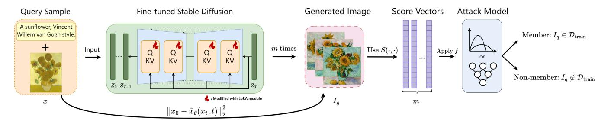

# 面向微调扩散模型的黑盒成员推断攻击
Black-box Membership Inference Attacks against Fine-tuned Diffusion Models

## 文献信息

- 英文标题：Black-box Membership Inference Attacks against Fine-tuned Diffusion Models
- 中文标题：面向微调扩散模型的黑盒成员推断攻击
- 作者：Yan Pang，Tianhao Wang
- 发表信息：NDSS 2025
- 论文主问题：在仅有文本到图像查询接口的条件下，如何判断给定图像或图文对是否属于目标模型的微调训练集
- 威胁模型类别：黑盒成员推断攻击，目标为条件扩散模型的下游微调阶段
- 本地 PDF 路径：`<DIFFAUDIT_ROOT>/Research/references/materials/black-box/2025-ndss-black-box-membership-inference-fine-tuned-diffusion-models.pdf`
- GitHub PDF：[2025-ndss-black-box-membership-inference-fine-tuned-diffusion-models.pdf](https://github.com/DeliciousBuding/DiffAudit-Research/blob/main/references/materials/black-box/2025-ndss-black-box-membership-inference-fine-tuned-diffusion-models.pdf)
- OCR/Markdown 精修版链接：[OCR精修版：Black-box Membership Inference Attacks against Fine-tuned Diffusion Models](https://ncn24qi9j5mt.feishu.cn/docx/Or4UdDUsxoxvidxvSdDcKZ8fntb)
- 飞书原生 PDF：[2025-ndss-black-box-membership-inference-fine-tuned-diffusion-models.pdf](https://ncn24qi9j5mt.feishu.cn/file/A43xbNYYfojZMdxyOdecmW8enmc)
- 开源实现：[py85252876/Reconstruction-based-Attack](https://github.com/py85252876/Reconstruction-based-Attack)
- 报告状态：本地 Markdown 终稿

## 1. 论文定位

这篇论文属于黑盒成员推断路线的主论文，研究对象不是预训练扩散模型是否记住了大规模互联网语料，而是公开预训练模型在下游小样本微调后，是否会对微调数据产生可外部利用的成员泄露。作者把攻击面明确限定为文本到图像服务接口，因此它讨论的是更贴近真实部署的 API 风险，而不是白盒或灰盒设定下的能力上界。

在 DiffAudit 的文献框架中，这篇论文的价值在于为“仅凭生成接口是否足以支持成员推断”给出较强的实证回答。它既不是纯理论论文，也不是工程实现说明，而是一篇围绕黑盒攻击可行性、边界条件和防御效果展开的系统性实验论文。

## 2. 核心问题

论文试图回答的问题可以压缩为一句话：当攻击者只能反复调用目标扩散模型的生成接口时，能否可靠地区分某个查询样本是否参与了该模型的微调训练。这里的关键不在于恢复模型参数，也不在于读取中间去噪轨迹，而在于从最终生成图像与查询图像之间的相似性中提取成员信号。

作者进一步把问题细化为两个技术子问题。第一，如果查询样本只包含图像而没有原始文本提示，提示恢复是否足以支撑攻击。第二，如果攻击者手中的辅助数据与目标成员集不重叠，影子模型校准后的分数是否仍有可迁移性。四种 Attack-I 到 Attack-IV 场景，正是围绕这两个子问题展开。

## 3. 威胁模型与前提

论文假设攻击者只能访问目标条件扩散模型的输出接口，能够提交文本提示并收集生成图像，看不到模型参数、梯度、损失值以及中间去噪状态。查询对象至少包含待判定图像 `I_q`；在较强场景下还包含与之对应的原始文本 `T_q`。若文本缺失，攻击者可使用图像描述模型先合成提示词，再将其送入目标模型。

攻击还依赖辅助数据和影子模型。辅助数据既用于拟合成员与非成员的相似度分布，也用于训练分类器型攻击器。论文显式区分辅助数据是否与目标微调成员集重叠，并据此定义四种场景：

| 场景 | 查询内容 | 辅助数据与成员集关系 | 难度判断 |
| --- | --- | --- | --- |
| Attack-I | `⟨T_q, I_q⟩` | 部分重叠 | 最强场景 |
| Attack-II | `⟨I_q⟩` | 部分重叠 | 依赖 captioning |
| Attack-III | `⟨T_q, I_q⟩` | 不重叠 | 迁移校准场景 |
| Attack-IV | `⟨I_q⟩` | 不重叠 | 最困难场景 |

论文结论的适用边界也很明确。它讨论的是微调数据成员关系，而不是 Stable Diffusion 预训练集成员关系；它讨论的是条件扩散模型的图像生成接口，而不是无条件采样器或文本单独成员关系；它默认攻击者可以多次查询同一提示，因此结论不直接覆盖被严格限流的一次性接口。

## 4. 方法总览

作者的核心判断是：成员样本在微调后更容易被目标模型“复现”，这种复现不必体现为逐像素重建，而会体现为查询图像与多次生成结果在特征空间中的更高相似度。基于这一判断，论文没有直接估计扩散模型难以计算的似然，而是把黑盒攻击统一改写为“多次查询 + 特征提取 + 相似度聚合 + 成员判决”的流程。

具体来说，若查询样本带有原始提示词，攻击者直接以 `T_q` 多次调用目标模型；若只给定图像，则先用 BLIP2 之类的 captioning 模型从 `I_q` 生成提示，再发起查询。对每次生成得到的图像 `I_g^i`，攻击者使用预训练图像编码器提取特征，并计算其与查询图像的相似度。最后，作者实现了三类推断器：基于阈值的简单攻击、基于成员/非成员分布的似然比较、以及直接消费相似度向量的分类器攻击。

与既有黑盒方法相比，这篇论文真正替换的不是判决头，而是攻击对象本身。传统 GAN-Leaks 一类方法依赖大量采样来寻找足够接近的重建样本，而本文将成员信号转化为较低查询预算下也可稳定计算的相似度统计量，因此在现实约束更强的 API 场景中仍能工作。

## 5. 方法概览 / 流程

从流程上看，作者把黑盒攻击拆成三个连续模块。第一步是提示构造：直接使用原始文本，或经 captioning 模型补齐文本。第二步是重复查询：对同一查询执行 `m` 次生成，得到一组与查询共享语义条件的输出图像。第三步是得分推断：在图像编码器空间中计算相似度向量，并用统计函数 `f` 做聚合，再交给阈值、分布或分类器型攻击器。

这一步分解的重要性在于，它把黑盒攻击的真正瓶颈从“如何精确重建训练样本”转移到了“如何稳定组织相似度分数”。因此，论文后续关于图像编码器、距离度量、captioning 质量和影子模型失配的消融，本质上都是在检验这一分数组织方式是否稳健。

上图概括了方法闭环：查询样本经提示恢复后反复触发目标模型生成，再通过图像特征相似度形成成员判定。对团队阅读而言，这张图的价值不是复述步骤本身，而是清楚展示论文把 captioning、重复查询和分数聚合串成了同一条黑盒攻击链路。

## 6. 关键技术细节

论文首先给出一个理论动机：如果成员样本在扩散模型训练中被更充分地拟合，那么其潜变量重建结果应当更接近原始图像。对 Stable Diffusion 而言，作者把这种关系写成潜空间形式：

$$
\Pr[b=1 \mid x,\theta]
\propto
-\left\|
D(z_0)-D\!\left(\hat{z}_{\theta}(z_t,t,\phi_{\theta}(p))\right)
\right\|_2^2.
$$

这条式子的作用不是直接构造一个可计算的最优检验器，而是给出为什么“生成图像与查询图像的接近程度”可以作为成员信号的理论支撑。换言之，论文不是在黑盒条件下真正估似然，而是在用扩散训练目标解释相似度攻击的合理性。

在最基础的实例化中，成员推断可以写成一个阈值判决：

$$
\mathcal{A}_{\text{base}}(x,\theta)
=
\mathbf{1}\left\{S(I_q, I_g)\ge \tau\right\}.
$$

其中 `S` 是查询图像与生成图像之间的相似度函数，`\tau` 是由影子模型校准出的阈值。单次查询对应的判决过于脆弱，因此作者进一步把同一查询下的多次生成结果统一纳入统计函数 `f` 中。对于基于阈值的攻击，聚合后的分数还要在 patch 维度上平均：

$$
\frac{1}{k}\sum_{j=1}^{k}
f\!\left[
\left\langle
S\!\left(E(I_q),E(I_g^i)\right)
\right\rangle_{i=1}^{m}
\right]_j
\ge \tau.
$$

这条公式说明论文真正比较的不是像素差，而是编码器特征空间中的多次查询相似度。`E` 的选择因此直接决定攻击质量。论文比较了 DETR、BEiT、EfficientFormer、ViT、DeiT 等图像编码器，并发现 DeiT 最稳定；距离度量方面，余弦相似度在三类攻击器与多数据集设置下整体最稳健。

分布攻击和分类器攻击则把相同的分数矩阵用不同方式消费。前者用影子模型成员集与非成员集分别拟合 `Q_in` 和 `Q_out`，再比较查询分数更像哪一侧；后者把聚合后的高维相似度向量直接送入 MLP。论文后续实验反复表明，分类器攻击通常最强，但其提升建立在同一套分数矩阵之上，因此论文的真正贡献仍是黑盒相似度框架，而不是分类器结构本身。

## 7. 实验设置

实验目标模型是 Stable Diffusion v1-5 的下游微调版本，评估数据集为 CelebA-Dialog、WIT 与 MS COCO。作者显式避免与 Stable Diffusion 预训练数据重叠，以保证讨论对象确实是微调阶段成员关系。成员集记为正类，非成员集记为负类。

默认设置来自论文的 Table III：训练集规模 `100`，微调 `500` 个 epoch，分辨率 `512×512`，batch size `4`，学习率 `5×10^{-5}`，梯度累积步数 `4`，推理步数 `30`，图像编码器采用 DeiT，图像描述模型采用 BLIP2，距离度量采用余弦相似度，默认攻击器采用 classifier-based。论文同时说明，每次微调平均需要两张 A100 GPU 持续约三天，这一成本对复现评估有直接影响。

基线方面，论文比较了 Matsumoto 等人的 GAN-Leaks 风格黑盒方法，以及 Zhang 等人基于 ResNet18 区分生成分布与保留集分布的方法。指标采用 `ASR`、`AUC` 与 `TPR@FPR=1%`，并在部分消融中记录 `FID` 以观察采样步数变化是否改变图像质量与攻击结果。

## 8. 主要结果

论文最重要的结论来自受限采样预算下的基线对比。作者刻意模拟恶意模型发布者限制用户采样数量的现实情形，在这一设定下，既有黑盒方法几乎退化为随机猜测，而本文提出的四种攻击仍然维持较高判别力。以 CelebA-Dialog 为例，Matsumoto 与 Zhang 两个基线的 AUC 分别仅为 `0.50` 和 `0.49`，`TPR@FPR=1%` 都只有 `0.01`；相比之下，Attack-I 到 Attack-IV 的 AUC 达到 `0.93` 到 `0.94`，ASR 达到 `0.85` 到 `0.88`，低误报区间的 TPR 为 `0.53` 到 `0.60`。

这张表对理解论文主结论最关键，因为它集中回答了“为什么旧方法在扩散模型 API 上失效，而新方法仍有效”。论文的解释是，旧方法更依赖大量采样来估计分布差异或寻找重建对应，而本文方法依赖的是较少查询下仍可稳定计算的相似度统计量，因此更符合有限预算接口的现实。

除主表外，论文还给出几组决定边界条件的结果。其一，在 CelebA-Dialog、WIT 与 MS COCO 上，最佳 ROC-AUC 分别约为 `0.95`、`0.85` 与 `0.93`，说明攻击并非仅在单一数据集成立。其二，随着微调 epoch 增加，攻击效果上升，作者将其解释为模型对训练样本记忆增强；而单纯增加 DDIM 推理步数并不会显著提升攻击性能，说明攻击强弱并不主要受采样步数驱动。其三，Attack-II 与 Attack-IV 在不微调 captioning 模型时会明显退化，例如 CelebA-Dialog 上可从 `0.93` 降至 `0.59` 或 `0.60`，表明“无原始文本”场景的真正瓶颈在提示恢复质量。其四，DP-SGD 会把若干实验组合压到接近随机猜测，说明攻击信号确实与训练记忆相关，而不是偶然的语义匹配。

## 9. 优点

- 论文把黑盒约束定义得足够严格，没有借助中间去噪状态、梯度或目标训练集显式已知等灰盒前提。
- 四种攻击场景来自两个现实维度的交叉分解，即原始提示词是否可得、辅助数据是否与成员集重叠，因此后续实验的解释力较强。
- 方法主线统一，阈值攻击、分布攻击和分类器攻击都建立在同一套相似度分数矩阵之上，便于判断改进究竟来自特征还是来自判决器。
- 消融覆盖了图像编码器、距离度量、captioning 微调、影子模型失配、训练轮数与 DP-SGD 防御，证据链完整度较好。

## 10. 局限与有效性威胁

论文的第一重局限在于它并未真正解决“零先验黑盒成员推断”。Attack-II 与 Attack-IV 对 captioning 质量高度敏感，而 Attack-I 与 Attack-III 则要求原始提示词可得。因此，若现实接口既无法恢复稳定提示，又无法获得相对贴近的数据先验，攻击强度会低于主表呈现的水平。

第二重局限来自实验边界。默认训练集规模只有 `100`，虽然与个性化或小样本风格微调场景贴近，但不能直接外推到更大规模的下游训练。论文也承认随着训练集扩大，攻击成功率会下降，因此“黑盒成员推断始终有效”并不是本文支持的结论。

第三重局限是复现成本。论文制品涉及 Stable Diffusion、LoRA、BLIP2、影子模型、相似度分数矩阵与多类脚本，硬件要求也偏高。对 DiffAudit 而言，阻塞并不在理解论文，而在是否具备一条可控的黑盒查询、提示恢复、影子校准和分数缓存流水线。

最后，理论部分更适合作为方法动机，而不是严格的最优性证明。论文通过扩散训练目标说明相似度为何有意义，但黑盒攻击最终仍建立在经验上可分的统计量之上，因此不能把公式部分误读为对所有条件扩散模型的统一可证判决定理。

## 11. 对 DiffAudit 的价值

这篇论文可以直接进入 DiffAudit 的黑盒主路线，角色是“现实 API 场景下的主锚点论文”，而不是边界材料。相比更早依赖图像变体接口或更强访问权限的方法，它更贴近模型市场与图像生成服务的真实攻击面。

对工程实现而言，论文给出的优先级很清楚：先打通重复查询、captioning、图像编码器、相似度分数矩阵和影子模型校准，再谈更复杂的攻击器替换。对实验分层而言，它提供了四种场景的天然分桶，适合 DiffAudit 后续按“有无提示词”“有无重叠辅助数据”组织黑盒实验矩阵。对产品叙事而言，它说明仅凭输出接口也可能检测模型是否记住了微调样本，这对版权审计、个性化模型审计和模型市场风险提示都具有直接价值。

## 12. 关键图使用方式

本报告选用两张图，且都已插入对应正文段落之后。第一张图放在第 5 节，用于解释 attack pipeline 如何把提示恢复、重复查询和分数聚合连接成单一黑盒链路。第二张图放在第 8 节，用于锚定受限采样预算下的主结论，即旧黑盒基线接近随机猜测，而本文方法仍保持显著可分性。两张图分别承担方法理解与主结果展示，不再保留独立图片区块。

## 13. 复现评估

若要复现实验，需要至少具备以下资产：目标模型或可替代的本地微调模型、成员与非成员划分、影子模型训练管线、BLIP2 或同类 captioning 模型、图像编码器及相似度计算实现、重复查询与分数缓存机制，以及对多种攻击器共享的相似度矩阵导出接口。

从仓库当前状态看，文献归档和报告体系已经具备，但尚未看到与本文一一对应的黑盒攻击执行流水线。真正缺失的不是公式或表格，而是可复用的实验编排能力：如何稳定调用目标模型、如何在有限预算下缓存多次生成结果、如何把提示恢复质量纳入实验控制、以及如何对影子模型和目标模型使用同构的分数特征。后一项尤其关键，因为论文多组结果都依赖影子模型校准。

结构性阻塞主要有两个。第一，若实际目标只有线上 API 而非本地权重，复现将受到限流、费用和不可控随机性的约束。第二，Attack-II 与 Attack-IV 的有效性高度依赖 captioning 质量，因此即便查询接口打通，没有稳定的提示恢复模块也很难复现实验主结论。

## 14. 写回总索引用摘要

这篇论文研究的是微调条件扩散模型在黑盒接口下的成员推断问题，重点不是预训练集泄露，而是小样本下游微调后，外部查询者能否仅凭生成结果判断某个样本是否参与训练。

论文提出的核心方法是基于相似度分数的黑盒攻击框架：对同一查询反复调用目标模型，在图像编码器空间中比较查询图像与生成图像的相似度，再通过阈值、分布或分类器三类攻击器输出成员判定。主实验显示，在受限采样预算下，本文方法显著优于既有黑盒基线；同时，captioning 质量、辅助数据关系与 DP-SGD 防御都会明显影响攻击结果。

对 DiffAudit 而言，这篇论文是黑盒路线的主锚点文献。它既给出了贴近现实 API 约束的攻击模板，也明确揭示了黑盒审计真正依赖的先验条件和工程瓶颈，适合用于后续实验分层、实现优先级排序和面向外部场景的风险叙事。
