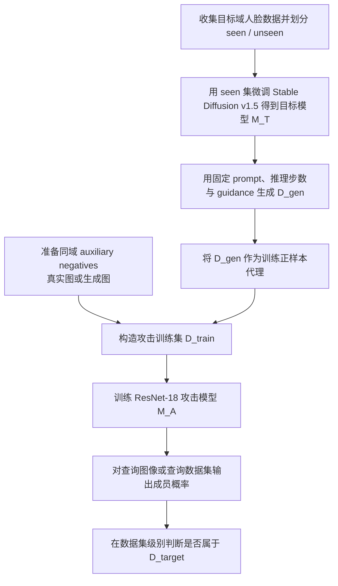
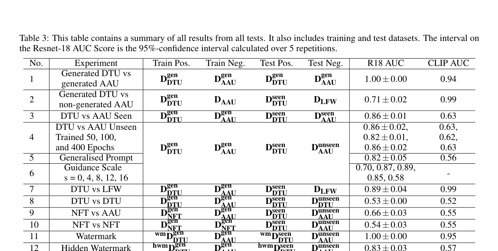

# Membership Inference Attacks for Face Images Against Fine-Tuned Latent Diffusion Models

- Title: Membership Inference Attacks for Face Images Against Fine-Tuned Latent Diffusion Models
- Material Path: `references/materials/black-box/2025-visapp-membership-inference-face-fine-tuned-latent-diffusion-models.pdf`
- Primary Track: `black-box`
- Venue / Year: VISAPP 2025
- Threat Model Category: 黑盒、数据集级成员推断、面向人脸数据微调的 latent diffusion model
- Core Task: 判断一批人脸图像是否被用作 Stable Diffusion v1.5 微调集
- Open-Source Implementation: [osquera/MIA_SD](https://github.com/osquera/MIA_SD)（仓库索引记录；本报告未执行）
- Report Status: done

## Executive Summary

这篇论文讨论的是一个非常具体但现实性很强的黑盒隐私审计问题：当攻击者只能像普通用户一样向目标 latent diffusion model 输入文本提示词并接收生成图像时，能否判断某批人脸照片是否被用来微调该模型。作者把问题限制在 Stable Diffusion v1.5 与人脸域，避免把结论泛化到未微调模型或更宽泛的图像分布。

论文的核心方法不是直接对目标模型做逆向，而是先利用目标模型生成一批“训练正样本替身”，再用一个 ResNet-18 监督分类器学习“成员域”与“非成员域”的差异。关键假设是：如果目标模型对微调数据过拟合，那么其生成分布会泄露训练集的统计特征，足以让攻击模型在数据集层面做出成员判断。

作者报告该攻击在多种黑盒设置下有效。以 `D^seen_{DTU}` 对 `D^unseen_{AAU}` 为例，目标模型训练 50、100、400 epochs 时，攻击 AUC 分别约为 `0.86 ± 0.02`、`0.82 ± 0.01`、`0.86 ± 0.02`；可见即便不是极端长时间微调，攻击也能成立。作者同时强调，该方法对“单张图像是否在训练集内”并不成功，`D^seen_{DTU}` 对 `D^unseen_{DTU}` 的 AUC 仅 `0.53 ± 0.00`，接近随机猜测。

对 DiffAudit 而言，这篇论文的重要性在于它把“黑盒 diffusion MIA”从抽象 benchmark 拉到更贴近合规叙事的人脸场景，并系统检查了 auxiliary data、guidance scale、prompt 和 watermark 对攻击信号的影响。它更像一篇风险案例与实验条件研究，而不是最终可直接产品化的主线算法。

## Bibliographic Record

- Title: Membership Inference Attacks for Face Images Against Fine-Tuned Latent Diffusion Models
- Authors: Lauritz Christian Holme, Anton Mosquera Storgaard, Siavash Arjomand Bigdeli
- Venue / year / version: VISAPP 2025, conference proceedings version
- Local PDF path: `D:/Code/DiffAudit/Project/references/materials/black-box/2025-visapp-membership-inference-face-fine-tuned-latent-diffusion-models.pdf`
- Source URL if known: [https://doi.org/10.5220/0013182600003912](https://doi.org/10.5220/0013182600003912)

## Research Question

论文试图回答的问题是：在纯黑盒访问条件下，攻击者能否推断一组人脸图像是否属于某个被微调 latent diffusion model 的训练集。这里的“成员关系”主要是数据集级别，而不是逐张图像的点级别归属。

其默认威胁模型是假设攻击者无法访问模型权重、训练配置或原始训练数据，只能通过文本提示词查询目标模型 `M_T` 并获得生成图像。攻击者还需要准备一个不与目标训练集重合、但与目标域相同或相近的 auxiliary dataset。

## Problem Setting and Assumptions

- Access model: 纯黑盒；只能输入 prompt，不能访问参数、梯度或训练日志。
- Available inputs: 查询图像集合、若干文本 prompt、一个可构造的辅助人脸数据域。
- Available outputs: 目标 LDM 生成的人脸图像；攻击模型输出某图像属于 `D_target` 的概率。
- Required priors or side information: 攻击者需要知道目标模型属于“人脸微调后的 Stable Diffusion”这一大致域假设，并能够准备同域非成员图像或生成式辅助数据。
- Scope limits: 论文只评估 SD v1.5 的 face-image fine-tuning；不声称适用于未微调模型，也没有证明对单样本级 membership 判定有效。

## Method Overview

作者先定义目标模型 `M_T` 为文本到图像映射，再定义攻击模型 `M_A` 为图像到成员概率映射。为了训练 `M_A`，作者不直接使用成员图片作为正样本，而是先用目标模型生成 2,500 张输出图像，将这些输出视作“泄露了训练数据分布的正样本代理”。负样本来自 auxiliary dataset，作者特别偏向用另一生成模型产生的人脸图，而不是直接使用真实照片，以避免攻击模型退化为“真实图 / 生成图”分类器。

具体流程是：收集 DTU 与 AAU 教职工公开头像，切分为 `seen` 与 `unseen`；用 `seen` 集微调 Stable Diffusion v1.5；再用微调后的模型生成 `D^gen`；随后把 `D^gen` 与 auxiliary negatives 组合成监督训练集，训练一个替换末层后的预训练 ResNet-18；最后用该攻击模型对待审计图像集合打分。论文还系统改变训练 epochs、prompt、guidance scale、watermark 与混合数据集设置，观察攻击表现的变化。

作者声称该方法利用的是“生成分布与训练分布的相似性”这一泄露信号。当前报告同意这是论文的主要工作假设，但也注意到作者自己在实验中观察到某些设置会因训练负样本与测试负样本共享分布而产生指标膨胀，因此该信号并不总是纯粹的成员性信号。

## Method Flow

## Key Technical Details

论文明确给出目标模型与攻击模型的函数形式：

$$
M_T : T \rightarrow \mathbb{R}^{H \times W \times 3}, \qquad
M_A : \mathbb{R}^{H \times W \times 3} \rightarrow P,
$$

其中 `P` 表示图像属于目标训练集 `D_{target}` 的预测概率。这个形式化很重要，因为它把攻击限制在“只看生成 API 行为”的黑盒设定，而不是内部表征。

论文还讨论了 classifier-free guidance 对生成分布泄露信号的影响，并引用了如下推理公式：

$$
\varepsilon_t = \varepsilon_{t,\mathrm{uncond}} + s \cdot \left(\varepsilon_{t,\tau(y)} - \varepsilon_{t,\mathrm{uncond}}\right),
$$

其中 `s` 为 guidance scale。作者报告当 `s` 位于 `4` 到 `12` 时，攻击 AUC 最强；`s=16` 时图像出现明显伪影，AUC 反而下降。这说明攻击性能高度依赖目标模型生成分布是否仍稳定贴近训练数据流形。

实现上，目标模型是 SD v1.5；图像标签由 BLIP 自动生成，并在 DTU/AAU 场景下分别加上 `"a dtu headshot of a"` 或 `"a aau headshot of a"` 前缀；攻击模型使用保留预训练权重的 ResNet-18，仅替换末层为二分类输出，并使用 categorical cross-entropy 与 Adam。当前报告认为，这种实现并不复杂，但复现成本主要集中在目标 LDM 微调和批量生成辅助数据上，而不是 ResNet-18 本身。

## Experimental Setup

目标域数据来自两所大学公开头像。`D_DTU` 与 `D_AAU` 各被切分为 `seen` / `unseen` 两部分，其中 `D^seen_{DTU}` 与 `D^seen_{AAU}` 各为 1,120 张，`D^unseen_{DTU}` 为 1,103 张，`D^unseen_{AAU}` 为 978 张。另一个非目标数据集是 `LFW`，共有 9,452 张人脸图。

目标模型为针对不同训练集分别微调的 SD v1.5。作者还构造了 visible watermark、hidden watermark 和 `DTU + LFW` 混合集训练版本。攻击训练正样本通常为各目标模型生成的 2,500 张人脸图，默认采用 100 inference steps，常用 guidance scale 为 `7.5`，并按 seed 每个生成 25 张图。基线是 CLIP zero-shot classification。

评估指标主要是 AUC。每个实验重复训练攻击模型 5 次，用 95% confidence interval 报告 ResNet-18 AUC。论文总共汇总了 13 组实验，覆盖 seen/unseen 负样本关系、是否微调、prompt 泛化、guidance scale、水印与混合集设置。

## Main Results

最核心的结论是：针对“是否使用某批人脸数据做过微调”的数据集级判断，攻击是可行的。`DTU vs AAU Seen` 的 AUC 为 `0.86 ± 0.01`，`DTU vs AAU Unseen` 在 50/100/400 epochs 下分别为 `0.86 ± 0.02`、`0.82 ± 0.01`、`0.86 ± 0.02`。这意味着攻击信号在多个训练时长下都存在，而不是只出现在极端过拟合情形。

第二个强结论是：攻击对辅助数据构造极其敏感。作者报告使用生成式 auxiliary negatives 明显优于使用真实图像；当真实 `LFW` 或 `AAU` 图像与生成正样本对比时，CLIP baseline 甚至可能取得接近完美的 AUC，这被作者自己解释为分布差异过大造成的“人为放大”。因此，一部分高分不能直接解释为纯成员泄露。

第三个关键结论是：这篇论文更支持“dataset-level MIA”而不是“per-image MIA”。`DTU vs DTU`（`D^seen_{DTU}` 对 `D^unseen_{DTU}`）的 AUC 只有 `0.53 ± 0.00`，几乎随机。相反，visible watermark 能把 AUC 提升到 `1.00 ± 0.00`，hidden watermark 仅有 `0.83 ± 0.03`；guidance scale 在 `s=8` 左右达到峰值，说明攻击成功率与生成设置强相关。

## Strengths

- 论文把 threat model 限定为真实黑盒 API 风格访问，问题定义清晰。
- 实验变量覆盖较全，明确检查了 epochs、prompt、guidance、watermark 与混合训练集。
- 作者没有回避负面结果，明确指出单样本级 membership 识别失败。
- 作者主动讨论了某些实验设置中的分布泄露与指标膨胀，这提高了结果解释的可信度。

## Limitations and Validity Threats

- 结论高度局限于“人脸域 + SD v1.5 + 微调模型”，外推到其他 latent diffusion family 缺乏证据。
- 攻击成功主要停留在数据集级别；如果 DiffAudit 目标是样本级归因或证据提交，这篇方法不够强。
- 训练负样本和测试负样本共享数据分布会带来人工增益；作者虽有识别，但未完全消除该混杂因素。
- 论文没有给出更系统的消融来区分“成员性信号”和“组织/拍摄环境风格信号”。
- 作者采用公开人脸抓取数据，真实世界中数据许可、爬取偏差和身份分布偏差都可能影响攻击表现。

## Reproducibility Assessment

忠实复现需要至少以下资产：可微调的 SD v1.5 环境、DTU/AAU 风格的人脸数据抓取结果、`seen/unseen` 划分、BLIP 自动打标流程、目标模型微调脚本、批量生成脚本、ResNet-18 训练配置，以及 visible / hidden watermark 版本数据。论文思路本身不复杂，但资产准备和 GPU 成本不低。

代码方面，仓库索引记录了 `osquera/MIA_SD`，说明作者路线可能有公开实现；但当前报告没有执行该仓库，因此不能确认其与论文最终设置的一致性。论文正文中也没有在已读关键页上详细列出完整复现实验命令。

结合仓库现状，DiffAudit 已经有 `black-box` 主线的 `recon`、`variation` 和 `clid` 代码化流程，以及 `code-ready` 或 `evidence-ready` 的 smoke 证据；但并没有这篇论文所需的 face-specific 数据抓取、BLIP 标注、SD v1.5 人脸微调和攻击分类器训练流水线。因此当前仓库只能复用黑盒工作流骨架，尚不能直接声称已覆盖本论文复现。

## Relevance to DiffAudit

这篇论文与 DiffAudit 的关系，首先在于它提供了一个高敏感度、高现实压力的黑盒案例：目标不再是通用图像，而是人脸照片。对于面向合规、取证或客户沟通的叙事，这比抽象 benchmark 更容易解释“为什么 diffusion MIA 值得审计”。

从方法路线看，它不是仓库当前 `recon` 或 `variation` 的直接替身。`recon` 更接近 reconstruction-based 纯黑盒阈值路径，`variation` 更接近 API-only 查询变化路径；而这篇论文使用的是“目标模型生成代理正样本 + 监督攻击分类器”的路线。因此它更适合被记录为 `black-box` 分支中的补充子路线，而不是当前主线实现的最短落地对象。

当前报告进一步推断，这篇论文最有价值的部分不是绝对 AUC，而是“哪些条件会放大或削弱成员信号”的实验图谱。对 DiffAudit 来说，这些因素可以反过来指导资产探测、风险说明和 benchmark 设计，例如显式记录目标模型是否是人脸域、是否存在显式水印、以及推理 guidance 是否稳定。

## Recommended Figure

- Figure page: 6
- Crop box or note: `55 65 540 310`，直接裁切 `Table 3` 区域；未采用整页截图，因为表格区域可以被干净分离，且正文对主图无增益
- Why this figure matters: 该表一次性汇总 13 组实验，集中展示了数据集级攻击可行、单样本级攻击失败、watermark 增强效应、guidance 影响与未微调对照；相比单独曲线图，它更完整地支撑论文主结论
- Local asset path: `docs/paper-reports/assets/black-box/2025-visapp-membership-inference-face-fine-tuned-latent-diffusion-models-key-figure-p6.png`

## Extracted Summary for `paper-index.md`

这篇论文研究的是一个面向人脸图像的黑盒成员推断问题：当 Stable Diffusion v1.5 被某批人脸照片微调后，外部攻击者能否仅通过 prompt 查询与生成结果，判断这批人脸是否属于训练集。作者特别把问题限制在 face-image fine-tuning 场景，因此结论更像是高敏感领域案例分析，而不是对所有扩散模型的普遍断言。

论文的方法是先用目标模型生成图像，把这些生成图像当作成员分布的正样本代理，再配合同域 auxiliary negatives 训练一个 ResNet-18 攻击模型。结果表明，该方法在数据集级别通常有效，例如 DTU 与 AAU 人脸集合之间可获得约 `0.86` 的 AUC；visible watermark 会把 AUC 推高到 `1.00`，guidance scale 也会显著影响结果；但对同一分布中的 seen / unseen 单样本识别基本失败，AUC 约为 `0.53`。

它对 DiffAudit 的意义在于补充了“面向敏感人脸数据的黑盒审计”这一现实叙事，并揭示了生成条件、辅助数据构造和水印会显著改变成员信号强度。仓库当前已有黑盒主线骨架，但尚未覆盖这篇论文所需的人脸抓取、BLIP 标注、SD v1.5 微调与攻击分类器训练，因此该文更适合作为黑盒路线的案例参照和条件分析材料。
