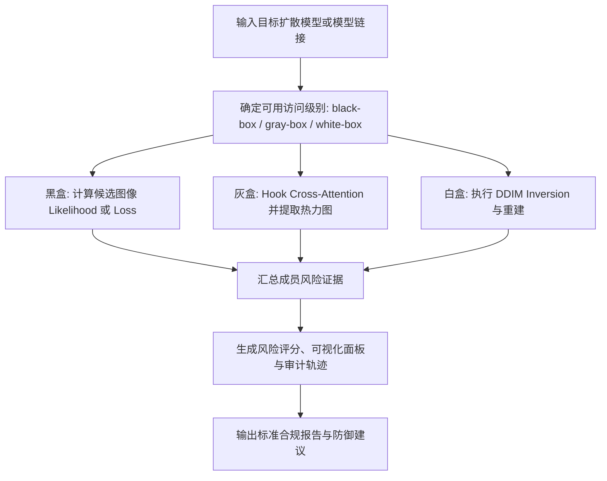
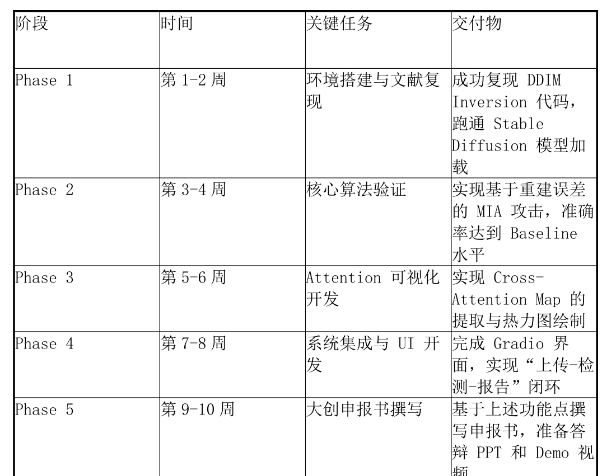

# DiffAudit 产品需求文档（PRD）阅读报告

- Title: DiffAudit —— 基于成员推断的扩散模型隐私风险检测与安全审计系统（产品需求文档 PRD）
- Material Path: `references/materials/context/diffaudit-product-requirements.pdf`
- Primary Track: `context`
- Venue / Year: 内部产品需求文档 / 2026-04-04
- Threat Model Category: 黑盒、灰盒、白盒成员推断复合审计
- Core Task: 将扩散模型隐私风险检测、成员推断证据生成与合规报告输出产品化
- Open-Source Implementation: 文档未提供独立实现仓库；仅将 GitHub 开源 MIA 原型作为竞品参照
- Report Status: complete

## Executive Summary

这份材料不是学术论文，而是一份面向 `DiffAudit` 项目的内部产品需求文档。文档试图回答的核心问题是：如何把扩散模型成员推断与隐私泄露检测，从分散的研究原型整理为可操作、可解释、可交付合规证据的审计系统。其产品定位不是训练新模型，而是对既有扩散模型开展黑盒、灰盒与白盒三类隐私审计，并把检测结果转化为面向法务、审计员与非算法人员的可视化输出。

文档的技术主线围绕三类信号展开。第一类是白盒 `DDIM Inversion` 重建攻击，通过比较候选图像与重建图像的误差判断成员关系；第二类是灰盒 `Cross-Attention` 热力图溯源，通过语义注意力异常集中识别敏感区域记忆；第三类是黑盒 `Likelihood/Loss` 检测，用于只能调用 API 的场景。产品层面则补上仪表盘、风险可视化、模型加载器以及合规报告生成模块，使审计过程从算法验证走向业务闭环。

从 DiffAudit 项目视角看，这份 PRD 的价值不在于给出已经验证的学术结论，而在于把当前仓库中分散存在的黑盒、灰盒、白盒路线，重组为一个统一的产品叙事。文档明确给出性能目标、兼容模型范围、阶段性路线图与风险管理项，因此它更像研究路线到工程交付之间的桥接层。当前报告据此推断：该材料可直接服务于团队后续的对外叙事、里程碑管理与审计演示设计，但不能替代正式实验论文或复现实证材料。

## Bibliographic Record

- Title: DiffAudit —— 基于成员推断的扩散模型隐私风险检测与安全审计系统（产品需求文档 PRD）
- Authors: 文档未署名
- Venue / year / version: 内部 PRD，生成时间为 2026-04-04，版本号未标注
- Local PDF path: `D:/Code/DiffAudit/Research/references/materials/context/diffaudit-product-requirements.pdf`
- Source URL: 文档未提供

## Research Question

这份文档试图回答的不是单一算法是否有效，而是一个更接近部署的问题：能否把扩散模型成员推断与隐私泄露审计，封装为具备模型接入、证据生成、可视化解释和合规报告输出能力的产品系统。其基本判断是，扩散模型的潜空间、反演轨迹和跨模态注意力不仅能服务图像编辑，也能反向成为隐私风险审计接口。

文档假设的部署环境覆盖三类威胁模型。对于白盒场景，审计方能够访问模型权重并执行 DDIM 反演；对于灰盒场景，审计方至少能 Hook `Cross-Attention` 层并输出热力图；对于黑盒场景，审计方只能通过 API 或推理接口获得似然或损失相关分数。产品目标是把三类访问条件统一到同一套风险评分与合规证据框架下。

## Problem Setting and Assumptions

- Access model: 文档显式区分黑盒、灰盒、白盒三档访问条件，并据此绑定不同检测模块。
- Available inputs: 候选图像、目标扩散模型权重或 API 接口、可选的模型下载链接（`Hugging Face` 或 `Civitai`）。
- Available outputs: 重建误差、成员概率、注意力热力图、整体风险评分、标准化合规报告与修复建议书。
- Required priors or side information: 需要知道待审计对象是扩散模型，并且在白盒/灰盒路线中需要模型内部结构访问权限；在风险应对部分还隐含需要影子模型、对照模型或小型自建训练集。
- Scope limits: 文档没有定义严格的数据分割协议、统计检验流程、法律条款编号细节和证据可采性标准，因此其范围更接近产品蓝图而非可立即执行的审计规范。

## Method Overview

文档的基本方法是把三类成员推断信号打包成统一审计引擎。白盒模块通过 `DDIM Inversion` 将候选图像映射回噪声，再由目标模型重建；如果候选图像属于训练集，文档假设其重建失败更少，因而重建误差更小。灰盒模块在生成过程中提取 `Cross-Attention` 图，对敏感面部区域与文本 token 的异常集中现象进行解释性标注。黑盒模块则退化为基于似然或损失的成员判别，用于仅有外部接口的模型服务。

在产品闭环中，这些检测结果不会停留在算法分数层。文档进一步要求把不同攻击结果汇总为仪表盘风险评分，把原图、重建结果与热力图并排展示，并最终生成面向法规场景的合规报告和防御建议。换言之，方法上的核心并不是提出新的攻击定理，而是把已有扩散审计信号转译为可审计、可展示、可归档的产品工作流。

## Method Flow

## Key Technical Details

文档中唯一明确写出的判别公式是白盒重建误差。其逻辑是：将候选图像 `x_0` 经 `DDIM Inversion` 映射为噪声，再由目标模型重建得到 `\hat{x}_0`，若二者差异极小，则该样本更可能属于训练成员。文档没有给出阈值学习方式、统计置信区间或 ROC 校准方法，因此该公式只能被视为产品侧引用的核心判别信号，而非完整实验定义。

$$
\left\lVert x_0 - \hat{x}_0 \right\rVert
$$

除该误差项之外，文档还反复强调三个实现细节。第一，潜空间操作被认为比像素空间更高效，因此被当作核心工程优势。第二，`Cross-Attention` 热力图不仅承担检测，还承担解释责任，即帮助法务或审计员理解“风险来自哪里”。第三，黑盒似然检测是最低访问权限下的兜底接口，但文档没有给出具体的条件似然定义、采样步数或查询预算，因此其技术边界仍然模糊。

## Experimental Setup

这份材料不是实验论文，因此本节只能整理文档声明的目标验证设置，而不能把它误写成已完成实验。文档给出的模型覆盖范围是 `Stable Diffusion 1.5`、`2.1`、`XL` 和自定义 `checkpoints`。在风险应对部分，它还点名 `CelebA` 与 `FFHQ` 可以作为自建小型扩散模型的训练数据，用于演示隐私泄露场景。

从对照对象看，文档把传统 `Loss/Likelihood` 方法、通用 AI 安全平台和学术原型 MIA 工具视为基线或竞品。指标层面，明确提出单样本审计速度小于 10 秒、攻击成功表现达到 `AUC > 0.85`、兼容本地或私有云敏感数据处理，以及通过插件机制扩展新攻击算法。需要强调的是，这些都是产品目标值，不是已报告的实验结果。

## Main Results

严格来说，文档没有提供可归入“实验结果”的内容。它没有给出数据集规模、训练/测试划分、成员与非成员样本数量、置信区间、显著性检验，也没有展示任何真实 AUC 曲线或热力图案例。因此不能声称材料已经验证了 `DDIM Inversion`、`Attention Map` 或 `Likelihood` 三条路线的有效性。

文档真正给出的“结果”更接近预期产物与目标状态：第一，形成覆盖黑盒、灰盒、白盒的统一审计引擎；第二，在 10 周内完成从算法验证到 `Gradio` 闭环演示的工程路径；第三，以法规条文映射、风险等级评估和审计轨迹记录作为差异化产品价值。当前报告据此推断，最强的结论不是“方法已被证明有效”，而是“团队已经明确了将研究路线组织成产品路线的结构”。

## Strengths

- 文档把三类访问模型统一纳入单一产品框架，避免黑盒、灰盒、白盒路线各自孤立推进。
- 其核心卖点不是单纯报告成员概率，而是补上可解释热力图、证据链记录和法规导向输出，贴合审计产品化需求。
- 路线图将算法验证、可视化开发、系统集成和申报材料产出按周排列，便于与实际工程计划对齐。
- 非功能需求给出了明确目标值，如审计耗时和 `AUC` 目标，使后续验收可以围绕量化指标展开。

## Limitations and Validity Threats

- 文档大量引用“文献综述中提到”的方法，但没有给出对应论文、章节号与正式参考文献，证据链不足。
- 白盒、灰盒、黑盒三条路线的判别阈值、样本数需求、查询预算和误报控制机制均未形式化，无法直接复现实验。
- 合规部分引用《中国生成式人工智能服务管理暂行办法》第 `X` 条，说明法规映射仍处于占位状态，尚未完成法律条文落地。
- 风险评估中承认风格相似导致的误报问题，但对影子模型如何训练、怎样与目标模型对比没有给出协议。
- 文档未提供任何真实图像案例、热力图样例或报告样本，因此产品可解释性目前仍停留在需求层，而非证据层。

## Reproducibility Assessment

若要忠实复现文档设想，至少需要以下资产：可加载的扩散模型权重、成员/非成员候选图像集合、`DDIM Inversion` 实现、`Cross-Attention` 提取与可视化模块、黑盒似然接口、影子模型或无隐私对照模型、以及最终报告生成器。文档本身没有提供代码仓库、配置文件、评测脚本或固定数据划分，因此不能独立支持复现。

就当前 `DiffAudit` 仓库状态看，仓库主页已经把项目定义为“面向扩散模型的隐私风险审计与成员推断复现仓库”，并明确拆分 `black-box`、`gray-box`、`white-box` 三条主线；`docs/reproduction-status.md` 也记录了 `recon` 等路线的已有证据。因此，当前仓库已经覆盖了这份 PRD 所需的研究路线骨架，但尚不能从这份材料单独推出完整产品实现已经存在。阻塞项主要是：缺少与 PRD 一一对应的 UI、报告模板实例、法律映射内容以及真实演示资产。

## Relevance to DiffAudit

这份材料对 DiffAudit 的意义，在于它把“研究路线图”转换成“产品路线图”。仓库现有材料更偏复现实验与路线分类，而这份 PRD 把这些路线重新组织为核心审计引擎、可视化交互、合规报告和里程碑计划四层结构，从而为对外汇报、申报书撰写和演示系统开发提供统一叙事。

从路线映射看，白盒重建攻击对应仓库中的 `recon` 与白盒信号整理，灰盒注意力分析对应灰盒结构特征与中间信息访问路线，黑盒似然检测则对应黑盒主线。也就是说，这份材料不是新的学术分支，而是对现有路线进行产品编排。它最适合被用作上下游沟通材料、阶段验收框架和审计原型需求说明，而不适合作为单独的技术证据来源。

## Recommended Figure

- Figure page: 5
- Crop box or note: `80 65 510 405`；裁切第 5 页顶部路线图表格，而非整页正文。该文档没有典型实验曲线或模型框图，路线图表格最能表达产品结构与阶段交付关系。
- Why this figure matters: 该表格用阶段、时间、关键任务和交付物四列，压缩展示了 PRD 的执行逻辑，是全文中最接近“结构图”的区域；相比竞品矩阵或大段正文，它更适合在报告中作为一眼可读的关键图。
- Local asset path: `docs/paper-reports/assets/context/diffaudit-product-requirements-key-figure-p5.png`

## Extracted Summary for `paper-index.md`

这份材料讨论的不是单点算法改进，而是如何把扩散模型成员推断、隐私泄露识别和合规证据输出组织成一个完整产品。它关注的核心问题是：面对可能记忆训练图像的扩散模型，审计方如何在不同访问权限下稳定发现风险，并把结果转化为业务和法规可理解的交付物。

文档提出的产品方案由三类检测信号组成：白盒 `DDIM Inversion` 重建误差、灰盒 `Cross-Attention` 热力图溯源和黑盒 `Likelihood/Loss` 判别；同时配套风险仪表盘、可视化溯源界面、模型加载器与标准合规报告模块。它的核心贡献不是证明新方法优于现有论文，而是把已有研究信号重组为一套可执行的工程路线图和产品闭环。

对 DiffAudit 而言，这份 PRD 的价值在于把仓库中已经存在的黑盒、灰盒、白盒研究主线，统一编排成产品需求、里程碑和交付语言。它适合作为团队后续 UI 原型、报告生成器和审计演示系统的需求基线，但不能替代正式实验论文或复现实证材料。