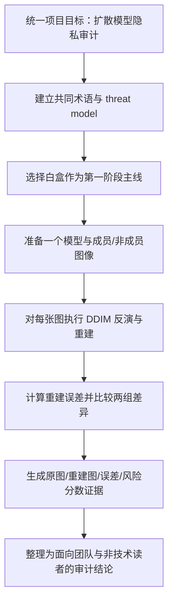

# DiffAudit 团队入门扫盲文档

- Title: DiffAudit 团队入门扫盲文档
- Material Path: `references/materials/context/diffaudit-team-onboarding.pdf`
- Primary Track: `context`
- Venue / Year: 内部入门材料 / 2026
- Threat Model Category: 以白盒主线为优先的扩散模型隐私审计导引
- Core Task: 为新成员统一问题定义、术语体系与首版最小闭环
- Open-Source Implementation: 文档本身不附代码；相关仓库状态见 `README.md`、`docs/reproduction-status.md` 与 `src/diffaudit/attacks/README.md`
- Report Status: done

## Executive Summary

这份材料不是研究论文，而是一份面向新成员的 6 页内部 onboarding 文档。其核心作用是把 DiffAudit 从“做一个攻击算法”重新定义为“做一个扩散模型隐私风险审计原型系统”，并用通俗但结构化的语言解释成员推断、记忆、白盒/灰盒/黑盒、DDIM 反演、重建误差等基础概念。

文档给出的中心方法论是白盒优先的最小闭环：选择一个扩散模型，准备成员与非成员样本，对每张图执行 DDIM 反演与重建，计算重建误差，再比较两组差异并输出可视化或报告证据。这里的重点不是单一分数，而是把“原图、重建图、误差、热力图、风险分数”组织成可解释的证据链。

对 DiffAudit 而言，这份材料的重要性不在于提出新算法，而在于统一研发、研究和汇报口径。它把项目目标、术语、阶段性范围和角色分工压缩成可快速传播的共同认知；同时它也暴露出一个需要明确标注的现实差异：文档主张先打穿白盒闭环，但当前仓库的可执行主线仍以黑盒和灰盒为主，白盒还停留在 research-ready。

## Bibliographic Record

- Title: DiffAudit 团队入门扫盲文档
- Authors: 文档未署名；PDF metadata 未提供可信作者信息
- Venue / year / version: 团队内部入门材料，PDF 创建时间为 2026-04-04，全文 6 页
- Local PDF path: `<DIFFAUDIT_ROOT>/Research/references/materials/context/diffaudit-team-onboarding.pdf`
- Source URL: 未知；当前仅见本地 PDF

## Research Question

这份文档试图回答的不是单篇论文里的统计判别问题，而是一个团队级研究启动问题：当成员几乎不了解扩散模型隐私审计时，应该如何在最短时间内建立共同问题定义、共同术语和共同第一阶段目标。文档把核心问题收束为“扩散模型会不会背题”，并进一步把这一定性问题拆成记忆、成员推断和审计系统三个层次。

在 threat model 上，文档明确采用“全景介绍、白盒优先”的设置。它说明黑盒最贴近真实 API 场景，灰盒适合解释增强，但在第一阶段更推荐白盒，因为白盒更容易产生清晰、可展示、可解释的证据链。

## Problem Setting and Assumptions

访问模型方面，文档默认团队最终会覆盖白盒、灰盒、黑盒三类场景，但当前 onboarding 明确把白盒作为首个落地路线，因此默认可以访问模型内部足够多的信息，并执行 DDIM 反演与重建流程。可用输入包括一个待审计扩散模型、一组成员样本、一组非成员样本，以及必要的图像读写和可视化能力。可用输出则被定义为重建结果、误差值、热力图、风险分数和报告化结论。

该材料还隐含了若干先验：团队成员需要接受“扩散模型是逐步去噪模型”的工作直觉，需要理解 Stable Diffusion 类模型在潜空间操作，需要接受成员与非成员会在重建质量或过程稳定性上出现系统差异。作用边界也很明确：这份文档是研究启动导引，不提供正式实验协议、数据集名称、超参数、判别阈值或统计显著性定义。

## Method Overview

文档把方法路线组织成一个审计原型，而不是一条孤立攻击。第一步是统一项目定位，即把 DiffAudit 理解为“给扩散模型做隐私体检”的系统。第二步是建立术语与攻击面认知，尤其把成员推断、记忆、白盒/灰盒/黑盒区分清楚。第三步是确定第一版只打穿一个最小闭环，避免同时追求多路线、多模型、多界面而失去可执行性。

在具体技术上，文档把白盒主线压缩为六个动作：选定一个模型，准备成员与非成员样本，对每张图做 DDIM 反演和重建，计算重建误差，比较两组是否可分，再把结果转换成页面或报告证据。它利用的核心信号不是生成质量本身，而是模型对训练成员与非成员响应差异所暴露出的重建和稳定性差异。

## Method Flow

## Key Technical Details

源文档没有给出显式损失函数、判别统计量或数学符号定义，因此本报告不补写公式。需要保留的技术细节主要有三项。其一，DDIM 反演被当作白盒主线的关键操作，用于把候选图像映射回可供扩散过程重建的噪声表示。其二，重建误差被当作最直接的成员性区分信号，文档明确把它视为成员组与非成员组差异比较的核心量。其三，证据设计不止于单个数值，而是强调“原图、重建图、误差、热力图、风险分数”的组合展示，这说明文档将可解释性视为审计系统的必要组成，而不是结果后的附属可视化。

## Experimental Setup

这份材料没有报告已完成实验，而是给出一个建议性的首版实验配置。数据方面，文档只要求一组成员图和一组非成员图，没有指定数据集名称、规模或采样策略。模型方面，文档建议先选一个模型打通流程，并用 Stable Diffusion 的潜空间直觉解释这一路线。基线方面没有列出正式对照方法；评价信号主要是重建误差和由此派生的可视化证据。整体评价条件是白盒第一阶段设置，后续再逐步补黑盒、灰盒和防御建议模块。

## Main Results

如果把这份文档视为团队级“结论性材料”，其主要输出有三点。第一，它把项目目标从“做攻击”提升为“做审计系统”，要求检测、解释、展示和报告同时成立。第二，它明确主张第一阶段优先白盒，因为白盒更容易产生可解释证据链。第三，它定义了一个六步最小闭环，作为项目是否已经“活起来”的 operational criterion。

其中最强的主张是范围控制与证据导向，而不是任何量化性能。文档没有证明白盒路线在所有设置下都更优，也没有给出成员与非成员可分性的具体实验结果；它更像一份研究启动规范，规定团队应优先验证哪一种证据链。

## Strengths

这份材料的第一项优势是术语统一做得足够明确，能够在极短篇幅里区分成员推断、记忆、白盒/灰盒/黑盒等容易混淆的概念。第二项优势是它把技术问题和产品表达绑定在一起，没有把项目窄化为单篇论文复现。第三项优势是它给出了非常明确的第一版边界，能减少团队在项目初期因目标过宽导致的执行发散。

## Limitations and Validity Threats

材料的主要局限在于证据不足。文档没有引用具体论文、数据集、指标定义或实验数值，因此其中关于白盒优先、重建误差可分等表述，应被理解为研究路线建议，而不是已经被当前项目验证的结论。第二，文档没有给出可执行参数、模型清单、资产格式或统计检验标准，复现时仍需大量补充实现细节。第三，它与当前仓库状态并不完全一致：仓库 README 明确写明当前默认优先级是 black-box，而白盒仍未形成正式代码模块，因此直接把该文档当成“当前工程现实”会造成误读。

## Reproducibility Assessment

要忠实复现文档所描述的最小闭环，至少需要四类资产：一个可访问内部信息的扩散模型 checkpoint、一组成员图、一组非成员图，以及支持 DDIM 反演、重建、误差计算和证据保存的代码路径。文档自身不提供这些资产，也不附任何代码仓库链接。

从当前 DiffAudit 仓库状态看，相关基础设施只覆盖了部分路线。`README.md` 和 `docs/reproduction-status.md` 显示，黑盒 `recon`、`variation` 与灰盒 `secmi`、`pia` 已经进入 `code-ready` 或 `evidence-ready`；但 `src/diffaudit/attacks/README.md` 明确写明白盒目前“还没有正式代码模块，白盒仍处于 research-ready”。因此，这份 onboarding 文档与仓库的产品叙事是对齐的，但与仓库的可执行优先级并不完全一致。今天阻塞 faithful reproduction 的关键因素仍是白盒所需的 checkpoint、训练配置，以及样本级梯度或激活访问接口。

## Relevance to DiffAudit

这份材料对 DiffAudit 的价值主要体现在团队协作层而非新算法层。它适合作为新成员、申报文案和工程同学共享的最短公共入口，帮助大家统一“我们做的是隐私审计，不是普通生图优化”这一核心叙事。

同时，它也能作为路线对照物使用。当前仓库默认优先级更偏黑盒，但该文档坚持白盒先打穿最小闭环；这种差异本身就是项目管理信息，提示团队需要在“最易展示的白盒证据链”与“当前最成熟的黑盒工程资产”之间做显式取舍，而不是让两种叙事在不同文档中并存却不解释。

## Recommended Figure

- Figure page: `5`
- Crop box or note: `50 190 540 500`；源文档没有典型科研图表，因此选择第 5 页“第一版最小闭环”结构区块作为关键图，而不是整页正文
- Why this figure matters: 该区域用六个顺序动作把文档最核心的执行框架压缩成单个视觉单元，最能代表这份 onboarding 材料的 operational logic
- Local asset path: `docs/paper-reports/assets/context/diffaudit-team-onboarding-key-figure-p5.png`

## Extracted Summary for `paper-index.md`

这份文档面向第一次接触扩散模型隐私审计的新成员，核心任务是解释 DiffAudit 到底在研究什么。它把问题收束为“扩散模型会不会记住训练样本并因此暴露成员信息”，并进一步说明项目目标不是提升图像生成质量，而是构建一套能够识别、解释和展示隐私风险的审计系统。

文档给出的核心方法不是新攻击算法，而是一条白盒优先的最小闭环：选择一个模型，准备成员与非成员样本，对图像做 DDIM 反演与重建，计算重建误差，比较两组差异，并把结果整理成可视化证据或报告。它还系统整理了成员推断、记忆、白盒/灰盒/黑盒、潜空间、注意力热力图等术语，用于统一团队内部的基础语言。

它对 DiffAudit 的意义在于统一项目叙事和启动顺序。文档明确要求团队先打穿一个可展示的审计闭环，再逐步扩展黑盒、灰盒与防御建议，这对新成员 onboarding、申报材料撰写和后续报告产出都有直接价值；同时，它也提醒团队当前仓库的黑盒优先现实与文档中的白盒优先设想之间仍需做明确对齐。
