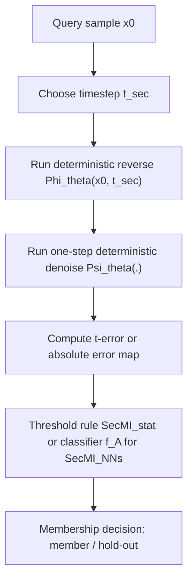

# Are Diffusion Models Vulnerable to Membership Inference Attacks?

- Title: Are Diffusion Models Vulnerable to Membership Inference Attacks?
- Material Path: `references/materials/gray-box/2023-icml-secmi-membership-inference-diffusion-models.pdf`
- Primary Track: `gray-box`
- Venue / Year: ICML 2023 (PMLR 202)
- Threat Model Category: Gray-box membership inference against diffusion models via intermediate denoising-state access
- Core Task: Determine whether an image belongs to the training set by comparing diffusion-step posterior estimation errors
- Open-Source Implementation: Official code at <https://github.com/jinhaoduan/SecMI>; the current DiffAudit repository already vendors a minimal SecMI subset and exposes planner/adapter/smoke paths
- Report Status: Complete

## Executive Summary

这篇论文的核心问题是：扩散模型是否像分类模型和 GAN 一样，存在可观测且可利用的成员推断信号。作者先否定了一个常见直觉，即“扩散模型更难做 MIA，因此已有生成模型攻击大致无效只是实现问题”。他们在 DDPM 上系统评估多种既有生成模型 MIA 后指出，旧方法在扩散模型上大多失效，原因不是成员泄露不存在，而是这些方法没有利用扩散模型训练目标中最直接的后验匹配结构。

基于这一观察，论文提出 `SecMI`。方法不依赖判别器，也不直接比较最终生成图像，而是利用扩散模型在每个时间步上拟合 forward posterior 的训练目标，构造单样本的 step-wise posterior estimation error，即 `t-error`。作者的基本假设是：若样本属于训练集，则模型在相应时间步上的后验估计通常更准确，因此 `t-error` 更小。围绕这一信号，论文给出阈值版 `SecMI_stat` 和神经网络版 `SecMI_NNs` 两个攻击器。

实验覆盖标准扩散模型、Latent Diffusion Model 与 Stable Diffusion。对 DDPM 四个数据集，`SecMI_stat` 平均 `ASR/AUC` 达到 `0.810/0.881`，`SecMI_NNs` 达到 `0.889/0.949`；在 `TPR@1%FPR` 上，`SecMI_NNs` 最高可到 `37.98%`。在文本到图像与大规模预训练场景中，性能有所下降，但仍维持明显高于随机的成员可分性。对 DiffAudit 而言，这篇论文的重要性不只是“最早的扩散 MIA 论文”，而是它给出了灰盒主线的基准接口定义：攻击者需要看到中间 timestep 的反演或等价误差信号，这决定了后续 `PIA`、`SiMA` 等工作所继承和放松的访问假设。

## Bibliographic Record

- Title: Are Diffusion Models Vulnerable to Membership Inference Attacks?
- Authors: Jinhao Duan, Fei Kong, Shiqi Wang, Xiaoshuang Shi, Kaidi Xu
- Venue / year / version: Proceedings of the 40th International Conference on Machine Learning, PMLR 202, 2023
- Local PDF path: `D:/Code/DiffAudit/Project/references/materials/gray-box/2023-icml-secmi-membership-inference-diffusion-models.pdf`
- Source URL: <https://proceedings.mlr.press/v202/duan23b.html>

## Research Question

论文试图回答两个相连的问题。第一，扩散模型是否确实会泄露训练成员身份，而不是因为生成式建模更“平滑”就天然规避 MIA。第二，如果已有针对 GAN 或 VAE 的方法不适用，扩散模型特有的什么内部信号可以支撑新的成员推断攻击。

作者采用的部署设定并非纯黑盒 API，而是更接近灰盒。攻击者知道待测图像，能访问目标扩散模型在若干时间步上的 deterministic reverse / denoise 结果，或者至少能计算与这些中间状态等价的 `t-error` 指标；但攻击者并不拥有训练集划分标签，也不需要完整梯度级白盒权限。

## Problem Setting and Assumptions

- Access model: 灰盒，攻击者能够查询或重建中间 timestep 上的 reverse / denoise 结果，因而可计算 `t-error`；并非只见最终采样图像。
- Available inputs: 待测样本 `x_0`，目标扩散模型参数化的噪声预测器，选定的时间步 `t_sec`，以及在 `SecMI_NNs` 中可用于训练攻击器的一小部分 member/hold-out 样本。
- Available outputs: `SecMI_stat` 使用单步误差标量；`SecMI_NNs` 使用像素级绝对误差图作为二分类输入。
- Required priors or side information: 论文默认已知 diffusion schedule、可执行 deterministic reverse 与 denoise 过程；在文本到图像设置中还需要文本条件，或使用替代 prompt。
- Scope limits: 方法主要针对成员可分性，不解决训练数据完整提取；公共 API 若只返回最终图像而不暴露中间状态，则不满足论文主设定。

## Method Overview

方法设计分成三步。第一步，作者从扩散模型的训练目标出发，把成员泄露信号落到“后验估计误差是否更小”这一可检验命题上。第二步，由于随机 forward / reverse 过程难以直接计算真实 posterior estimation error，他们借助 DDIM 风格的 deterministic reverse 和 deterministic denoise，把这一量近似为单样本、单 timestep 上可计算的 `t-error`。第三步，再把 `t-error` 变成成员判定：可以直接做阈值比较，也可以把误差图输入一个轻量二分类器。

该方法利用的核心信号不是最终重构图像质量，而是模型在特定时间步上对输入样本局部几何结构的拟合程度。若模型对成员样本记忆更充分，则 deterministic reverse 后再 denoise 回来的偏差应更小。作者进一步观察到，较小的 `t` 往往泄露更强，因为状态中保留了更多与原样本有关的信息。

## Method Flow

## Key Technical Details

论文的技术核心在于把扩散训练目标与成员推断的可观测量对齐。首先，作者复述了单步 posterior matching 的训练目标；其次，用 deterministic reverse/denoise 近似单样本 posterior estimation error；最后，用阈值或攻击分类器把误差转成成员判定。对复现实验最重要的是三个公式。

扩散模型在第 `t` 步的训练目标写为：

$$
\ell_t = \mathbb{E}_q \left[\frac{1}{2\sigma_t^2}\left\| \tilde{\mu}_t(x_t, x_0) - \mu_\theta(x_t, t) \right\|^2 \right].
$$

在 deterministic reverse 与 denoise 近似下，论文定义单样本的 `t-error` 为：

$$
\tilde{\ell}_{t,x_0} = \left\| \psi_\theta(\phi_\theta(\tilde{x}_t, t), t) - \tilde{x}_t \right\|^2.
$$

`SecMI_stat` 将其直接转为阈值判定：

$$
M(x_0,\theta) = \mathbf{1}\!\left[\tilde{\ell}_{t_{\mathrm{sec}},x_0} \le \tau \right].
$$

论文的关键论点是：当噪声预测器充分逼近真实噪声时，上式近似的 `t-error` 会收敛到原始 posterior estimation error，因此可以作为成员信号。需要注意的是，这不是严格最优检验；它依赖过拟合导致的误差分布偏移，以及 deterministic approximation 在目标模型上的有效性。

## Experimental Setup

- Datasets: DDPM 使用 CIFAR-10、CIFAR-100、STL10-U、Tiny-ImageNet；LDM 使用 Pokemon 与 COCO2017-val；Stable Diffusion 使用 Laion-aesthetic-5plus 与 COCO2017-val。
- Model families: DDPM from scratch；Latent Diffusion Model；Stable Diffusion v1-4/v1-5。
- Baselines: LOGAN, TVD, Over-Representation, Monte-Carlo Set, GAN-Leaks，以及文中两个 `SecMI` 变体。
- Metrics: ASR、AUC、`TPR@1%FPR`、`TPR@0.1%FPR`。
- Evaluation conditions: 各数据集统一按训练集 `50%/50%` 划分 member 与 hold-out；DDPM 设置 `T=1000`，实验中常用 `t_sec=100`；为加速推断采用 `DDIM(10)`；`SecMI_NNs` 使用 ResNet-18，并以 `20%` 的 `D_M` 与 `D_H` 训练攻击模型。

## Main Results

论文最强的结论是：传统生成模型 MIA 对扩散模型大多无效，但这不表示扩散模型安全，而是需要利用 step-wise posterior estimation error。Table 1 和 Figure 1 显示，在 DDPM/CIFAR-10 上，旧方法大多接近随机；相比之下，`SecMI_stat` 与 `SecMI_NNs` 的 AUC 分别达到 `0.88` 和 `0.95`。

在 DDPM 四个数据集上，Table 2 报告 `SecMI_stat` 平均 `ASR/AUC = 0.810/0.881`，`SecMI_NNs = 0.889/0.949`。Table 3 进一步表明，在低误报要求下方法仍有效：`SecMI_NNs` 在 `TPR@1%FPR` 上达到 `26.66%` 到 `37.98%`，在 `TPR@0.1%FPR` 上仍有 `3.50%` 到 `7.59%`。这说明信号不只是整体 ROC 可分，而是在高置信度区间也保留可用判别力。

结果中最依赖设定的部分是文本到图像场景。LDM 在 Pokemon 和 COCO2017-val 上仍可达到 `AUC 0.891` 与 `0.875`，但对 prompt 的依赖显著增加；Stable Diffusion v1-4/v1-5 上 AUC 只有 `0.707/0.701`。因此可以说，方法对复杂预训练模型依然成立，但强度明显弱于受控 DDPM 数据集。

## Strengths

- 首次把扩散模型成员推断问题系统化，并明确证明“旧生成模型 MIA 失效”与“扩散模型无泄露”不是同一件事。
- 方法信号与扩散训练目标直接对应，论证链条比单纯比较生成图像距离更紧。
- 同时给出简单阈值版和学习版攻击器，便于区分“信号是否存在”与“如何最大化利用该信号”。
- 实验指标覆盖低 FPR 区间，符合成员推断评估的实际风险重点。
- 结果横跨 DDPM、LDM 与 Stable Diffusion，说明这不是只对一个 toy setting 成立的现象。

## Limitations and Validity Threats

- 方法依赖中间 timestep 的可见性或等价重建能力，这比真实商业 API 常见的最终图像黑盒权限更强。
- `SecMI_NNs` 使用额外监督训练的攻击模型，且作者明确承认其评估集略小于其他方法，因此与基线对比并非完全公平。
- 强防御实验的证据并不完整。论文报告 DP-SGD、强正则和强增强会让 DDPM 无法收敛，这更像训练失败，而不是对“已有效训练模型的防御效果”做公平比较。
- 文本到图像场景对 prompt 较敏感，说明攻击性能与侧信息质量耦合明显。
- 论文只在公开数据上评估，没有分析特定人群、版权敏感子集或现实 API 限流条件下的行为。

## Reproducibility Assessment

忠实复现至少需要四类资产：目标扩散模型权重、严格的 member/hold-out 划分、可执行 deterministic reverse/denoise 的运行环境，以及与论文一致的 `t_sec`、`DDIM(k)`、攻击器训练设置。论文正文和附录已经给出大多数关键超参数，并公开了官方仓库，因此复现入口明显优于很多后续论文。

就当前 DiffAudit 仓库而言，相关路线并非空白。仓库已经 vendored `third_party/secmi`，并且存在 `src/diffaudit/attacks/secmi.py`、`src/diffaudit/attacks/secmi_adapter.py`、planner、asset probe 与 synthetic smoke 流程。这意味着仓库已经覆盖了 SecMI 的计划层和接口层。

但这仍不等于“已经完成论文复现”。当前最实际的阻塞项是：真实 checkpoint 与数据划分资产是否齐全、gray-box observable contract 是否与论文假设完全一致、以及是否具备对真实成员集运行 `SecMI` 的工程化执行链。换言之，DiffAudit 已经覆盖了这条路线的骨架，却未从本报告可见证据中证明数值复现已经完成。

## Relevance to DiffAudit

这篇论文对 DiffAudit 的价值是基线性的。它定义了灰盒主线中最典型的访问假设：攻击者能看到中间 timestep 相关信号，因此可以围绕 posterior estimation error 做成员判定。后续 `PIA`、`SiMA` 或 caption-free 扩展，本质上都是在这一主线上改变可观测量、初始化策略或成本结构。

仓库当前已经把 `SecMI` 视为灰盒主线的一部分，并为其准备了 planner、adapter、dry-run 和 vendored 子集，因此这篇论文不仅是文献背景，也直接对应当前代码库的实际对象。对内，它可作为 gray-box observable contract 的定义参照；对外，它可作为解释“为什么需要中间状态访问”的首篇核心文献。

如果未来需要把 DiffAudit 的路线讲清楚，这篇论文最适合放在灰盒章节的起点位置：先由 `SecMI` 说明强访问假设下的高精度攻击，再用后续工作讨论如何降低访问需求、提升效率或转向更现实的产品接口。

## Recommended Figure

- Figure page: 7
- Crop box or note: Cropped Figure 4 with PDF clip box `45 155 565 305`; this isolates the four ROC subplots and caption while removing surrounding table/body text
- Why this figure matters: 该图同时展示了总体 ROC 与 log-scale 低 FPR 区域，比 Figure 2 的机理图更能代表论文的最终证据；当前报告已直接检查裁切 PNG，图中四个子图与标题说明清晰可辨
- Local asset path: `docs/paper-reports/assets/gray-box/2023-icml-secmi-membership-inference-diffusion-models-key-figure-p7.png`

## Extracted Summary for `paper-index.md`

这篇论文研究扩散模型上的成员推断问题，目标是在攻击者掌握待测样本并可访问扩散过程部分中间信号时，判断该样本是否属于训练集。作者首先证明，直接移植 GAN 或 VAE 上的既有生成模型 MIA 到 DDPM 基本无效，因此扩散模型需要单独建模其泄露机制。

作者提出 `SecMI`，核心思想是比较扩散模型在某个时间步上的后验估计误差。论文用 deterministic reverse 与 denoise 近似单样本的 posterior estimation error，定义 `t-error` 作为成员信号，并给出阈值版 `SecMI_stat` 与学习版 `SecMI_NNs`。在 DDPM 四个数据集上，两者平均 `ASR/AUC` 分别达到 `0.810/0.881` 与 `0.889/0.949`，在 LDM 和 Stable Diffusion 上也保持了明显高于随机的可分性。

它对 DiffAudit 的意义在于奠定了灰盒主线的基准接口与证据标准：要获得强成员推断性能，攻击者通常需要接触中间 timestep 的误差信号，而不是只看最终生成结果。当前仓库已经围绕 `SecMI` 准备了 vendored 子集、planner、adapter 与 smoke 流程，因此这篇论文既是灰盒路线的理论起点，也是现有工程骨架最直接对应的基础文献。
