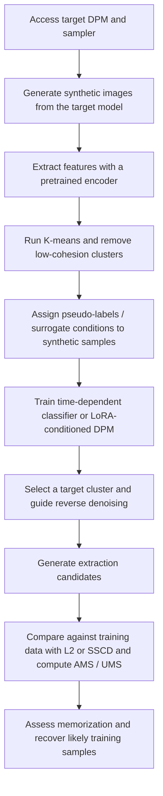
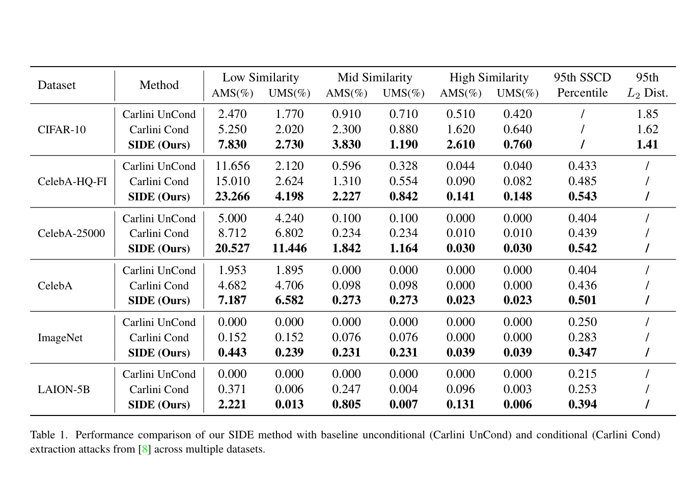

# SIDE: Surrogate Conditional Data Extraction from Diffusion Models

- Title: SIDE: Surrogate Conditional Data Extraction from Diffusion Models
- Material Path: D:/Code/DiffAudit/Project/references/materials/gray-box/2024-arxiv-side-extracting-training-data-unconditional-diffusion-models.pdf
- Primary Track: gray-box
- Venue / Year: arXiv preprint, 2024; examined PDF version is arXiv:2410.02467v7 dated 2025-08-01
- Threat Model Category: main attack is white-box extraction; appendix extends to black-box query attack and poisoned fine-tuning backdoor extraction
- Core Task: use surrogate conditions to extract training data from unconditional and conditional diffusion probabilistic models
- Open-Source Implementation: no official implementation is identified in the examined PDF
- Report Status: done

## Executive Summary

本文试图推翻一个常见前提：无条件扩散模型因为没有显式 prompt 或 class label，因此比条件模型更难发生可控的数据抽取。作者提出 SIDE，通过“先从模型自己生成的样本里恢复聚类结构，再把聚类中心当成替代条件”的办法，把原本无条件的采样过程改造成可定向的抽取过程。核心主张不是简单地说模型会记忆，而是说只要能构造出足够有信息量的条件，记忆就会被显著放大。

方法上，SIDE 不依赖原始训练集标签，而是先让目标 DPM 生成一批合成图像，使用预训练特征提取器做聚类，删去 cohesion 低的簇，再把保留下来的簇中心视为 surrogate condition。对于小模型，作者训练时间相关分类器并在反向扩散中加入 guidance 梯度；对于大模型，作者直接用伪标签数据对 LoRA 适配器做条件微调。论文因此把“是否有显式标签”改写成“能否构造 informative label”。

实验上，论文在 CIFAR-10、CelebA-HQ-FI、CelebA-25000、CelebA、ImageNet 和 LAION-5B 上报告 SIDE 全面优于 Carlini 等人的无条件与条件抽取基线。最重要的信息不是单点提升，而是 SIDE 在多个数据集上连条件基线也一起超过，说明“更精确的条件”比“天然存在的 prompt 或类标签”更决定抽取强度。对 DiffAudit 而言，这篇论文的重要性在于它把泄露风险从显式条件接口推进到“模型内部聚类可否被外部代理化”的层面，为 gray-box 路线提供了新的 side-information 视角，但其主实验仍然建立在白盒参数访问上。

## Bibliographic Record

- Title: SIDE: Surrogate Conditional Data Extraction from Diffusion Models
- Authors: Yunhao Chen, Shujie Wang, Difan Zou, Xingjun Ma
- Venue / year / version: arXiv preprint, initial submission in 2024, examined version arXiv:2410.02467v7 dated 2025-08-01
- Local PDF path: D:/Code/DiffAudit/Project/references/materials/gray-box/2024-arxiv-side-extracting-training-data-unconditional-diffusion-models.pdf
- Source URL: https://arxiv.org/abs/2410.02467

## Research Question

论文试图回答两个相互关联的问题。第一，为什么条件扩散模型比无条件扩散模型更容易出现训练样本记忆与可提取性。第二，如果无条件模型内部事实上也形成了可分的高密度簇，那么攻击者能否在没有原始标签的情况下构造替代条件，从而把无条件模型转化为可定向抽取的对象。论文的主 threat model 是白盒：攻击者可访问目标模型参数，目标是恢复原始训练样本。附录再讨论更弱的黑盒 API 查询情形，以及通过数据投毒植入触发词的 backdoor 扩展。

## Problem Setting and Assumptions

- Access model: main body assumes full parameter access to the target DPM; appendix adds a costly black-box query variant.
- Available inputs: target DPM, its sampler, a pretrained feature extractor, synthetic images sampled from the target model, and compute budget for classifier training or LoRA fine-tuning.
- Available outputs: generated candidate images, feature clusters, similarity scores against the training set during evaluation, and memorization metrics AMS and UMS.
- Required priors or side information: no original training labels are required, but the attack assumes that generated samples preserve enough cluster structure for pseudo-label construction.
- Scope limits: the main evidence is for white-box extraction; the black-box appendix is proof-of-concept and the poisoned fine-tuning extension changes the threat model substantially.

## Method Overview

SIDE 的第一阶段是“制造条件”。攻击者先从目标 DPM 采样一批合成图像，再用预训练特征提取器把这些图像嵌入到语义空间中。随后用 K-means 获得若干聚类，并用 cosine similarity 过滤掉 cohesion 太低的簇。保留下来的簇被视为模型内部已经存在的高密度模式，簇中心则被升格为 surrogate condition。

第二阶段是“把 surrogate condition 接入采样”。若目标是小规模扩散模型，作者训练一个时间相关分类器 $p_t(y \mid x_t)$，在每个反向去噪步用类别梯度修正 score。若目标是大模型，如 Stable Diffusion 1.5，则不单独训练分类器，而是固定原模型权重，仅对 LoRA 适配器做条件微调，使模型直接接受伪标签条件。抽取时随机挑一个目标簇，按该簇对应的 surrogate label 反复采样，得到与该簇高密度区域对齐的候选图像。

作者的核心直觉是：无条件模型并非真的“没有条件”，而是把条件隐藏在训练后形成的表示结构里。显式 prompt 只能粗略地指向一个语义区域，而聚类中心可以更窄地锚定到一组相似样本附近，因此更容易落入记忆样本所在的局部模式。

## Method Flow

## Key Technical Details

论文把 surrogate guidance 写成带额外条件项的采样 SDE。这里的关键不是普通 classifier guidance 本身，而是条件 $y_I$ 并非来自人工标签，而是来自对模型自生成样本做聚类后得到的簇中心。作者另外引入 guidance scale $\lambda$，用来缓和神经分类器校准不稳带来的偏差。

$$
dx = \left[f(x,t) - g(t)^2 \left(\nabla_x \log p_t^\theta(x) + \lambda \nabla_x \log p_t^\theta(y_I \mid x)\right)\right] dt + g(t) dw.
$$

为了从模型层面讨论“记忆”而不只看单张图是否撞到训练集，作者定义了 distributional memorization divergence。其含义是，把训练集视为由很多以训练样本为中心、方差很小的高斯核混合而成，再计算该分布与生成分布之间的 KL 散度。该值越小，说明生成分布越贴近训练样本支撑集，也就越强地表现出记忆。

$$
M(D; p_\theta, \epsilon) = D_{\mathrm{KL}}(q_\epsilon \Vert p_\theta), \qquad
q_\epsilon(x) = \frac{1}{N} \sum_{x_i \in D} \mathcal{N}(x \mid x_i, \epsilon^2 I).
$$

在评测层面，论文引入 AMS 与 UMS，分别度量“抽出的样本里有多少命中训练集相似区间”和“命中了多少不同训练样本”。这比单纯看 95th percentile SSCD 更细，因为它区分了 hit rate 与 unique extraction，并允许分 low, mid, high similarity 三档分析。

$$
\mathrm{AMS}(D_1, D_2, \alpha, \beta) =
\frac{\sum_{x_i \in D_1} F(x_i, D_2, \alpha, \beta)}{N_G},
\qquad
\mathrm{UMS}(D_1, D_2, \alpha, \beta) =
\frac{\left|\bigcup_{x_i \in D_1} \phi(x_i, D_2, \alpha, \beta)\right|}{N_G}.
$$

理论上，作者把 class label、text caption、random label 和 cluster information 都统一到 informative label 框架里，并证明：如果某个条件对应的子分布 $p_i$ 能被条件模型更好地拟合，则该条件模型相对该子集的 memorization divergence 不会高于无条件模型。换言之，条件越能隔离高密度子分布，记忆越容易被放大。这个结论正是 SIDE 选择“先找簇，再造条件”的理论依据。

## Experimental Setup

- Datasets: CIFAR-10; CelebA-HQ-FI, CelebA-25000, full CelebA at 128x128; ImageNet at 256x256; LAION-5B with Stable Diffusion 1.5 at 512x512.
- Model families: DDPM / DDIM-style models trained from scratch on smaller datasets; Stable Diffusion 1.5 for LAION-5B experiments.
- Baselines: Carlini UnCond and Carlini Cond from the prior extraction work.
- Metrics: normalized $L_2$ distance for low-resolution data, SSCD for high-resolution data, plus AMS and UMS under low, mid, high similarity bands.
- Evaluation conditions: 100 clusters for surrogate labeling, cohesion threshold 0.5, ResNet34 pseudo-labeler, SSCD feature extractor, LoRA rank 512 for Stable Diffusion, classifier learning rate 1e-4, LoRA learning rate 1e-5.
- Sampling volume: 51,200 generations on CelebA-HQ-FI, 50,000 on CelebA-25000, 10,000 on CIFAR-10, 5,120 on CelebA, 2,560 on ImageNet, and 512,000 on LAION-5B.

## Main Results

最核心的结果见 Table 1。SIDE 在所有六个数据集上都优于 Carlini UnCond，并且也系统性超过 Carlini Cond。这个结果直接否定了“无条件模型虽然可能记忆，但由于没有条件接口，攻击上仍然基本安全”的推论。

具体看数值，CelebA-25000 上 SIDE 的 low-similarity AMS 达到 20.527%，明显高于条件基线 8.712%；CelebA-HQ-FI 上 mid-similarity AMS/UMS 为 2.227%/0.842%，同样明显高于条件基线 1.310%/0.554%。在 LAION-5B 上，SIDE 的 95th percentile SSCD 为 0.394，也高于 Carlini Cond 的 0.253。即使在最难的 ImageNet 上，SIDE 仍能把 low-similarity AMS 从 0.152% 提升到 0.443%。

论文还报告了若干机制性观察。簇数 $K$ 存在 hit rate 与 diversity 的权衡：更大的 $K$ 往往提升 UMS，但可能轻微降低 AMS。cohesion 提高时 AMS 持续上升，而 UMS 在约 0.6 左右达到峰值后下降，说明过度纯化的簇会牺牲覆盖面。不同特征提取器下结果较稳，表示 SIDE 不依赖单一编码器。

## Strengths

- 把“条件导致记忆增强”推广为 informative label 理论，而不是只停留在 prompt 或 class label 经验结论。
- 方法统一覆盖小模型与大模型，分别给出时间相关分类器和 LoRA 条件化两条实现路径。
- 评测不只报告单一 SSCD 分位数，而是加入 AMS 与 UMS，能同时刻画命中率与 unique extraction。
- 定量结果跨 CIFAR-10、CelebA、ImageNet、LAION-5B 一致，说明结论不是单一数据集特例。

## Limitations and Validity Threats

- 主体攻击假设是白盒访问，与 gray-box 或纯 API 场景之间仍有明显落差；黑盒部分只在附录中以遗传算法做 proof of concept。
- 黑盒结果的查询成本很高。附录表明做到 800 代需要 40,000 次查询，高相似度 UMS 仍只有 0.010%，因此距离实用攻击还有距离。
- 论文引入的 AMS/UMS 是作者自定义指标，虽然信息量更高，但与既有工作横向对比时要注意口径差异。
- 论文文本中出现多处 `(author?)` 占位符，说明稿件仍带有明显草稿痕迹；这不会直接推翻结果，但会削弱写作与复核质量信号。
- “Extended SIDE” 的后门微调扩展显著改变了攻击模型，应与主文中的后验抽取路线分开讨论，不能当作同一假设下的自然增强版。

## Reproducibility Assessment

忠实复现 SIDE 需要以下资产：目标 DPM 权重、可控采样器、用于聚类的预训练特征提取器、训练时间相关分类器或 LoRA 条件化模块的训练代码、以及可访问训练集的评测管线。论文给出了足够多的实现要点，例如 cluster count、cohesion threshold、LoRA rank、学习率和生成样本数，因此方向性复现是可能的。

但当前阻塞也很清楚。第一，论文正文未给出官方代码链接。第二，AMS/UMS 依赖对训练集逐样本比较，这要求评测数据与相似度实现细节齐全。第三，黑盒 GA 路线与后门扩展都需要额外工程化组件。结合当前 DiffAudit 仓库，已经有论文矩阵把 SIDE 标成 `gray-box / white-box` 的背景阅读，但未见 SIDE 专用实验脚手架或结果缓存，因此今天更适合把它用作威胁建模和指标设计参考，而不是立即作为最低成本复现实验。

## Relevance to DiffAudit

这篇论文与 DiffAudit 的直接关联不在于“它已经给出一个可立即复用的 gray-box 基线”，而在于它重新定义了 side information 的来源。此前很多提取或 membership 路线把 prompt、class label 或 identity cue 看成外部条件；SIDE 则说明模型自己生成样本里的聚类结构也可以被反向利用，进而把内部表示转译成攻击条件。

对当前仓库来说，SIDE 最适合作为 gray-box 与 white-box 之间的桥接文献。其主体白盒设定提醒我们不要把“无显式条件接口”误判成“低泄露风险”；其附录黑盒遗传算法又说明，在缺少梯度时仍可把 surrogate classifier 当作 fitness function 做外部搜索。这对 DiffAudit 后续设计 gray-box 审计路线、整理泄露证据层级，以及扩展 beyond-membership 的训练样本提取叙事都很有价值。

## Recommended Figure

- Figure page: 6
- Crop box or note: cropped Table 1 region with `--clip 35 20 580 395`; a clean crop was feasible, so no full-page fallback was needed
- Why this figure matters: Table 1 is the strongest single piece of evidence in the paper because it compares SIDE against unconditional and conditional extraction baselines across six datasets and low, mid, high similarity regimes, showing that surrogate conditioning can make unconditional models more extractable than conventional conditional attacks
- Local asset path: ../assets/gray-box/2024-arxiv-side-extracting-training-data-unconditional-diffusion-models-key-figure-p6.png

## Extracted Summary for `paper-index.md`

这篇论文讨论扩散模型训练数据提取中的一个关键误区：无条件扩散模型通常被认为比条件模型安全，因为攻击者没有 prompt 或类别标签来精确引导生成过程。作者的目标是检验这种安全感是否成立，并在统一的理论框架下说明不同形式的条件信息为何会放大记忆与泄露风险。

论文提出 SIDE，通过目标模型自生成样本的特征聚类来构造 surrogate condition，再用时间相关分类器或 LoRA 条件微调把这些伪标签接入反向扩散过程。实验显示，SIDE 在 CIFAR-10、CelebA、ImageNet 和 LAION-5B 上均优于既有无条件与条件抽取基线，说明只要条件足够精确，即便原模型是无条件的，也能被定向推向记忆样本所在的高密度区域。

对 DiffAudit 而言，这篇论文的价值主要在于 threat model 与 side-information 视角的扩展。它不是最贴近当前 gray-box 审计实现的低成本基线，因为主实验要求白盒参数访问，但它揭示了“内部聚类结构可被代理成条件信号”这一更强的泄露机制，可作为后续 gray-box 路线、泄露指标设计和 beyond-membership 训练样本提取叙事的重要背景文献。
