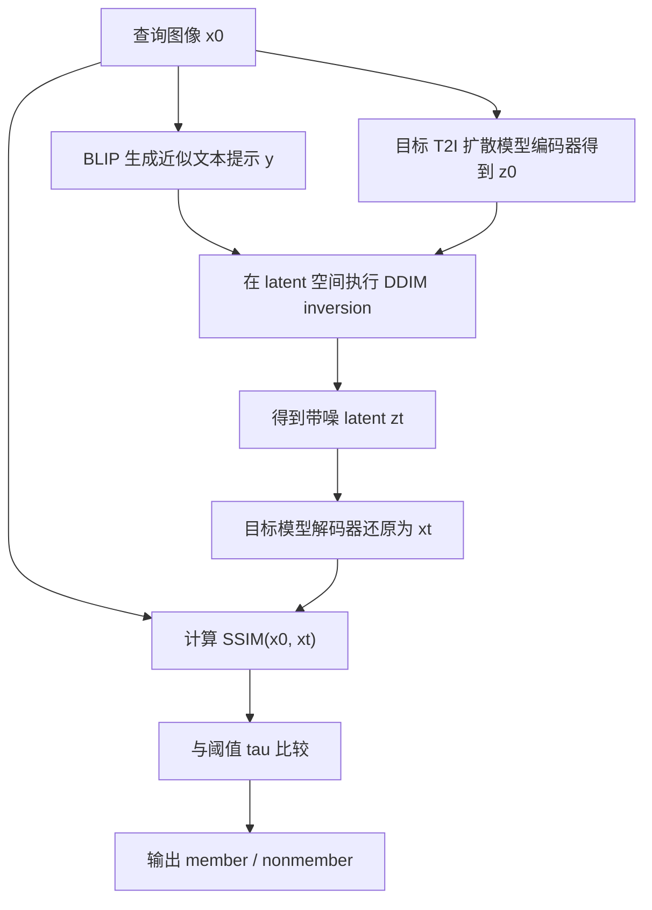

# Unveiling Structural Memorization: Structural Membership Inference Attack for Text-to-Image Diffusion Models

- Title: Unveiling Structural Memorization: Structural Membership Inference Attack for Text-to-Image Diffusion Models
- Material Path: `references/materials/gray-box/2024-arxiv-structural-memorization-membership-inference-text-to-image-diffusion.pdf`
- Primary Track: Gray-box
- Venue / Year: ACM MM 2024
- Threat Model Category: Gray-box membership inference for text-to-image diffusion models
- Core Task: 给定一张查询图像，判断其是否属于目标文生图扩散模型的训练集成员
- Open-Source Implementation: 论文正文未给出官方代码仓库链接
- Report Status: Complete

## Executive Summary

这篇论文关注文生图扩散模型的成员推断问题。作者认为，现有扩散模型 MIA 多依赖像素级噪声预测误差或相邻噪声状态差异，这类信号隐含了一个较强假设，即目标模型会以逐像素方式记住训练图像。对于以 LAION 级别大规模数据训练的文生图模型，这一假设并不充分，因为模型更可能记住的是结构而非全部像素细节。

论文的核心贡献是把成员性线索从像素级记忆转向结构级记忆。作者先分析前向扩散过程中图像结构的衰减行为，发现成员图像在早期扩散阶段的结构保持更好，随后据此提出一种简单的结构式攻击：将输入图像编码到 latent 空间，执行 DDIM inversion 得到带噪 latent，再解码回图像空间，并以原图与输出图的 SSIM 作为成员分数，高于阈值则判为 member。

实验覆盖 Latent Diffusion Model 与 Stable Diffusion v1-1，在 `512x512` 与 `256x256` 两种分辨率下均与 `SecMI`、`PIA`、`Naive Loss` 比较。论文报告该方法在两个目标模型上都取得最优 AUC 与 ASR，例如在 LDM `512x512` 上达到 `AUC=0.930`、`ASR=0.860`，在 Stable Diffusion `512x512` 上达到 `AUC=0.920`、`ASR=0.852`，并在噪声、旋转、饱和度和亮度扰动下维持更高鲁棒性。对 DiffAudit 而言，这篇论文的重要性在于它明确提出一条灰盒主线：不再围绕像素级噪声残差，而是围绕前向扩散中的结构保持性构造成员推断信号。

## Bibliographic Record

- Title: Unveiling Structural Memorization: Structural Membership Inference Attack for Text-to-Image Diffusion Models
- Authors: Qiao Li, Xiaomeng Fu, Xi Wang, Jin Liu, Xingyu Gao, Jiao Dai, Jizhong Han
- Venue / year / version: ACM Multimedia 2024, conference version in local PDF
- Local PDF path: `D:/Code/DiffAudit/Project/references/materials/gray-box/2024-arxiv-structural-memorization-membership-inference-text-to-image-diffusion.pdf`
- Source URL if known: 本地 PDF 未显式给出持久链接；当前报告仅能确认其为与 MM'24 题目一致的本地副本

## Research Question

论文试图回答的问题是：对于大规模文生图扩散模型，是否存在比像素级噪声比较更稳定、更可迁移的成员推断线索？作者的回答是肯定的，并进一步把该线索具体化为“成员图像在前向扩散早期具有更强的结构保持性”。

其默认威胁模型是灰盒而非纯黑盒。攻击者持有待检测图像，能够访问目标文生图扩散模型的编码器、解码器与前向扩散相关计算，能够执行 DDIM inversion，并能得到一条文本条件路径；但论文同时强调，真实训练时的原始 caption 往往不可得，因此文本由 BLIP 从图像自动生成，而不是直接读取训练集标注。

## Problem Setting and Assumptions

访问模型方面，攻击需要使用目标文生图模型的 encoder、decoder、U-Net 与 DDIM inversion 过程，因此明显强于仅能调用生成 API 的黑盒设定，但又不依赖重新训练 shadow model 或访问训练梯度。

可用输入包括查询图像 `x_0`、目标模型参数、BLIP 自动生成的文本提示，以及用于阈值和统计比较的 member/hold-out 数据划分。可观察输出包括前向扩散后再解码得到的图像 `x_t`，以及由此计算的 SSIM 分数。

论文依赖若干关键先验。第一，训练成员在早期扩散阶段的结构衰减慢于非成员。第二，这种结构差异在 image space 通过 encoder-decoder 回环后仍可被 SSIM 捕获。第三，文本对低噪声早期结构影响较弱，因此即使只能用 BLIP 生成近似 caption，也不会显著破坏攻击信号。范围上，论文只评估通用互联网图像语料训练的文生图模型，不讨论微调模型、风格域极窄数据集或纯 API 访问场景。

## Method Overview

方法分成两个层次。第一层是现象验证：作者先沿前向扩散轨迹考察原图与带噪图的结构相似度变化，比较成员集与 hold-out 集在不同 timestep 的 SSIM 衰减速度与平均差值。这个分析给出的核心结论是，成员图像在早期扩散阶段保留更多结构信息，而该差异在大约 `t=100` 左右最明显。

第二层是真正的攻击过程。给定输入图像，攻击者先用目标文生图模型编码器得到 latent 表示 `z_0`；再用 BLIP 生成文本提示；随后在 latent 空间执行 DDIM inversion 得到 `z_t`；再通过解码器将 `z_t` 还原到图像空间，得到前向扩散后的图像 `x_t`；最后计算 `SSIM(x_0, x_t)` 作为成员分数，并通过阈值 `\tau` 做二分类。

论文强调其信号与现有基线不同。`Naive Loss`、`PIA`、`SecMI` 等方法本质上都围绕像素级噪声误差或相邻状态差异构造统计量，而本文直接比较原图与扩散后输出图之间的结构相似性，因此对附加噪声一类现实扰动更不敏感。

## Method Flow

## Key Technical Details

论文中最值得保留的不是训练损失，而是把前向扩散、结构衰减和最终决策连成一条链。首先，作者在 latent 空间使用 DDIM inversion，将输入图像映射到更高噪声的状态；其次，用 SSIM 的变化率和成员/非成员的平均差作为现象分析指标；最后，再用单次 `SSIM(x_0, x_t)` 作为实际攻击得分。其 distinctive point 在于：比较发生在 image space，但噪声注入发生在 latent diffusion space，这样可以利用 encoder-decoder 消除直接噪声纹理对结构比较的干扰。

$$
x_{t+1}=\sqrt{\alpha_{t+1}}\left(\frac{x_t-\sqrt{1-\alpha_t}\,\epsilon_\theta(x_t,t)}{\sqrt{\alpha_t}}\right)+\sqrt{1-\alpha_{t+1}}\,\epsilon_\theta(x_t,t)
$$

$$
v(t)=\frac{\operatorname{SSIM}(x_0,x_{t+\Delta t})-\operatorname{SSIM}(x_0,x_t)}{\Delta t}
$$

$$
\hat{m}(x_0)=
\begin{cases}
\text{member}, & \operatorname{SSIM}(x_0,x_t)>\tau \\
\text{nonmember}, & \operatorname{SSIM}(x_0,x_t)\le \tau
\end{cases}
$$

从论文文字可见，超参数也很关键。总扩散步数过小会削弱成员/非成员差异，过大又会把结构一并淹没；作者报告 `T=100` 效果最佳。采样间隔 `t_i` 在 `1` 到 `100` 之间影响较小，因此论文最终采用 `t_i=50` 作为计算代价与效果之间的折中。

## Experimental Setup

- Target models: Latent Diffusion Model 与 Stable Diffusion v1-1。
- Training corpora for targets: 分别对应 LAION-400M 与 LAION2B-en。
- Member / hold-out split: 每个目标模型随机采样 `5000` 张训练成员图像；hold-out 使用 `5000` 张 COCO2017-Val 图像。
- Resolutions: `256x256` 与 `512x512`。
- Attack pipeline details: 使用 DDIM inversion，采样间隔 `50`，前向扩散过程中进行两次噪声注入。
- Baselines: `SecMI`、`PIA`、`Naive Loss`。
- Metrics: `AUC`、`ASR`、`Precision`、`Recall`、`TPR@1%FPR`、`TPR@0.1%FPR`。
- Robustness tests: Salt-and-pepper noise、10 度旋转、饱和度变化、亮度变化。
- Text sensitivity tests: 改变 classifier-free guidance 的 scale `\gamma`，并比较不同 prompt 的重建结构变化。

## Main Results

主结果是该结构式方法在两个目标模型上都优于三个像素级基线。在 LDM `512x512` 上，论文报告 `AUC=0.930`、`ASR=0.860`、`Precision=0.880`、`Recall=0.839`；次优 `Naive Loss` 只有 `AUC=0.789`、`ASR=0.740`。在 Stable Diffusion `512x512` 上，本文方法达到 `AUC=0.920`、`ASR=0.852`，同样显著高于 `Naive Loss` 的 `0.766/0.717`。

低误报区间的优势也成立。LDM `512x512` 下，本文方法 `TPR@1%FPR=0.575`、`TPR@0.1%FPR=0.245`，高于 `Naive Loss` 的 `0.338/0.231` 与 `PIA` 的 `0.243/0.126`。Stable Diffusion `512x512` 下，对应数值为 `0.512/0.234`，仍为最佳。

鲁棒性是论文第二个强结论。在 LDM `512x512` 的附加噪声场景中，本文方法仍有 `AUC=0.710`、`ASR=0.694`，而 `PIA` 和 `Naive Loss` 分别降到 `0.399/0.517` 与 `0.517/0.559`。此外，文本条件敏感性实验显示 `\gamma` 从 `0` 到 `5` 时，AUC 基本保持在 `0.930` 左右，说明该攻击依赖的是早期扩散中的结构保持，而不是精确 caption。

## Strengths

- 贡献点明确：不是在既有 loss-based 路线上微调分数，而是提出“结构级记忆”这一新的成员性线索。
- 证据链完整：先有扩散过程分析，再给出攻击算法，再以主结果、低误报结果、鲁棒性和文本敏感性实验交叉支撑。
- 方法简单：最终分数就是一次 `SSIM(x_0, x_t)` 阈值判定，没有依赖复杂分类器或 shadow 训练。
- 工程上较有现实意义：使用 BLIP 自动生成文本，避免把“已知训练 caption”当成默认条件。

## Limitations and Validity Threats

- 论文没有在正文给出官方代码链接，补充材料细节存在，但复现实操入口不够直接。
- 成员集与 hold-out 集的构造较理想化：从 LAION 随机抽成员、从 COCO 取非成员，分布差异可能放大成员/非成员信号，未充分讨论数据分布错配带来的偏差。
- 结构分数只使用 SSIM，这是一种手工设计指标。论文没有深入比较更强结构表征，如 LPIPS、DINO 特征或分层语义结构度量。
- 鲁棒性实验只在 LDM `512x512` 上展开，不能直接证明所有模型规模、所有语义域下都同样稳定。
- 攻击仍需访问 encoder-decoder 与 DDIM inversion 路径，因此不适用于严格黑盒 API；其适用边界必须与 `REDIFFUSE` 一类真正黑盒方法区分开。

## Reproducibility Assessment

忠实复现需要的核心资产包括：LDM 与 Stable Diffusion v1-1 权重、可访问的 encoder/decoder/U-Net 推理链路、LAION 成员样本子集、COCO2017-Val hold-out 集、BLIP caption 生成器，以及与论文一致的 DDIM inversion 和阈值设定。若要复现表 1 到表 10，还需要完整的多分辨率评估、低 FPR 指标统计与四类图像扰动实现。

代码可得性方面，正文未声明官方开源仓库，因此当前更像“可复现但入口不友好”的状态，而不是“拿来即可跑”的状态。补充材料可能含更多实现细节，但仅凭正文不足以重建全部训练前处理和评测脚本。

结合当前 DiffAudit 仓库，相关灰盒主线已经覆盖了 `SecMI` 与 `PIA` 的计划、适配和 smoke 路径，因此论文中的主要对照基线并非完全空白；但仓库内没有发现针对本文结构式攻击的现成实现、配置模板或 runtime 适配层。今天阻碍忠实复现的关键因素是：缺少作者代码、缺少论文同分布的 LAION 成员子集与阈值校准流程、以及缺少将 BLIP caption 与前向扩散结构分数整合成统一实验管线的现成实现。

## Relevance to DiffAudit

这篇论文与 DiffAudit 的灰盒路线高度相关。它保留了灰盒可观察性假设，即攻击者可以接入目标扩散模型的内部推理路径，但它把攻击信号从 `SecMI`、`PIA` 所依赖的像素级噪声误差转移到结构保持性，因此很适合作为现有灰盒路线的对照扩展。

从产品与叙事角度看，本文也有价值。`SecMI -> PIA` 可以被视为“噪声/损失线索”家族，而本文提供了“结构记忆线索”家族。若 DiffAudit 未来要向用户解释“为什么成员图像更容易被识别”，这篇论文给出的论述比单纯比较 loss 更直观，也更能连接隐私风险与模型记忆机制。

从工程优先级看，本文不是必须立刻替代现有灰盒主线，但非常适合成为下一阶段的比较对象：同样的目标模型、同样的 member/hold-out 划分下，可以直接测量结构分数与 `SecMI`/`PIA` 在精度、查询成本、扰动鲁棒性上的差异。

## Recommended Figure

- Figure page: 4
- Crop box or note: `300 78 610 176`；裁切第 4 页右上角 Figure 2 主体，仅保留两张结构相似度曲线图，去掉周围双栏正文
- Why this figure matters: 这组曲线是整篇论文的经验前提。它直接展示成员图像在早期扩散阶段结构衰减更慢，以及 member-hold-out 之间的平均 SSIM 差值在约 `t=100` 达到峰值，因而解释了为什么后续单次 `SSIM(x_0, x_t)` 可以成为有效成员分数
- Local asset path: `docs/paper-reports/assets/gray-box/2024-arxiv-structural-memorization-membership-inference-text-to-image-diffusion-key-figure-p4.png`

## Extracted Summary for `paper-index.md`

这篇论文研究文生图扩散模型上的成员推断攻击，核心问题是：当目标模型由大规模互联网图像训练而成时，攻击是否还能依赖像素级误差识别训练成员。作者认为更现实的信号来自结构级记忆，即训练成员在前向扩散早期比非成员保留更多图像结构，因此成员与非成员在结构相似度衰减曲线上会出现系统性差异。

论文提出一种结构式灰盒攻击。做法是先把输入图像编码到 latent 空间，用 BLIP 生成近似文本提示，再执行 DDIM inversion 得到带噪 latent，最后解码回图像空间，并用原图与输出图的 SSIM 作为成员分数。实验在 Latent Diffusion Model 和 Stable Diffusion v1-1 上表明，该方法在 AUC、ASR、`TPR@1%FPR` 等指标上普遍优于 `SecMI`、`PIA` 和 `Naive Loss`，同时对附加噪声等扰动更稳健。

对 DiffAudit 来说，这篇论文的重要性在于它补足了灰盒路线中的“结构记忆”分支。当前仓库已覆盖 `SecMI` 与 `PIA` 等像素级或噪声级基线，而本文提供了一个不同的比较轴：在相近的灰盒访问条件下，直接利用前向扩散中的结构保持性做成员审计。这使它非常适合作为后续灰盒实验和路线叙事中的对照论文。
