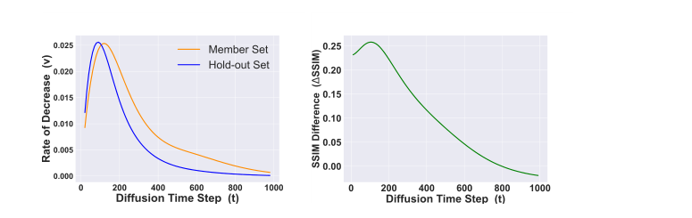

# 结构记忆驱动的文生图扩散模型成员推断
Unveiling Structural Memorization: Structural Membership Inference Attack for Text-to-Image Diffusion Models

## 文献信息

- 英文标题：Unveiling Structural Memorization: Structural Membership Inference Attack for Text-to-Image Diffusion Models
- 中文标题：结构记忆驱动的文生图扩散模型成员推断
- 作者：Qiao Li，Xiaomeng Fu，Xi Wang，Jin Liu，Xingyu Gao，Jiao Dai，Jizhong Han
- 发表信息：ACM Multimedia 2024，本地 PDF 为会议版
- 论文主问题：在大规模文生图扩散模型中，如何不用像素级噪声误差，而是利用结构记忆判断一张图像是否属于训练集成员
- 威胁模型类别：灰盒成员推断，攻击者可访问目标文生图模型的编码器、解码器和前向扩散相关推理路径，但不依赖参数梯度
- 本地 PDF 路径：`D:\Code\DiffAudit\Research\references\materials\gray-box\2024-arxiv-structural-memorization-membership-inference-text-to-image-diffusion.pdf`
- GitHub PDF：[2024-arxiv-structural-memorization-membership-inference-text-to-image-diffusion.pdf](https://github.com/DeliciousBuding/DiffAudit-Research/blob/main/references/materials/gray-box/2024-arxiv-structural-memorization-membership-inference-text-to-image-diffusion.pdf)
- OCR/Markdown 精修版链接：[OCR精修版：Unveiling Structural Memorization: Structural Membership Inference Attack for Text-to-Image Diffusion Models](https://www.feishu.cn/docx/CYJ7dkLHioaEhyxBMyQcNGHHnKf)
- 飞书原生 PDF：[2024-arxiv-structural-memorization-membership-inference-text-to-image-diffusion.pdf](https://ncn24qi9j5mt.feishu.cn/file/PtWkbsbUZody0Yxkmk9cfV5Tnjh)
- 开源实现链接：暂未找到
- 报告状态：已完成

## 1. 论文定位

这篇论文处理的是文生图扩散模型上的成员推断攻击。它不讨论数据提取，也不是防御论文，而是沿着灰盒审计路线回答一个更细的问题：当目标模型训练在 LAION 级别的大规模图文数据上时，成员性究竟体现为像素级记忆，还是更高层的结构级记忆。

对 DiffAudit 而言，这篇论文的定位不是替代 `SecMI` 或 `PIA`，而是补上一条新的灰盒信号线。前两者主要利用噪声预测误差或相邻时间步差异，本文则把信号换成“前向扩散早期的结构保持性”，因此更适合作为灰盒对照论文和叙事补强材料。

## 2. 核心问题

论文真正要回答的不是泛泛的“扩散模型会不会泄露成员信息”，而是两个更具体的问题。第一，现有基于像素级噪声残差的 MIA 是否足以刻画文生图模型的记忆方式。第二，如果模型记住的主要是图像结构而不是完整像素纹理，那么能否围绕这种结构记忆设计更稳健的成员分数。

作者的结论是：对大规模文生图模型来说，像素级线索并不充分。成员样本在前向扩散早期会比非成员更好地保留整体结构，这种差异可以在图像空间通过结构相似度稳定读出，并转化为有效的成员判定规则。

## 3. 威胁模型与前提

论文采用的是灰盒设定。攻击者持有待检测图像 `x_0`，可以调用目标文生图扩散模型的编码器、解码器、U-Net 推理路径和 DDIM inversion，因此能够把图像送入 latent 空间，再观察前向扩散后的重构结果。攻击者不需要访问训练梯度，也不需要重新训练大型 shadow diffusion model。

这一设定同时带有几个关键前提。其一，真实训练 caption 往往拿不到，因此文本条件由 BLIP 从图像自动生成，而不是默认已知 ground-truth caption。其二，论文的有效性依赖“成员在低噪声早期更能保留结构”这一经验规律。其三，这条路线不适用于只暴露最终生成图像的严格 black-box API，因为它需要走通目标模型内部的编码和扩散路径。

## 4. 方法总览

作者先做现象分析，再把分析结果变成攻击。直觉上，扩散模型在前向扩散早期先破坏局部细节，较晚才逐步破坏全局结构；如果某张图像在训练中出现过，模型会更倾向于保留它的骨架和布局，因此成员图像在相同扩散步上会比非成员图像更像原图。

基于这个观察，攻击过程很直接。先将输入图像编码成 latent 表示，再用 BLIP 生成文本提示，并在 latent 空间执行 DDIM inversion 得到带噪 latent，随后解码回图像空间，得到前向扩散后的图像。最后计算原图和扩散后图像之间的 SSIM，若该值高于阈值，就判为成员。与 `SecMI`、`PIA` 相比，变化不在推理接口，而在成员分数从像素级噪声误差改成了结构相似度。

## 5. 方法概览 / 流程

这条攻击链可以概括为四步：输入查询图像，编码到 latent 空间；用 BLIP 生成近似文本并执行 DDIM inversion，把图像推进到某个前向扩散时间步；将带噪 latent 解码回图像空间；比较原图与输出图的结构相似度并做阈值判定。论文最终采用总扩散步数 `T=100`、采样间隔 `t_i=50` 的配置，因为作者发现结构差异在早期最强，而过深扩散会把成员与非成员都一起淹没。

## 6. 关键技术细节

论文第一条关键技术线索是把 DDIM inversion 当作可控的“结构破坏器”。对于给定时间步，前向更新写成

$$
x_{t+1}=\sqrt{\alpha_{t+1}}\left(\frac{x_t-\sqrt{1-\alpha_t}\,\epsilon_\theta(x_t,t)}{\sqrt{\alpha_t}}\right)+\sqrt{1-\alpha_{t+1}}\,\epsilon_\theta(x_t,t).
$$

这一步的作用不是生成图像，而是把原图稳定地推进到更高噪声状态，同时保留由目标模型决定的结构衰减轨迹。因为攻击比较的是同一模型下不同样本的衰减行为，所以这条轨迹本身就携带成员信息。

第二条关键线索是，作者并不直接比较某个时间步的 SSIM，而是先研究结构相似度的下降速度：

$$
v(t)=\frac{\operatorname{SSIM}(x_0,x_{t+\Delta t})-\operatorname{SSIM}(x_0,x_t)}{\Delta t}.
$$

论文用这一定义说明，在大约前一百个扩散步内，非成员的结构相似度下降得更快。这意味着成员图像在早期更能维持轮廓、布局和大尺度纹理，而不是只表现为局部像素误差更小。

第三条线索是把分布级观察压缩为单样本攻击规则。作者统计 member 集和 hold-out 集之间的平均结构差

$$
\Delta \operatorname{SSIM}(t)=\frac{1}{|X_m|}\sum_{x_0\in X_m}\operatorname{SSIM}(x_0,x_t)-\frac{1}{|X_h|}\sum_{x_0\in X_h}\operatorname{SSIM}(x_0,x_t),
$$

并发现该差值在约 `t=100` 达到峰值。于是最终攻击器只保留最简单的单样本决策：

$$
\hat{m}(x_0)=\mathbb{1}\!\left[\operatorname{SSIM}(x_0,x_t)>\tau\right].
$$

这一步很重要，因为它说明论文真正贡献的不是复杂分类器，而是找到一个更合适的 gray-box 统计量。结构相似度本身就在完成成员判断，而不是后处理模型替它完成判断。

## 7. 实验设置

- 目标模型：Latent Diffusion Model、Stable Diffusion v1-1。
- 数据来源：成员样本从相应训练数据中随机抽取，hold-out 使用 COCO2017-Val。
- 样本规模：每个目标模型使用 `5000` 张成员图像和 `5000` 张 hold-out 图像。
- 分辨率：`512x512` 与 `256x256`。
- 文本条件：使用 BLIP 自动生成提示词，并评估不同 classifier-free guidance scale。
- 基线：`SecMI`、`PIA`、`Naive Loss`。
- 指标：`AUC`、`ASR`、`Precision`、`Recall`、`TPR@1%FPR`、`TPR@0.1%FPR`。
- 鲁棒性评估：附加噪声、旋转、饱和度变化、亮度变化。

## 8. 主要结果

主结论很清楚：结构式攻击在两个目标模型上都稳定优于像素级基线。在 LDM `512x512` 上，本文方法达到 `AUC=0.930`、`ASR=0.860`，而 `Naive Loss` 仅为 `0.789/0.740`；在 Stable Diffusion `512x512` 上，本文方法达到 `0.920/0.852`，同样高于 `Naive Loss` 的 `0.766/0.717`。低误报区间也保持优势，例如 LDM `512x512` 下的 `TPR@1%FPR=0.575`，明显高于 `PIA` 的 `0.243` 和 `SecMI` 的 `0.227`。

论文第二个有分量的结论是鲁棒性。以 LDM `512x512` 为例，在附加噪声扰动下，本文方法仍有 `AUC=0.710`、`ASR=0.694`，而 `PIA` 下降到 `0.399/0.517`。作者据此主张：结构级分数比噪声级分数更贴近模型实际记忆方式，因此对真实世界中的轻微失真更不敏感。

上图对应论文的经验支点。左图显示 non-member 在早期扩散阶段的结构相似度下降更快；右图则显示 member 与 hold-out 的平均 SSIM 差值在约 `t=100` 达到峰值。也就是说，论文不是先拍脑袋设定 `T=100`，而是先从结构衰减曲线里读出最有信息量的时间区间，再把它固定为攻击配置。

## 9. 优点

这篇论文的优点在于，它没有在既有 loss-based 路线上继续堆技巧，而是把成员信号换到了更符合大模型记忆方式的结构层。其次，证据链比较完整：先分析扩散过程中的结构演化，再给出攻击器，最后用主结果、低误报指标和扰动实验共同支撑。最后，方法本身很简单，最终攻击分数就是一次 SSIM 比较，工程上比训练额外攻击模型更直接。

## 10. 局限与有效性威胁

局限也很明确。第一，接口假设仍然偏强，需要访问编码器、解码器和前向扩散链路，因此不能外推到严格 black-box 服务。第二，member 与 hold-out 的构造使用 LAION 对 COCO，这里面可能夹带分布差异，进而放大可分性。第三，结构度量只用 SSIM，论文没有系统比较 LPIPS、DINO 或其他更强语义结构指标。第四，正文未给出官方代码仓库，复现入口不友好。

## 11. 对 DiffAudit 的价值

它对 DiffAudit 的直接价值，是把灰盒路线从“噪声误差家族”扩展到“结构记忆家族”。如果后续要给用户解释为什么某些图像更容易被审计出来，这篇论文提供了比单纯 loss gap 更直观的语言：成员图像在模型内部前向腐蚀时，骨架会更慢崩塌。

在工程层面，这篇论文适合作为下一阶段灰盒对照实验，而不是替换现有 `SecMI` / `PIA` 主线。最合适的做法，是在相同模型、相同 member/hold-out 划分下，把结构分数与噪声分数放在同一张表里比较精度、查询成本和扰动鲁棒性。

## 12. 关键图使用方式

本报告只保留 1 张关键图，即上文主结果段落后的结构相似度曲线。它承担两个任务：一是解释为什么攻击器要选择早期扩散时间步，二是把“结构记忆”从抽象论断落到可观察的 member / hold-out 曲线差异上。方法流程图没有额外插入，因为本方法本身很短，文字已经足够说明执行顺序。

## 13. 复现评估

忠实复现需要的资产包括：LDM 与 Stable Diffusion v1-1 权重，可调用的 encoder / decoder / U-Net 推理接口，成员样本子集、COCO hold-out 集、BLIP caption 生成器，以及与论文一致的 DDIM inversion 配置和阈值校准流程。当前 DiffAudit 仓库最缺的不是基础灰盒框架，而是这条结构分数链路本身，包括“图像编码到 latent 再回到图像空间”的评估管线和对应的 SSIM 统计模块。

结构性阻塞主要有两个：作者代码未公开，很多实现细节只能从正文逆推；论文使用的 LAION 成员子集与阈值校准流程也没有直接给出可下载资产。因此这篇论文更适合先做近似复现和对照实验，而不是把“忠实重跑论文表格”当作短期目标。

## 14. 写回总索引用摘要

这篇论文解决的是文生图扩散模型上的灰盒成员推断问题，核心关注点不是单纯的像素误差，而是模型是否在训练中记住了图像的整体结构。

论文的核心方法是观察前向扩散早期的结构衰减规律，发现成员图像比非成员更能保持结构；据此，作者通过 DDIM inversion 生成带噪版本，再用原图与输出图之间的 SSIM 作为成员分数，并在 LDM 和 Stable Diffusion 上取得优于 `SecMI`、`PIA`、`Naive Loss` 的结果。

它对 DiffAudit 的价值在于补足灰盒路线里的结构记忆分支。当前仓库已有像素级噪声误差基线，而本文提供了一个不同的比较轴，适合用于后续灰盒实验对照和产品叙事中的机制解释。
