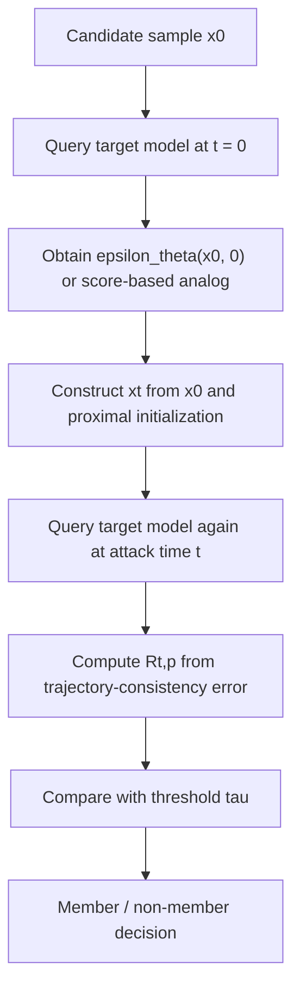
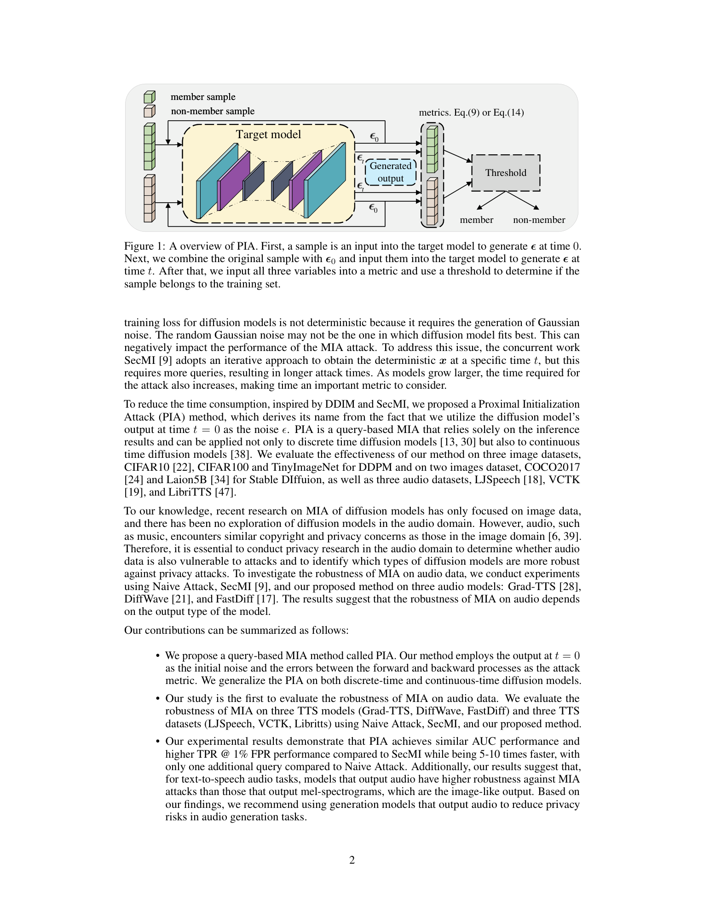

# An Efficient Membership Inference Attack for the Diffusion Model by Proximal Initialization

- Title: An Efficient Membership Inference Attack for the Diffusion Model by Proximal Initialization
- Material Path: `D:/Code/DiffAudit/Project/references/materials/gray-box/2024-iclr-pia-proximal-initialization.pdf`
- Primary Track: `gray-box`
- Venue / Year: ICLR 2024
- Threat Model Category: Gray-box query-based membership inference against diffusion models with intermediate noise-related outputs
- Core Task: Determine whether a sample belongs to the training set by reusing the model output at `t = 0` to build a low-query attack statistic
- Open-Source Implementation: <https://github.com/kong13661/PIA>
- Report Status: Complete

## Executive Summary

这篇论文研究扩散模型上的灰盒成员推断攻击。作者关注的问题不是如何恢复训练样本，而是在攻击者无法读取模型参数、但能够访问扩散过程中的中间噪声相关输出时，是否可以用更少查询次数稳定地区分成员与非成员。论文的回答是肯定的，并据此提出 `PIA`（Proximal Initialization Attack）及其归一化版本 `PIAN`。

方法上的核心变化是：不再像 `SecMI` 那样为得到某个时刻的确定性轨迹而执行较长的迭代逆推，而是直接把模型在 `t = 0` 时对样本给出的噪声预测 `\epsilon_\theta(x_0, 0)` 当作“近邻初始化”，再在选定时刻 `t` 发起第二次查询。攻击分数由“以该初始化构造出的 groundtruth trajectory”与“模型在时刻 `t` 的预测点”之间的 `\ell_p` 距离给出，因此整个攻击在离散时间与连续时间扩散模型中都只需两次查询。

实验覆盖 DDPM、Stable Diffusion 与 Grad-TTS，并把音频扩散模型纳入成员推断讨论。论文报告 `PIA/PIAN` 在 DDPM 与 Grad-TTS 上通常取得与 `SecMI` 相当或更高的 AUC，同时在 `TPR@1%FPR` 上更优，且查询代价显著更低。作者进一步指出，输出为 mel-spectrogram 的 TTS 模型明显更脆弱，而直接输出音频波形的 DiffWave/FastDiff 则接近随机猜测。对 DiffAudit 而言，这篇论文的重要性在于它把灰盒主线从 `SecMI` 推进到一个更低 query budget、工程上更易打通的执行路线。

## Bibliographic Record

- Title: An Efficient Membership Inference Attack for the Diffusion Model by Proximal Initialization
- Authors: Fei Kong, Jinhao Duan, Ruipeng Ma, Hengtao Shen, Xiaofeng Zhu, Xiaoshuang Shi, Kaidi Xu
- Venue / year / version: ICLR 2024; OpenReview camera-ready corresponding to 2023 arXiv preprint
- Local PDF path: `D:/Code/DiffAudit/Project/references/materials/gray-box/2024-iclr-pia-proximal-initialization.pdf`
- Source URL: <https://openreview.net/forum?id=rpH9FcCEV6>

## Research Question

论文试图回答三个彼此关联的问题。第一，针对扩散模型成员推断，是否能保留灰盒信号强度，同时把查询次数从 `SecMI` 一类方法的大量迭代降到常数级。第二，这种攻击是否不仅适用于离散时间的 DDPM/DDIM，也能迁移到连续时间扩散模型。第三，音频生成扩散模型是否也像图像扩散模型一样暴露可观的成员信号。

其威胁模型沿用 `SecMI` 的半白盒设定：攻击者知道待测样本 `x_0`，能够查询目标模型在特定时刻的中间输出，但看不到权重、梯度或完整训练过程。因此它不是纯黑盒 API 攻击，也不是需要白盒参数访问的训练损失重放。

## Problem Setting and Assumptions

- Access model: 灰盒查询式访问，需要拿到模型在 `t=0` 和某个攻击时刻 `t` 的噪声相关输出。
- Available inputs: 候选样本 `x_0`、时间步 `t`、范数阶数 `p`、阈值 `\tau`。
- Available outputs: 离散时间模型中的 `\epsilon_\theta(x_0,0)` 与 `\epsilon_\theta(x_t,t)`；连续时间模型中的 score-related output `s_\theta(x_t,t)`。
- Required priors or side information: 知道扩散调度 `\bar{\alpha}_t` 或连续时间漂移/扩散系数表达；能够构造 member 与 hold-out 的校准集或 surrogate model 来选阈值。
- Scope limits: 论文主要证明查询式成员可分性，而非严格最优检验；连续时间推导依赖对高阶无穷小项的忽略；真实可部署性取决于服务端是否暴露中间输出。

## Method Overview

方法从 DDIM 的确定性轨迹性质出发。作者先证明：当 `\sigma_t = 0` 时，只要知道 `x_0` 与轨迹中的任一点 `x_k`，就能重建整条轨迹上的任意 `x_t`。随后他们选择最靠近原始样本的 `k = 0`，并用模型在 `t = 0` 的输出 `\epsilon_\theta(x_0, 0)` 近似真实噪声，从而得到一条“groundtruth trajectory”。

攻击执行时，先对样本查询一次 `t = 0`，得到 `\epsilon_\theta(x_0,0)`。接着用该输出与原始样本合成时刻 `t` 的点 `x_t = \sqrt{\bar{\alpha}_t}x_0 + \sqrt{1-\bar{\alpha}_t}\epsilon_\theta(x_0,0)`，然后向目标模型做第二次查询，得到该点的噪声预测或连续时间 score。成员样本若更贴近训练时拟合到的轨迹，则第二次预测会与第一次得到的近邻初始化更一致，因此对应的 `R_{t,p}` 更小。

`PIAN` 只是对第一步拿到的 `\epsilon_\theta(x_0,0)` 做一次 `\ell_1` 归一化与高斯尺度匹配，试图把它拉回更接近标准正态的尺度。论文后续实验表明，这个改动在 DDPM 和 Grad-TTS 上有时能提升低 FPR 区域表现，但在 Stable Diffusion 上反而不稳定，因此作者更推荐直接使用 `PIA`。

## Method Flow

## Key Technical Details

论文的第一项关键技术点是利用 DDIM 的确定性轨迹关系，把任意已知点 `x_k` 与 `x_0` 映射到任意 `x_t`。这使得 `t = 0` 的模型输出可以直接充当地面真实轨迹的近邻初始化，而不必像 `SecMI` 那样反复迭代求解中间点：

$$
x_t=\sqrt{\bar{\alpha}_t}x_0+\sqrt{1-\bar{\alpha}_t}\cdot \frac{x_k-\sqrt{\bar{\alpha}_k}x_0}{\sqrt{1-\bar{\alpha}_k}}.
$$

第二项关键技术点是离散时间攻击分数。将 `k=0` 且 `x_k` 由 `\epsilon_\theta(x_0,0)` 给出后，轨迹误差可以化简为两次查询结果的 `\ell_p` 距离：

$$
R_{t,p}=
\left\|
\epsilon_\theta(x_0,0)-
\epsilon_\theta\!\left(
\sqrt{\bar{\alpha}_t}x_0+\sqrt{1-\bar{\alpha}_t}\epsilon_\theta(x_0,0),\, t
\right)
\right\|_p.
$$

第三项关键技术点是连续时间版本。作者从 score-based SDE/ODE 出发，用 `s_\theta(x_t,t)` 近似 `\nabla_{x_t}\log p_t(x_t)`，并在忽略高阶无穷小项后得到：

$$
R_{t,p}=
\left\|
f_t(x_t)-\frac{1}{2}g_t^2 s_\theta(x_t,t)
\right\|_p.
$$

这里有两个需要明确记录的推断边界。其一，连续时间推导对 `dt` 与高阶项做了近似处理，因此更像工程上可用的统计量，而非严格等价的最优测试。其二，`PIAN` 仅对 `\epsilon_\theta(x_0,0)` 做基于 `\ell_1` 范数的尺度归一化，论文自己也承认这只是启发式校正，不能保证真正恢复到标准正态。

## Experimental Setup

- Datasets:
  - DDPM: CIFAR10, CIFAR100, TinyImageNet。
  - Stable Diffusion: 2500 张 Laion-Aesthetics v2.5+ 训练成员样本与 2500 张 COCO2017-val 留出样本。
  - TTS: LJSpeech, VCTK, LibriTTS-lean-100。
- Model families:
  - Discrete-time: DDPM, Stable Diffusion v1-5。
  - Continuous-time: Grad-TTS。
  - Additional robustness comparison: DiffWave, FastDiff。
- Baselines: Naive Attack、SecMI、PIA、PIAN。
- Metrics: AUC、`TPR@1%FPR`，正文另提到 `TPR@0.1%FPR` 但主表主要报告前两项。
- Evaluation conditions:
  - 默认把数据随机一分为二作为训练集与 hold-out 集。
  - DDPM 上：Naive Attack 使用 `t=200`，SecMI 用 `t=100`，PIA/PIAN 用 `t=200`，并取 `\ell_4` 范数。
  - Grad-TTS 上：Naive Attack 用 `t=0.8`，SecMI 用 `t=0.6`，PIA/PIAN 用 `t=0.3`，并取 `\ell_4` 范数。
  - Stable Diffusion 上：Naive Attack 与 PIA 用 `t=500`，SecMI 用 `t=100`。

## Main Results

Grad-TTS 上的结果最强。表 1 中，`PIA` 在 LJSpeech/VCTK/LibriTTS 上分别达到 `99.6/87.8/95.4` 的 AUC，`TPR@1%FPR` 分别为 `94.2/20.6/30.0`；`PIAN` 在同三组数据上的低 FPR TPR 分别达到 `95.7/19.6/44.7`。与 `SecMI` 相比，论文报告 `PIA` 平均高出 `5.4` 个点、`PIAN` 平均高出 `10.5` 个点的 `TPR@1%FPR`，但查询数只需 `1+1`，计算消耗约为 `SecMI` 的 `3.2%`。

DDPM 上，`PIA` 的 AUC 虽然只比 `SecMI` 略高，但低 FPR 区域提升更明确。以 CIFAR100 为例，`PIA` 的 AUC 为 `89.4`，`TPR@1%FPR` 为 `19.6`，相比 `SecMI` 的 `87.6/11.1` 更优；`PIAN` 在 CIFAR10 和 TinyImageNet 上分别把 `TPR@1%FPR` 提高到 `31.2` 与 `32.8`。论文据此强调，在成员审计更关心的低误报区间，`PIA/PIAN` 比单纯追求 AUC 的结论更有实际意义。

Stable Diffusion 上，`PIA` 仍优于 `SecMI`，但 `PIAN` 明显失效。三种文本设定下，`PIA` 的 AUC 为 `70.5/73.9/73.3`，`TPR@1%FPR` 为 `18.1/19.8/20.2`；而 `PIAN` 下降到 `56.7/58.8/55.3` 的 AUC。这说明归一化启发式并不适合 latent diffusion。另一方面，表 5 和附录表 6 显示 DiffWave/FastDiff 的 AUC 大多只在 `50` 到 `57` 左右，接近随机猜测，支持了“输出波形的音频扩散模型更鲁棒”的观察。

## Strengths

- 把灰盒成员推断的 query budget 从 `SecMI` 的多轮迭代压缩到两次查询，工程代价显著下降。
- 同时覆盖离散时间与连续时间扩散模型，方法叙事比只适用于 DDPM/DDIM 的工作更完整。
- 主结果不仅看 AUC，还明确强调 `TPR@1%FPR`，这更符合审计场景对低误报区的关注。
- 首次系统讨论音频扩散模型成员推断，并区分 mel-spectrogram 输出与 waveform 输出两类鲁棒性差异。
- 官方代码可获得，且论文附录给出了关键超参数与阈值迁移实验。

## Limitations and Validity Threats

- 威胁模型要求访问中间噪声相关输出，因此它不是面向商业生成 API 的纯黑盒路线。
- 连续时间推导依赖忽略高阶无穷小项，理论上是近似而非严格等式。
- `PIAN` 的归一化缺乏强理论保证，在 Stable Diffusion 上已被实验反证为不稳。
- 文中关于“更推荐使用音频输出模型”的结论主要来自成员推断结果，而不是对其内部机制的充分解释。
- 论文虽然给出 surrogate-model 迁移阈值实验，但仍默认攻击者能够准备若干同分布训练/留出划分，这在真实审计中未必便宜。

## Reproducibility Assessment

忠实复现至少需要以下资产：DDPM 与 Stable Diffusion 权重、TTS 数据与模型实现、成员/留出划分、可访问 `t=0` 与时刻 `t` 中间输出的推理接口，以及用于阈值校准的辅助划分。官方代码仓库降低了复现门槛，附录也给出了 `t`、`\ell_p`、查询次数和数据划分方式，因此这篇论文的“实现入口”明显好于没有代码的同类工作。

从当前 DiffAudit 仓库看，`PIA` 已不是纯文献状态。仓库已经存在 `PIA` 的 planner、资产探测、runtime probe、runtime smoke 与 synthetic smoke 路径，说明灰盒执行链已经部分落地。不过这些资产目前主要围绕 `PIA` 的 DDPM 运行路径与配置化探针，尚未覆盖论文中的 Grad-TTS、DiffWave/FastDiff 和 Stable Diffusion 全套实验矩阵，因此还不能等同于“全文结果已复现”。

当前最现实的阻塞项有三个。第一，论文对音频模型的结论需要额外的数据管线与声学模型环境，而当前仓库公开信息更偏向图像/DDPM 侧。第二，Stable Diffusion 实验依赖真实 member split 与文本条件处理，数据准备成本不低。第三，若要数值对齐正文与附录表格，还需要把阈值选取、`t` sweep、`\ell_p` sweep 与 surrogate 迁移流程完整脚本化。

## Relevance to DiffAudit

这篇论文对 DiffAudit 的价值非常直接。它定义了当前灰盒主线里“性能与成本更平衡”的攻击节点：相较 `SecMI`，`PIA` 在保持甚至提升成员区分能力的同时，把查询与运行开销显著压缩，更适合作为默认灰盒 baseline 或产品原型中的首选实现。

它也为路线比较提供了清晰参照。若以后要把灰盒工作和真正黑盒路线并排展示，`PIA` 可以充当灰盒低成本上界，而 `SecMI` 更像高成本、更强轨迹约束的参照点。与此同时，论文关于 waveform 输出更鲁棒的观察，也可作为未来 DiffAudit 讨论“模型输出形式与隐私暴露关系”时的一个重要证据点。

最后，这篇论文与当前仓库状态是对齐的。仓库已明确把 `PIA` 纳入实现线，因此该报告不只是文献介绍，还能直接为后续 runtime probe、smoke 和真实资产接入提供方法学依据。

## Recommended Figure

- Figure page: 2
- Crop box or note: Cropped `Figure 1` with PDF clip box `90 60 520 272`; this isolates the method diagram and its caption without retaining the surrounding正文
- Why this figure matters: 该图以最紧凑的方式呈现了 `PIA` 的两次查询结构：先在 `t=0` 取近邻初始化，再在目标时刻 `t` 计算轨迹一致性误差，最后经阈值做成员判定。相较结果表，它更适合作为报告中的方法总览图。
- Local asset path: `../assets/gray-box/2024-iclr-pia-proximal-initialization-key-figure-p2.png`

我直接检查了渲染后的 PNG。该裁切保留了完整算法图与图注，没有带入下方正文段落，因此满足“优先裁切图表区域而不是整页正文”的要求；图中也能清楚看出 `Eq.(9)` / `Eq.(14)` 所对应的度量位置。

## Extracted Summary for `paper-index.md`

这篇论文研究扩散模型上的灰盒成员推断，目标是在攻击者看不到模型参数、但能访问 `t=0` 与目标时刻 `t` 的中间噪声相关输出时，判断给定样本是否出现在训练集中。作者特别关注查询代价问题，希望用比 `SecMI` 更少的查询获得稳定成员信号。

作者提出 `PIA`（以及归一化版本 `PIAN`），核心做法是把模型在 `t=0` 的输出当作 proximal initialization，用它构造 groundtruth trajectory，再与时刻 `t` 的预测结果做 `\ell_p` 距离比较。论文在 DDPM、Stable Diffusion 与 Grad-TTS 上报告，`PIA/PIAN` 往往能达到与 `SecMI` 相当或更高的 AUC，并在 `TPR@1%FPR` 上更优，同时只需两次查询。

它对 DiffAudit 的意义在于明确给出了灰盒路线里一个更低成本、可工程化的主力方法。当前仓库已经存在 `PIA` 的 planner、资产探测和 smoke 路径，因此这篇论文不仅是灰盒基线文献，也能直接支撑后续真实资产接入与运行链扩展。
