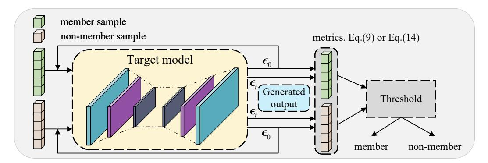
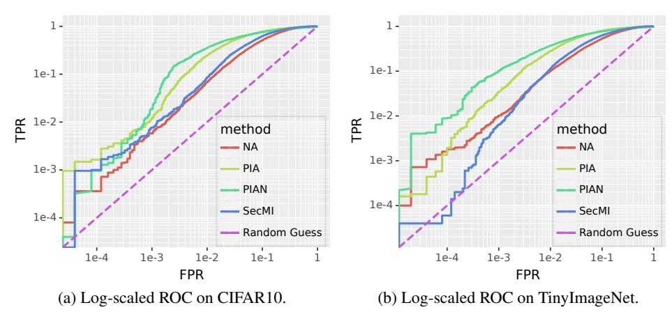

# 近邻初始化驱动的扩散模型高效成员推断攻击
An Efficient Membership Inference Attack for the Diffusion Model by Proximal Initialization

## 文献信息

- 英文标题：An Efficient Membership Inference Attack for the Diffusion Model by Proximal Initialization
- 中文标题：近邻初始化驱动的扩散模型高效成员推断攻击
- 作者：Fei Kong，Jinhao Duan，Ruipeng Ma，Hengtao Shen，Xiaofeng Zhu，Xiaoshuang Shi，Kaidi Xu
- 发表 venue / year / version：ICLR 2024，OpenReview conference version
- 论文主问题：在只能访问扩散模型中间噪声相关输出的灰盒场景下，能否把成员推断的查询成本压到常数级，同时保持对成员与非成员的稳定区分
- 威胁模型类别：灰盒查询式成员推断攻击
- 本地 PDF 路径：`D:/Code/DiffAudit/Research/references/materials/gray-box/2024-iclr-pia-proximal-initialization.pdf`
- GitHub PDF 链接：[2024-iclr-pia-proximal-initialization.pdf](https://github.com/DeliciousBuding/DiffAudit-Research/blob/main/references/materials/gray-box/2024-iclr-pia-proximal-initialization.pdf)
- OCR 精修版链接：[OCR精修版：An Efficient Membership Inference Attack for the Diffusion Model by Proximal Initialization](https://www.feishu.cn/docx/CVdhdm80qocjBPxNi87cwhARnuf)
- 飞书原生 PDF：[2024-iclr-pia-proximal-initialization.pdf](https://ncn24qi9j5mt.feishu.cn/file/OALubF47DoG7UCxgFohcMwD6nDe)
- 开源实现：[kong13661/PIA](https://github.com/kong13661/PIA)
- 报告状态：已完成

## 1. 论文定位

这篇论文处在 DiffAudit 灰盒路线的主干位置。它延续 `SecMI` 对扩散模型中间时间步信号的利用思路，但不再通过多轮迭代逼近某个确定性中间点，而是直接把模型在 `t=0` 的输出当作 proximal initialization，再在目标时刻 `t` 做第二次查询。论文真正要解决的不是“有没有成员信号”，而是“能否用更低 query budget 抽出同样强甚至更强的成员信号”。

从路线角色看，`PIA` 更像 `SecMI` 之后的工程化推进版本：访问假设仍然偏强，但执行链显著更短，因而更适合作为仓库里灰盒默认基线或运行探针的落地点。

## 2. 核心问题

论文集中回答三个相互关联的问题。第一，在扩散模型成员推断里，能否把 `SecMI` 那类多次查询、多步回推的方法缩减成两次查询。第二，这种低查询攻击能否同时覆盖离散时间扩散模型和连续时间扩散模型。第三，音频扩散模型是否也暴露类似的成员信号，尤其是 mel-spectrogram 输出和 waveform 输出之间是否存在鲁棒性差异。

作者给出的回答是肯定的，但带有清晰边界：只要攻击者能读到 `t=0` 与目标时刻 `t` 的中间噪声或 score 相关输出，就可以构造一个低成本、低误报区间表现更强的统计量。

## 3. 威胁模型与前提

攻击者持有待测样本 `x_0`，能够查询目标模型在 `t=0` 和某个攻击时刻 `t` 的噪声预测或 score 输出，但拿不到模型权重、梯度和训练过程，因此不是白盒攻击。论文结论依赖三个前提：其一，服务接口必须暴露中间输出；其二，攻击者需要知道扩散调度或连续时间动力学中的必要系数；其三，阈值 `\tau` 的选取通常仍要借助成员 / 留出划分或 surrogate model 做校准。

这也意味着论文结果不能直接外推到只返回最终图像的严格黑盒 API。它证明的是灰盒接口上的可分性，而不是所有扩散服务都天然存在同等强度的成员泄露。

## 4. 方法总览

`PIA` 的直觉来自 DDIM 的确定性轨迹。若在 `\sigma_t=0` 的条件下知道原样本 `x_0` 和轨迹上的任一点 `x_k`，就能恢复整条 trajectory。作者因此不再像 `SecMI` 那样费力求 `x_k`，而是直接取最接近原样本的 `k=0`，把模型在 `t=0` 的预测 `\epsilon_\theta(x_0,0)` 当作近邻初始化，先合成时刻 `t` 的点 `x_t`，再做第二次查询比较两次预测的一致性。

这种改动把攻击从“迭代回推轨迹”改成“用第一次查询构造 groundtruth trajectory，再用第二次查询做对照”，从而把核心成本压缩为两次查询。`PIAN` 只是对第一次得到的 `\epsilon_\theta(x_0,0)` 做归一化，试图让它更接近标准高斯尺度。

这张图最有价值的地方在于，它把论文的核心替换动作直接画清楚了：第一次查询不再只是取 loss，而是生成一个可重复利用的 proximal initialization；第二次查询则在由该初始化构造出的 `x_t` 上验证轨迹一致性。

## 5. 方法概览 / 流程

如果只看主线，`PIA` 的流程比 `SecMI` 更接近一个可直接接入工程的双查询统计器。真正需要调的超参数主要只有攻击时间步 `t`、范数阶数 `p` 和阈值 `\tau`。

## 6. 关键技术细节

离散时间部分的技术起点是 DDIM 轨迹可由两点确定。若已知 `x_0` 和任意中间点 `x_k`，则可恢复任意时刻 `x_t`：

$$
x_t=\sqrt{\bar{\alpha}_t}x_0+\sqrt{1-\bar{\alpha}_t}\cdot\frac{x_k-\sqrt{\bar{\alpha}_k}x_0}{\sqrt{1-\bar{\alpha}_k}}.
$$

论文的关键决策是把 `k` 直接取为 `0`。因为 `\bar{\alpha}_0` 非常接近 `1`，模型在 `t=0` 的输出 `\epsilon_\theta(x_0,0)` 可以被当作一个足够近的噪声近似，从而省掉迭代求解中间点的成本。

在此基础上，离散时间攻击统计量被化简为：

$$
R_{t,p}=
\left\|
\epsilon_{\theta}(x_0,0)-
\epsilon_{\theta}\!\left(
\sqrt{\bar{\alpha}_t}x_0+\sqrt{1-\bar{\alpha}_t}\epsilon_{\theta}(x_0,0),\, t
\right)
\right\|_p.
$$

这个式子的含义很直接：如果样本是成员，那么模型在 `t=0` 拿到的 proximal initialization 与在 `t` 时刻重新预测出的噪声更一致，故 `R_{t,p}` 更小。`PIAN` 则进一步做

$$
\hat{\epsilon}_{\theta}(x_0,0)=N\sqrt{\frac{\pi}{2}}\frac{\epsilon_{\theta}(x_0,0)}{\|\epsilon_{\theta}(x_0,0)\|_1},
$$

用 `\ell_1` 尺度把第一次查询结果拉回近似标准高斯。论文后面也承认，这只是启发式归一化，并不保证总是更优。

连续时间版本则把 DDPM 的噪声预测换成 score / drift 形式，最终统计量近似为

$$
R_{t,p}\approx \left\|f_t(x_t)-\frac{1}{2}g_t^2 s_{\theta}(x_t,t)\right\|_p.
$$

因此 `PIA` 的连续时间扩展本质上仍是在比较“根据第一次查询得到的轨迹信息”和“当前时刻模型输出”之间的一致性，只是变量从离散噪声换成了连续动力学项。

## 7. 实验设置

- 数据集：DDPM 使用 CIFAR10、CIFAR100、TinyImageNet；Stable Diffusion 使用 Laion-Aesthetics v2.5+ 与 COCO2017-val；音频侧使用 LJSpeech、VCTK、LibriTTS-lean-100。
- 模型：离散时间包含 DDPM 与 Stable Diffusion v1.5；连续时间包含 Grad-TTS；鲁棒性补充实验包含 DiffWave 与 FastDiff。
- 基线：Naive Attack、SecMI、PIA、PIAN。
- 指标：AUC、`TPR@1%FPR`，正文还讨论了 `TPR@0.1%FPR`。
- 典型设置：DDPM 上 `PIA/PIAN` 取 `t=200`、`\ell_4`；Grad-TTS 上 `PIA` 取 `t=0.3`、`\ell_4`；Stable Diffusion 上 `PIA` 取 `t=500`。

实验的重点不是把所有设定都扫满，而是比较在相近访问条件下，`PIA` 相对 `SecMI` 是否能维持可分性并显著降低查询数。

## 8. 主要结果

论文最强的结果出现在 Grad-TTS 上。`PIA` 在 LJSpeech、VCTK、LibriTTS 上分别达到 `99.6`、`87.8`、`95.4` 的 AUC，`TPR@1%FPR` 分别为 `94.2`、`20.6`、`30.0`；`PIAN` 在同一设置下还把 LibriTTS 的 `TPR@1%FPR` 提升到 `44.7`。作者据此强调，查询数只有 `1+1` 的前提下，`PIA/PIAN` 在低误报区间往往优于 `SecMI`。

DDPM 上的结论更适合作为灰盒主线证据。以 CIFAR100 为例，`PIA` 的 `AUC=89.4`、`TPR@1%FPR=19.6`，相比 `SecMI` 的 `87.6/11.1` 明显更强；`PIAN` 在 CIFAR10 和 TinyImageNet 上也把 `TPR@1%FPR` 提高到 `31.2` 和 `32.8`。Stable Diffusion 上 `PIA` 仍优于 `SecMI`，但 `PIAN` 退化明显，说明归一化启发式并不能直接迁移到 latent diffusion。

这张对数尺度 ROC 图的价值不在于补充更多均值，而在于直接展示 `PIA` 在低 FPR 区域相对 Naive Attack 和 `SecMI` 的优势。对 DiffAudit 来说，这比单纯报一个 AUC 更接近真实审计场景。

## 9. 优点

- 只需两次查询就能完成攻击，明显降低了灰盒成员推断的执行成本。
- 同时覆盖离散时间与连续时间扩散模型，方法叙事完整度高于只适用于 DDPM 的工作。
- 结果不只看 AUC，而是明确强调 `TPR@1%FPR`，更贴近审计产品对低误报的需求。
- 把音频扩散模型纳入成员推断讨论，并区分 mel-spectrogram 输出和 waveform 输出的风险差异。

## 10. 局限与有效性威胁

- 访问假设偏强，要求暴露 `t=0` 和 `t` 的中间噪声或 score 输出，不能直接套到严格黑盒 API。
- 连续时间推导含近似项，统计量更像工程可用近似，而非严格最优检验。
- `PIAN` 的归一化缺乏强理论保证，并已在 Stable Diffusion 上表现出退化。
- 音频模型“更鲁棒”的结论主要来自成员推断表现，尚未被更深入的机制分析充分支撑。

## 11. 对 DiffAudit 的价值

这篇论文对 DiffAudit 的价值非常直接。它可以作为当前灰盒路线里成本最低、最容易工程化的主力 baseline，与 `SecMI` 形成一组非常清晰的对照：两者都依赖中间输出，但 `PIA` 在实现链和查询预算上更轻。仓库当前也已经存在对应的 `pia` 计划器与探针代码，这使它不只是文献材料，而是与现有实现状态直接对齐的路线文档。

从叙事层面看，`PIA` 还提供了一个很好的“灰盒上界”位置。后续若要把灰盒结果与真正黑盒路线并排解释，`PIA` 可以代表中间输出可见时的低成本强基线。

## 12. 关键图使用方式

- 方法图放在“方法总览”之后，用来解释 `PIA` 与 `SecMI` 的根本区别，即第一次查询产物会被重用为 proximal initialization，而不是仅仅参与一次 loss 计算。
- 结果图放在“主要结果”之后，用来支撑论文真正重要的结论：`PIA` 的优势集中体现在低误报区间，而不只是平均 AUC。

## 13. 复现评估

忠实复现 `PIA` 需要目标模型权重、成员 / 留出划分、可访问 `t=0` 与目标时刻 `t` 中间输出的推理接口，以及阈值标定流程。对当前仓库而言，`src/diffaudit/attacks/pia.py` 已提供 DDPM 侧的计划与资产探测逻辑，`tests/test_pia_adapter.py` 也覆盖了 runtime probe 与 synthetic smoke，这说明图像 DDPM 的最短链路已经有工程抓手。

真正的结构性阻塞主要在论文矩阵之外：Grad-TTS、DiffWave、FastDiff 与 Stable Diffusion 的完整实验资产尚未在仓库里呈现；真实 member split、文本条件处理和连续时间接口也还没有被统一进现有实验脚手架。因此，当前更合理的定位是“仓库已具备 PIA 主线入口，但尚未覆盖论文全量复现”。

## 14. 写回总索引用摘要

这篇论文研究扩散模型上的灰盒成员推断，核心问题是在攻击者看不到模型参数、但能访问 `t=0` 与目标时刻 `t` 的中间输出时，能否以常数级查询判断样本是否属于训练集。

作者提出 `PIA` 与 `PIAN`。其关键做法是把模型在 `t=0` 的输出当作 proximal initialization，用它构造 groundtruth trajectory，再与时刻 `t` 的预测结果做 `\ell_p` 距离比较。实验表明，该方法在 DDPM、Stable Diffusion 与 Grad-TTS 上通常达到与 `SecMI` 相当或更高的 AUC，并在 `TPR@1%FPR` 上更优，同时只需两次查询。

它对 DiffAudit 的价值在于提供了一条更低成本、更易工程化的灰盒主线。当前仓库已经有 `pia` 的计划器、探针和 smoke 流程，因此这篇论文既是方法学基线，也能直接服务后续实验接入与产品叙事。
