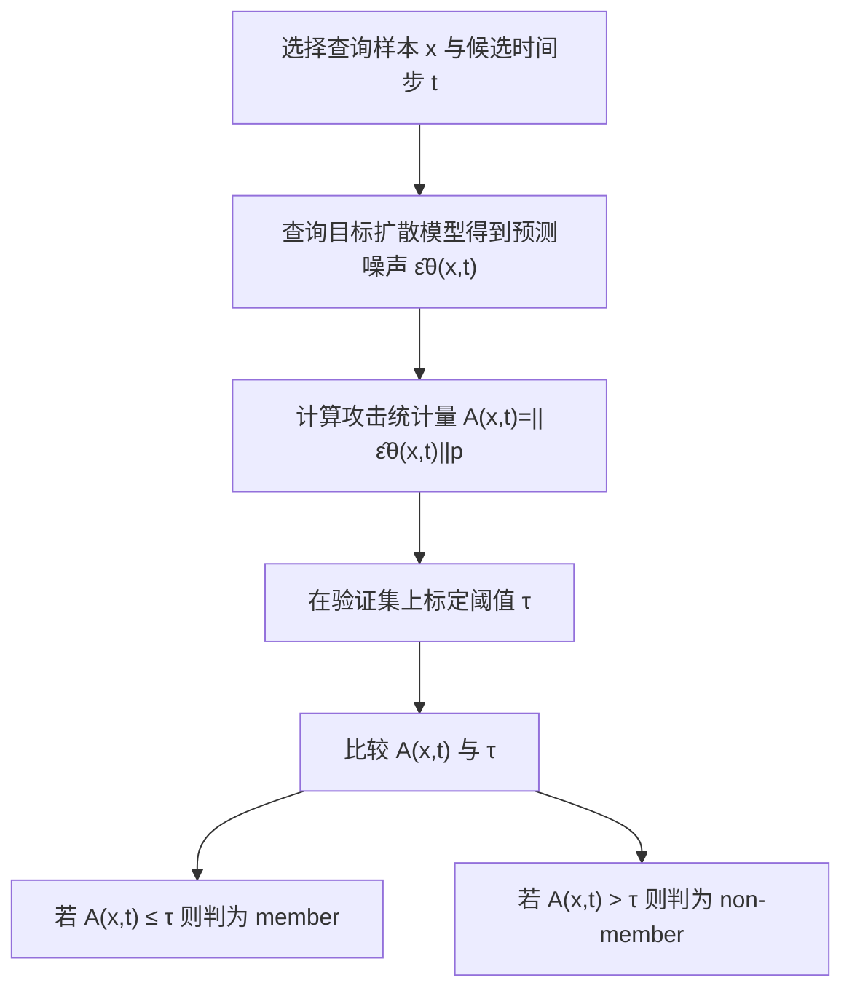

# SCORE-BASED MEMBERSHIP INFERENCE ON DIFFUSION MODELS

- Title: SCORE-BASED MEMBERSHIP INFERENCE ON DIFFUSION MODELS
- Material Path: D:/Code/DiffAudit/Project/references/materials/gray-box/2025-arxiv-sima-score-based-membership-inference-diffusion-models.pdf
- Primary Track: gray-box
- Venue / Year: arXiv preprint, 2025; examined PDF version is arXiv:2509.25003v1
- Threat Model Category: gray-box membership inference attack on diffusion models with model access and controlled queries
- Core Task: infer whether a query image was in diffusion model training data by scoring the norm of predicted noise across timesteps
- Open-Source Implementation: official code/data release is stated in the PDF and points to https://github.com/mx-ethan-rao/SimA
- Report Status: done

## Executive Summary

这篇论文研究扩散模型成员推断攻击中的一个更基础问题：预测噪声向量本身是否已经足以泄露训练成员身份。作者把注意力集中到扩散模型输出的 score 或 denoiser 上，主张当查询样本靠近训练样本时，模型预测噪声的范数会更小；当样本只是同分布但未进训练集时，这个范数通常会更大。论文据此提出单次查询攻击 SimA，用一个简单的标量统计量代替既有方法中多次采样、多步比较或更复杂的组合打分。

方法贡献主要有两层。第一层是理论层：作者把高斯平滑后的数据分布、score 函数、以及有限训练集上的局部核均值联系起来，说明成员样本在小到中等扩散步上会让局部均值塌缩回自身，从而使预测噪声范数趋近于零。第二层是经验层：作者将这一观点落实为 $A(x,t)=\lVert \hat{\epsilon}_\theta(x,t)\rVert_p$，并在 DDPM、Guided Diffusion、LDM 和 Stable Diffusion 上与 PIA、PFAMI、SecMI、Loss 等基线比较。

论文的主结论对 DiffAudit 有直接价值。一方面，SimA 说明 gray-box 条件下不一定需要复杂攻击流程，单查询 score 范数就能构成强基线，尤其适合整理 route 时作为“最短路径”方法。另一方面，作者同时发现 LDM 相比像素空间 DDPM 明显更难被这一类攻击击穿，并把差异归因到潜变量 VAE 的信息瓶颈，而不是扩散过程本身。这使该文不仅是一个攻击方法论文，也是解释不同扩散架构泄露差异的重要证据。

## Bibliographic Record

- Title: SCORE-BASED MEMBERSHIP INFERENCE ON DIFFUSION MODELS
- Authors: Mingxing Rao, Bowen Qu, Daniel Moyer
- Venue / year / version: arXiv preprint, 2025, examined version arXiv:2509.25003v1
- Local PDF path: D:/Code/DiffAudit/Project/references/materials/gray-box/2025-arxiv-sima-score-based-membership-inference-diffusion-models.pdf
- Source URL: https://arxiv.org/abs/2509.25003

## Research Question

论文试图回答两个相互关联的问题。第一，在扩散模型的 gray-box 成员推断场景下，攻击者是否可以仅依赖模型输出的预测噪声或 score 统计量，稳定地区分训练成员与非成员。第二，如果该统计量有效，它所利用的究竟是“训练记忆导致局部 denoising 更精确”这一几何现象，还是某种特定模型架构或特定基线技巧带来的偶然优势。论文默认的部署设定是攻击者能够访问目标模型并对指定样本在指定扩散步上做前向查询，但不需要重新训练辅助分类器，也不需要生成大量 Monte Carlo 样本。

## Problem Setting and Assumptions

- Access model: gray-box; attacker can access the target diffusion model and evaluate $\hat{\epsilon}_\theta(x,t)$ on chosen queries and timesteps.
- Available inputs: query image $x$, diffusion timestep $t$, target model weights or equivalent internal query access, and a calibration split for threshold selection.
- Available outputs: predicted noise vectors, derived norm scores, and a binary membership decision after thresholding.
- Required priors or side information: balanced member and held-out validation data for threshold calibration; knowledge of the model's diffusion-time interface.
- Scope limits: the main theory is derived for in-distribution points and finite-sample empirical distributions; OOD regions and extremely early or late timesteps are explicitly treated as unstable.

## Method Overview

作者把攻击量设计得非常直接。给定样本 $x$ 和扩散步 $t$，先查询模型得到预测噪声 $\hat{\epsilon}_\theta(x,t)$，再计算其范数作为攻击分数。直觉是，成员样本在训练集中真实出现过，因此其局部核均值会在小尺度平滑下更接近自身；模型在这类点上的 denoising 目标接近零，故分数更小。非成员即便来自同一分布，也通常位于某个训练样本之间的局部空洞里，局部均值不再等于自身，于是分数更大。

具体决策流程是，先在验证集上为某个时间步 $t$ 选择阈值 $\tau$，再对测试样本计算 $A(x,t)$ 并比较是否低于阈值。论文并不要求跨多个时间步聚合，尽管作者也分析了时间步选择对效果的影响。实验上，他们发现过早时间步会因低密度区域的 score 外推而不稳定，过晚时间步则因高斯平滑过强而让成员与非成员一起向全局均值塌缩，因此最佳区间通常落在中早期步长，例如文中反复提到的 $t \in [10,300]$。

与既有方法相比，SimA 的差异不在于用了全新信号，而在于把多种已有攻击统一解释成“对 denoiser 行为的不同近似测量”。Matsumoto 等人的 Loss、Fu 等人的 PFAMI、Duan 等人的 SecMI、以及 Kong 等人的 PIA 都可以被视为在不同噪声采样或时间扰动下间接估计同一泄露机制；SimA 则退回到最直接的 $\epsilon=0$ 情形，用最少查询数抽取同类信号。

## Method Flow

## Key Technical Details

论文的核心定义就是单点单步攻击统计量：

$$
A(x,t)=\left\|\hat{\epsilon}_\theta(x,t)\right\|_p.
$$

作者先从 VP forward process 出发，将带噪分布写成对原始数据分布的高斯卷积：

$$
x_t=\sqrt{\bar{\alpha}_t}\,x_0+\sigma_t\epsilon,\quad \epsilon\sim\mathcal{N}(0,I),
$$

$$
p_t(x)=\int p_{\mathrm{data}}(x_0)\,\mathcal{N}\!\left(x\,\middle|\,\sqrt{\bar{\alpha}_t}x_0,\sigma_t^2 I\right)\,dx_0.
$$

在此基础上，score 与 denoising mean 的关系被写成

$$
s_t(x)=\nabla_x\log p_t(x)=-\frac{x-\sqrt{\bar{\alpha}_t}\,\mu_t(x)}{\sigma_t^2},
\qquad
\hat{\epsilon}_\theta(x,t)\approx \frac{x-\sqrt{\bar{\alpha}_t}\,\mu_t(x)}{\sigma_t}
=-\sigma_t\nabla_x\log p_t(x).
$$

有限训练集情形下，$\mu_t(x)$ 被近似为训练样本的核加权均值：

$$
\mu_t^{\mathrm{finite}}(x)=\sum_{i=1}^{N} w_i(x,t)x_0^{(i)},\qquad
w_i(x,t)=\operatorname{softmax}_i\!\left(-\frac{\|x-\sqrt{\bar{\alpha}_t}x_0^{(i)}\|_2^2}{2\sigma_t^2}\right).
$$

这一步是整个理论链条的关键。若 $x=x^{(k)}$ 本身就是训练成员，则当 $t\to 0$ 时，对应权重会塌缩到第 $k$ 个训练样本，进而使 $\mu_t^{\mathrm{finite}}(x^{(k)})\to x^{(k)}$，$\hat{\epsilon}_\theta(x^{(k)},t)\to 0$。若 $x^\dagger$ 只是同流形上的 held-out 点，局部核均值通常不再等于该点本身，作者借助 local moment matching 给出 $m_r(x^\dagger)-x^\dagger$ 与 $\hat{\epsilon}_\theta(x^\dagger,t)$ 近似成比例的关系，从而解释非成员分数为何保持非零。文中还指出 $\ell_p$ 范数中除 $p=2$ 外的其他选项有时会略好，但主结论不依赖这一技巧。

## Experimental Setup

- Datasets: CIFAR-10, CIFAR-100, STL10-U, CelebA, ImageNet-1K vs ImageNetV2, plus Stable Diffusion experiments on Pokemon, COCO2017-Val, Flickr30k, LAION-Aesthetics v2 5+ and LAION-2B-MultiTranslated.
- Model families: vanilla DDPM trained from scratch on small datasets; publicly released Guided Diffusion on ImageNet-1K; LDM on ImageNet; Stable Diffusion v1-4 and v1-5 in appendix experiments.
- Baselines: PIA, PFAMIMet, SecMIstat, Loss; the authors intentionally evaluate statistic-based variants rather than auxiliary neural classifiers.
- Metrics: ASR, AUC, TPR@1%FPR, and number of queries.
- Evaluation conditions: 15 member-held-out experiments across 11 datasets; ImageNet experiments use 3,000 member and 3,000 held-out samples; Stable Diffusion experiments include both fine-tuning and pre-training settings with conditional and unconditional variants where applicable.

## Main Results

论文报告 SimA 在像素空间扩散模型上总体达到或逼近最优结果。对 DDPM，SimA 在 CIFAR-10、CIFAR-100、STL10-U、CelebA 上分别取得 90.45、89.85、96.34、82.85 的 AUC；其中 STL10-U 上与 PIA 的 AUC 同为 96.34，但 SimA 的 TPR@1%FPR 更高，为 72.75。对 Guided Diffusion 的 ImageNet-1K 实验，SimA 的 AUC 为 89.77，明显高于 PIA 的 66.44、PFAMIMet 的 72.22、SecMIstat 的 82.55 和 Loss 的 60.38，同时查询数仅为 1。

更值得注意的是负结果。对 ImageNet 上的 LDM，同样的攻击族整体失效，SimA AUC 仅为 56.14，其他方法也大多接近随机水平。作者进一步通过控制 CIFAR-10 上 VAE 的 $\beta$-VAE 正则化强度，显示 MIA 性能会随信息瓶颈增大而下降，而 FID 在较长区间内并未同步显著恶化。当前报告据此推断，该文最重要的经验发现并不只是“SimA 强”，而是“latent bottleneck 可能系统性削弱这类 score-based MIA”。

关于时间步，作者给出的附录分析也值得保留。极早时间步因低密度区 score 外推不稳，会削弱非成员分数；极晚时间步因平滑过强，成员与非成员同时向各向同性高斯塌缩，成员信号消失。因此最佳攻击区间是数据依赖的，文中经验上集中在中早期步。这一结论意味着复现时若只测单个任意时间步，可能会低估或高估方法本身。

## Strengths

- 理论与经验闭环较完整，把 score、局部核均值、成员推断分数统一到同一推导链条中。
- 攻击定义极简，单查询即可得到强结果，便于作为 gray-box 审计基线。
- 实验覆盖 DDPM、Guided Diffusion、LDM 与 Stable Diffusion，既有正结果也有重要负结果。
- 对 LDM 脆弱性下降给出机制性假设，并通过调节 VAE 正则化进行受控验证，而不是只停留在现象描述。

## Limitations and Validity Threats

- 论文虽然归入 gray-box 路线，但仍假定可直接访问模型内部 denoiser 接口；对仅有最终采样 API 的更弱黑盒环境并不适用。
- 阈值选择依赖带标签的验证划分，真实攻击部署中这一校准先验未必总能稳定获得。
- 对时间步最优区间的选择具有显著数据依赖性，若换用不同噪声日程、分辨率或架构，最佳设置可能迁移失败。
- LDM 鲁棒性的解释目前仍是经验性推断。论文认为问题更可能出在 VAE 信息瓶颈，但未给出严格因果隔离，也未解决“如何对潜空间逆向恢复成员信息”这一更深层问题。
- 表中部分最优项与次优项差距并不大，例如 DDPM 某些数据集上 SimA 与已有方法接近，因此不应把该文解读为在所有设定下压倒性领先。

## Reproducibility Assessment

忠实复现 SimA 所需资产并不复杂：目标扩散模型、成员与 held-out 划分、对任意时间步查询 $\hat{\epsilon}_\theta(x,t)$ 的接口、以及阈值校准和 ROC 评测代码。论文还公开声明提供数据划分、模型检查点、训练和测试脚本，并给出了 GitHub 仓库，因此从“最短路径复现”角度看，它比很多需要辅助分类器或多查询采样的 MIA 更友好。

但阻塞点依然存在。首先，最佳时间步与范数选择具有显著经验性，需要逐模型重做扫描。其次，LDM 和 Stable Diffusion 路线不仅受扩散模型影响，还受潜变量编码器与预训练数据分布影响，复现实验必须同时固定 VAE、采样分辨率和 member-held-out 方案。就当前 DiffAudit 仓库而言，已经有 gray-box 报告模板与相邻论文资产，但尚未看到专门针对 SimA 的实验脚手架或结果缓存；因此它适合作为理论与基线文献优先补档，而不是立刻假设仓库已具备一键复现条件。

## Relevance to DiffAudit

这篇论文对 DiffAudit 的价值主要在于基线收敛。若需要为 gray-box 路线建立一条最容易落地、又能与既有方法公平比较的成员推断主线，SimA 提供了非常强的候选方案，因为它把攻击核心压缩成可解释、可扫描、可单查询评估的 score 范数统计量。对后续路线图而言，这有助于区分“方法复杂”与“信号本身有效”两个层次。

更进一步，这篇论文提供了一个重要分叉点。它表明像素空间扩散模型与潜空间扩散模型在成员泄露上的机制可能不同，后续 DiffAudit 若继续扩展到 Stable Diffusion 或其他 latent 模型，不能默认 DDPM 结论自动迁移。换言之，该文既是 gray-box 成员推断的简洁基线，也是后续将 gray-box 路线拆分为 pixel-space 与 latent-space 两类审计叙事的重要依据。

## Recommended Figure

- Figure page: 9
- Crop box or note: cropped Figure 3 region with `--clip 55 45 505 216`; a clean figure-only crop was feasible, so no full-page fallback was needed
- Why this figure matters: Figure 3 simultaneously shows the paper's two most decision-relevant findings, namely that score-based MIA performs much better on DDPM than on LDM under matched ImageNet splits, and that increasing the VAE bottleneck can suppress MIA AUC without immediately destroying FID
- Local asset path: ../assets/gray-box/2025-arxiv-sima-score-based-membership-inference-diffusion-models-key-figure-p9.png

## Extracted Summary for `paper-index.md`

这篇论文研究扩散模型的成员推断攻击，核心问题是攻击者能否仅通过模型对查询样本输出的预测噪声来判断该样本是否属于训练集。作者将目标限定在 gray-box 场景，即攻击者可以访问模型并在给定时间步上读取 denoiser 输出，但不依赖复杂辅助分类器或大量重复查询。

论文提出 SimA，将攻击统计量定义为预测噪声范数 $A(x,t)=\lVert \hat{\epsilon}_\theta(x,t)\rVert_p$，并用高斯卷积后的数据分布、score 函数与有限训练集局部核均值之间的关系解释其有效性。实验表明，SimA 在 DDPM 和 Guided Diffusion 上通常达到或超过既有基线，同时只需单次查询；但在 LDM 与部分 Stable Diffusion 设定上，该类方法整体退化到接近随机，说明潜变量瓶颈显著改变了泄露机制。

对 DiffAudit 而言，这篇论文一方面提供了一个可解释、低查询成本、适合做 gray-box 基线的成员推断方法，另一方面也明确提示 pixel-space 与 latent-space 扩散模型不应被放在同一泄露假设下分析。它既能支撑当前 gray-box 主线的最短路径实现，也能为后续将审计路线拆分到 LDM/Stable Diffusion 提供机制证据。
