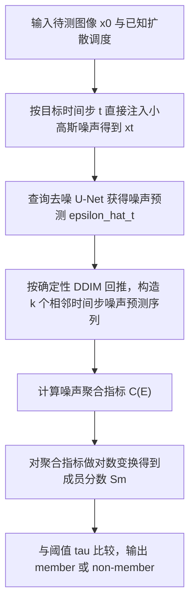
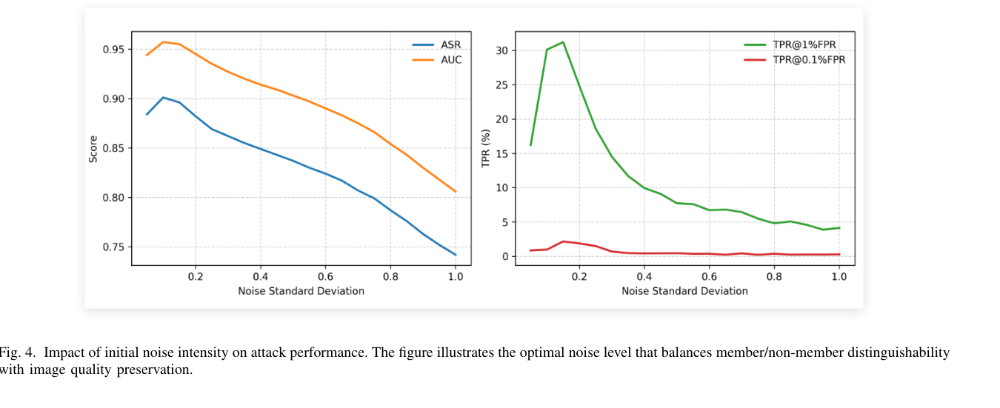

# Noise Aggregation Analysis Driven by Small-Noise Injection: Efficient Membership Inference for Diffusion Models

- Title: Noise Aggregation Analysis Driven by Small-Noise Injection: Efficient Membership Inference for Diffusion Models
- Material Path: `D:/Code/DiffAudit/Research/references/materials/gray-box/2025-arxiv-small-noise-injection-membership-inference-diffusion-models.pdf`
- Primary Track: gray-box
- Venue / Year: arXiv / 2025
- Threat Model Category: Gray-box membership inference against diffusion models
- Core Task: 通过小噪声注入与跨时间步噪声聚合度分析推断样本是否属于扩散模型训练集
- Open-Source Implementation: 论文正文未给出公开代码仓库
- Report Status: complete

## Executive Summary

该文研究扩散模型的成员推断攻击，目标是在不直接读取参数的前提下，判断给定图像是否出现在训练集中。作者指出，现有扩散模型成员推断方法要么直接迁移自其他生成模型、效果有限，要么依赖较长的 DDIM 采样链，导致查询成本偏高。论文提出的核心思想是：向待测图像注入幅度很小的高斯噪声，然后观察模型在若干相邻时间步上的噪声预测是否呈现更强聚合。作者假设成员样本由于在训练中被反复优化，其噪声预测在局部时间邻域内更稳定、更集中，非成员样本则更分散。

方法上，论文将前向扩散的多步加噪等价改写为对原图一次性注入目标时间步对应方差的噪声，从而避免传统方法为达到目标时间步而进行多次模型访问。随后，攻击者在时间步 $t$ 处得到噪声预测，基于确定性 DDIM 思路向前回推，构造 $k$ 个相邻时间步的噪声向量，再用 L1、L2、质心距离、平均密度或凸包体积等聚合指标计算成员分数。论文将这一策略称为 small-noise injection driven noise aggregation analysis。

实验结果表明，该方法在 DDPM 场景下相对于 GAN-Leaks、NaiveLoss 和 SecMI 取得更高的 ASR 与 AUC，同时把查询次数压缩到 5 次。在 CIFAR-10 上，作者报告 ASR 0.901、AUC 0.957、TPR@1%FPR 28.7，高于 SecMI 的 0.811、0.881 与 9.11。对 Stable Diffusion v1.4/v1.5，论文报告其 ASR 与 AUC 仍优于对比方法，但 TPR@1%FPR 明显落后于 NaiveLoss，说明该方法在 latent diffusion 大模型上的收益并不全面。对 DiffAudit 而言，这篇论文的价值不在于给出完全成熟的结论，而在于提供了一条更明确的 gray-box 路线：把“成员性”转化为局部时间邻域上的噪声一致性度量，并把查询效率作为攻击设计目标。

## Bibliographic Record

- Title: Noise Aggregation Analysis Driven by Small-Noise Injection: Efficient Membership Inference for Diffusion Models
- Authors: Guo Li, Yuyang Yu, Xuemiao Xu
- Venue / year / version: arXiv, 2025, arXiv:2510.21783v1
- Local PDF path: `D:/Code/DiffAudit/Research/references/materials/gray-box/2025-arxiv-small-noise-injection-membership-inference-diffusion-models.pdf`
- Source URL if known: `https://arxiv.org/abs/2510.21783`

## Research Question

论文试图回答的问题是：在扩散模型场景下，是否可以仅通过较少次数的模型查询，基于待测样本在局部扩散时间步上的噪声预测一致性，对其训练集成员身份做出有效推断。与更早依赖重建误差、似然或长链 DDIM 轨迹的方法不同，本文将攻击信号聚焦在“轻微扰动后，噪声预测是否在相邻时间步保持高度聚合”。

论文默认的威胁模型并非纯黑盒。攻击者不读取模型参数，但需要向目标扩散模型查询指定时间步的噪声预测，并知道扩散调度、时间步设置及 DDIM 风格的确定性回推过程。因此，更准确地说，这是针对扩散模型去噪接口的 gray-box 成员推断，而不是只观察最终生成图片或 API 文本返回值的输出级攻击。

## Problem Setting and Assumptions

访问模型方面，攻击者可对目标扩散模型的去噪网络进行查询，获得给定图像在指定时间步的噪声预测。论文没有要求白盒梯度或参数访问，但这一访问能力已经强于常见的输出级黑盒设置。

可用输入包括待测原始图像 $x_0$、扩散步数设置、噪声调度参数以及用于构造邻域轨迹的步长 $m$ 和采样数量 $k$。在 Stable Diffusion 实验中，论文还隐含假设攻击者能稳定复现 VAE 编码和 latent diffusion 推理流程，否则无法得到与文中一致的噪声预测序列。

可用输出是多个时间步上的噪声向量 $\hat{\epsilon}_{t}, \hat{\epsilon}_{t-m}, \hat{\epsilon}_{t-2m}, \dots$。所需先验包括：了解 DDPM/DDIM 的前向与反向公式；接受“成员样本噪声预测更稳定”这一经验假设；并能对成员与非成员分别构造阈值评估。论文的适用范围限于图像扩散模型，且对 latent diffusion 的有效性弱于标准 DDPM。

## Method Overview

作者的方法分为三个阶段。第一阶段是小噪声注入。不是通过完整的前向扩散链把样本逐步推到时间步 $t$，而是利用前向扩散的闭式形式，直接向原图注入与目标时间步对应的高斯噪声，得到 $x_t$。作者认为，当噪声标准差较小时，图像主结构被保留，成员样本更容易触发模型训练期间形成的稳定噪声响应。

第二阶段是迭代去噪预测。攻击者将 $x_t$ 输入去噪 U-Net，得到时间步 $t$ 的噪声预测，再以确定性 DDIM 形式估计 $\hat{x}_0$ 并向前回推到 $t-m, t-2m, \dots$。这样得到的并不是完整重建图像序列，而是一个相邻时间步噪声预测序列。论文的关键主张是，成员样本在这一局部序列中的噪声向量更集中，非成员样本更分散。

第三阶段是聚合度量与阈值决策。作者对噪声向量集合 $E$ 计算聚合指标 $C(E)$，再通过对数变换得到成员分数 $S_m$。如果一个样本在相邻时间步上的噪声预测更紧凑，其聚合度量更小、成员分数更高，更可能被判定为成员。论文同时比较了多种聚合指标，最终默认采用 L2 average distance。

## Method Flow

## Key Technical Details

论文最关键的技术点是把“多步到达目标时间步”改写成“一步直接注入相应方差的噪声”。这使攻击不再依赖长链采样路径，而转化为对局部时间邻域的一致性测量。该设计减少查询次数，也强化了一个非常具体的信号源：成员样本在轻微扰动下的噪声预测更集中。

前向扩散的闭式表达是方法成立的数学基础：

$$
x_t = \sqrt{\bar{\alpha}_t}\, x_0 + \sqrt{1-\bar{\alpha}_t}\, \epsilon, \quad \epsilon \sim \mathcal{N}(0, I).
$$

在得到噪声序列 $E=\{\hat{\epsilon}_{t-im}\}_{i=0}^{k-1}$ 后，论文用聚合度量定义成员分数：

$$
S_m = -\log\!\left(C(E)+\delta\right).
$$

作者还给出一个信息论层面的解释，即成员样本对应的条件噪声预测熵更低：

$$
H(\epsilon \mid x_{\mathrm{member}}) < H(\epsilon \mid x_{\mathrm{nonmember}}).
$$

从实现角度看，论文默认的最佳设置包括时间步范围 $T \in [50,150]$、噪声标准差 $\sigma \approx 0.1$、采样数量 $k=5$、DDIM 邻域步长 $m=10$。这些参数不是理论推出，而是实验经验。论文比较了 L1、L2、质心距离、平均密度和凸包体积等聚合指标，并声称除凸包体积外其余指标差异不大，但默认选 L2 average distance 以平衡性能与计算开销。

## Experimental Setup

标准扩散模型实验使用 CIFAR-10、CIFAR-100 与 Tiny-ImageNet。作者对每个数据集做 50%/50% 随机划分，前半作为训练成员集，后半作为测试或非成员候选集。训练和超参数设定声称与 SecMI 保持一致，以保证对比公平性。

模型方面，论文主要评估 DDPM，并把扩展实验放到 Stable Diffusion v1.4 与 v1.5。对大模型部分，作者从 LAION-aesthetic-5plus 抽取 1000 张图像作为成员集，从 COCO2017-Val 抽取 1000 张图像作为非成员集。这里没有给出更细的采样控制，例如 prompt 条件、去重策略与数据污染检查，因此这部分实验解释力弱于 DDPM 主实验。

基线包括 GAN-Leaks、NaiveLoss 和 SecMI。评估指标包括 ASR、AUC、TPR@1%FPR 与 TPR@0.1%FPR。论文还做了若干消融：时间步选择、初始噪声强度、聚合度量类型、去噪步数 $k$ 以及 DDIM 采样步长。

## Main Results

在 DDPM 主实验中，论文报告其方法在三个数据集上都优于基线。以 CIFAR-10 为例，作者给出的结果是 Query Times 5、ASR 0.901、AUC 0.957；SecMI 为 12 次查询、ASR 0.811、AUC 0.881；NaiveLoss 虽然只有 1 次查询，但 ASR 和 AUC 仅为 0.663 和 0.718。CIFAR-100 上该方法为 0.839/0.903，Tiny-IN 上为 0.842/0.912，均高于论文列出的对比方法。

在低误报率指标上，结果更具选择性。论文报告的 CIFAR-10 TPR@1%FPR 从 SecMI 的 9.11 提升到 28.7，提升幅度很大；但在 CIFAR-100 上仅从 9.26 提升到 9.65，在 Tiny-IN 上从 12.67 提升到 14.58，增益明显收缩。这说明方法对不同数据复杂度的稳健性并不一致，最强证据主要来自 CIFAR-10。

消融结果支持“小噪声而非大噪声”的核心叙事。Figure 4 显示噪声标准差从较小值增加到约 0.1 左右时，ASR、AUC 与 TPR@1%FPR 达到峰值，之后随噪声增强而下降。论文据此认为，小噪声既能放大成员与非成员的差异，又不会过度破坏图像语义。另一个关键消融是去噪步数 $k$ 的选择，Table IV 显示 $k=5$ 时效果最好，继续增大反而使聚合关系被拉散。

在 Stable Diffusion v1.4/v1.5 上，结果更应谨慎解读。作者报告其方法的 ASR/AUC 为 0.701/0.652 与 0.696/0.661，高于 GAN-Leaks、NaiveLoss 和 SecMI；但 TPR@1%FPR 只有 8.0 与 8.3，而 NaiveLoss 为 23.7。也就是说，若关注极低误报率场景，这一方法在 latent diffusion 上并未优于更简单的 loss-based 攻击。论文结论中对“大模型可扩展性”的表述因此略显乐观。

## Strengths

论文的第一项实质性优势是把查询成本纳入攻击目标，而不是只追求指标最好。相较 SecMI 的 12 次查询，作者将主实验中的查询次数压到 5 次，同时在 DDPM 上维持更高的 ASR 与 AUC，这一点对实际 gray-box 评估更有意义。

第二项优势是方法结构清晰。攻击信号被明确限定为“相邻时间步噪声预测的聚合程度”，并给出可替换的聚合指标集合。对于 DiffAudit 这类需要整理不同攻击路线的项目，这种可分解的表述比纯经验型启发式更容易归档和复现实验。

第三项优势是作者没有只停留在小模型上，而是至少尝试了 Stable Diffusion 的迁移验证，并对噪声强度、时间步范围、聚合指标和 DDIM 步长做了系统消融。这些结果即便不完全支持其最强主张，也为后续复现提供了参数搜索边界。

## Limitations and Validity Threats

最重要的限制是威胁模型其实偏强。攻击者需要访问去噪网络在特定时间步的噪声预测，这在很多真实部署的图像生成 API 上并不成立。因此，该方法更适合作为研究型 gray-box 分析，而不是现成的在线服务黑盒攻击。

第二个问题是大模型部分的证据不够稳健。论文宣称方法在 Stable Diffusion 上具有可扩展性，但其自身表 5 同时显示，在 TPR@1%FPR 这一更接近安全评估需求的指标上，NaiveLoss 明显更强。论文没有进一步解释阈值校准、VAE 编码误差或数据集异质性是否改变了该比较。

第三个问题是论文写作和符号使用略粗糙。部分公式排版、变量定义和自然语言表述存在不够严谨之处，例如若干符号在正文中复用但未严格界定，且没有给出方差、重复运行或统计显著性分析。代码与精确实验脚本也未公开，降低了结果可复核性。

## Reproducibility Assessment

忠实复现实验至少需要以下资产：DDPM 训练脚本与权重、CIFAR-10/CIFAR-100/Tiny-IN 的成员/非成员划分、扩散调度参数、时间步与步长配置、能输出各时间步噪声预测的 U-Net 推理代码，以及 Stable Diffusion 对应的 VAE 编码和 latent 推理管线。若缺少这些组件，只能做近似复现。

论文未提供公开仓库，因此当前复现将依赖从 SecMI 或其他扩散 MIA 实现出发手工补齐。当前 DiffAudit 仓库已经覆盖扩散模型成员推断的 gray-box 路线与相关论文索引，这意味着该文可以较自然地并入现有路线对比；但“小噪声注入 + 聚合分数”本身仍需要单独实现和调参，不能直接由已有基线脚本替代。

当前最现实的阻塞点有两个。第一，Stable Diffusion 部分需要确认论文所说的查询接口到底作用在像素空间、latent 空间还是混合流程上；第二，阈值设定与成员/非成员采样细节不足，可能导致复现实验出现明显漂移。就现有信息看，DDPM 主实验比大模型实验更适合作为优先复现对象。

## Relevance to DiffAudit

这篇论文与 DiffAudit 的相关性主要体现在方法分层。它不是单纯复述 SecMI，也不是完全新的黑盒攻击，而是把扩散 MIA 进一步细化为“单步小噪声注入 + 局部时间邻域聚合分析”的 gray-box 变体。对于构建 DiffAudit 的路线图，这有助于把扩散模型成员推断拆分为 loss-based、reconstruction-based、posterior-based 与 aggregation-based 几类更清晰的子路线。

从工程价值看，该文最值得跟踪的不是它宣称的全面领先，而是它把查询次数压缩到 5 次这一设计目标。如果 DiffAudit 后续希望比较“攻击成功率 / 查询成本”权衡，这篇论文提供了较好的对照点。特别是在 DDPM 类模型上，它显示局部时间邻域已经足以承载成员信号，不一定需要很长的推理链。

从审慎性角度看，DiffAudit 不应直接把该文视为对大规模文本到图像模型的定论。更稳妥的做法是把它标为 gray-box 主线中的“查询高效但对接口要求较强”的方法，并在后续对 latent diffusion 场景单独记录其低误报率指标不足这一事实。这样既保留论文贡献，也避免把其结论外推过度。

## Recommended Figure

- Figure page: 7
- Crop box or note: `50 55 590 275`
- Why this figure matters: 该图直接展示论文核心假设成立的经验区间，即初始噪声标准差过小不足以放大差异，过大则破坏语义结构，约 `sigma = 0.1` 附近达到最佳平衡。相比流程图，它更能支撑“small-noise injection”是有效攻击信号而非表述包装。
- Local asset path: `../assets/gray-box/2025-arxiv-small-noise-injection-membership-inference-diffusion-models-key-figure-p7.png`

## Extracted Summary for `paper-index.md`

该文研究扩散模型成员推断攻击，核心问题是在不直接读取模型参数的前提下，判断某张图像是否参与过训练。论文针对现有方法查询成本高、对扩散模型适配性有限的问题，提出利用轻微噪声扰动后噪声预测稳定性差异来识别成员与非成员。

作者的方法先用前向扩散闭式形式向原图一次性注入小噪声，再在相邻时间步上提取去噪网络的噪声预测序列，并用 L1/L2 距离、质心距离、密度或凸包体积衡量其聚合程度。论文报告该方法在 DDPM 的 CIFAR-10、CIFAR-100 和 Tiny-ImageNet 上以 5 次查询取得优于 SecMI 的 ASR 和 AUC；但在 Stable Diffusion 上虽然 ASR/AUC 仍有优势，低误报率指标并不占优。

对 DiffAudit 而言，这篇论文的重要性在于它提供了一条清晰的 gray-box aggregation-based 路线，可与 loss-based、posterior-based 扩散 MIA 方法形成直接对照。它尤其适合被记录为“查询效率较高、但需要时间步噪声预测接口且在 latent diffusion 上证据偏弱”的代表工作。
