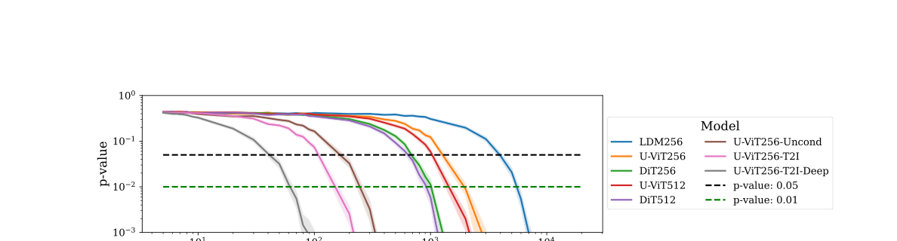

# 扩散模型中的版权数据识别
CDI: Copyrighted Data Identification in Diffusion Models

- 英文标题：CDI: Copyrighted Data Identification in Diffusion Models
- 中文标题：扩散模型中的版权数据识别
- 作者：Jan Dubinski，Antoni Kowalczuk，Franziska Boenisch，Adam Dziedzic
- 发表 venue / year / version：CVPR 2025 conference paper
- 论文主问题：给定一组公开嫌疑作品 `P` 与一组同分布但未公开的对照作品 `U`，能否以统计显著性的形式证明 `P` 曾被用于训练目标扩散模型
- 威胁模型类别：灰盒为主、兼容白盒的数据集级训练数据识别 / 版权审计
- 本地 PDF 路径：`D:\Code\DiffAudit\Research\references\materials\gray-box\2025-cvpr-cdi-copyrighted-data-identification-diffusion-models.pdf`
- GitHub PDF 链接：[2025-cvpr-cdi-copyrighted-data-identification-diffusion-models.pdf](https://github.com/DeliciousBuding/DiffAudit-Research/blob/main/references/materials/gray-box/2025-cvpr-cdi-copyrighted-data-identification-diffusion-models.pdf)
- OCR 精修版链接：[OCR精修版：CDI: Copyrighted Data Identification in Diffusion Models](https://www.feishu.cn/docx/LV94dtKqWo9PNuxtqhxcDRpNnmg)
- 飞书原生 PDF：[2025-cvpr-cdi-copyrighted-data-identification-diffusion-models.pdf](https://ncn24qi9j5mt.feishu.cn/file/Lf4nb8TtmoFg5Dx0PffcQ5pwnXc)
- 开源实现：[sprintml/copyrighted_data_identification](https://github.com/sprintml/copyrighted_data_identification)
- 报告状态：已完成展示稿

## 1. 论文定位

这篇论文不再把问题定义成“单张图像是不是训练成员”，而是把版权审计的最小证据单元提升到“作品集合是否被训练使用”。因此它属于灰盒路线下的集合级训练数据识别论文，主题更接近版权取证与审计证据聚合，而不是传统单样本成员推断。

对 DiffAudit 而言，它不是替代现有灰盒单样本 MIA 的主线论文，而是灰盒路线中“集合级审计 / 证据聚合”子路线的主论文。它解决的是叙事层与证据层的问题：如何把多张可疑作品汇总成一个可解释的显著性结论。

## 2. 核心问题

论文试图回答的技术问题是：当扩散模型不会逐字逐像素复现训练图像时，数据拥有者是否仍能证明“自己的一组作品整体参与了训练”。作者的核心判断是，现有扩散模型 MIA 对单样本的信号过弱，难以直接支撑版权主张，因此需要转向数据集级识别。

更具体地说，论文关心的不是恢复哪一张训练图，也不是证明某一张图一定是成员，而是证明公开嫌疑集合 `P` 的成员性分布显著高于同分布对照集合 `U`。这让输出从单点分数变成了“是否拒绝零假设”的统计审计结论。

## 3. 威胁模型与前提

论文把 CDI 设定为由可信第三方仲裁者执行的审计流程。灰盒访问下，仲裁者可以在任意扩散步 `t` 上对输入样本获得目标模型的噪声预测；白盒访问下，还可读取模型内部与梯度信息。攻击者看不到真实训练集，但需要拿到公开嫌疑集合 `P`、同分布未公开集合 `U` 和目标模型接口。

这个设定有两个强前提。第一，`U` 必须与 `P` 近似同分布，否则统计检验会把分布差异误当成成员性差异。第二，最现实的灰盒场景只能使用已有 MIA 特征与 `Multiple Loss`，无法直接使用更强的梯度型特征，因此论文最强结果并不等于最常见部署条件下的效果。

## 4. 方法总览

CDI 的直觉是：单样本成员信号弱，但同一数据拥有者通常持有一组风格或来源一致的作品，只要这些作品中成员性分数整体偏高，就可以在集合层面形成更稳定的证据。作者首先提取每个样本的成员性相关特征，再训练一个轻量评分器把这些特征映射为样本分数，最后对 `P` 与 `U` 的分数分布做统计检验。

具体流程分三步。第一步，从已有扩散模型 MIA 与论文新增特征中抽取样本级特征。第二步，把 `P`、`U` 划分为控制集和测试集，用控制集训练逻辑回归评分器 `s`。第三步，把 `s` 输出到 `P_test` 与 `U_test` 上，再用单尾 Welch `t` 检验判断 `P` 的平均分数是否显著更高。相较已有方法，论文真正新增的不是“再造一个单样本攻击”，而是“特征工程 + 评分模型 + 显著性检验”的完整集合级证据链。

## 5. 方法概览 / 流程

在实现上，论文对 `P` 与 `U` 采用 5 折交叉验证，使每个样本都能在不泄露自身标签的前提下进入测试阶段。每次划分中，`P_ctrl` 与 `U_ctrl` 用于拟合评分器，`P_test` 与 `U_test` 用于产生成员性分数；随后作者重复随机采样 1000 次并聚合 `p` 值，避免一次划分偶然性主导结论。

这条流程的重要性在于，CDI 不直接对“某个样本的最高分”做阈值判断，而是把集合均值差异转成显著性问题。它因此更接近审计而不是攻击 demo，适合回答“是否足以支持训练相关性的主张”。

## 6. 关键技术细节

扩散模型的基础信号仍然来自噪声预测损失。在潜空间扩散模型中，作者沿用

$$
L(z,t,\epsilon;f_{\theta})=\left\lVert \epsilon-f_{\theta}(z_t,t)\right\rVert_2^2
$$

作为最基本的成员性线索。论文提出的 `Multiple Loss` 并不只取一个扩散步，而是在多个 `t` 上同时计算该损失，让评分器自己学习哪些时间步最有辨识度。

新增特征中最关键的是 `Gradient Masking`。作者先计算

$$
g=\left|\nabla_{z_t}L(z,t,\epsilon;f_{\theta})\right|,\qquad \hat{z}_t=\epsilon\cdot M+z_t\cdot \neg M
$$

其中 `M` 是梯度幅值前 `20%` 的二值掩码。直觉上，这一步会破坏潜表示里最影响损失的语义区域，再观察模型能否恢复这些区域。论文报告 `GM` 是最有影响力的新增特征，但它依赖梯度，因此更偏白盒。

最终判定不是逐样本阈值，而是集合级假设检验：

$$
H_0:\ \overline{s(fe(P_{\mathrm{test}}))}\le \overline{s(fe(U_{\mathrm{test}}))}
$$

作者使用单尾 Welch `t` 检验，并在 1000 次随机试验后聚合 `p` 值；只有当 `p<0.01` 时，才把 `P` 判为与训练集相关。这一设计把“成员分数偏高”转换成了“高置信度拒绝零假设”的审计语言。

## 7. 实验设置

- 模型：LDM、U-ViT、DiT 三类扩散模型，共 8 个实例，覆盖无条件、类条件、文本条件与多种分辨率。
- 数据：主要基于 ImageNet-1k 与 COCO；成员集合 `P` 从训练集抽样，对照集合 `U` 从测试集抽样，并始终设定 `|P|=|U|`。
- 基线：Denoising Loss、SecMIstat、PIA、PIAN，以及不带统计检验的 set-level MIA。
- 评估：不同 `|P|` 下的 `p` 值曲线、达到 `p<0.01` 所需的最小样本数、`TPR@FPR=1%`、非成员污染鲁棒性、假阳性鲁棒性，以及灰盒/白盒访问差异。

## 8. 主要结果

论文的主结论是：CDI 能在 8 个扩散模型上稳定给出集合级训练数据识别结论，且在最有利的 COCO 文本条件模型 `U-ViT256-T2I-Deep` 上，只需约 `70` 个嫌疑样本就能达到 `p<0.01`。作者同时总结出三条趋势：训练集越大越难审计，输入分辨率越高越容易识别，训练步数越多成员性信号越强。

这张结果图的作用不是展示某个单点数字，而是说明“审计样本预算”随模型而变化。对 COCO 文本条件模型，曲线很快跌破 `p=0.01`；对 ImageNet 预训练模型，则需要显著更多样本才能获得同等级置信度。

消融进一步说明统计检验是决定性组件。去掉 `t` 检验后，set-level MIA 在多个模型上的 `TPR@FPR=1%` 只有 `6.50%`、`10.20%`、`23.20%` 这一量级，而 CDI 可提升到 `74.43%`、`24.92%`、`100.00%`。新增特征也显著降低样本需求，例如 `U-ViT512` 达到显著性所需样本数从约 `20000` 降到 `2000`。当 `P` 与 `U` 都只含非成员时，平均 `p` 值约为 `0.38` 到 `0.40`，显示方法不会系统性误报；而在灰盒访问下，论文称平均需要比白盒多约三分之一的样本。

## 9. 优点

- 任务定义贴近真实版权争议，把“单样本成员分数”升级为“作品集合是否被训练使用”的审计问题。
- 方法结构克制，评分模型只用逻辑回归，真正的创新放在特征组织和统计检验，而不是堆复杂分类器。
- 实验覆盖模型类型、分辨率、数据规模、假阳性、污染比例和灰盒访问，证据链完整。

## 10. 局限与有效性威胁

- 论文强依赖同分布未公开集合 `U`；现实创作者是否持有足够且分布稳定的未公开样本，本身就是结构性难题。
- 商业闭源服务通常不提供任意扩散步噪声预测，因此论文的灰盒前提并不天然成立。
- 最强结果依赖 `GM` 与 `NO` 等更偏白盒的特征，灰盒版本虽然有效，但样本需求更高。
- 论文提供的是集合级训练相关性，而不是逐图归因；从统计显著性走到法律可采性，中间仍有额外链路。

## 11. 对 DiffAudit 的价值

它适合进入 DiffAudit 的灰盒扩展路线，具体角色应定义为“集合级审计 / 证据聚合”子路线主论文。对单样本 MIA 主线而言，它是补强而不是替代，因为它解决的是多作品汇总后的审计表达问题。

对工程实现，它提示我们先把现有灰盒 `SecMI`、`PIA` 一类输出标准化成可拼接特征，再在集合层增加评分模型与统计检验，而不是直接追求白盒特征。对实验分层，它提供了样本规模、污染比例、灰盒/白盒访问、假阳性鲁棒性这四类必测维度。对产品叙事，它把“单图分数”升级成“创作者级版权审计结论”，更接近外部可解释交付。

## 12. 关键图使用方式

本稿只保留 1 张关键图，即结果曲线图 `docs/paper-reports/assets/gray-box/2025-cvpr-cdi-copyrighted-data-identification-diffusion-models-key-figure-p6.png`。它应放在“主要结果”段落之后，用于说明不同模型达到显著性所需的嫌疑样本规模差异，以及为什么 CDI 更适合做集合级审计预算评估。

这张图的服务对象是结果理解和实验设计，而不是方法结构解释。因此本稿不再额外插入流程图，避免展示稿在有限篇幅里分散注意力。

## 13. 复现评估

忠实复现至少需要四类资产：目标扩散模型的灰盒或白盒访问接口、公开嫌疑集合 `P`、同分布未公开集合 `U`、以及已有扩散模型 MIA 的统一实现。实现层面还需要复现逻辑回归评分器、5 折交叉验证、1000 次重采样与 `p` 值聚合。

对当前 DiffAudit 仓库而言，最缺的不是论文说明，而是集合级流水线本身：还没有专门的 `P/U` 数据组织、特征缓存、评分训练与统计检验脚本。真正的结构性阻塞有两个，一是现实中难获得高质量 `U`，二是很多目标系统并不提供论文要求的任意 `t` 噪声预测接口。

## 14. 写回总索引用摘要

这篇论文解决的是扩散模型版权审计中的集合级训练数据识别问题。它不判断单张图像是否一定属于训练集，而是判断某个数据拥有者的一组公开作品是否整体参与了目标扩散模型训练。

论文提出 CDI：先从已有扩散模型 MIA 与新增特征中提取样本级成员性信号，再用逻辑回归评分器聚合，最后用单尾 Welch `t` 检验输出显著性结论。实验表明，方法在多类扩散模型上都有效，部分 COCO 文本条件模型只需约 `70` 个样本即可达到 `p<0.01`。

对 DiffAudit 来说，它最有价值的地方是补上“集合级审计 / 证据聚合”路线。工程上可复用现有灰盒 MIA 作为特征输入，实验上可引入样本规模和污染比例分析，叙事上则能把单图分数提升为创作者级版权审计结论。
