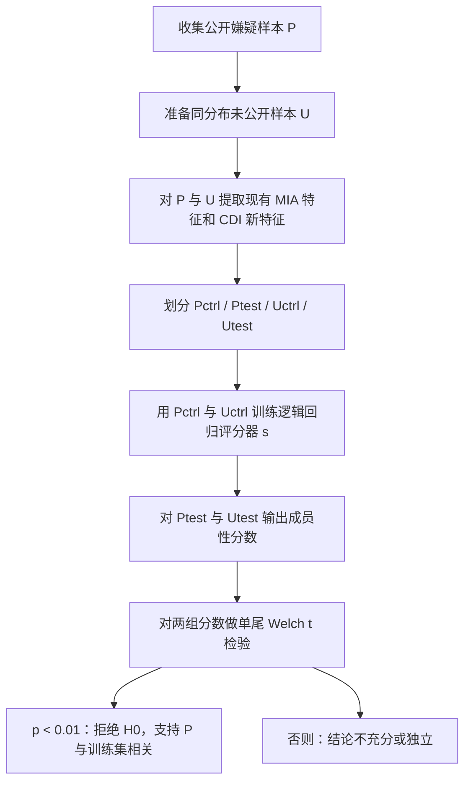

# CDI: Copyrighted Data Identification in Diffusion Models

- Title: CDI: Copyrighted Data Identification in Diffusion Models
- Material Path: `references/materials/gray-box/2025-cvpr-cdi-copyrighted-data-identification-diffusion-models.pdf`
- Primary Track: `gray-box`
- Venue / Year: CVPR 2025
- Threat Model Category: 数据集级成员性审计；以 `gray-box` 为主，兼容 `white-box`
- Core Task: 判断一组受怀疑公开样本是否整体被用于扩散模型训练
- Open-Source Implementation: [sprintml/copyrighted_data_identification](https://github.com/sprintml/copyrighted_data_identification)
- Report Status: done

## Executive Summary

这篇论文讨论的不是“某一张图像是否在训练集中”这一传统单样本成员推断问题，而是更贴近版权争议的集合级问题：某个创作者或图库拥有的一组公开作品，是否整体上被某个可疑扩散模型用于训练。作者首先重新评估现有针对扩散模型的 MIA，结论是当模型规模和训练集规模上来以后，单样本信号不足以支撑高置信度版权主张。

为此，论文提出 CDI，将问题从单样本成员推断转为数据集级识别。其输入是公开嫌疑集合 `P` 与同分布但未公开的对照集合 `U`；其核心做法是从现有 MIA 与三种新设计特征中抽取样本级证据，用逻辑回归把多维特征映射为成员性分数，再对 `P` 与 `U` 的分数分布做单尾 Welch t 检验。作者强调，真正提供法律意义上高置信度结论的不是某一个样本分数，而是“特征聚合 + 统计检验”这一完整证据链。

实验表明，CDI 在 8 个扩散模型上都能工作，并且在部分 COCO 文本条件模型上，数据拥有者只需约 70 个样本即可达到 `p < 0.01` 的显著性水平。对 DiffAudit 而言，这篇论文的重要性在于它把审计单位从“单样本泄露”扩展到“作品集合是否被训练使用”，因此更适合作为版权取证和审计叙事中的补充证据路线，而不是替代现有单样本灰盒 MIA 主线。

## Bibliographic Record

- Title: CDI: Copyrighted Data Identification in Diffusion Models
- Authors: Jan Dubinski, Antoni Kowalczuk, Franziska Boenisch, Adam Dziedzic
- Venue / year / version: Proceedings of the IEEE/CVF Conference on Computer Vision and Pattern Recognition, 2025
- Local PDF path: `D:/Code/DiffAudit/Project/references/materials/gray-box/2025-cvpr-cdi-copyrighted-data-identification-diffusion-models.pdf`
- Source URL: [CVPR 2025 OpenAccess PDF](https://openaccess.thecvf.com/content/CVPR2025/papers/Dubinski_CDI_Copyrighted_Data_Identification_in_Diffusion_Models_CVPR_2025_paper.pdf)

## Research Question

论文试图回答的精确问题是：当数据拥有者无法依赖模型输出的逐字复现时，是否仍能以统计上可靠的方式证明一组受版权保护的数据样本曾被用于训练某个扩散模型。对应威胁模型不是封闭 API 下的纯黑盒提示词探测，而是由可信第三方仲裁者执行的模型审计场景。

作者假设仲裁者至少能在任意扩散步 `t` 上对给定输入获得噪声预测，因此最低要求是灰盒访问；如果还能读取内部梯度与参数，则可进一步使用白盒特征。论文的目标不是恢复具体训练样本，也不是判断某个样本是否会被 verbatim 再现，而是给出集合级“训练相关性”判定。

## Problem Setting and Assumptions

访问模型方面，灰盒设定允许对输入样本在任意扩散步上查询噪声预测；白盒设定则进一步允许访问模型内部与梯度。可用输入包括公开嫌疑集合 `P`、来自同一分布但未公开的集合 `U`，以及目标扩散模型。可用输出是各类 MIA 分数、CDI 新特征以及最终统计检验结果。

关键先验是 `P` 与 `U` 满足近似同分布且独立同分布假设；这在真实版权场景里并不轻松，因为 `U` 需要代表创作者“未发表但同风格”的作品或草图。方法的作用范围是集合级判定，因此它不能直接替代单样本层面的侵权归因，也不能回答“到底是哪几张图被训练过”。

## Method Overview

CDI 的第一步是把数据拥有者提供的公开样本 `P` 和未公开对照 `U` 送入扩散模型，提取一组成员性相关特征。特征来源包括已有扩散模型 MIA，以及作者新增的三类手工特征：Gradient Masking、Multiple Loss、Noise Optimization。作者的判断是，单一特征方差太高，不足以支持可靠数据集审计，因此必须把它们组合起来。

第二步是把 `P` 和 `U` 划分为控制集与测试集，即 `P_ctrl`、`P_test`、`U_ctrl`、`U_test`。论文用 `P_ctrl` 与 `U_ctrl` 上的特征训练一个逻辑回归评分器 `s`，使成员样本倾向于得到更高分数，再把该评分器应用到 `P_test` 和 `U_test` 上。这里的关键不在于复杂分类器，而在于让评分器自动挑出对当前模型最有用的成员性信号。

第三步是统计检验。作者不直接把若干分数做简单聚合，而是对 `P_test` 与 `U_test` 的得分均值做单尾 Welch t 检验，并重复 1000 次随机采样后聚合 `p` 值，从而把“集合得分整体更高”转化为可解释的显著性结论。论文也专门证明，仅做集合级 MIA 聚合而不做统计检验，性能明显更差。

## Method Flow

## Key Technical Details

扩散模型基础损失沿用潜空间噪声预测目标：

$$
L(z,t,\omega;f_{\omega}) = \left\lVert \omega - f_{\omega}(z_t, t) \right\rVert_2^2.
$$

CDI 在此之上定义特征提取器 `fe`。其中最有代表性的 GM 特征先计算梯度幅值

$$
g = \left| \nabla_{z_t} L(z_t, t, \omega; f_{\omega}) \right|,
\quad
\hat{z}_t = \omega \cdot M + z_t \cdot \neg M,
$$

其中 `M` 是梯度前 20% 位置构成的二值掩码。随后作者只在这些“语义上更重要”的区域上计算恢复损失，借此区分成员与非成员。论文报告 GM 是最有影响力的新特征。

最终判定不是逐样本阈值，而是集合级假设检验：

$$
H_0:\ \overline{s(fe(P_{\mathrm{test}}))} \le \overline{s(fe(U_{\mathrm{test}}))},
\qquad
\text{reject } H_0 \text{ if } p < 0.01.
$$

实现上，评分模型 `s` 选用逻辑回归而不是更复杂的分类器；作者还使用 5 折交叉验证最大化 `P`、`U` 的使用效率，并将 1000 次随机试验的 `p` 值聚合，以降低一次划分带来的偶然性。需要特别注意的是，GM 与 NO 依赖梯度或内部优化，更接近白盒；论文在灰盒设置下只保留原始 MIA 特征与 Multiple Loss。

## Experimental Setup

模型方面，作者评估了 LDM、U-ViT、DiT 三类扩散模型，包含 `256x256`、`512x512` 分辨率，以及 `U-ViT256-Uncond`、`U-ViT256-T2I`、`U-ViT256-T2I-Deep` 等文本或无条件变体。数据集方面，类别条件模型主要基于 ImageNet-1k，文本条件模型主要基于 COCO。`P` 从训练集抽样构造为成员集合，`U` 从测试集抽样构造为非成员集合，并设定 `|P| = |U|`。

基线包括四种现有 MIA：Denoising Loss、SecMIstat、PIA、PIAN。评估指标一方面是对不同 `|P|` 下聚合 `p` 值的观察，另一方面包括拒绝零假设所需的最小样本数，以及在消融中使用的 `TPR@FPR=1%`。论文还额外分析了去掉统计检验、删减特征、加入非成员污染、以及切换到灰盒访问后的性能变化。

## Main Results

最核心结果是：CDI 能在 8 个扩散模型上稳定给出集合级成员性判断，且在最有利的 COCO 文本条件设置中，仅需约 70 个嫌疑样本即可达到 `p < 0.01`。对训练集更大的 ImageNet 模型，需要更多样本，这与作者总结的规律一致：训练集越大越难判定，输入分辨率越高越容易判定，训练步数越多信号越强。

消融结果说明统计检验是决定性组件。表 2 中，不带 t 检验的 set-level MIA 在多个模型上只有 `0.00%` 到 `33.40%` 的 `TPR@FPR=1%`，而 CDI 可提升到 `24.92%` 到 `100.00%`。特征消融还显示，新特征显著降低达到显著性所需的样本量，例如 `U-ViT512` 从约 `20000` 个样本降到约 `2000` 个样本。

论文同时给出两个对实际审计很关键的结论。第一，`P` 中即使混入相当比例未被训练的非成员样本，CDI 仍能在若干模型上工作；第二，当 `P` 和 `U` 都由非成员构成时，平均 `p` 值约为 `0.38` 到 `0.40`，不会误报为训练成员。灰盒场景下方法仍然有效，但平均需要比白盒多约三分之一的样本。

## Strengths

- 论文把问题从不稳定的单样本 MIA，转成更贴近版权纠纷实务的数据集级审计问题，任务定义有现实针对性。
- 方法结构清晰，证据链由“特征提取、评分学习、统计检验”组成，结论形式比单一启发式分数更适合被外部审查。
- 实验覆盖多种扩散架构、条件设定和分辨率，不仅展示总体有效性，也给出了统计检验、特征选择、灰盒访问和假阳性方面的系统消融。

## Limitations and Validity Threats

- 方法强依赖同分布未公开集合 `U`。若创作者拿不出与公开作品同分布的未发表样本，或者 `U` 分布明显偏移，统计检验的解释力会下降。
- 论文主要在开放权重、可查询噪声预测的模型上验证；对于商业闭源文生图服务，灰盒前提本身往往不成立。
- 灰盒版本必须放弃 GM 与 NO 等更强特征，因此虽然“仍然有效”，但样本需求会上升；这意味着论文最强结果并不等同于最现实部署条件下的结果。
- 论文给出法律取证动机，但统计显著性不自动等于法律可采性；从科学证据到法律证据仍存在额外链路。

## Reproducibility Assessment

复现 CDI 需要四类资产：目标扩散模型的可查询接口或权重、成员集合 `P`、同分布非成员集合 `U`、以及已有扩散模型 MIA 的实现。作者公开了统一代码库，这是积极信号；论文也给出较明确的特征定义、逻辑回归评分器、5 折交叉验证和 1000 次随机统计检验流程。

当前 DiffAudit 仓库已经在材料索引和工作区矩阵中标记 CDI，且明确把它定位为“数据集级审计 / 证据聚合”路线；但仓库里尚未看到针对 CDI 的专门实验流水线或可直接复用的灰盒复现实装。今天阻塞忠实复现的主要因素不是文档缺失，而是现实数据条件与访问条件：需要可靠的 `U` 集合、对扩散模型的噪声预测访问，以及较高批量推理成本。

## Relevance to DiffAudit

这篇论文对 DiffAudit 的价值不在于替代现有灰盒单样本成员推断，而在于补齐“版权取证证据链”这一更高层级叙事。若 DiffAudit 只报告单张图像的成员性分数，证据通常会因方差过大而难以解释；CDI 提供了一种把多张作品统一审计并输出显著性结论的方式，更适合作为路线图中的审计扩展层。

具体到灰盒路线，论文已经明确指出：灰盒版本应只使用原始 MIA 特征与 Multiple Loss，而不是默认搬用全部 CDI 特征。因此，对 DiffAudit 的直接启发是先把现有灰盒 MIA 输出标准化为可聚合特征，再在集合级别引入评分模型与统计检验，而不是先追求白盒特征工程。仓库现有矩阵把 CDI 归入 `gray-box` 候选并标记为“审计证据整理”扩展，这一定位与论文内容一致。

## Recommended Figure

- Figure page: 6
- Crop box or note: `50 24 525 152`；裁切第 6 页顶部 Figure 2，仅保留主结果曲线与图例，避免整页正文干扰
- Why this figure matters: 该图直接展示 `p` 值如何随嫌疑样本数量 `|P|` 变化，并清楚支持论文最关键结论，即 CDI 在不同扩散模型上的样本需求差异，以及“最少约 70 个样本即可达到显著性”的主张
- Local asset path: `docs/paper-reports/assets/gray-box/2025-cvpr-cdi-copyrighted-data-identification-diffusion-models-key-figure-p6.png`

## Extracted Summary for `paper-index.md`

这篇论文研究扩散模型训练数据的版权审计问题，目标不是判定单张图像是否为训练成员，而是判断某个数据拥有者的一组公开作品是否整体被用于训练可疑扩散模型。作者指出，现有针对扩散模型的单样本成员推断在大规模、现实模型上不够稳定，难以单独支撑高置信度版权主张。

论文提出 CDI，将公开嫌疑集合 `P` 与同分布未公开集合 `U` 做对照，从现有 MIA 与三种新增特征中抽取成员性信号，经逻辑回归评分器聚合后，再用单尾 Welch t 检验输出集合级显著性结论。实验显示，CDI 在多类扩散模型上均有效，部分 COCO 文本条件模型只需约 70 个样本即可达到 `p < 0.01`，且统计检验与新特征都会显著降低样本需求。

对 DiffAudit 而言，这篇论文的意义在于提供了一条“数据集级审计 / 证据聚合”路线，适合补强单样本灰盒 MIA 难以解释的场景。它尤其提示：在灰盒设定下，应优先聚合已有 MIA 和 Multiple Loss 这类可访问特征，再叠加统计检验形成更可用于审计叙事的集合级证据。
