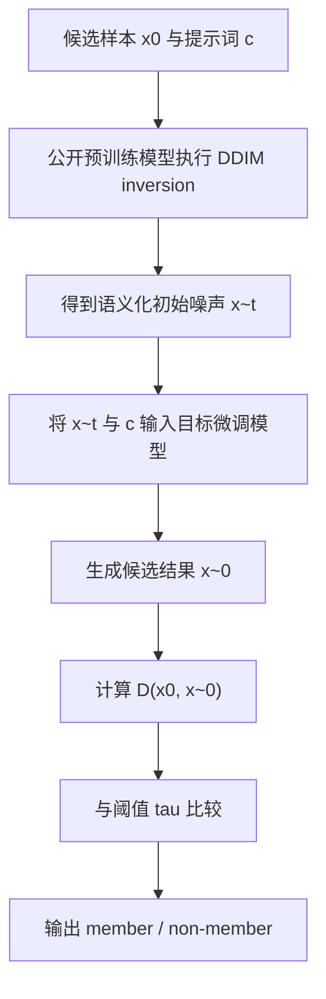

# Noise as a Probe: Membership Inference Attacks on Diffusion Models Leveraging Initial Noise

- Title: Noise as a Probe: Membership Inference Attacks on Diffusion Models Leveraging Initial Noise
- Material Path: `D:/Code/DiffAudit/Project/references/materials/gray-box/2026-arxiv-noise-as-a-probe-membership-inference-diffusion-models.pdf`
- Primary Track: `gray-box`
- Venue / Year: `arXiv / 2026`
- Threat Model Category: `gray-box membership inference with end-to-end generation access, controllable initial noise, and access to the pre-trained base model`
- Core Task: `利用语义化初始噪声对微调扩散模型执行成员推断`
- Open-Source Implementation: `未在 PDF 中给出仓库链接；仓库侧索引当前记为“暂未找到”`
- Report Status: `complete`

## Executive Summary

这篇论文研究的是一个比传统灰盒更贴近部署接口、但仍明显强于纯黑盒的成员推断设定：攻击者不能读取去噪网络的中间输出，也不训练 shadow model，而是只能控制初始噪声、输入文本提示词，并观察最终生成图像。作者的核心问题是，扩散模型在最大噪声步是否真的完全丢失了原图语义；如果没有，残留语义能否被转化为可操作的成员推断信号。

论文的关键洞见有三层。第一，常用噪声日程在最终步的信噪比并不为零，因此“初始噪声”并非严格纯高斯噪声。第二，微调后的扩散模型会学习利用这些残留语义，使得含有成员语义的初始噪声更容易重建出接近原图的结果。第三，尽管攻击者无法访问目标模型参数做 self-inversion，但预训练底座与微调模型之间保留了足够相近的语义空间，因此可以先用公开的预训练模型做 DDIM inversion，再把得到的语义噪声送入目标模型。

实验上，作者在 Pokemon、T-to-I、MS-COCO、Flickr 四个数据集上评估该方法。其平均 AUC 为 84.59，平均 T@F=1% 为 18.35；在 MS-COCO 上达到 90.46/21.80。更重要的是，这个结果是在“不访问中间去噪结果、不训练 shadow model 或分类器”的条件下获得的，因此论文证明了一条不同于 SecMI/PIA 的信号路径：泄露不一定必须从轨迹或分数空间读取，初始噪声接口本身也可能是审计入口。

## Bibliographic Record

- Title: Noise as a Probe: Membership Inference Attacks on Diffusion Models Leveraging Initial Noise
- Authors: Puwei Lian, Yujun Cai, Songze Li, Bingkun Bao
- Venue / year / version: arXiv preprint, January 30, 2026, `arXiv:2601.21628v1`
- Local PDF path: `D:/Code/DiffAudit/Project/references/materials/gray-box/2026-arxiv-noise-as-a-probe-membership-inference-diffusion-models.pdf`
- Source URL: `https://arxiv.org/abs/2601.21628`

## Research Question

论文试图回答两个紧密关联的问题。其一，在文本到图像扩散模型的微调场景中，最大噪声步是否仍保留足以区分成员与非成员的残留语义。其二，在攻击者只能进行端到端生成、但可控制初始噪声和提示词、且知道对应预训练底座的前提下，是否能够仅通过最终生成结果构造有效的成员推断攻击。

其 threat model 不是经典黑盒。攻击者拥有候选数据集及其提示词，能够调用目标微调模型的生成接口并直接设定初始噪声，同时还拥有目标模型对应的预训练版本用于 inversion。论文因此更适合归入 DiffAudit 的 `gray-box` 轨道，而不是无辅助信息的纯黑盒路线。

## Problem Setting and Assumptions

- Access model: 只能做端到端生成，不能访问目标模型参数，不能读取中间去噪网络输入输出。
- Available inputs: 候选图像 `x_0`、对应 caption `c`、可注入的初始噪声、预训练底座模型。
- Available outputs: 目标模型最终生成图像 `\tilde{x}_0`。
- Required priors or side information: 知道目标模型由哪个预训练模型微调而来；拥有一批非成员样本用于设阈值；默认能获得真实 caption，附录才讨论 caption 缺失情形。
- Scope limits: 论文聚焦微调后的 Stable Diffusion v1-4 体系；主要评估“成员与非成员来自同分布”的严格设定；攻击依赖接口允许显式控制初始噪声，这并非所有线上服务都会暴露。

## Method Overview

方法由两步组成。第一步不是直接攻击目标模型，而是利用其公开预训练底座对目标样本执行 DDIM inversion，得到带有原图语义的“语义化初始噪声”。作者认为这是可行的，因为微调不会完全破坏预训练模型的语义空间，预训练 inversion 得到的噪声仍能被目标微调模型识别。

第二步将该语义噪声和同一提示词送入目标模型进行生成。如果目标样本属于训练成员，目标模型更可能利用噪声中残留的语义结构，生成与原图更接近的结果；若样本是非成员，则生成结果偏离更大。攻击者再用距离度量比较原图与生成图，基于阈值输出成员或非成员判断。

该方法利用的不是显式置信度、分数函数或中间轨迹，而是“模型是否会响应被注入到初始噪声中的样本语义”这一隐式行为差异。论文因此把初始噪声从采样随机源重新解释为可审计探针。

## Method Flow

## Key Technical Details

论文首先沿用标准成员推断形式化，将攻击目标写为：

$$
A(x_i, \theta)=\mathbf{1}\!\left[P(m_i=1 \mid \theta, x_i)\ge \tau\right].
$$

作者随后强调，噪声日程在最终步的残留信号可由信噪比描述：

$$
\mathrm{SNR}(t):=\frac{\bar{\alpha}_t}{1-\bar{\alpha}_t}.
$$

真正的攻击定义则是把预训练模型 inversion 与目标模型生成串起来：

$$
\tilde{x}_t=\mathrm{Inv}_{\theta_{\mathrm{pre}}}^{t}(x_0 \mid c,\gamma_2), \qquad
A(x_i,\theta)=\mathbf{1}\!\left[D\!\left(x_0, G_\theta(\tilde{x}_t \mid c,\gamma_1)\right)\le \tau\right].
$$

从实现上看，论文默认使用 `\ell_2` 距离作为成员分数，`γ_2=1.0`、inversion 步数 `100`，生成阶段 `γ_1=3.5`、采样步数 `50`。值得注意的是，正文公式 (8) 与文字描述都表明“距离越小越像成员”，但附录 Algorithm 1 第 6 至 9 行却写成 `Score > τ` 时判为成员，这里存在符号方向不一致，复现时必须自行核对。

## Experimental Setup

作者在四个数据集上评估方法：Pokemon 使用 `416/417` 个 member/non-member，T-to-I 使用 `500/500`，MS-COCO 使用 `2500/2500`，Flickr 使用 `1000/1000`。模型为 `Stable Diffusion v1-4`，使用 Hugging Face Diffusers 官方 fine-tuning 脚本训练。所有图像分辨率为 `512`。

对比基线包括灰盒 intermediate-result 攻击 `SecMI`、`PIA`，以及端到端攻击 `NA-P`、`GD`、`Feature-T`、`Feature-C`、`Feature-D`。评估指标为 `AUC` 与 `TPR@1%FPR`。硬件条件为单张 `RTX 4090 24GB`。论文还进一步分析了超参数、不同 scheduler、未知架构版本、caption 缺失和防御条件下的效果。

## Main Results

主结果见 Table 5。论文报告该方法在四个数据集上的平均 `AUC=84.59`、平均 `T@F=1%=18.35`，在所有端到端方法中最佳；其中 `MS-COCO` 上达到 `90.46/21.80`，不仅显著优于 `Feature-C` 等端到端基线，也接近甚至超过部分 intermediate-result 方法。这个结果支撑了论文最重要的论断：只要初始噪声可控，最终生成结果本身就足以承载成员信号。

附加实验进一步强化了这一结论。表 7 表明，相比直接从随机噪声生成图像的 naive 方案，语义噪声注入使四个数据集的 AUC 平均提升 `21.57%`。表 6 说明方法对 inversion 步数和 guidance scale 并不敏感。表 8 和表 9 则显示，即便存在 SSei 防御、数据增强，或预训练架构版本未知，攻击仍保持明显有效。

但这些结果也依赖较强前提。论文一直采用成员与非成员同分布的严格划分，并默认接口允许直接传入初始噪声；因此实验结论更适用于“能力受限但仍掌握较多先验”的审计者，而不能直接外推到一般公开 API。

## Strengths

- 明确提出了区别于轨迹误差和分数空间的新信号来源，即初始噪声中的残留语义。
- 在不访问中间去噪结果、也不训练 shadow model 的条件下取得了很强的端到端攻击性能。
- 通过 SNR、重建距离、cross-attention 热图和防御实验构成了较完整的论证链，而非只给最终 AUC。
- 讨论了未知架构、caption 缺失、不同 scheduler 与 defense，实验覆盖面比只报主表更扎实。

## Limitations and Validity Threats

- 攻击前提并不弱：需要候选数据、caption、预训练底座，以及“可直接控制初始噪声”的接口，这使其与普通黑盒服务存在明显距离。
- 论文没有在 PDF 中提供开源仓库链接，关键工程细节如 cross-attention 抽取位置、阈值实现流程主要散落在附录，复现成本仍不低。
- Algorithm 1 与公式 (8) 的阈值不等号方向矛盾，这是一个需要人工判定的实现歧义。
- 主实验集中在 SD-v1-4 微调场景，尚不足以证明该结论能稳定泛化到更封闭的商业模型或完全不同的扩散体系。

## Reproducibility Assessment

忠实复现至少需要以下资产：可微调或已微调的 `SD-v1-4` 模型、对应预训练底座、四个带 caption 的数据集划分、支持自定义初始噪声的生成接口、DDIM inversion 实现，以及一批非成员样本用于阈值选择。若要复现论文中的解释性证据，还需要能抓取 cross-attention heatmap 的实现。

就公开材料而言，PDF 已给出充足的实验超参数、数据规模和主要公式，但尚未给出代码仓库链接。当前 DiffAudit 仓库已经把该论文登记到 `manifest.csv`、`paper-index.md` 和报告 `manifest.csv` 中，同时灰盒路线也已有 `SecMI`、`PIA` 等相邻论文作为参照；但尚未看到这篇论文的专门实现或实验记录，因此今天仍然存在工程落地空缺。

## Relevance to DiffAudit

这篇论文对 DiffAudit 的价值不在于提供一个可以直接替代 `SecMI` 或 `PIA` 的实现，而在于明确提出另一类审计接口：当系统不暴露中间去噪轨迹时，攻击者仍可能通过“可控初始噪声 + 最终生成图像”构造成员信号。它因此是灰盒路线向受限黑盒路线延伸时的重要桥接材料。

与现有路线相比，`Noise as a Probe` 把审计关注点前移到了采样入口。对 DiffAudit 而言，这意味着后续实验设计不能只关注 loss、score、posterior 或中间层误差，也要关注部署接口是否允许用户通过 seed、latent 或 noise engineering 形式操控采样起点。若允许，这种接口本身就可能成为隐私风险面。

## Recommended Figure

- Figure page: `6`
- Crop box or note: `40 40 570 272` in PDF points, cropped to isolate `Table 5`
- Why this figure matters: 这张表最集中地展示了论文的中心结论，即该方法在无需中间结果访问、无需 shadow model 的前提下，仍能在四个数据集上取得所有端到端方法中的最佳结果，并在部分场景接近甚至超过经典灰盒基线。
- Local asset path: `../assets/gray-box/2026-arxiv-noise-as-a-probe-membership-inference-diffusion-models-key-figure-p6.png`

## Extracted Summary for `paper-index.md`

这篇论文研究微调扩散模型中的成员推断问题，关注点不是中间去噪轨迹，而是初始噪声本身是否残留了足够的语义信息。作者指出，常见噪声日程在最大噪声步仍保留非零信号，因此“初始噪声”并非完全无语义，这为成员推断提供了新的攻击入口。

论文提出的核心方法是先用公开预训练底座对目标样本执行 DDIM inversion，得到带有样本语义的初始噪声，再将该噪声送入目标微调模型并比较生成结果与原图的距离。实验结果表明，这种语义化初始噪声能够明显放大成员与非成员之间的差异，使方法在多个数据集上取得优于既有端到端攻击的 AUC 和低 FPR 指标。

对 DiffAudit 来说，这篇论文的重要性在于它把“可控初始噪声”明确识别为一种可审计接口，说明即便系统不暴露中间结果，仍可能从采样入口和最终生成图像中提取成员信号。它因此是灰盒路线向受限黑盒路线延伸时的关键桥接材料，也提醒后续评估必须关注 seed、latent 或 noise engineering 接口的隐私风险。
