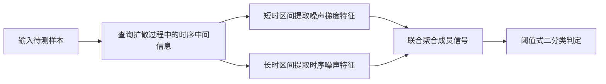

# 面向扩散模型的时序成员推理攻击方法
Temporal Membership Inference Attack Method for Diffusion Models

## 文献信息

- 英文标题：Temporal Membership Inference Attack Method for Diffusion Models
- 中文标题：面向扩散模型的时序成员推理攻击方法
- 作者：高志鹏，张祎，尤玮婧，柴泽，杨杨，芮兰兰
- 发表 venue / year / version：计算机研究与发展，2026，Vol.63 No.1，journal version
- 论文主问题：在扩散模型成员推断中，如何同时兼顾短时攻击和长时攻击效果，并用时间相关信号提升成员判定的稳定性
- 威胁模型类别：灰盒查询式成员推断攻击
- 本地 PDF 路径：`<DIFFAUDIT_ROOT>/Research/references/materials/gray-box/2026-crad-temporal-membership-inference-attack-method-diffusion-models.pdf`
- GitHub PDF 链接：[2026-crad-temporal-membership-inference-attack-method-diffusion-models.pdf](https://github.com/DeliciousBuding/DiffAudit-Research/blob/main/references/materials/gray-box/2026-crad-temporal-membership-inference-attack-method-diffusion-models.pdf)
- OCR 精修版链接：待补
- 飞书原生 PDF 获取方式：待补
- 开源实现：暂未找到
- 报告状态：已完成

## 1. 论文定位

这篇论文最容易被误读的地方，是它表面上强调“基于查询”的成员推断，因此看起来像黑盒补强材料；但正文前 3 页已经把 threat-model 讲得很清楚：作者采用的是“基于查询的灰盒攻击方式”，并明确依赖开源扩散模型所暴露的中间步输出接口。因此，它不能直接进入 DiffAudit 当前的严格黑盒主线。

它在仓库中的正确位置是 gray-box literature。更具体地说，它位于 `SecMI -> PIA -> SimA` 这一条“中间时间步 / 噪声相关信号”方法族旁边，属于一个强调时间长度分段处理的新候选分支。

## 2. 核心问题

论文真正要解决的问题不是“扩散模型能否做成员推断”，而是：如果把攻击按扩散时间长度拆成短时和长时两类，哪种信号在短时更有效，哪种信号在长时更有效，以及能否把二者组合成一条统一的成员推断路径。

作者的答案是：

- 短时攻击中，噪声梯度信息更有利于提升攻击成功率
- 长时攻击中，时序噪声信息更有利于维持成员区分度
- 若把两者组合成 `TMIA-DM`，效果优于传统单一信号方法

## 3. 威胁模型与前提

论文前几页对三种攻击设定都给了定义，并最终选择灰盒路线。作者认为：

- 黑盒攻击只看模型输出，无法直接拿到内部细节
- 白盒攻击可直接获取模型内部结构和参数
- 灰盒攻击掌握部分模型结构、参数或部分输入输出信息，更适合开源扩散模型场景

正文还进一步写明，本文方法采用“基于查询的灰盒攻击方式”，理由是流行开源扩散模型提供了访问中间步输出的接口，因此攻击者可以拿到足够的中间时序信息来实施成员推断。

所以这篇论文的结论不适用于当前仓库里严格 black-box 的：

- `recon`
- `variation / Towards`

而更接近当前 gray-box 的：

- `SecMI`
- `PIA`
- `SimA`

## 4. 方法总览

`TMIA-DM` 的直觉是：成员信号在整个扩散过程中并不均匀。短时阶段的梯度变化更剧烈，更适合用噪声梯度去区分成员与非成员；长时阶段梯度逐渐平滑，如果继续只靠梯度，攻击会退化，因此需要引入时序噪声信号继续保持区分度。

它的核心改动不是重新定义一个完全新的观察对象，而是把“时间长度”本身当作攻击设计变量，按照短时和长时拆分成员信号，再把二者合成一个统一的阈值式灰盒攻击器。

从路线关系上看：

- `SecMI` 更像 step-wise posterior error
- `PIA` 更像 epsilon consistency / proximal initialization
- `SimA` 更像单时间步 score norm
- `TMIA-DM` 则更像“按攻击时长切换噪声相关特征”的组合式方法

## 5. 方法概览 / 流程

这条流程说明得很明确：它不是只看最终输出，也不是只取一个时间步，而是一个显式依赖中间时序行为的灰盒攻击。

## 6. 关键技术细节

当前从正式 PDF 首页、摘要和前 3 页中可以稳定提炼出 3 个关键技术点。

第一，作者把短时与长时视为 2 个不同的攻击区间，而不是统一用一个静态统计量覆盖全部扩散过程。这和当前很多方法“只找一个好时间步”不同，它更像把时间本身当作特征组织轴。

第二，作者明确用“噪声梯度”与“时序噪声”两类信号分工合作。也就是说，它不是简单地说“梯度比噪声强”或“噪声比梯度强”，而是把二者按攻击时长拆开使用。

第三，最终判定仍然是二分类阈值法。正文写明其“采用二分类阈值判断方式判别成员样本”，这意味着它在执行层可能比依赖多影子模型训练的方案更轻，但其强度仍受中间接口可用性约束。

## 7. 实验设置

目前从本轮已确认的正文和元数据中，能稳定确定的只有这些实验层信息：

- 论文比较的是短时攻击与长时攻击
- 主要指标明确包含 `ASR`
- 方法作用对象是“常见扩散模型”
- 文章主题仍是 diffusion MIA，而非更一般的 origin attribution 或 data extraction

当前还没有在本轮阅读里完全提炼出的内容包括：

- 具体数据集矩阵
- 具体模型矩阵
- 与 `SecMI / PIA / SimA` 的完整逐项比较表
- `AUC / TPR@低FPR` 是否被系统报告，以及具体数值

因此，这篇报告当前定位为：正式 threat-model 和方法定位已完成，完整实验矩阵仍可后续补读。

## 8. 主要结果

当前可直接写出的结果，来自期刊摘要与首页元数据：

- 相较传统方法，`TMIA-DM` 在常见扩散模型上短时攻击 `ASR` 提升约 `5` 个百分点
- 长时攻击 `ASR` 提升约 `1` 个百分点

所以它的主要贡献是“平衡短时和长时攻击效果”，而不是把扩散模型成员推断从不存在变成存在。

当前不能过度写出的结论包括：

- 不能直接写成当前仓库 gray-box 最强方法
- 不能直接写成对 `PIA` 或 `SecMI` 的全面替代
- 不能写成 strict black-box 方法

## 9. 优点

- 明确把“短时与长时攻击不平衡”提成独立问题，这比只比总体 AUC 更接近扩散攻击的真实时间结构。
- 将噪声梯度与时序噪声进行组合，而不是继续押单一信号。
- 保持阈值式判定，理论上比多影子模型路线更容易做成轻量攻击器。

## 10. 局限与有效性威胁

- threat-model 不是严格黑盒，不能直接补强 `recon` 或 `variation` 主线。
- 当前仓库还没有它的官方实现或可直接执行的 adapter，不能因为论文已归档就写成“可运行路线”。
- 本轮虽已拿到官方 PDF 和正文前几页，但还没有完成全篇数值矩阵与关键图的系统抽取，因此当前更适合作为路线材料，而不是立即升成执行主线。

## 11. 对 DiffAudit 的价值

它对 DiffAudit 的直接价值主要有两层。

第一，它帮助仓库做 threat-model 纠偏。用户很容易把“基于查询”的扩散论文统称为黑盒，但这篇论文恰好证明并非如此：只要结论依赖中间步时序信息，它就更接近 gray-box，而不是 black-box。

第二，它补强了灰盒方法族的研究宽度。当前仓库灰盒方向已经有：

- `SecMI`：后验估计误差
- `PIA`：近邻初始化 / epsilon consistency
- `SimA`：单步 score norm

`TMIA-DM` 则补上：

- 时间相关噪声与梯度分段组合的攻击路线

因此，它最适合作为 gray-box 候选文献，而不是黑盒主线替代。

## 12. 复现评估

如果后续真要把它推进成执行面，最少需要：

- 可查询中间扩散步骤或等价噪声接口
- 明确的短时 / 长时分段规则
- 噪声梯度提取接口
- 时序噪声特征聚合逻辑
- 与现有 `SecMI / PIA` 可同口径比较的评估入口

当前仓库最接近它的，不是 `recon` 黑盒侧，而是：

- `external/PIA`
- `external/SecMI`
- `Research/src/diffaudit/attacks/pia_adapter.py`

也就是说，如果未来要给它建执行入口，应该从 gray-box 现有资产和接口层出发，而不是从黑盒 API 路线出发。

## 13. 写回总索引用摘要

这篇论文研究扩散模型上的时序成员推断攻击，核心问题是在不同扩散时长下，成员信号更适合依赖哪类中间噪声信息，以及能否在一个统一框架里平衡短时和长时攻击效果。

作者提出 `TMIA-DM`，用噪声梯度支撑短时攻击，用时序噪声支撑长时攻击，并采用查询式灰盒设定与阈值式成员判定。摘要报告该方法可把短时 `ASR` 提高约 `5` 个百分点、长时 `ASR` 提高约 `1` 个百分点。

它对 DiffAudit 的价值不在于补强黑盒，而在于扩展灰盒方法族：相比 `SecMI`、`PIA`、`SimA`，它更明确地把“攻击时长”作为信号选择变量，因此适合作为后续 gray-box 候选路线材料。
