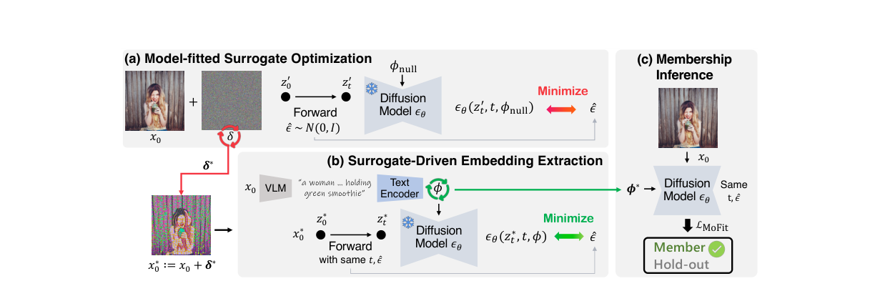

# 无需 Caption 的成员推断：基于模型拟合嵌入的无文本审计
No Caption, No Problem: Caption-Free Membership Inference via Model-Fitted Embeddings

- 英文标题：No Caption, No Problem: Caption-Free Membership Inference via Model-Fitted Embeddings
- 中文标题：无需 Caption 的成员推断：基于模型拟合嵌入的无文本审计
- 作者：Joonsung Jeon，Woo Jae Kim，Suhyeon Ha，Sooel Son，Sung-Eui Yoon
- 发表 venue / year / version：ICLR 2026 conference paper
- 论文主问题：在拿不到训练时真实 caption 的前提下，如何只凭查询图像对文生图 latent diffusion model 做成员推断
- 威胁模型类别：灰盒，text-to-image diffusion membership inference，caption-free
- 本地 PDF 路径：`D:\Code\DiffAudit\Research\references\materials\gray-box\2026-openreview-mofit-caption-free-membership-inference.pdf`
- GitHub PDF 链接：[2026-openreview-mofit-caption-free-membership-inference.pdf](https://github.com/DeliciousBuding/DiffAudit-Research/blob/main/references/materials/gray-box/2026-openreview-mofit-caption-free-membership-inference.pdf)
- OCR / born-digital 精修版链接：[OCR精修版：No Caption, No Problem: Caption-Free Membership Inference via Model-Fitted Embeddings](https://www.feishu.cn/docx/EpTOdMzKposoRVxRP0KcKSDdnwe)
- 飞书原生 PDF：[2026-openreview-mofit-caption-free-membership-inference.pdf](https://ncn24qi9j5mt.feishu.cn/file/RgGObebMJo6O3txk2K9c2y08nxf)
- 开源实现：[JoonsungJeon/MoFit](https://github.com/JoonsungJeon/MoFit)
- 报告状态：已完成

## 1. 论文定位

这篇论文属于 gray-box 路线上的攻击论文，直接针对 text-to-image latent diffusion model 的成员推断，但把既有工作默认拥有 ground-truth caption 的前提去掉了。它在路线上的位置很明确：不是再做一个 caption-dependent 变体，而是把 CLiD 这一类依赖真实文本条件的思路推进到更现实的 caption-free 审计场景。

## 2. 核心问题

论文要回答的技术问题是：如果审计者只有可疑图像，无法拿到训练时配对文本，那么还能否构造出足够强的条件信号，使成员样本与非成员样本在条件去噪损失上重新分离。更具体地说，作者要解决的不是“恢复真实 caption”，而是“在缺文本监督时重建一个比 VLM caption 更有区分度的条件嵌入”。

## 3. 威胁模型与前提

攻击者可以访问目标 LDM 的去噪网络，并在固定时间步上读取条件与无条件损失；也可以对输入扰动和条件嵌入做梯度优化。攻击者看不到训练集真实 caption，但允许用 VLM 生成 caption 作为初始化。论文结论适用于可微访问的灰盒设定，不适用于只能拿到最终生成 API 的弱黑盒环境；同时，LoRA 微调场景会显著削弱方法有效性。

## 4. 方法总览

MOFIT 分两步。第一步先把原始查询图像 \(x_0\) 推向目标模型已经学到的无条件先验流形，得到一个 model-fitted surrogate \(x_0^\*\)；第二步再从这个 surrogate 上反向优化出与之高度耦合的条件嵌入 \(\phi^\*\)。推断时作者并不把 \(\phi^\*\) 继续配给 surrogate，而是故意让原图 \(x_0\) 去搭配 \(\phi^\*\)，制造 image-condition mismatch。经验上，成员样本对这种错配更敏感，\(L_{\text{cond}}\) 的上升更明显，而非成员变化较小，于是重新拉开可分性。

## 5. 方法概览 / 流程

从流程上看，MOFIT 先固定同一个时间步 \(t\) 和噪声 \(\hat{\epsilon}\)，在 null condition 下优化扰动 \(\delta\)，让 surrogate 在无条件分支上更贴近目标模型；然后把条件嵌入当成连续变量，继续在 surrogate 上最小化条件损失，得到 model-fitted embedding。最后在原图上计算 \(L_{\text{cond}}-L_{\text{uncond}}\)，并与辅助损失做稳健缩放后联合判定成员身份。

这张图最关键的价值是把“surrogate 优化、embedding 提取、原图错配推断”三段式链路放在一张图里，便于后续把实现拆成独立模块。

## 6. 关键技术细节

第一阶段的目标是找到一个更贴近模型无条件先验的 surrogate：

$$
\delta^\* := \arg\min_{\delta}\; \mathbb{E}_{z'_0,t,\hat{\epsilon}}\left[\left\|\hat{\epsilon}-\epsilon_\theta(z'_t,t,\phi_{\text{null}})\right\|^2\right].
$$

这里固定 \(t\) 和 \(\hat{\epsilon}\) 很重要，因为作者要让优化方向稳定下来，把图像沿着“更像模型已学分布”的方向推，而不是做随机噪声平均。

第二阶段直接从 surrogate 提取条件嵌入：

$$
\phi^\* := \arg\min_{\phi}\; \mathbb{E}_{z_0^\*,t,\hat{\epsilon}}\left[\left\|\hat{\epsilon}-\epsilon_\theta(z_t^\*,t,\phi)\right\|^2\right].
$$

这一步不是在语义上恢复文本，而是在模型内部构造一个与 surrogate 过拟合配对的条件变量，因此它对原图来说天然是“错位但模型内高度可信”的条件。

最终核心分数是

$$
\mathcal{L}_{\text{MoFit}}=
\mathbb{E}_{z_0,t,\hat{\epsilon}}\left[\left\|\hat{\epsilon}-\epsilon_\theta(z_t,t,\phi^\*)\right\|^2\right]
-
\mathbb{E}_{z_0,t,\hat{\epsilon}}\left[\left\|\hat{\epsilon}-\epsilon_\theta(z_t,t,\phi_{\text{null}})\right\|^2\right].
$$

其作用不是单独替代所有旧信号，而是先重建 caption-free 主信号，再和 \(-L_{\text{aux}}\) 做 robust scaling 组合。论文的关键观察也由此成立：成员样本在错配条件下的 \(L_{\text{cond}}\) 抬升显著强于非成员。

## 7. 实验设置

主实验使用 Stable Diffusion v1.4 在 Pokemon、MS-COCO、Flickr 三个数据集上的微调模型；附录补充了 SD v1.5、v2.1、v3 和医学图像模型。基线包括 Loss、SecMI、PIA、PFAMI 与 CLiD；在 caption-free 对比里，这些基线统一改用 VLM caption。优化时固定 \(t=140\)、总扩散步数 \(T=1000\)，surrogate 阶段按梯度符号更新，embedding 阶段用 Adam。评价指标是 ASR、AUC 与 TPR@1%FPR；MS-COCO 与 Flickr 各采样 500/500 member-hold-out 图像，Pokemon 使用全部可用样本。

## 8. 主要结果

主表结论很强，但需要分指标看。Pokemon 上，MOFIT 达到 94.48 ASR、97.30 AUC、50.48 TPR@1%FPR，远高于使用 VLM caption 的 CLiD 的 77.55、83.43、19.23，但仍明显低于 GT-captioned CLiD 的 90.14 TPR。MS-COCO 上，MOFIT 达到 88.00 ASR 和 94.17 AUC，超过 GT-captioned CLiD 的 86.50 和 90.27，不过在 TPR@1%FPR 上略低于 caption-free CLiD 的 50.80。Flickr 上，MOFIT 也稳定优于所有 VLM-captioned 基线。附录里，SD v1.5 上的 AUC 只有 71.03，但 TPR@1%FPR 仍达到 41.30，说明方法迁移到大模型后仍有可用性，但并不是全指标压倒性领先。

## 9. 优点

第一，它把 gray-box 成员推断从“默认拿到真实文本”推进到更现实的 caption-free 设定。第二，方法机制是自洽的：作者先观察到成员对错配条件更敏感，再围绕这一点设计 surrogate 与 embedding 的两阶段优化。第三，实验不只报主表，还补了输入变体、LoRA、运行时和 early stopping，便于判断方法边界。

## 10. 局限与有效性威胁

最明显的限制是访问假设偏强：攻击要读内部损失并反向优化，严格说更接近可微灰盒。其次，caption-free 并不等于完全摆脱文本先验，因为 \(\phi^\*\) 的初始化仍来自 VLM caption。第三，论文在预训练 SD v1.5 上没有沿用原始 LAION-mi member split，而是替换成 431 个已验证 memorized samples，这会增强信号，也限制了与标准 split 的直接横比。第四，LoRA 微调下 MOFIT 几乎退化到随机水平。最后，作者自己报告默认运行时间约 7 到 9 分钟每张图，吞吐明显受限。

## 11. 对 DiffAudit 的价值

它可以直接进入 DiffAudit 的 gray-box 主线，而且更适合作为“caption-free gray-box”主论文，而不是普通补充材料。工程上，它提示我们把现有依赖 caption 的路线拆成两层：一层是直接用现成文本条件的攻击，一层是通过 surrogate 与拟合嵌入重建条件信号的攻击。叙事上，它还能和 CLiD 形成很清晰的对照：CLiD 说明文本条件泄露存在，MOFIT 说明即使拿不到真实文本，泄露仍然可被放大。

## 12. 关键图使用方式

本报告只保留 1 张方法图，并放在第 5 节流程解释之后。它服务的目的不是展示结果数值，而是帮助读者快速理解实现拆分：先做 surrogate 优化，再做 embedding 提取，最后用原图与拟合嵌入错配打分。对 DiffAudit 来说，这张图最适合映射为后续实验脚本的三段式接口。

## 13. 复现评估

复现需要的核心资产包括目标 LDM 权重、成员与非成员划分、可读取条件/无条件损失并支持反传的推理接口、VLM caption 初始化器，以及用于阈值和 \(\gamma\) 标定的小规模校准集。仓库当前缺的不是论文材料，而是显式的两阶段优化脚手架和运行缓存。结构性阻塞主要有两个：一是运行成本高，单图优化时间长；二是若只有黑盒 API，则 surrogate 与 embedding 两步都无法直接落地。

## 14. 写回总索引用摘要

这篇论文解决的是文生图 latent diffusion model 在 caption-free 条件下的成员推断问题。与 CLiD 等默认持有真实 caption 的工作不同，它把攻击前提收紧到“只有查询图像，没有训练标注文本”。

核心方法是先在无条件分支上把查询图像优化成更贴近模型先验的 surrogate，再从 surrogate 中提取一个与之过拟合耦合的条件嵌入，并把该嵌入错配回原图来放大成员样本的条件损失。实验证明，这一机制能显著优于 VLM-captioned 基线，并在部分数据集上超过 GT-captioned CLiD 的 ASR/AUC。

对 DiffAudit 而言，它的价值在于补齐了 gray-box 路线里最现实的一段空白：真实 caption 不可得时如何继续审计。它既适合作为 caption-free gray-box 主论文，也适合作为后续评估 LoRA、防御训练和运行时成本权衡的参照点。
