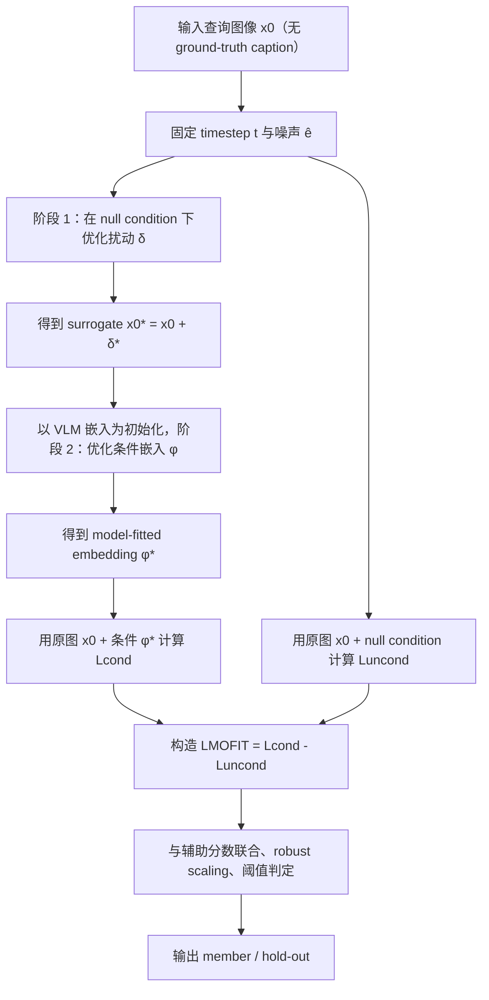

# No Caption, No Problem: Caption-Free Membership Inference via Model-Fitted Embeddings

- Title: No Caption, No Problem: Caption-Free Membership Inference via Model-Fitted Embeddings
- Material Path: `D:/Code/DiffAudit/Project/references/materials/gray-box/2026-openreview-mofit-caption-free-membership-inference.pdf`
- Primary Track: `gray-box`
- Venue / Year: ICLR 2026
- Threat Model Category: Gray-box text-to-image diffusion membership inference without ground-truth captions
- Core Task: 在仅有查询图像、缺少真实训练 caption 的情况下，判断该图像是否属于目标 LDM 的训练集
- Open-Source Implementation: [JoonsungJeon/MoFit](https://github.com/JoonsungJeon/MoFit)
- Report Status: completed

## Executive Summary

这篇论文关注一个比既有扩散模型成员推断更接近实际部署的问题：审计者往往能拿到可疑图像，却拿不到训练时配对的真实文本 caption。作者指出，现有针对 text-to-image latent diffusion model 的方法大多默认可访问 ground-truth caption；一旦改用 VLM 生成的替代 caption，条件去噪损失的分离度明显下降，成员与非成员的分布会重新重叠。

论文提出 MOFIT，其核心不是“恢复真实 caption”，而是先把查询图像推向目标模型的无条件先验流形，再从这个 surrogate 中提取一个与 surrogate 强耦合、但与原图故意失配的条件嵌入。作者的经验观察是：成员样本对这种失配条件更敏感，`L_cond` 会更明显升高；非成员样本的变化则相对有限。MOFIT 正是把这种不对称敏感性放大为成员推断信号。

从论文报告的结果看，MOFIT 在 Pokemon、MS-COCO、Flickr 三个微调 SD v1.4 模型上都显著优于使用 VLM caption 的 Loss、SecMI、PIA、PFAMI 和 CLiD 基线；在 MS-COCO 上甚至超过了使用真实 caption 的 CLiD。对 DiffAudit 而言，这篇工作的重要性不只是“又一个更强攻击”，而是明确把 gray-box 路线从 caption-dependent 推向 caption-free，并给出了可操作的两阶段优化范式。

## Bibliographic Record

- Title: No Caption, No Problem: Caption-Free Membership Inference via Model-Fitted Embeddings
- Authors: Joonsung Jeon, Woo Jae Kim, Suhyeon Ha, Sooel Son, Sung-Eui Yoon
- Venue / year / version: Published as a conference paper at ICLR 2026
- Local PDF path: `D:/Code/DiffAudit/Project/references/materials/gray-box/2026-openreview-mofit-caption-free-membership-inference.pdf`
- Source URL if known: 本地 PDF 未显式记录 OpenReview 页面 URL；代码仓库为 [https://github.com/JoonsungJeon/MoFit](https://github.com/JoonsungJeon/MoFit)

## Research Question

论文试图回答的问题是：当审计者无法获得训练时的真实 caption，只能访问查询图像本身时，是否仍能对 text-to-image latent diffusion models 执行有效成员推断。其攻击设定不是纯黑盒，因为方法需要反复访问目标去噪模型的条件与无条件损失，并对输入扰动和条件嵌入做优化；但它比既有 caption-dependent 设定更弱，因为真实文本监督被移除了。

## Problem Setting and Assumptions

- Access model: 攻击者可访问目标 LDM 的去噪过程、条件/无条件噪声预测损失，并能对输入扰动与条件嵌入做梯度优化。
- Available inputs: 查询图像 `x`，目标模型 `\epsilon_\theta`，噪声日程，固定 timestep `t`，以及采样噪声 `\hat{\epsilon}`。
- Available outputs: 条件损失、无条件损失，以及据此构造的成员分数。
- Required priors or side information: 不需要 ground-truth caption；作者允许使用 VLM caption 仅作为嵌入初始化或辅助分数的条件来源。
- Scope limits: 论文主要评估 text-conditioned latent diffusion models；LoRA 适配场景下性能明显下降，说明方法并非对所有参数化微调方式同样有效。

## Method Overview

MOFIT 分两阶段工作。第一阶段是 model-fitted surrogate optimization。给定原始查询图像 `x_0`，作者对扰动 `\delta` 做优化，使加入扰动后的 surrogate `x_0^\*=x_0+\delta^\*` 在无条件分支下更贴合目标模型学到的先验。这里的关键不是生成“视觉上更自然”的图片，而是让 surrogate 在目标模型内部表示空间中更像训练过的样本。

第二阶段是 surrogate-driven embedding extraction。作者把条件嵌入 `\phi` 当作连续变量，在固定 `t` 和 `\hat{\epsilon}` 的条件下，直接最小化 surrogate 的条件去噪损失，得到 `\phi^\*`。这样得到的 `(x_0^\*, \phi^\*)` 是一对对目标模型高度过拟合的 image-condition pair。最终做推断时，并不用 surrogate，而是把 `\phi^\*` 施加到原始图像 `x_0` 上，故意制造 image-condition mismatch。

论文的核心经验结论是：成员样本在这种失配条件下会出现更显著的 `L_cond` 上升，而非成员样本上升较小；与此同时，成员样本的 `L_uncond` 往往更低。于是 `L_cond-L_uncond` 的差异被重新拉开，形成 caption-free 成员推断信号。

## Method Flow

## Key Technical Details

论文最重要的技术点不在于语言恢复，而在于通过 surrogate 将查询样本主动推向目标模型流形，再从该点抽取过拟合条件嵌入。第一阶段在无条件分支上最小化损失，使 surrogate 更贴近模型先验；第二阶段在相同 `t` 与 `\hat{\epsilon}` 下优化条件嵌入，使其与 surrogate 紧耦合。最终用原图和 `\phi^\*` 的错配来触发成员样本更强的条件损失响应。

$$
\delta^\* := \arg\min_{\delta} \; \mathbb{E}_{z'_0,t,\hat{\epsilon}} \left[\left\lVert \hat{\epsilon} - \epsilon_\theta(z'_t, t, \phi_{\text{null}}) \right\rVert^2 \right]
$$

$$
\phi^\* := \arg\min_{\phi} \; \mathbb{E}_{z^\*_0,t,\hat{\epsilon}} \left[\left\lVert \hat{\epsilon} - \epsilon_\theta(z^\*_t, t, \phi) \right\rVert^2 \right]
$$

$$
L_{\text{MOFIT}} = \mathbb{E}_{z_0,t,\hat{\epsilon}} \left[\left\lVert \hat{\epsilon} - \epsilon_\theta(z_t, t, \phi^\*) \right\rVert^2 \right] - \mathbb{E}_{z_0,t,\hat{\epsilon}} \left[\left\lVert \hat{\epsilon} - \epsilon_\theta(z_t, t, \phi_{\text{null}}) \right\rVert^2 \right]
$$

作者进一步把 `L_MOFIT` 与 `-L_aux` 做 robust scaling 后线性组合，再用阈值判定成员身份。其中 `L_aux` 取 `L_uncond` 或基于 VLM caption 的 `L_VLM`。这说明 MOFIT 不是完全替代既有损失信号，而是在 caption-free 场景下重建一个更可分的主信号，再与已有辅助信号融合。

## Experimental Setup

- Datasets: Pokemon、MS-COCO、Flickr；另有预训练 Stable Diffusion v1.5 的补充实验。
- Model families: 以 Stable Diffusion v1.4 微调模型为主，另评估 SD v1.5、v2.1、v3。
- Baselines: Loss、SecMI、PIA、PFAMI、CLiD；caption-free 对比中统一使用 VLM 生成 caption。
- Metrics: ASR、AUC、TPR@1%FPR。
- Evaluation conditions: `t=140`，两阶段优化固定同一 `t` 与 `\hat{\epsilon}`；扰动沿梯度符号更新，嵌入用 Adam 优化；MS-COCO 与 Flickr 每类 500 张，Pokemon 使用全部样本。

## Main Results

主结果见 Table 2。对 Pokemon，MOFIT 达到 94.48 ASR / 97.30 AUC / 50.48 TPR@1%FPR，显著高于 caption-free 的 CLiD（77.55 / 83.43 / 19.23）与其他基线，但仍低于 GT-captioned CLiD 的极高 TPR。对 MS-COCO，MOFIT 达到 88.00 / 94.17 / 47.00，不仅显著超过 caption-free CLiD 的 80.90 / 86.53 / 50.80，也超过了 GT-captioned CLiD 的 86.50 / 90.27。对 Flickr，MOFIT 达到 86.00 / 91.32 / 53.20，同样全面优于 VLM-captioned 基线。

在预训练 SD v1.5 上，MOFIT 的 ASR 为 77.61，几乎与 GT-captioned CLiD 的 77.38 持平，并把 TPR@1%FPR 提升到 41.30，远高于 caption-free 基线。论文还通过输入变体、数据增强、LoRA、不同大模型与医学数据等附录实验说明：MOFIT 的优势并非只存在于单一数据集，但其性能对参数化微调形式和运行预算是敏感的。

## Strengths

- 威胁模型更现实，直接针对“只有图像、没有真实 caption”的审计条件。
- 方法设计有明确机制解释，不是单纯经验堆叠；成员对错配条件更敏感这一观察贯穿问题动机、分数设计与结果分析。
- 结果报告较完整，既有主表，也有 surrogate 有效性、输入变体、防御与跨模型附录。
- 在 MS-COCO 上超过 GT-captioned CLiD，这一结果对 caption-free 设定具有较强说服力。

## Limitations and Validity Threats

- 方法计算代价高，作者报告每张图像约 7 至 9 分钟；这会限制大规模审计吞吐。
- 攻击需要反复访问目标模型内部损失并做优化，现实上更接近 gray-box 甚至接近 white-box 的可微访问，而非公开 API 式黑盒。
- 论文将 VLM caption 用作嵌入初始化与部分辅助信号来源，因此“caption-free”准确地说是不依赖 ground-truth caption，而不是完全脱离文本侧先验。
- LoRA 场景下 MOFIT 近乎退化到随机水平，说明结论并不自动外推到所有微调范式。
- 论文的若干强结论依赖特定微调基座、固定 timestep 与阈值校准流程；跨实现复现时可能较敏感。

## Reproducibility Assessment

论文提供了公开代码，这是明显优点；同时正文与附录给出了步长、优化器、迭代次数、timestep、数据划分规模和辅助分数选择。要忠实复现，仍需要目标模型权重、对应成员/非成员划分、VLM caption 生成器、固定噪声与 timestep 设置，以及用于阈值/`γ` 校准的小规模已知成员与非成员样本。就当前 DiffAudit 仓库而言，本次任务未直接核验是否已有 MOFIT 两阶段优化实现；可以确认的是，本仓库已经沿 gray-box/black-box 路线收集了相关扩散模型 MIA 文献资产，因此该论文最适合作为“caption-free gray-box”节点补齐方法谱系。

## Relevance to DiffAudit

这篇论文与 DiffAudit 的相关性很高。它直接覆盖 gray-box 路线中一个此前常被弱化的现实约束，即审计者拿不到训练 caption。相比依赖原始文本监督的 CLiD 类方法，MOFIT 提供了一条更可落地的审计路径：通过模型拟合 surrogate 和错配条件嵌入，把 caption 缺失转化为可利用的条件敏感性差异。对项目叙事而言，它能把“caption-dependent gray-box MIA”与“更现实的无文本审计设定”明确区分开，并提示两个后续方向：一是评估仓库现有路线是否能在无真实 caption 条件下退化使用；二是系统跟踪 LoRA 与训练时增强是否能作为有效防御。

## Recommended Figure

- Figure page: 5
- Crop box or note: `60 55 555 212`，仅保留 Figure 2 的流程图区域，不包含页正文
- Why this figure matters: 该图最完整地展示了 MOFIT 的两阶段结构，即 surrogate 优化、embedding 提取以及最终成员判定的因果链条。相比只看结果表，这张图更能解释为什么方法在 caption-free 设定下仍能恢复分离度。
- Local asset path: `../assets/gray-box/2026-openreview-mofit-caption-free-membership-inference-key-figure-p5.png`

## Extracted Summary for `paper-index.md`

这篇论文研究 text-to-image latent diffusion models 的成员推断问题，但把攻击条件收紧到更现实的 caption-free 设定：审计者只有查询图像，没有训练时的真实文本标注。作者指出，现有依赖 ground-truth caption 的方法在替换为 VLM 生成 caption 后，成员与非成员的条件损失分布会显著重叠，导致推断性能明显下降。

论文提出 MOFIT。其做法不是恢复真实 caption，而是先在无条件分支上优化扰动，把查询图像推向目标模型学到的先验流形，得到 model-fitted surrogate；再从该 surrogate 中优化出与之紧耦合的条件嵌入 `\phi^\*`。推断时用原图与 `\phi^\*` 的故意失配来放大成员样本的条件损失响应，并用 `L_{\text{MOFIT}}=L_{cond}-L_{uncond}` 及辅助分数做判定。论文报告该方法在 Pokemon、MS-COCO、Flickr 上都显著优于 VLM-captioned 基线，并在 MS-COCO 上超过了使用真实 caption 的 CLiD。

对 DiffAudit 来说，这篇工作的重要性在于它把 gray-box 路线推进到“不依赖真实 caption”的实际审计场景，并提供了一个可复用的两阶段优化框架。它也明确暴露了方法边界：需要可微访问目标模型、计算成本较高、且在 LoRA 场景下效果明显退化，因此既适合作为 caption-free gray-box 主线文献，也适合作为后续防御评估的参照点。
