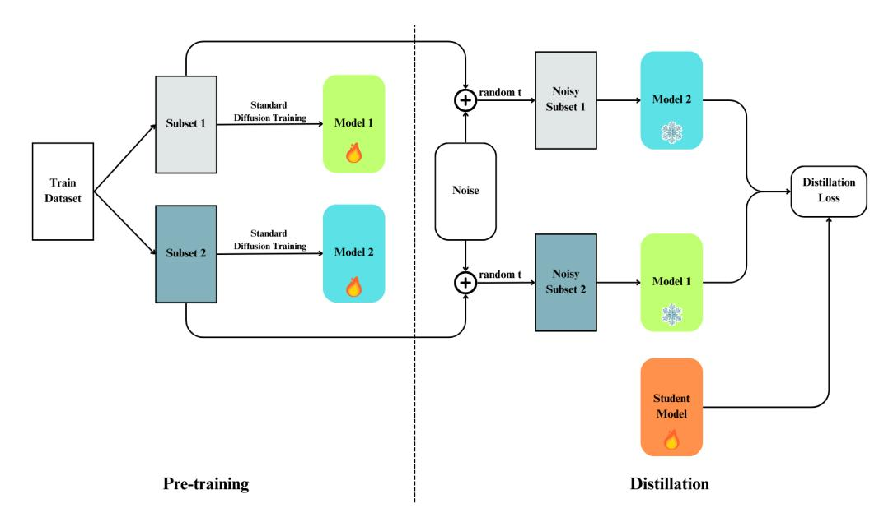
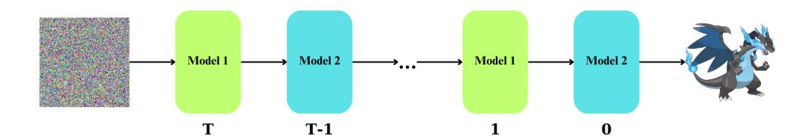
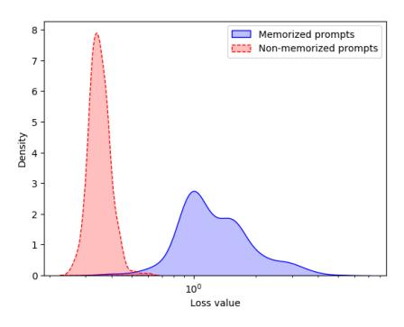

# DUAL-MODEL DEFENSE: SAFEGUARDING DIFFUSION MODELS FROM MEMBERSHIP INFERENCE ATTACKS THROUGH DISJOINT DATA SPLITTING

Bao Q. Tran<sup>∗</sup> , Viet Nguyen<sup>∗</sup> , Anh Tran, Toan Tran VinAI Research

v.{baotq4,vietnv18,anhtt152,toantm3}@vinai.io

## ABSTRACT

Diffusion models have demonstrated remarkable capabilities in image synthesis, but their recently proven vulnerability to Membership Inference Attacks (MIAs) poses a critical privacy concern. This paper introduces two novel and efficient approaches (DualMD and DistillMD) to protect diffusion models against MIAs while maintaining high utility. Both methods are based on training two separate diffusion models on disjoint subsets of the original dataset. DualMD then employs a private inference pipeline that utilizes both models. This strategy significantly reduces the risk of black-box MIAs by limiting the information any single model contains about individual training samples. The dual models can also generate "soft targets" to train a private student model in DistillMD, enhancing privacy guarantees against all types of MIAs. Extensive evaluations of DualMD and DistillMD against state-of-the-art MIAs across various datasets in white-box and black-box settings demonstrate their effectiveness in substantially reducing MIA success rates while preserving competitive image generation performance. Notably, our experiments reveal that DistillMD not only defends against MIAs but also mitigates model memorization, indicating that both vulnerabilities stem from overfitting and can be addressed simultaneously with our unified approach.

# 1 INTRODUCTION

In recent years, diffusion models [\(Sohl-Dickstein et al., 2015;](#page-12-0) [Ho et al., 2020;](#page-10-0) [Rombach et al., 2022\)](#page-11-0) have rapidly emerged as a powerful tool for image generation, outperforming traditional methods such as Generative Adversarial Networks (GANs) [\(Goodfellow et al., 2014\)](#page-10-1) and Variational Autoencoders (VAEs) [\(Kingma, 2013\)](#page-10-2). These models, including well-known examples like Stable Diffusion models [\(Rombach et al., 2022;](#page-11-0) [Podell et al., 2023\)](#page-11-1), DALL-E 2 [\(Ramesh et al., 2022\)](#page-11-2) and Imagen [\(Saharia et al., 2022\)](#page-11-3), utilize a progressive denoising process that results in higher-quality and more stable image generation compared to previous architectures. By gradually transforming random noise into clean images, diffusion models excel at producing detailed and realistic visuals across various applications, from graphic design to medical imaging.

However, the superior performance of diffusion models relies heavily on large and diverse datasets, which often include sensitive information such as copyrighted images, personal photos, medical data, and even stylistic elements from contemporary artists. The nature of these datasets poses significant privacy risks, as diffusion models can inadvertently memorize and reproduce parts of their training data during the generation [\(Carlini et al., 2023\)](#page-10-3). This replication of training data during inference makes diffusion models vulnerable to Membership Inference Attacks (MIAs) [\(Shokri et al.,](#page-11-4) [2017;](#page-11-4) [Matsumoto et al., 2023;](#page-11-5) [Wu et al., 2022\)](#page-12-1), which aim to determine whether specific samples are present in their training data. If a model has been trained on sensitive datasets, an attacker might extract or infer specific details about the data used in training, leading to unintended exposure of private or proprietary information.

Therefore, implementing robust defense mechanisms to protect against MIAs and other privacyrelated attacks is crucial. Existing defense methods for MIAs, such as those based on model dis-

<sup>∗</sup>Equal contribution.

tillation [\(Tang et al., 2022;](#page-12-2) [Shejwalkar & Houmansadr, 2021;](#page-11-6) [Mazzone et al., 2022\)](#page-11-7), have proven effective in image classification models by reducing overfitting and limiting memorization of training data. However, these approaches cannot be directly applied to diffusion models due to their unique structure and the resource-intensive nature of distillation processes, especially in large diffusion models.

To address these challenges, we propose a tailored distillation method optimized for diffusion models, namely DistillMD (see Fig. [1\)](#page-1-0), which is computationally efficient and effective in preventing MIAs. Compared to other distillation defenses, one key advantage of our method is that it does not require additional test data for the teacher to produce non-member labels. This limitation of other approaches hinders their applications in cases where we do not have much data to train and evaluate the models. To evaluate this benefit, we perform our defense in the model fine-tuning paradigm with a small dataset in Section [4.2.](#page-8-0)

<span id="page-1-0"></span>

Figure 1: Our proposed defense method DistillMD with model distillation. Two teacher models are trained on two disjoint subsets with standard diffusion models training (Left). A student model is then distilled from the two teachers using the distillation loss. Only one teacher model is used to produce the target noise given one data sample, and the teacher is chosen so that the input noisy image did not appear at its training subset in the previous phase (Right).

While effectively alleviating any attack, the distillation method often requires a high computational cost to train a student model, hindering the method's application to resource-constraint settings. For resource-constrained environments where the overhead of model distillation is impractical, we propose another dual-model defense (DualMD) method that does not require additional training other than the two teacher models but can still efficiently mitigate MIAs in black-box settings. The method is illustrated in Fig. [2.](#page-2-0)

Although the mentioned techniques can be effective for unconditional diffusion models, they can fail to protect conditional diffusion models due to the strong overfitting to the conditions. For example, [Pang & Wang](#page-11-8) [\(2023\)](#page-11-8) designed their attack to exploit this property using text prompts to guide diffusion models to produce images in a distribution close to the target images.

Prompt overfitting has been extensively studied in diffusion model memorization. For example, [Somepalli et al.](#page-12-3) [\(2023b\)](#page-12-3) observed that prompt overfitting plays a crucial role in model memorization and proposed several techniques to reduce the effect. [Wen et al.](#page-12-4) [\(2024\)](#page-12-4) further argued that some tokens can be more important than others to guide the generation. In Section [4.2,](#page-8-0) we show that DualMD and DistillMD alone cannot effectively defend against attacks utilizing the text guidance and propose a technique following [Somepalli et al.](#page-12-3) [\(2023b\)](#page-12-3) to diversify the training prompts. Although this simple approach is inspired by model memorization, it appears to be crucial to defend

<span id="page-2-0"></span>

Figure 2: The efficient defense method DualMD with modified inference pipeline. The two models, which are trained on disjointed subsets, are used to denoise images alternately.

against MIAs, as presented in Section [4.2.](#page-8-0) This implies a strong connection between the two areas, and we provide a more in-depth discussion in Section [3.6.](#page-6-0)

We summarize our contributions as follows:

- We propose two mitigation strategies to defend against Membership Inference Attacks (MIAs): DualMD, targeting black-box attacks via an inference-only approach, and DistillMD, which defends against both white-box and black-box attacks through a distillationbased method. Our evaluation reveals that the distillation approach is more suitable to maintain high generation quality of unconditional diffusion models, while dual-model inference better preserves the quality of text-to-image diffusion models.
- We evaluate the effectiveness of our methods in training large text-to-image diffusion models and propose a technique to prevent the models from overfitting to the prompts. Our experiments demonstrate that we can significantly reduce the risk of personal data leakage in both white-box and black-box settings.
- We show that memorization mitigation techniques can be applied to defend MIAs and that defending against MIAs can mitigate model memorization. To the best of our knowledge, we are the first to establish this connection between these two areas.

# 2 BACKGROUND AND RELATED WORK

Diffusion Models Recent breakthroughs in diffusion models have demonstrated remarkable success across various generative tasks. As powerful generative models, diffusion models [\(Sohl-](#page-12-0)[Dickstein et al., 2015;](#page-12-0) [Ho et al., 2020\)](#page-10-0) produce fascinating images by progressively denoising inputs. They first incorporate noise into data distributions through a forward process, then reverse this procedure to recover the original data. In particular, starting with an initial data original image x<sup>0</sup> sampled from a (unknown) distribution q(x0), the forward process gradually diffuses x<sup>0</sup> into a standard Gaussian noise x<sup>T</sup> ∼ N (0, I) through T consecutive timesteps, where I is the identity matrix. Specifically, at timestep t ∈ {1, . . . , T}, the diffusion process q(xt|xt−1) and the denoising process pθ(xt−1|xt) are defined as follows:

$$q(\mathbf{x}_{t}|\mathbf{x}_{t-1}) = \mathcal{N}(\mathbf{x}_{t}; \sqrt{1 - \beta_{t}}\mathbf{x}_{t-1}, \beta_{t}\mathbf{I}),$$

$$p_{\theta}(\mathbf{x}_{t-1}|\mathbf{x}_{t}) = \mathcal{N}(\mathbf{x}_{t-1}; \boldsymbol{\mu}_{\theta}(\mathbf{x}_{t}, t), \Sigma_{\theta}(\mathbf{x}_{t}, t)),$$
(1)

where β<sup>t</sup> ∈ (0, 1] is an increasing noise scheduling sequence. By denoting α<sup>t</sup> = 1 − β<sup>t</sup> and α¯<sup>t</sup> = Q<sup>t</sup> <sup>s</sup>=1 αs, the diffused image x<sup>t</sup> at timestep t has a closed form as follows:

$$\mathbf{x}_{t} = \sqrt{\bar{\alpha}_{t}}\mathbf{x}_{0} + \sqrt{1 - \bar{\alpha}_{t}}\boldsymbol{\epsilon}_{t}, \text{ where } \boldsymbol{\epsilon}_{t} \sim \mathcal{N}(0, \mathbf{I}).$$
 (2)

During the training process, a noise-predictor ϵ<sup>θ</sup> learns to estimate the noise ϵ that was previously added to x<sup>0</sup> by minimizing the denoising loss:

<span id="page-2-1"></span>
$$L(\theta) = \mathbb{E}_{\mathbf{x}_0, \epsilon, t} \left[ \| \epsilon - \epsilon_{\theta}(\mathbf{x}_t, t) \|^2 \right]. \tag{3}$$

After that, in the reverse diffusion process, a random Gaussian noise x<sup>T</sup> ∼ N (0, I) is iteratively denoised to reconstruct the original image x<sup>0</sup> ∈ q(x0). At each denoising step, using the output of the trained noise-predictor ϵθ, the mean of the less noisy image xt−<sup>1</sup> is computed as follows:

$$\boldsymbol{\mu}_{t} = \frac{1}{\sqrt{\alpha_{t}}} \left( \mathbf{x}_{t} - \frac{1 - \alpha_{t}}{\sqrt{1 - \bar{\alpha}_{t}}} \boldsymbol{\epsilon}_{\theta}(\mathbf{x}_{t}, t) \right). \tag{4}$$

Membership Inference Attacks The membership inference attacks (MIAs), introduced by [Shokri](#page-11-4) [et al.](#page-11-4) [\(2017\)](#page-11-4), aim to identify whether a specific data point was part of the model's training set. Based on the threat models or the level of access attackers have, MIAs can be classified into *white-box* and *black-box* attacks. *White-box* MIAs usually utilize the internal parameters and gradients of the diffusion model to perform threshold-based attacks [\(Hu & Pang, 2023;](#page-10-4) [Dubinski et al., 2023\)](#page-10-5), ´ gradient-based attacks [\(Pang et al., 2023\)](#page-11-9) and proximal initialization [\(Kong et al., 2024\)](#page-10-6). In contrast, *black-box* MIAs such as [Pang & Wang](#page-11-8) [\(2023\)](#page-11-8) target the output generated by the diffusion models without direct access to internal parameters. Studies have demonstrated that these attacks can effectively differentiate between training and non-training samples by analyzing the generated image quality [\(Wu et al., 2022;](#page-12-1) [Matsumoto et al., 2023;](#page-11-5) [Carlini et al., 2023\)](#page-10-3), and the estimation errors [\(Duan et al., 2023\)](#page-10-7). Moreover, [Li et al.](#page-11-10) [\(2024b\)](#page-11-10) recently find that fine-tuning models on small datasets can augment their vulnerability to MIAs.

Membership Inference Defenses Existing studies have demonstrated that overfitting in the threat models is a primary factor contributing to their vulnerability to MIAs. Consequently, various defenses have been proposed to counter MIAs, for example, by addressing overfitting, including techniques such as adversarial regularization [\(Hu et al., 2021\)](#page-10-8), dropout [\(Salem et al., 2018\)](#page-11-11), overconfidence reduction [\(Chen & Pattabiraman, 2023\)](#page-10-9), and early stopping [\(Song & Mittal, 2021\)](#page-12-5). Furthermore, differential privacy (DP) [\(Yeom et al., 2018;](#page-12-6) [Abadi et al., 2016;](#page-9-0) [Wu et al., 2019\)](#page-12-7) has been widely used to mitigate MIAs by limiting the influence of any training data point on the model. However, DP methods often face trade-offs between privacy and utility. Additionally, knowledge distillation-based defenses such as distillation for membership privacy [\(Shejwalkar & Houmansadr,](#page-11-6) [2021\)](#page-11-6) and complementary knowledge distillation [\(Zheng et al., 2021\)](#page-12-8) aim to protect against MIAs by transferring knowledge from unprotected models. More recently, multiple techniques [\(Tang et al.,](#page-12-2) [2022;](#page-12-2) [Mazzone et al., 2022;](#page-11-7) [Li et al., 2024a\)](#page-10-10) have been proposed to combine knowledge distillation with ensemble learning to preserve data privacy. Nevertheless, none of the methods are designed specifically for diffusion models which are usually large and constrained by resource limitation.

Diffusion Memorization and Mitigation It is widely recognized that generative language models pose a risk of replicating content from their training data [\(Carlini et al., 2021;](#page-10-11) [2022\)](#page-10-12). Similarly, [Webster](#page-12-9) [\(2023\)](#page-12-9) observe the same behavior of large diffusion models, while [Somepalli et al.](#page-12-10) [\(2023a\)](#page-12-10) argue that diffusion models trained on smaller datasets tend to produce images that closely resemble those in the training set. As the size of the training dataset increases, the likelihood of such replication decreases. Several mitigation strategies have been explored to address these issues of diffusion models by either modifying the text conditioning [\(Somepalli et al., 2023b;](#page-12-3) [Wen et al., 2024;](#page-12-4) [Ren](#page-11-12) [et al., 2024\)](#page-11-12), manipulating the guidance scale [\(Chen et al., 2024\)](#page-10-13), or model pruning [\(Struppek et al.;](#page-12-11) [Chavhan et al., 2024\)](#page-10-14).

## 3 METHODOLOGY

#### 3.1 MEMBERSHIP INFERENCE ATTACKS (MIAS) AND DEFENSES

Given an image x and a pre-trained diffusion model ϵ<sup>θ</sup> on the training dataset Dtrain. Denoting the test dataset by Dtest, the goal of MIAs [\(Shokri et al., 2017\)](#page-11-4) is to detect if this image belongs to Dtrain. By viewing this as a binary classification problem, we have the dataset B = {(x<sup>i</sup> , yi)} m <sup>i</sup>=1, where

$$y_i = \begin{cases} 1, & \text{if } \mathbf{x}_i \in D_{\text{train}} \\ 0, & \text{if } \mathbf{x}_i \notin D_{\text{train}}. \end{cases}$$

The task of MIAs then becomes to learn an attack function f<sup>ϵ</sup><sup>θ</sup> for the model ϵ<sup>θ</sup> to maximize the probability of f<sup>ϵ</sup><sup>θ</sup> (xi) = y<sup>i</sup> , i.e.,

$$\max_{\boldsymbol{f}_{\boldsymbol{\epsilon}_{\theta}}} \mathbb{P}\left(\boldsymbol{f}_{\boldsymbol{\epsilon}_{\theta}}\left(\mathbf{x}_{i}\right) = y_{i}\right).$$

The design of fϵ<sup>θ</sup> depends on the specific choice of attacks and the attack settings. For example, in white-box attacks, the attacker can access all or parts of the training configuration and the model ϵθ. In black-box attacks, the attacker can only access the images generated by the model. Regardless of the settings, MIAs are usually based on the assumption that the models overfit the training data. For example, consider diffusion models, in which the model ϵ<sup>θ</sup> takes the input image x, condition c (c = ∅ in unconditional case), timestep t ∈ {1, . . . , T} and a random noise ϵ ∼ N(0, I) to compute the denoising loss in Eq. [3,](#page-2-1) we have the following assumption:

$$\underset{\left(\mathbf{x}_{\text{train}},\,\mathbf{c}_{\text{train}}\right) \in D_{\text{train}}}{\mathbb{E}} \left[ \left\| \boldsymbol{\epsilon}_{\theta}\left(\mathbf{x}_{\text{train}},\mathbf{c}_{\text{train}},t\right) - \boldsymbol{\epsilon} \right\| \right] \leq \underset{\left(\mathbf{x}_{\text{test}},\,\mathbf{c}_{\text{test}}\right) \in D_{\text{test}}}{\mathbb{E}} \left[ \left\| \boldsymbol{\epsilon}_{\theta}\left(\mathbf{x}_{\text{test}},\mathbf{c}_{\text{test}},t\right) - \boldsymbol{\epsilon} \right\| \right].$$

The larger the gap between the two terms, the more accessible the attacker can extract the training data. Therefore, our defense aims to make this assumption less intense so that the attacker cannot separate member data from non-member data using this property. To this aim, we design a new training paradigm to minimize the gap between train and test data, which is equivalent to the following optimization problem:

<span id="page-4-3"></span>
$$\min_{\substack{\epsilon_{\theta} \\ (\mathbf{x}_{\text{train}}, \, \mathbf{c}_{\text{train}}) \in D_{\text{train}} \\ (\mathbf{x}_{\text{test}}, \, \mathbf{c}_{\text{test}}) \in D_{\text{test}}}} \mathbb{E}_{\substack{\theta \in \{0, 1\} \\ (\mathbf{x}_{\text{train}}, \, \mathbf{c}_{\text{train}}, \, \mathbf{c}_{\text{train}}, \, \mathbf{c}_{\text{train}}, \, \mathbf{c}_{\text{train}}, \, \mathbf{c}_{\text{train}}, \, \mathbf{c}_{\text{train}}, \, \mathbf{c}_{\text{train}}, \, \mathbf{c}_{\text{train}}, \, \mathbf{c}_{\text{train}}, \, \mathbf{c}_{\text{train}}, \, \mathbf{c}_{\text{train}}, \, \mathbf{c}_{\text{train}}, \, \mathbf{c}_{\text{train}}, \, \mathbf{c}_{\text{train}}, \, \mathbf{c}_{\text{train}}, \, \mathbf{c}_{\text{train}}, \, \mathbf{c}_{\text{train}}, \, \mathbf{c}_{\text{train}}, \, \mathbf{c}_{\text{train}}, \, \mathbf{c}_{\text{train}}, \, \mathbf{c}_{\text{train}}, \, \mathbf{c}_{\text{train}}, \, \mathbf{c}_{\text{train}}, \, \mathbf{c}_{\text{train}}, \, \mathbf{c}_{\text{train}}, \, \mathbf{c}_{\text{train}}, \, \mathbf{c}_{\text{train}}, \, \mathbf{c}_{\text{train}}, \, \mathbf{c}_{\text{train}}, \, \mathbf{c}_{\text{train}}, \, \mathbf{c}_{\text{train}}, \, \mathbf{c}_{\text{train}}, \, \mathbf{c}_{\text{train}}, \, \mathbf{c}_{\text{train}}, \, \mathbf{c}_{\text{train}}, \, \mathbf{c}_{\text{train}}, \, \mathbf{c}_{\text{train}}, \, \mathbf{c}_{\text{train}}, \, \mathbf{c}_{\text{train}}, \, \mathbf{c}_{\text{train}}, \, \mathbf{c}_{\text{train}}, \, \mathbf{c}_{\text{train}}, \, \mathbf{c}_{\text{train}}, \, \mathbf{c}_{\text{train}}, \, \mathbf{c}_{\text{train}}, \, \mathbf{c}_{\text{train}}, \, \mathbf{c}_{\text{train}}, \, \mathbf{c}_{\text{train}}, \, \mathbf{c}_{\text{train}}, \, \mathbf{c}_{\text{train}}, \, \mathbf{c}_{\text{train}}, \, \mathbf{c}_{\text{train}}, \, \mathbf{c}_{\text{train}}, \, \mathbf{c}_{\text{train}}, \, \mathbf{c}_{\text{train}}, \, \mathbf{c}_{\text{train}}, \, \mathbf{c}_{\text{train}}, \, \mathbf{c}_{\text{train}}, \, \mathbf{c}_{\text{train}}, \, \mathbf{c}_{\text{train}}, \, \mathbf{c}_{\text{train}}, \, \mathbf{c}_{\text{train}}, \, \mathbf{c}_{\text{train}}, \, \mathbf{c}_{\text{train}}, \, \mathbf{c}_{\text{train}}, \, \mathbf{c}_{\text{train}}, \, \mathbf{c}_{\text{train}}, \, \mathbf{c}_{\text{train}}, \, \mathbf{c}_{\text{train}}, \, \mathbf{c}_{\text{train}}, \, \mathbf{c}_{\text{train}}, \, \mathbf{c}_{\text{train}}, \, \mathbf{c}_{\text{train}}, \, \mathbf{c}_{\text{train}}, \, \mathbf{c}_{\text{train}}, \, \mathbf{c}_{\text{train}}, \, \mathbf{c}_{\text{train}}, \, \mathbf{c}_{\text{train}}, \, \mathbf{c}_{\text{train}}, \, \mathbf{c}_{\text{train}}, \, \mathbf{c}_{\text{train}}, \, \mathbf{c}_{\text{train}}, \, \mathbf{c}_{\text{train}}, \, \mathbf{c}_{\text{train}}, \, \mathbf{c}_{\text{train}}, \, \mathbf{c}_{\text{train}}, \, \mathbf{c}_{\text{train}}, \, \mathbf{c}_{\text{train}}, \, \mathbf{c}_{\text{train}}, \, \mathbf{c}_{\text{train}}, \, \mathbf{c}_{\text{train}}, \, \mathbf{c}_{\text{train}}, \, \mathbf{c}_{\text{train}}, \, \mathbf{c}_{\text{train}}, \, \mathbf{c}_{\text{train}}, \, \mathbf{c}_{\text{train}}, \, \mathbf{c}_{\text{train}}, \, \mathbf{c}_{\text{train}}, \, \mathbf{c}_{\text{train}}, \, \mathbf{c}$$

The key idea is to modify the training loss so that our models do not fit directly into the training set. For this aim, we train two teacher models on two disjoint datasets and then let them produce "soft targets" from the other dataset to train a student model. Since these targets are the outputs of teacher models to their "non-member" images, the outputs of the student model to these data will be close to their outputs to the test data. More details are presented in the following Sections [3.2](#page-4-0) and [3.3.](#page-4-1)

## <span id="page-4-0"></span>3.2 DISJOINT TRAINING

Although ensemble learning has been used to defend against MIAs in image classification models [\(Tang et al., 2022;](#page-12-2) [Li et al., 2024a\)](#page-10-10), they are not applicable to diffusion models, and the growing number of models poses a significant challenge when applying to large architectures. Therefore, we propose an efficient method with only two models on two disjoint subsets of the training data.

Formally, given a training dataset Dtrain, a test dataset Dtest, and an original learning model parameterized by θ. Our first step is to subdivide the training dataset into two disjoint subsets, and each is used to train a separate model, i.e., Dtrain = D<sup>1</sup> ∪ D2, where D<sup>1</sup> ∩ D<sup>2</sup> = ∅. The two trained models parameterized by θ<sup>1</sup> and θ2, respectively, can be used to generate images directly while keeping the privacy of both training subsets thanks to our customized inference pipeline proposed in Section [3.4.](#page-5-0) Alternatively, they can be distilled into a new private student model. Our basic assumption is that the two models "see" the training data of the other as test data, i.e.,

<span id="page-4-2"></span>
$$\mathbb{E}_{\substack{(\mathbf{x}_{2}, \mathbf{c}_{2}) \in D_{2} \\ t \in \{1, \dots, T\}}} \left[ \| \boldsymbol{\epsilon}_{\theta_{1}} \left( \mathbf{x}_{2}, \mathbf{c}_{2}, t \right) - \boldsymbol{\epsilon} \| \right] = \mathbb{E}_{\substack{(\mathbf{x}_{test}, \mathbf{c}_{test}) \in D_{test} \\ t \in \{1, \dots, T\}}} \left[ \| \boldsymbol{\epsilon}_{\theta_{1}} \left( \mathbf{x}_{test}, \mathbf{c}_{test}, t \right) - \boldsymbol{\epsilon} \| \right].$$

$$\mathbb{E}_{\substack{(\mathbf{x}_{1}, \mathbf{c}_{1}) \in D_{1} \\ t \in \{1, \dots, T\}}} \left[ \| \boldsymbol{\epsilon}_{\theta_{2}} \left( \mathbf{x}_{1}, \mathbf{c}_{1}, t \right) - \boldsymbol{\epsilon} \| \right] = \mathbb{E}_{\substack{(\mathbf{x}_{test}, \mathbf{c}_{test}) \in D_{test} \\ t \in \{1, \dots, T\}}} \left[ \| \boldsymbol{\epsilon}_{\theta_{2}} \left( \mathbf{x}_{test}, \mathbf{c}_{test}, t \right) - \boldsymbol{\epsilon} \| \right].$$

$$(6)$$

The two models are trained with the typical denoising loss as in Eq. [3.](#page-2-1) The details of that disjoint training mechanism is presented in Algorithm [1.](#page-5-1)

### <span id="page-4-1"></span>3.3 ALTERNATING DISTILLATION (DISTILLMD)

Choosing teacher models Based on the assumption given in Eq. [6,](#page-4-2) we alternately use the two teacher models to generate targets for the student model to learn from. Specifically, the first model θ1, which is trained on the first subset D1, will infer on the second subset D2, while the second model θ<sup>2</sup> trained on D<sup>2</sup> will infer on the first subset D1. Fig. [1](#page-1-0) illustrates the training pipeline, and the algorithm is described in Algorithm [2.](#page-5-2)

### <span id="page-5-1"></span>Algorithm 1 Disjoint Training with DDPM

```
Require: Training dataset Dtrain, number of time steps T, learning rate η
 1: Divide Dtrain into disjoint subsets D1 and D2
 2: Initialize two networks ϵθ1
                           and ϵθ2 with parameters θ1, θ2
 3: for i = 1, 2 do
 4: for number of training iterations do
 5: Take sample x0 ∼ Di
                              // Sample a data point from the corresponding data distribution
 6: Sample t ∼ Uniform({1, . . . , T}) // Randomly choose a time step
 7: Sample ϵ ∼ N (0, I) // Sample noise from a Gaussian
 8: Compute xt =
                     √
                      αtx0 +
                             √
                               1 − αtϵ // Diffuse data at time step t
 9: Compute loss: L = ∥ϵ − ϵθi
                                (xt, t)∥
                                      2
                                                                // Noise prediction loss
10: Update model parameters: θi ← θi − η∇θiL
11: end for
12: end for
13: return ϵθ1
             , ϵθ2
```

Distillation loss To prevent the student model from overfitting to training data, the real noise term in Equation [3](#page-2-1) is replaced by outputs of the teacher models as in Equation [7.](#page-5-3)

<span id="page-5-3"></span>
$$L(\theta) = \mathbb{E}_{\mathbf{x}_{0}, t} \left[ \| \operatorname{stopgrad}(\boldsymbol{\epsilon}_{\operatorname{teacher}}(\mathbf{x}_{t}, t)) - \boldsymbol{\epsilon}_{\theta}(\mathbf{x}_{t}, t) \|^{2} \right]. \tag{7}$$

By minimizing the loss in Eq. [7](#page-5-3) with suitable choices of the teacher models, we can make the outputs of the student model on train data closer to its outputs on test data. This closes the gap in Eq. [5](#page-4-3) thanks to the assumption provided in Eq. [6.](#page-4-2)

In practice, our defense method can effectively mitigate both white-box and black-box attacks while maximally preserving the generation capability of the model, as shown in Section [4.](#page-6-1)

#### <span id="page-5-2"></span>Algorithm 2 Alternating Distillation (DistillMD)

```
Require: Disjoint data subsets D1 and D2, denoising networks ϵθ1
                                                                     and ϵθ2
                                                                             , number of time steps
    T, number of distillation iterations n, learning rate η
```

```
1: Initialize student model ϵθ with parameters θs
2: for i ∈ n do
3: if i is even then
4: Sample x0 ∼ D1 // Sample a data point from the first subset
5: ϵteacher = ϵθ2
                                                // Take the second model as the teacher
6: else
7: Sample x0 ∼ D2 // Sample a data point from the second subset
8: ϵteacher = ϵθ1
                                                  // Take the first model as the teacher
9: end if
10: Sample t ∼ Uniform({1, . . . , T}) // Randomly choose a time step
11: Sample ϵ ∼ N (0, I) // Sample noise from a Gaussian
12: Compute xt =
                 √
                   αtx0 +
                         √
                           1 − αtϵ // Diffuse data at time step t
13: Compute loss: L = ∥stopgrad(ϵteacher(xt, t)) − ϵθs
                                              (xt, t)∥
                                                    2
                                                                // Distillation loss
14: Update model parameters: θs ← θs − η∇θsL
15: end for
16: return ϵθs
```

## <span id="page-5-0"></span>3.4 SELF-CORRECTING INFERENCE PIPELINE (DUALMD)

Motivation Black-box MIAs typically rely on training shadow models or assessing the distance between the target image and generated samples, exploiting the model's tendency to generate images close to its training data due to overfitting. However, our training paradigm ensures that for any given sample, there always exists a model that treats it as a test sample, enabling uniformly diverse sample generation.

Diffusion models uniquely require an iterative inference process that run the model multiple times. We leverage this characteristic by using our two teacher models to "correct" each other during inference. For instance, if the noisy image at time step t causes model 1 to produce output close to the target image, model 2 will generate a more uniformly distributed image at time step t − 1. This "self-correcting" inference process ensures diverse generation instead of concentration near training samples. Our experimental results in Section [4](#page-6-1) demonstrate that this method efficiently mitigates black-box MIAs on text-to-image diffusion models.

## 3.5 ENHANCING PRIVACY FOR CONDITIONAL DIFFUSION MODELS

Although disjoint training divides the data into disjoint subsets, text prompts in different subsets can still have overlapping words or textual styles that can be overfitted by both models. Therefore, we propose to enhance prompt diversity during training by using an image conditioning model to generate multiple prompts for each image of the training dataset. Then, a prompt is randomly sampled for each image in each epoch during training. More details about the limitations of DualMD and DistillMD on text-to-image diffusion models and the significance of prompt diversification are presented in Section [4.2.](#page-8-0)

## <span id="page-6-0"></span>3.6 MEMBERSHIP INFERENCE DEFENSES HELP MITIGATING DATA MEMORIZATION

Recently, an increasing body of research [\(Somepalli et al., 2023a](#page-12-10)[;b\)](#page-12-3) has highlighted the issue of data memorization in modern diffusion models, where some generated images are near-identical reproductions of images from the training datasets. Previous studies [\(Shokri et al., 2017;](#page-11-4) [Yeom et al.,](#page-12-6) [2018\)](#page-12-6) have shown that overfitting renders models vulnerable to MIAs. Given that data memorization is often considered a more extreme form of overfitting, this raises an important question: *Is there a connection between MIAs and data memorization?*

Our findings suggest that loss-based MIA techniques can effectively detect memorization in diffusion models. Specifically, we use the *t-error* (Eq. [8\)](#page-13-0) introduced by [Duan et al.](#page-10-7) [\(2023\)](#page-10-7) to detect whether the model memorizes a prompt. This detection is applied to a set of 500 memorized prompts and 500 non-memorized prompts [\(Wen et al., 2024\)](#page-12-4). The resulting detection performance is reported in Fig. [3,](#page-6-2) where it is evident that the loss function effectively distinguishes between memorized and non-memorized prompts. Given this observed link between data memorization and MIAs, we are led to explore a further question: *Can membership inference defenses help mitigate data memorization?*

<span id="page-6-2"></span>To investigate this, we conduct experiments on Stable Diffusion v1.5 [\(Rombach et al., 2022\)](#page-11-0) as detailed in Section [4.3.](#page-8-1) More information about the *t-error* and the memorization experiments are presented in Appendix [A.1.](#page-13-1)



Figure 3: Distribution of the values of the loss in Eq. [8](#page-13-0) between 500 memorized prompts and 500 non-memorized prompts on Stable Diffusion v1.5 [\(Rombach et al., 2022\)](#page-11-0).

## <span id="page-6-1"></span>4 EXPERIMENTS

We present the effectiveness of our defenses against white-box MIAs in Section [4.1](#page-7-0) and against black-box MIAs in Section [4.2.](#page-8-0) We also analyze the importance of prompt diversification in both

<span id="page-7-3"></span>Table 1: Quantitative evaluation of the quality of the defended models compared to the original model. Unconditional diffusion model is evaluated on CIFAR10 with DDPM, and text-to-image diffusion model is evaluated on Pokemon dataset with SDv1.5. Bold and underlined numbers are the best and the second best, respectively.

|                | CIFAR10 |        | Pokemon |        |  |
|----------------|---------|--------|---------|--------|--|
| Method         | FID (↓) | IS (↑) | FID (↓) | IS (↑) |  |
| Original model | 14.127  | 8.586  | 0.22    | 3.02   |  |
| DualMD         | 21.389  | 8.011  | 0.26    | 3.34   |  |
| DistillMD      | 14.192  | 8.391  | 0.44    | 3.52   |  |

cases and find that this technique slightly improves defense in white-box case and significantly enhances defense in black-box case.

Datasets We utilize various datasets to verify the effectiveness of the methods. The unconditional experiments use CIFAR10 [\(Krizhevsky et al., 2009\)](#page-10-15), CIFAR100 [\(Krizhevsky et al., 2009\)](#page-10-15), Tiny-ImageNet [\(Le & Yang\)](#page-10-16), and STL10-Unlabeled [\(Coates et al., 2011\)](#page-10-17) datasets. For the text-to-image experiments, we employ the popular Pokemon dataset [1](#page-7-1) . Each dataset is divided equally, with one half used for training the models (member set) and the other half serving as the non-member set.

In Sections [4.2](#page-8-0) and [4.3,](#page-8-1) we fine-tune the Stable Diffusion v1.5 (SDv1.5) [2](#page-7-2) [\(Rombach et al., 2022\)](#page-11-0) on Pokemon dataset so that it overfits to the dataset. We train the default DDPM [\(Ho et al., 2020\)](#page-10-0) from scratch for other datasets. More training details are given in Section [A.2.](#page-13-2)

Metrics Following [Kong et al.](#page-10-6) [\(2024\)](#page-10-6), we utilize Area Under the ROC Curve (AUC) and True Positive Rate when the False Positive Rate is 1% (TPR@1%FPR) as the key metrics to measure the vulnerability of the models to MIAs. Since we are defending MIAs, an AUC closer to 0.5 indicates better performance. For quality measurements, the popular Frenchet Inception Distance (FID) and Inception Score (IS) are measured. For unconditional models, FID and IS are computed on 25,000 generated images. In contrast, for text-to-image models, these metrics are calculated on images generated from training prompts.

Table [1](#page-7-3) presents the quantitative performance of our methods in terms of quality preservation compared to the baseline model. It can be seen that DistillMD shows superior quality preservation in unconditional models, whereas DualMD performs better for conditional models. Additionally, we later observe a similar trend in defending against MIAs, which indicates that DualMD is more effective for text-to-image diffusion models, while DistillMD is better suited for unconditional diffusion models.

## <span id="page-7-0"></span>4.1 WHITE-BOX ATTACKS

For white-box MIAs, we perform two attacks SecMIA [\(Duan et al., 2023\)](#page-10-7) and PIA [\(Kong et al.,](#page-10-6) [2024\)](#page-10-6) and defend against them with DistillMD. Since the attackers are assumed to have white-box access to the model, it is not realistic to perform DualMD defense. The results for unconditional diffusion models are given in Table [2,](#page-8-2) and for text-to-image diffusion models in Table [3.](#page-8-3) Although PIA cannot attack fine-tuned Stable Diffusion model, it is still clear that DistillMD significantly increases the privacy of both unconditional diffusion models and text-to-image diffusion models.

In the case of prompt diversification training, the BLIP model [\(Li et al., 2022\)](#page-11-13) is used to generate five prompts for each image. During training, one prompt is randomly drawn from the six (including the original) to serve as the text condition for the image. Our results show that this technique slightly improves the defense against white-box attacks.

<span id="page-7-1"></span><sup>1</sup><https://huggingface.co/datasets/lambdalabs/pokemon-blip-captions>

<span id="page-7-2"></span><sup>2</sup><https://huggingface.co/stable-diffusion-v1-5>

<span id="page-8-2"></span>Table 2: Effectiveness of our DistillMD against white-box MIAs on DDPM. The closer AUC to 0.5, the better. Bold numbers are the best.

|        |            |      | CIFAR10           |      | CIFAR100          |      | Tiny-ImageNet     |      | STL10-Unlabeled   |  |
|--------|------------|------|-------------------|------|-------------------|------|-------------------|------|-------------------|--|
| Attack | Method     | AUC  | TPR@1%<br>FPR (↓) | AUC  | TPR@1%<br>FPR (↓) | AUC  | TPR@1%<br>FPR (↓) | AUC  | TPR@1%<br>FPR (↓) |  |
| SecMIA | No defense | 0.93 | 0.35              | 0.96 | 0.45              | 0.96 | 0.53              | 0.94 | 0.30              |  |
|        | DistillMD  | 0.59 | 0.03              | 0.61 | 0.02              | 0.57 | 0.02              | 0.58 | 0.02              |  |
| PIA    | No defense | 0.89 | 0.13              | 0.88 | 0.14              | 0.84 | 0.08              | 0.83 | 0.09              |  |
|        | DistillMD  | 0.59 | 0.02              | 0.59 | 0.03              | 0.56 | 0.02              | 0.58 | 0.02              |  |

<span id="page-8-3"></span>Table 3: Effectiveness of our DistillMD against white-box MIAs on SDv1.5. The closer AUC to 0.5, the better. Bold numbers are the best.

|        |            | w/o prompt diversification |               |      | w/ prompt diversification |  |  |
|--------|------------|----------------------------|---------------|------|---------------------------|--|--|
| Attack | Method     | AUC                        | TPR@1%FPR (↓) | AUC  | TPR@1%FPR (↓)             |  |  |
| SecMIA | No defense | 0.99                       | 0.79          | 0.99 | 1.00                      |  |  |
|        | DistillMD  | 0.48                       | 0.02          | 0.44 | 0.01                      |  |  |
| PIA    | No defense | 0.46                       | 0.02          | 0.61 | 0.03                      |  |  |
|        | DistillMD  | 0.49                       | 0.01          | 0.50 | 0.02                      |  |  |

## <span id="page-8-0"></span>4.2 BLACK-BOX ATTACKS

For black-box MIAs, we employ the recently proposed attack in [Pang & Wang](#page-11-8) [\(2023\)](#page-11-8), which utilizes text guidance to augment the attack. The SDv1.5 model is fine-tuned on the Pokemon dataset with and without our methods. The results in Table [4](#page-8-4) show that training defenses alone cannot completely defend against MIAs. Unlike white-box attacks, both DistillMD and DualMD can only mitigate MIAs with the help of prompt diversification, which implies the importance of prompt overfitting. Moreover, DualMD can not only better preserve the generation quality but also better defend in the case of text-to-image diffusion models.

<span id="page-8-4"></span>Table 4: Effectiveness of our defenses against black-box MIA on SDv1.5. The closer AUC to 0.5, the better. Bold and underlined numbers are the best and the second best, respectively.

|                                   |                      | w/o prompt diversification | w/ prompt diversification |                         |  |
|-----------------------------------|----------------------|----------------------------|---------------------------|-------------------------|--|
| Method                            | AUC                  | TPR@1%FPR (↓)              | AUC                       | TPR@1%FPR (↓)           |  |
| No defense<br>DualMD<br>DistillMD | 0.90<br>0.82<br>0.66 | 0.57<br>0.35<br>0.09       | 0.45<br>0.52<br>0.46      | 0.009<br>0.014<br>0.005 |  |

## <span id="page-8-1"></span>4.3 MEMBERSHIP INFERENCE DEFENSES MITIGATE DATA MEMORIZATION

We use the fine-tuned SDv1.5 model using our methods to evaluate its capability of data memorization. For comparison, we employ the inference-time memorization mitigation method proposed by [Wen et al.](#page-12-4) [\(2024\)](#page-12-4), which reduces memorization by adjusting the prompt embedding to minimize the difference between unconditional and text-conditional noise predictions.

To measure the level of memorization, we calculate the SSCD similarity score [\(Pizzi et al., 2022;](#page-11-14) [Somepalli et al., 2023b\)](#page-12-3) between the generated images and the images in the training dataset, given the same set of prompts. In addition, the CLIP score [\(Radford et al., 2021\)](#page-11-15) is used to assess the alignment between the generated images and their corresponding prompts. A lower SSCD similarity score indicates reduced memorization, while a higher CLIP score reflects better alignment between the generated image and the prompt.

<span id="page-9-1"></span>Table 5: Mitigation results of our methods. Bold and underlined numbers are the best and the second best, respectively.

| Method            | SSCD (↓) | CLIP Scores (↑) |
|-------------------|----------|-----------------|
| No mitigation     | 0.60     | 0.26            |
| Wen et al. (2024) | 0.28     | 0.25            |
| DualMD            | 0.52     | 0.27            |
| DistillMD         | 0.27     | 0.28            |

Results and Discussion Table [5](#page-9-1) shows the effectiveness of our proposed method in mitigating data memorization. A thoroughly fine-tuned model without any mitigation produces highly similar images with an SSCD similarity score of 0.60 for given prompts, indicating significant memorization. In contrast, our DualMD and DistillMD approaches significantly reduce the SSCD score to 0.52 and 0.27, respectively, suggesting that membership inference defenses can help mitigate data memorization. Notably, both methods also show a slight improvement in CLIP scores. Furthermore, the method proposed by [Wen et al.](#page-12-4) [\(2024\)](#page-12-4), which directly targets mitigating memorization, achieves an SSCD similarity score of 0.28. Our DistillMD approach, despite being designed to defend against MIAs, not only reduces data memorization more effectively but also improves image-text alignment compared to the most recently proposed method in [Wen et al.](#page-12-4) [\(2024\)](#page-12-4).

# 5 CONCLUSION

This paper presents comprehensive and novel approaches to protect diffusion models against training data leakage while mitigating model memorization. Our methodology focuses on training two models using disjoint subsets of the training data. This results in two significant contributions, including DualMD for private inference and DistillMD for developing a privacy-enhanced student model. Both techniques effectively reduce model overfitting to training samples. We further enhance privacy protection for text-conditioned diffusion models by diversifying training prompts, preventing models from overfitting specific textual patterns. Notably, our experiments reveal that model memorization represents a more severe form of overfitting than membership inference attacks (MIAs), and our unified approach successfully addresses both vulnerabilities simultaneously, eliminating the need for separate mitigation strategies. In short, our paper presents inference-time and training-time strategies to defend diffusion models against MIAs. It provides new insights into the intersection between MIAs and model memorization, advancing our understanding of privacy preservation in generative models.

Limitations and Future Directions Our methods rely on dividing the training dataset into two halves, which may limit the generative capabilities of the teacher models in data-scarce scenarios. This limitation can affect the quality of the distilled model, as evidenced by the slight performance degradation shown in Table [1.](#page-7-3) Future research could focus on developing methods that allow models to leverage the entire dataset during training while maintaining strong privacy guarantees, potentially enhancing the performance of all models.

Furthermore, our inference-time defense method (DualMD) requires storing and alternating between two models, which may limit its applicability in resource-constrained environments. Future work could explore inference-time solutions that, like our DistillMD method, do not necessitate additional model storage while maintaining robust privacy protection.

## REFERENCES

<span id="page-9-0"></span>Martin Abadi, Andy Chu, Ian Goodfellow, H Brendan McMahan, Ilya Mironov, Kunal Talwar, and Li Zhang. Deep learning with differential privacy. In *Proceedings of the 2016 ACM SIGSAC conference on computer and communications security*, pp. 308–318, 2016.

- <span id="page-10-11"></span>Nicholas Carlini, Florian Tramer, Eric Wallace, Matthew Jagielski, Ariel Herbert-Voss, Katherine Lee, Adam Roberts, Tom Brown, Dawn Song, Ulfar Erlingsson, et al. Extracting training data from large language models. In *30th USENIX Security Symposium (USENIX Security 21)*, pp. 2633–2650, 2021.
- <span id="page-10-12"></span>Nicholas Carlini, Daphne Ippolito, Matthew Jagielski, Katherine Lee, Florian Tramer, and Chiyuan Zhang. Quantifying memorization across neural language models. *arXiv preprint arXiv:2202.07646*, 2022.
- <span id="page-10-3"></span>Nicolas Carlini, Jamie Hayes, Milad Nasr, Matthew Jagielski, Vikash Sehwag, Florian Tramer, Borja Balle, Daphne Ippolito, and Eric Wallace. Extracting training data from diffusion models. In *32nd USENIX Security Symposium (USENIX Security 23)*, pp. 5253–5270, 2023.
- <span id="page-10-14"></span>Ruchika Chavhan, Ondrej Bohdal, Yongshuo Zong, Da Li, and Timothy Hospedales. Memorized Images in Diffusion Models share a Subspace that can be Located and Deleted. *arXiv preprint arXiv:2406.18566*, 2024.
- <span id="page-10-13"></span>Chen Chen, Daochang Liu, and Chang Xu. Towards Memorization-Free Diffusion Models. In *Proceedings of the IEEE/CVF Conference on Computer Vision and Pattern Recognition*, pp. 8425– 8434, 2024.
- <span id="page-10-9"></span>Zitao Chen and Karthik Pattabiraman. Overconfidence is a dangerous thing: Mitigating membership inference attacks by enforcing less confident prediction. *arXiv preprint arXiv:2307.01610*, 2023.
- <span id="page-10-17"></span>Adam Coates, Andrew Ng, and Honglak Lee. An analysis of single-layer networks in unsupervised feature learning. In *Proceedings of the fourteenth international conference on artificial intelligence and statistics*, pp. 215–223. JMLR Workshop and Conference Proceedings, 2011.
- <span id="page-10-7"></span>Jinhao Duan, Fei Kong, Shiqi Wang, Xiaoshuang Shi, and Kaidi Xu. Are Diffusion Models Vulnerable to Membership Inference Attacks? In *Proceedings of the 40th International Conference on Machine Learning*, pp. 8717–8730. PMLR, July 2023. ISSN: 2640-3498.
- <span id="page-10-5"></span>Jan Dubinski, Antoni Kowalczuk, Stanisław Pawlak, Przemysław Rokita, Tomasz Trzci ´ nski, and ´ Paweł Morawiecki. Towards More Realistic Membership Inference Attacks on Large Diffusion Models, November 2023. arXiv:2306.12983 [cs].
- <span id="page-10-1"></span>Ian Goodfellow, Jean Pouget-Abadie, Mehdi Mirza, Bing Xu, David Warde-Farley, Sherjil Ozair, Aaron Courville, and Yoshua Bengio. Generative adversarial nets. *Advances in neural information processing systems*, 27, 2014.
- <span id="page-10-0"></span>Jonathan Ho, Ajay Jain, and Pieter Abbeel. Denoising diffusion probabilistic models. *Advances in neural information processing systems*, 33:6840–6851, 2020.
- <span id="page-10-4"></span>Hailong Hu and Jun Pang. Loss and likelihood based membership inference of diffusion models. In *International Conference on Information Security*, pp. 121–141. Springer, 2023.
- <span id="page-10-8"></span>Hongsheng Hu, Zoran Salcic, Gillian Dobbie, Yi Chen, and Xuyun Zhang. Ear: an enhanced adversarial regularization approach against membership inference attacks. In *2021 International Joint Conference on Neural Networks (IJCNN)*, pp. 1–8. IEEE, 2021.
- <span id="page-10-2"></span>Diederik P Kingma. Auto-encoding variational bayes. *arXiv preprint arXiv:1312.6114*, 2013.
- <span id="page-10-6"></span>Fei Kong, Jinhao Duan, RuiPeng Ma, Heng Tao Shen, Xiaoshuang Shi, Xiaofeng Zhu, and Kaidi Xu. An efficient membership inference attack for the diffusion model by proximal initialization. In *The Twelfth International Conference on Learning Representations*, 2024.
- <span id="page-10-15"></span>Alex Krizhevsky et al. Learning multiple layers of features from tiny images. 2009.
- <span id="page-10-16"></span>Ya Le and Xuan Yang. Tiny imagenet visual recognition challenge.
- <span id="page-10-10"></span>Jiacheng Li, Ninghui Li, and Bruno Ribeiro. MIST: Defending against membership inference attacks through Membership-Invariant Subspace Training. In *33rd USENIX Security Symposium (USENIX Security 24)*, pp. 2387–2404, 2024a.

- <span id="page-11-13"></span>Junnan Li, Dongxu Li, Caiming Xiong, and Steven Hoi. BLIP: Bootstrapping Language-Image Pre-training for Unified Vision-Language Understanding and Generation, February 2022. arXiv:2201.12086 [cs].
- <span id="page-11-10"></span>Zhangheng Li, Junyuan Hong, Bo Li, and Zhangyang Wang. Shake to Leak: Fine-tuning Diffusion Models Can Amplify the Generative Privacy Risk. In *2024 IEEE Conference on Secure and Trustworthy Machine Learning (SaTML)*, pp. 18–32. IEEE, 2024b.
- <span id="page-11-5"></span>Tomoya Matsumoto, Takayuki Miura, and Naoto Yanai. Membership Inference Attacks against Diffusion Models, March 2023. arXiv:2302.03262 [cs].
- <span id="page-11-7"></span>Federico Mazzone, Leander Van Den Heuvel, Maximilian Huber, Cristian Verdecchia, Maarten Everts, Florian Hahn, and Andreas Peter. Repeated Knowledge Distillation with Confidence Masking to Mitigate Membership Inference Attacks. In *Proceedings of the 15th ACM Workshop on Artificial Intelligence and Security*, pp. 13–24, Los Angeles CA USA, November 2022. ACM.
- <span id="page-11-8"></span>Yan Pang and Tianhao Wang. Black-box membership inference attacks against fine-tuned diffusion models. *arXiv preprint arXiv:2312.08207*, 2023.
- <span id="page-11-9"></span>Yan Pang, Tianhao Wang, Xuhui Kang, Mengdi Huai, and Yang Zhang. White-box Membership Inference Attacks against Diffusion Models, October 2023. arXiv:2308.06405 [cs].
- <span id="page-11-14"></span>Ed Pizzi, Sreya Dutta Roy, Sugosh Nagavara Ravindra, Priya Goyal, and Matthijs Douze. A selfsupervised descriptor for image copy detection. In *Proceedings of the IEEE/CVF Conference on Computer Vision and Pattern Recognition*, pp. 14532–14542, 2022.
- <span id="page-11-1"></span>Dustin Podell, Zion English, Kyle Lacey, Andreas Blattmann, Tim Dockhorn, Jonas Muller, Joe ¨ Penna, and Robin Rombach. Sdxl: Improving latent diffusion models for high-resolution image synthesis. *arXiv preprint arXiv:2307.01952*, 2023.
- <span id="page-11-15"></span>Alec Radford, Jong Wook Kim, Chris Hallacy, Aditya Ramesh, Gabriel Goh, Sandhini Agarwal, Girish Sastry, Amanda Askell, Pamela Mishkin, Jack Clark, et al. Learning transferable visual models from natural language supervision. In *International conference on machine learning*, pp. 8748–8763. PMLR, 2021.
- <span id="page-11-2"></span>Aditya Ramesh, Prafulla Dhariwal, Alex Nichol, Casey Chu, and Mark Chen. Hierarchical textconditional image generation with clip latents. *arXiv preprint arXiv:2204.06125*, 1(2):3, 2022.
- <span id="page-11-12"></span>Jie Ren, Yaxin Li, Shenglai Zen, Han Xu, Lingjuan Lyu, Yue Xing, and Jiliang Tang. Unveiling and Mitigating Memorization in Text-to-image Diffusion Models through Cross Attention. *arXiv preprint arXiv:2403.11052*, 2024.
- <span id="page-11-0"></span>Robin Rombach, Andreas Blattmann, Dominik Lorenz, Patrick Esser, and Bjorn Ommer. High- ¨ resolution image synthesis with latent diffusion models. In *Proceedings of the IEEE/CVF conference on computer vision and pattern recognition*, pp. 10684–10695, 2022.
- <span id="page-11-3"></span>Chitwan Saharia, William Chan, Saurabh Saxena, Lala Li, Jay Whang, Emily L Denton, Kamyar Ghasemipour, Raphael Gontijo Lopes, Burcu Karagol Ayan, Tim Salimans, et al. Photorealistic text-to-image diffusion models with deep language understanding. *Advances in neural information processing systems*, 35:36479–36494, 2022.
- <span id="page-11-11"></span>Ahmed Salem, Yang Zhang, Mathias Humbert, Pascal Berrang, Mario Fritz, and Michael Backes. Ml-leaks: Model and data independent membership inference attacks and defenses on machine learning models. *arXiv preprint arXiv:1806.01246*, 2018.
- <span id="page-11-6"></span>Virat Shejwalkar and Amir Houmansadr. Membership privacy for machine learning models through knowledge transfer. In *Proceedings of the AAAI conference on artificial intelligence*, volume 35, pp. 9549–9557, 2021.
- <span id="page-11-4"></span>Reza Shokri, Marco Stronati, Congzheng Song, and Vitaly Shmatikov. Membership inference attacks against machine learning models. In *2017 IEEE symposium on security and privacy (SP)*, pp. 3–18. IEEE, 2017.

- <span id="page-12-0"></span>Jascha Sohl-Dickstein, Eric Weiss, Niru Maheswaranathan, and Surya Ganguli. Deep unsupervised learning using nonequilibrium thermodynamics. In *International conference on machine learning*, pp. 2256–2265. PMLR, 2015.
- <span id="page-12-10"></span>Gowthami Somepalli, Vasu Singla, Micah Goldblum, Jonas Geiping, and Tom Goldstein. Diffusion art or digital forgery? investigating data replication in diffusion models. In *Proceedings of the IEEE/CVF Conference on Computer Vision and Pattern Recognition*, pp. 6048–6058, 2023a.
- <span id="page-12-3"></span>Gowthami Somepalli, Vasu Singla, Micah Goldblum, Jonas Geiping, and Tom Goldstein. Understanding and mitigating copying in diffusion models. *Advances in Neural Information Processing Systems*, 36:47783–47803, 2023b.
- <span id="page-12-12"></span>Jiaming Song, Chenlin Meng, and Stefano Ermon. Denoising diffusion implicit models. In *International Conference on Learning Representations*, 2021.
- <span id="page-12-5"></span>Liwei Song and Prateek Mittal. Systematic evaluation of privacy risks of machine learning models. In *30th USENIX Security Symposium (USENIX Security 21)*, pp. 2615–2632, 2021.
- <span id="page-12-11"></span>Lukas Struppek, Dominik Hintersdorf, Kristian Kersting, Adam Dziedzic, and Franziska Boenisch. Finding NeMo: Localizing Neurons Responsible For Memorization in Diffusion Models. In *ICML 2024 Workshop on Foundation Models in the Wild*.
- <span id="page-12-2"></span>Xinyu Tang, Saeed Mahloujifar, Liwei Song, Virat Shejwalkar, Milad Nasr, Amir Houmansadr, and Prateek Mittal. Mitigating membership inference attacks by Self-Distillation through a novel ensemble architecture. In *31st USENIX Security Symposium (USENIX Security 22)*, pp. 1433– 1450, Boston, MA, August 2022. USENIX Association.
- <span id="page-12-9"></span>Ryan Webster. A Reproducible Extraction of Training Images from Diffusion Models, May 2023. arXiv:2305.08694 [cs].
- <span id="page-12-4"></span>Yuxin Wen, Yuchen Liu, Chen Chen, and Lingjuan Lyu. Detecting, explaining, and mitigating memorization in diffusion models. In *The Twelfth International Conference on Learning Representations*, 2024.
- <span id="page-12-7"></span>Bingzhe Wu, Shiwan Zhao, Chaochao Chen, Haoyang Xu, Li Wang, Xiaolu Zhang, Guangyu Sun, and Jun Zhou. Generalization in generative adversarial networks: A novel perspective from privacy protection. *Advances in Neural Information Processing Systems*, 32, 2019.
- <span id="page-12-1"></span>Yixin Wu, Ning Yu, Zheng Li, Michael Backes, and Yang Zhang. Membership inference attacks against text-to-image generation models. *arXiv preprint arXiv:2210.00968*, 2022.
- <span id="page-12-6"></span>Samuel Yeom, Irene Giacomelli, Matt Fredrikson, and Somesh Jha. Privacy risk in machine learning: Analyzing the connection to overfitting. In *2018 IEEE 31st Computer Security Foundations Symposium (CSF)*, pp. 268–282, 2018. doi: 10.1109/CSF.2018.00027.
- <span id="page-12-8"></span>Junxiang Zheng, Yongzhi Cao, and Hanpin Wang. Resisting membership inference attacks through knowledge distillation. *Neurocomputing*, 452:114–126, 2021.

# A APPENDIX

#### <span id="page-13-1"></span>A.1 SECMI LOSS

Diffusion models optimize the variational bound pθ(x0) by matching the forward process posteriors at each step t. The local estimation error for a data point x<sup>0</sup> at time t is then expressed as:

$$\ell_{t,\mathbf{x}_0} = ||\hat{\mathbf{x}}_{t-1} - \mathbf{x}_{t-1}||^2,$$

where xt−<sup>1</sup> ∼ q(xt−1|xt, x0) and xˆt−<sup>1</sup> ∼ pθ(xt−1|xt). Due to the non-deterministic nature of the diffusion and denoising processes, calculating this directly is intractable. Instead, deterministic processes are used to approximate these errors:

$$\mathbf{x}_{t+1} = \phi_{\theta}(\mathbf{x}_{t}, t) = \sqrt{\bar{\alpha}_{t+1}} f_{\theta}(\mathbf{x}_{t}, t) + \sqrt{1 - \bar{\alpha}_{t+1}} \epsilon_{\theta}(\mathbf{x}_{t}, t),$$

$$\mathbf{x}_{t-1} = \psi_{\theta}(\mathbf{x}_{t}, t) = \sqrt{\bar{\alpha}_{t-1}} f_{\theta}(\mathbf{x}_{t}, t) + \sqrt{1 - \bar{\alpha}_{t-1}} \epsilon_{\theta}(\mathbf{x}_{t}, t),$$

where f<sup>θ</sup> (xt, t) = <sup>x</sup>t<sup>−</sup> 1−α¯tϵθ(xt,t) √ α¯<sup>t</sup> . Define Φ<sup>θ</sup> (xs, t) as the deterministic reverse and Ψ<sup>θ</sup> (xt, s) as the deterministic denoise process:

$$\mathbf{x}_{t} = \Phi_{\theta} \left( \mathbf{x}_{s}, t \right) = \phi_{\theta} \left( \cdots \phi_{\theta} \left( \phi_{\theta} \left( \mathbf{x}_{s}, s \right), s+1 \right), t-1 \right)$$

$$\mathbf{x}_{s} = \Psi_{\theta} \left( \mathbf{x}_{t}, s \right) = \psi_{\theta} \left( \cdots \psi_{\theta} \left( \psi_{\theta} \left( \mathbf{x}_{t}, t \right), t-1 \right), s+1 \right)$$

[Duan et al.](#page-10-7) [\(2023\)](#page-10-7) define SecMI loss or *t-error* as the approximated posterior estimation error at step t:

<span id="page-13-0"></span>
$$\tilde{\ell}_{t,\mathbf{x}_0} = ||\psi_{\theta}(\phi_{\theta}(\tilde{\mathbf{x}}_t, t), t) - \tilde{\mathbf{x}}_t||^2, \tag{8}$$

given sample x<sup>0</sup> ∈ D and the deterministic reverse result x˜<sup>t</sup> = Φ<sup>θ</sup> (x0, t) at timestep t.

This SecMI loss helps identify memberships as member samples tend to have lower *t-errors* compared to hold-out samples. We leverage this *t-error* to separate memorized and non-memorized prompts. The experiment is performed similar to [Wen et al.](#page-12-4) [\(2024\)](#page-12-4) in which we plot the distribution of the loss values of the member set and the hold-out set. We utilize 500 memorized prompts of Stable Diffusion v1 extracted by [Webster](#page-12-9) [\(2023\)](#page-12-9) for the member set, and 500 non-memorized prompts that are randomly sampled from the Lexica.art prompt set [3](#page-13-3) for the hold-out set. The result is illustrated in Fig. [3.](#page-6-2)

### <span id="page-13-2"></span>A.2 TRAINING DETAILS

#### A.2.1 DATASET

<span id="page-13-4"></span>Table [6](#page-13-4) provides a summary of the diffusion models used, the datasets, and the details of the data splits.

Table 6: Adopted diffusion models and datasets.

| Model  | Dataset         | Resolution | # Train | # Test | Condition |
|--------|-----------------|------------|---------|--------|-----------|
|        | CIFAR10         | 32         | 25,000  | 25,000 | -         |
| DDPM   | CIFAR100        | 32         | 25,000  | 25,000 | -         |
|        | STL10-Unlabeled | 32         | 50,000  | 50,000 | -         |
|        | Tiny-ImageNet   | 32         | 50,000  | 50,000 | -         |
| SDv1.5 | Pokemon         | 512        | 416     | 417    | text      |

<span id="page-13-3"></span><sup>3</sup><https://huggingface.co/datasets/Gustavosta/Stable-Diffusion-Prompts>

## A.2.2 TRAINING AND ATTACK HYPERPARAMETERS

According to [Matsumoto et al.](#page-11-5) [\(2023\)](#page-11-5), the vulnerability of the models to MIAs increases with the number of training steps because overfitting makes the models more susceptible to attacks. Therefore, in order to ensure a fair comparison, we train both the baseline model, the two models trained on two disjoint subsets, and the distilled model with a same number of training steps.

For unconditional diffusion models, we train all the models for 780,000 iterations with a batch size of 128, a learning rate of 2e-4.

For SDv1.5, we use the Huggingface Diffusers codebase [4](#page-14-0) to fine-tune the model in 20,000 iterations, with batch size of 16 and learning rate of 1e-5.

For white-box attacks on all models, we use the codebase and default settings of SecMIA [5](#page-14-1) [\(Duan](#page-10-7) [et al., 2023\)](#page-10-7) and PIA [6](#page-14-2) [\(Kong et al., 2024\)](#page-10-6)

For black-box attacks on SDv1.5, we generate 3 images for each prompt, each is generated using DDIM [\(Song et al., 2021\)](#page-12-12) with 50 inference steps.

For evaluating data memorization in Section [4.3,](#page-8-1) we use the codebase from [\(Wen et al., 2024\)](#page-12-4) [7](#page-14-3)

<span id="page-14-0"></span><sup>4</sup>[https://github.com/huggingface/diffusers/blob/main/examples/text\\_to\\_](https://github.com/huggingface/diffusers/blob/main/examples/text_to_image/README.md) [image/README.md](https://github.com/huggingface/diffusers/blob/main/examples/text_to_image/README.md)

<span id="page-14-1"></span><sup>5</sup><https://github.com/jinhaoduan/SecMI>

<span id="page-14-2"></span><sup>6</sup><https://github.com/kong13661/PIA>

<span id="page-14-3"></span><sup>7</sup>[https://github.com/YuxinWenRick/diffusion\\_memorization](https://github.com/YuxinWenRick/diffusion_memorization)