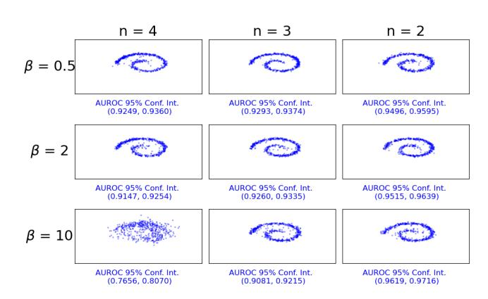
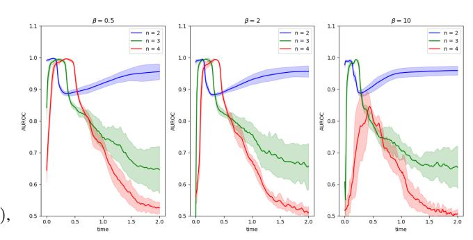
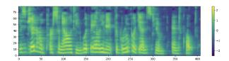
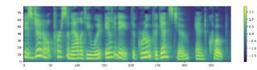

# DEFENDING DIFFUSION MODELS AGAINST MEMBERSHIP INFERENCE ATTACKS VIA HIGHER-ORDER LANGEVIN DYNAMICS

*Benjamin Sterling*1 *, Yousef El-Laham*2 *, Monica F. Bugallo ´* 2

1Department of Applied Math & Statistics, Stony Brook University, Stony Brook, NY, USA 2Department of Electrical and Computer Engineering, Stony Brook University, Stony Brook, NY, USA {benjamin.sterling, yousef.ellaham, monica.bugallo}@stonybrook.edu

#### ABSTRACT

Recent advances in generative artificial intelligence applications have raised new data security concerns. This paper focuses on defending diffusion models against membership inference attacks. This type of attack occurs when the attacker can determine if a certain data point was used to train the model. Although diffusion models are intrinsically more resistant to membership inference attacks than other generative models, they are still susceptible. The defense proposed here utilizes critically-damped higher-order Langevin dynamics, which introduces several auxiliary variables and a joint diffusion process along these variables. The idea is that the presence of auxiliary variables mixes external randomness that helps to corrupt sensitive input data earlier on in the diffusion process. This concept is theoretically investigated and validated on a toy dataset and a speech dataset using the Area Under the Receiver Operating Characteristic (AUROC) curves and the FID metric.

*Index Terms*— diffusion models, Langevin dynamics, membership privacy, data security.

# 1. INTRODUCTION

Diffusion models [\[1,](#page-3-0) [2\]](#page-3-1) have been shown to be fundamentally less susceptible to data security issues than other generative models such as GANs [\[3\]](#page-3-2). However, recent work has shown that they are still vulnerable to Backdoor Attacks, Membership Inference Attacks (MIA), and Adversarial Attacks [\[4\]](#page-3-3). Defense against MIA is desirable, especially if the model is trained on sensitive data, such as medical data or sensitive Intellectual Property. The standard for privacy surrounding Diffusion Models is Differentially Private Diffusion Models (DPDM) [\[5\]](#page-3-4). DPDM combines the Differentially Private Stochastic Gradient Descent (DP-SGD) technique [\[6\]](#page-3-5) and continuous-time diffusion models [\[7\]](#page-3-6). The quality of the samples generated with this method is directly related to the level of privacy chosen. This is commonly known as the privacy versus utility tradeoff.

Concurrently, the use of critically-damped and higher-order Langevin dynamics has been explored in other works with regards to continuous-time diffusion models. The seminal work of [\[8\]](#page-3-7) introduced critically-damped Langevin dynamics (CLD), where a single auxiliary variable denoted *velocity* was augmented to the diffusion process to smooth the stochastic process trajectories. Smoothing is often desirable because it resembles the continuity of real-world

THIS WORK HAS BEEN SUBMITTED TO THE IEEE FOR POS-SIBLE PUBLICATION. COPYRIGHT MAY BE TRANSFERRED WITH-OUT NOTICE, AFTER WHICH THIS VERSION MAY NO LONGER BE ACCESSIBLE.

data. Third-Order Langevin-Dynamics (TOLD) [\[9\]](#page-3-8) were introduced after CLD to add another auxiliary variable called *acceleration*, which had the effect of adding an extra smoothing component to the data. The authors additionally proposed in theory how to implement Higher-Order Langevin dynamics (HOLD) [\[9\]](#page-3-8). Since its invention, TOLD has been used in audio generation [\[10\]](#page-3-9) and image restoration tasks [\[11\]](#page-3-10). One further improvement to TOLD/HOLD is to reparameterize so that the diffusion process is critically-damped, resulting in critically-damped higher-order Langevin dynamics (HOLD++) [\[12\]](#page-3-11). It can be shown that critical damping is an optimal strategy in terms of convergence of the forward process. This makes HOLD++ an ideal tool to analyze how model dimensionality, among other factors, influences Membership Privacy.

Around the same time differential privacy was applied to diffusion models, there have been independently-developed attacks targeting diffusion models. The first such MIA, to our knowledge, was SecMI [\[13\]](#page-3-12). It was developed only to target discrete diffusion models. It uses the diffusion model's trained score network to approximate the forward and backward processes as deterministic processes, and it exploits the fact that the score network is optimized only on training data. The same authors further refine SecMI to Proximal Initialization (PIA) [\[14\]](#page-4-0). It exploits the same nature of the score network that SecMI does, but it also provides a continuous-time version.

The goal of this work is to enhance the defenses of diffusion models against membership inference attacks, beyond standard differential privacy. Currently, the main defenses against membership inference attacks fall into the categories of differential privacy, L2 regularization, and knowledge distillation [\[4\]](#page-3-3). Our focus is on applying Critically-Damped Higher-Order Langevin Dynamics (HOLD++) [\[15\]](#page-4-1) to achieve a base level of differential privacy, and arguing that it theoretically defends against real-world membership inference attacks. This theoretical defense is validated on both a toy and speech dataset.

## 2. BACKGROUND

Here we will briefly review how traditional continuous diffusion models [\[7\]](#page-3-6) apply to PIA; PIA will be used as a representative of such membership inference attacks. Diffusion models are a method of generating samples from an unknown intractable data distribution. They possess a forward process that transforms training data into noise, for the purpose of learning the score, and a backward process, for the purpose of generating synthetic samples from the data distribution. If the forward process of our model is dxt = f t(xt)dt + gtdw, then the deterministic reverse process is dxt = ft(xt) − 1 2 g 2 t ∇xt log pt(x) dt [\[7\]](#page-3-6). In practice, ∇xt log pt(xt) is estimated with a neural network sθ(xt, t). The PIA approach is to calculate the following attack metric for different data points:

$$R_{t,p} = \left\| \mathbf{f}_t(\mathbf{x}_t) - \frac{1}{2} g_t^2 \mathbf{s}_{\theta}(\mathbf{x}_t, t) \right\|_p,$$

where ||.||p denotes the p-norm. The metric may be interpreted as the jump-size of the process. Data points with a comparatively lower attack metric are more likely to be within the training dataset because sθ(xt, t) were trained with them. Therefore, PIA thresholds this metric and uses threshold testing to classify training and hold out data.

### 3. PROBLEM FORMULATION

This section will review HOLD++ and how to apply PIA to this specific diffusion method. It is argued here that HOLD++ is better at defending against PIA than traditional diffusion models because of its structure. Following [\[15\]](#page-4-1) and the previous section, we define the forward SDE of HOLD++ as: dxt = F Pxtdt + Gdw, where w is a standard Brownian motion. F = n−1 i=1 γi (Ei,i+1 − Ei+1,i) − ξEn,n, G = p 2ξL−1En,n, F = F ⊗ Id, and G = G ⊗ Id, Ei,j is the zero matrix with a single 1 position (i, j), and γ1, . . . γn−1, ξ are HOLD++ parameters. Here, the data variable is represented by q0, auxiliary variables are drawn according to p0, s0, . . . ∼ N (0, βL−1 I), and x0 = (q T 0 , p T 0 , s T 0 , . . .) T . It is shown in detail in [\[15\]](#page-4-1) that the mean and covariance of the forward process are given by:

$$\mu_t = \exp(\mathcal{F}t)\mathbf{x}_0,$$
  
$$\Sigma_t = L^{-1}\mathbf{I} + \exp(\mathcal{F}t)\left(\mathbf{\Sigma}_0 - L^{-1}\mathbf{I}\right)\exp(\mathcal{F}t)^T,$$
 (1)

where exp(·) is the matrix exponential map. One may sample from this distribution by taking the Cholesky Decomposition of Σt, Lt, and performing

$$\mathbf{x}_t = \boldsymbol{\mu}_t + \mathbf{L}_t \boldsymbol{\epsilon},\tag{2}$$

where ϵ = (ϵ T 1 , ϵ T 2 , . . . ϵ T n ) T and ϵ1, ϵ2 . . . ϵn ∼ N (0, I).

When the PIA attack metric Rt,p is adapted to the HOLD++ SDE, it becomes:

$$R_{t,p} = \left\| \mathcal{F} \mathbf{x}_t - \frac{1}{2} \mathcal{G} \mathcal{G}^T \mathbf{S}_{\theta}(\mathbf{x}_t, t) \right\|_p,$$

where Sθ(xt, t) = (0 T , . . . 0 T , sθ(xt, t) T ) T . The true scores of the first (n − 1)d entries are replaced with "0" because they all cancel with GGT . In this expression xt is estimated deterministically with [\(2\)](#page-1-0) using sθ(x0, 0) to estimate ϵn with ϵn ≈ −sθ(x0, 0)L0[−1, −1], where L0[−1, −1] denotes the matrix element in the final row and column. We may even further simplify the attack metric as: Rt,p = Fxt − ξL−1Sθ(xt, t) p .

The specifics of this attack using HOLD++ are summarized in Algorithm [1.](#page-1-1) With regular diffusion processes, sθ(x0, 0) is all one would need to estimate xt, but in the HOLD++ context, this quantity only informs us of the score function of the last auxiliary variable. Ideally, one would use ϵ1, ϵ2, . . . ϵn−1 ∼ N (0, Id) to match the true distribution of xt, but doing so defeats the purpose of using a deterministic attack metric. Therefore, the best thing one can do is set ϵ1, ϵ2, . . . ϵn−1 = 0. This work has attempted both, but only presents the results for ϵ1, ϵ2, . . . ϵn−1 = 0 as they are a more effective attack. Additionally, this work sets the auxiliary variables to zero during attack time, to avoid additional randomness. The attack metric involving GGT derives from the reverse deterministic process of the forward SDE [\[7\]](#page-3-6).

#### Algorithm 1 PIA Attack with HOLD++

- 1: Input: Data point q0 and Score Network sθ, threshold τ . 2: x0 ← (q T 0 , 0 T , 0 , . . . 0 T ) T 3: for k = 1 to ntime do 4: t ← (k − 1)T /ntime, Calculate µt , Σt, Lt using [\(1\)](#page-1-2). 5: ϵn ← −sθ(x0, 0)L0[−1, −1] 6: ϵfull ← 0 T , 0 T , . . . 0 T , ϵ T n T 7: xt ← µt + Ltϵfull 8: R[ntime] ← Fxt − ξL−1Sθ(xt, t)
- 9: end for
- 10: Hypothesis Test used to generate ROC Curves:

11: R¯ ← 1 ntime Pntime k=1 R[k], is in training set ← R < τ ¯

### 4. METHODOLOGY

p

This section rigorously proves that HOLD++ is Renyi Differentially ´ Private and that this bound only depends on ϵnum, a variance addition to the data that ensures numerical stability. The same modification works to achieve differential privacy on traditional continuous diffusion models, but at the end of the section we demonstrate that this differential privacy, coupled with HOLD++'s non-deterministic score function, helps further deter MIAs for HOLD++. The Renyi ´ divergence between two probability distributions P and Q is defined as:

$$D_{\alpha}(P \mid\mid Q) = \frac{1}{\alpha - 1} \log \mathbb{E}_{\mathbf{y} \sim Q} \left[ \left( \frac{P(\mathbf{y})}{Q(\mathbf{y})} \right)^{\alpha} \right].$$

Renyi-Differential-Privacy is defined for a random mechanism ´ f as follows. f : D → R has (α, ϵ) Renyi Differential Privacy, if for ´ adjacent X, X′ ∈ D, it follows that: Dα(f(X) || f(X ′ )) ≤ ϵ. In our case, the random mechanism is defined by f(x) = exp(Ft)x + η, where η ∼ N (0, Σt). To compute the Renyi Divergence applied ´ to f, we consider the distribution P of a random variable y outputted by f, and the distribution Q of a random variable y + v outputted by f, where v is the maximum difference between any two adjacent data points. Specifically,

$$P(\mathbf{y}) = \mathcal{N}(\mathbf{y} \mid \exp(\mathcal{F}t)\mathbf{x}, \mathbf{\Sigma}_t), \quad Q(\mathbf{y}) = \mathcal{N}(\mathbf{y} + \mathbf{v} \mid \exp(\mathcal{F}t)\mathbf{x}, \mathbf{\Sigma}_t),$$

$$\mathbf{v} \in \{\mathbb{R}^{n \times d} \mid \mathbf{v}^T \mathbf{\Sigma}_t^{-1} \mathbf{v} \leq \Delta f_t\}, \quad \text{and}$$

$$\Delta f_t = \max_{\mathbf{y}, \mathbf{z} \in \mathcal{D}} (\mathbf{y} - \mathbf{z})^T \exp(\mathcal{F}t)^T \mathbf{\Sigma}_t^{-1} \exp(\mathcal{F}t)(\mathbf{y} - \mathbf{z}).$$

The following theorem is adapted from [\[16\]](#page-4-2) in the non-isotropic Gaussian case:

Lemma 4.1. *The Random Mechanism* f(x) = exp(Ft)x+η *where* η ∼ N (0, Σt) *satisfies RDP(*α*,* α∆ft 2 *).*

*Proof.* Start by computing:

$$\mathbb{E}_{\mathbf{y} \sim Q} \left( \frac{P_t(\mathbf{y})}{Q_t(\mathbf{y})} \right)^{\alpha} = \int_{\mathbf{y} \in \mathbb{R}^{nd}} \frac{P_t(\mathbf{y})^{\alpha}}{Q_t(\mathbf{y})^{\alpha}} Q_t(\mathbf{y}) d\mathbf{y}.$$

After making a change of variables u = y − exp(Ft)x the above expression becomes:

$$\frac{\int_{\mathbf{u}\in\mathbb{R}^{nd}}\exp(\left(\left(\frac{\alpha-1}{2}\right)(\mathbf{u}+\mathbf{v})^T\boldsymbol{\Sigma}_t^{-1}(\mathbf{u}+\mathbf{v})-\frac{\alpha}{2}\mathbf{u}^T\boldsymbol{\Sigma}_t^{-1}\mathbf{u}\right))d\mathbf{u}}{(2\pi)^{nd/2}\det(\boldsymbol{\Sigma}_t)^{1/2}}$$

.

Note the identity: u T Σ −1 t u − 2(α − 1)v T Σ −1 t u = (u − (α − 1)v) T Σ −1 t (u − (α − 1)v) − (α − 1)2v T Σ −1 t v. This allows us to complete the square and evaluate the expectation:

$$D_{\alpha}(P_t \mid\mid Q_t) = \frac{1}{\alpha - 1} \log \exp\left(\frac{(\alpha - 1) + (\alpha - 1)^2}{2} \mathbf{v}^T \mathbf{\Sigma}_t^{-1} \mathbf{v}\right)$$
$$= \frac{\alpha}{2} \mathbf{v}^T \mathbf{\Sigma}_t^{-1} \mathbf{v} \le \frac{\alpha \Delta f_t}{2}.$$

Now, define Rt = (exp(Ft) T Σ −1 t exp(Ft))−1 , the effective correlation matrix. Using the derived formula for Σt and some algebraic simplifications:

$$\mathbf{R}_t = L^{-1} \left( \exp(\mathcal{F}t)^T \exp(\mathcal{F}t) \right)^{-1} + \mathbf{\Sigma}_0 - L^{-1} \mathbf{I}. \text{ Now: } \Delta f_t = \max_{\mathbf{y}, \mathbf{z} \in \mathcal{D}} (\mathbf{y} - \mathbf{z})^T \mathbf{R}_t^{-1} (\mathbf{y} - \mathbf{z}).$$

Lemma 4.2. ∆ft *monotonically decreases with* t*.*

*Proof.* F is negative definite, and the following formula for the derivative of an inverse matrix: dR−1 t dt = −R−1 t dRt dt R−1 t . One may use these two details to prove the following equation that implies that ∆ft monotonically decreases with t and the maximum ∆ft occurs at t = 0.

$$\frac{d\Delta f_t}{dt} = \max_{\mathbf{y}, \mathbf{z} \in \mathcal{D}} (\mathbf{y} - \mathbf{z})^T \frac{d\mathbf{R}_t^{-1}}{dt} (\mathbf{y} - \mathbf{z}) < 0.$$

It follows algebraically that R0 = Σ0, thus the maximum ∆ft is maxy,z∈D(y−z) T Σ −1 0 (y−z). Σ0 = diag(ϵnum, βL−1 , . . . , βL−1 where ϵnum is a small initial variance for the position component. In practice, ϵnum ≪ βL−1 , therefore:

$$\Delta f_t \leq \Delta f_0 = \max_{\mathbf{y}, \mathbf{z} \in \mathcal{D}} (\mathbf{y} - \mathbf{z})^T \mathbf{\Sigma}_0^{-1} (\mathbf{y} - \mathbf{z})$$

$$\approx \max_{\mathbf{y}, \mathbf{z} \in \mathcal{D}} (\mathbf{y} - \mathbf{z})^T \mathrm{diag}(1/\epsilon_{\mathrm{num}}, 0, \dots 0) (\mathbf{y} - \mathbf{z}) = \frac{\Delta_2 f}{\epsilon_{\mathrm{num}}},$$

where ∆2f = maxy,z∈D ||y − z||2 is the regular data sensitivity (excluding the auxiliary variables) used in other works. We may derive an upper bound on the true privacy loss, the Renyi Divergence between marginals Pt(qt) and Qt(qt):

$$\begin{split} D_{\alpha}(P_{t}(\mathbf{q}_{t}) \mid\mid Q_{t}(\mathbf{q}_{t})) &\leq D_{\alpha}(P_{t} \mid\mid Q_{t}) \\ &\leq \frac{\alpha \Delta f_{t}}{2} \leq \frac{\alpha \Delta f_{0}}{2} \approx \frac{\alpha \Delta_{2} f}{2\epsilon_{\text{num}}} \end{split}$$

The first inequality is true because marginals admit lower Renyi ´ Divergence than joint distributions. This implies that HOLD++ is Renyi differentially private for ´ ϵ = α∆f0 2 . We note that this bound is overly conservative, as it also bounds the joint privacy loss including all the auxiliary variables p0, s0 . . . etc. In real world experiments when ϵnum ≪ βL−1 , the privacy loss simplifies. This strongly resembles the bound derived in [\[16\]](#page-4-2). The obvious problem is that small ϵ and ϵnum cannot be achieved at the same time. Therefore, instead of solely relying on Differential Privacy, we argue that presence of auxiliary variables helps prevent an attacker from inferring membership. Having proven that privacy loss is maximized at the beginning of the diffusion process, we consider the Mean Squared Error (MSE) between xguess = (q T 0 , 0 T ) T and xtruth = (q T 0 , βL−1 z T ) T , where q0 is a point in the training data set and z ∼ N (0, In−1). It follows: E(||xguess − xtruth||2 ) = βL−1 (n − 1). This implies that the MSE may be "tuned" by the forward diffusion process by adjusting β, L −1 , and n, trading off model complexity, sample quality, and privacy leakage.

(a) Generated Spirals grouped by model order n, variance factor β, and ϵnum for L−1 = 1. 95% confidence intervals of the AUROC's with 25 sample runs are presented.

(a) AUROC with 95% confidence intervals for n as a function of diffusion time for spiral dataset. These are obtained by directly thresholding R (not R¯) referring to Algorithm [1.](#page-1-1)

# 5. EXPERIMENTS AND RESULTS

The theoretical section claims that PIA can be defended against using higher model orders n and higher starting variances βL−1 . This section seeks to validate this claim on the Swiss Roll and LJ Speech datasets. The validation metric that this paper primarily uses is the Area Under the ROC curve (AUROC) that comes from running PIA. An AUROC close to 1.0 indicates that the attack can perfectly differentiate training versus holdout data points, whereas an AUROC close to 0.5 indicates that the attack does not do better than randomly guessing. The code is publicly available at [https://github.com/bensterl15/MIAHOLD.](https://github.com/bensterl15/MIAHOLD)

Regarding the Swiss Roll dataset, the training and validation datasets are taken to be non-overlapping. Independent sessions are run in Figure [1a](#page-2-0) for differing n, β, and ϵnum with fixed L −1 = 1. These runs were repeated 25 times to obtain confidence intervals and performed with 40, 000 training epochs. A fully connected feedforward neural network was used with ReLU activation, layer normalization, and a total depth of 15 layers. Please, see the Github repository for full architectural details. As predicted, AUROC tends to decrease with increasing n and β. Notably, for β = 2, 10, the AUROC 95% confidence intervals do not overlap, suggesting that as β increases, the pairwise differences in AUROC grow more statistically significant as one changes the order of the model n. Figure [2a](#page-2-1) illustrates how privacy loss is distributed over diffusion time, further demonstrating that higher model orders n are more resistant to MIA, with vulnerabilities more time-localized. All of these results

Fig. 3: Generated image comparison (left n = 2, right n = 1) between model orders 1 and 2 at 190 epochs.

demonstrate that the implicit trade-off one makes under this defense scheme is model order n, variance factor β, privacy leakage controlled by ϵnum, AUROC, and visible spiral quality.

Our real-world experiment was run on the LJ Speech dataset. Grad-tts [\[17\]](#page-4-3) is a method for converting text to speech using diffusion models. In this experiment, grad-tts with the LJ Speech dataset was selected because it was used to demonstrate the continuous PIA attack in [\[14\]](#page-4-0), and because data augmentation is harder to perform on mel-spectrograms than images; a flipped image is usually still realistic, but a flip applied to a mel spectrogram produces a completely unrealistic audio recording. To test the effectiveness of HOLD++ in preventing membership attacks in this dataset, model orders n = 1, 2 were run. Higher model orders were tested, but were challenging to train with grad-tts, and are omitted. It should be noted that HOLD was initially developed for images; this work attempted to use the CIFAR-10 dataset, which has been demonstrated to work up to the model order n = 6 [\[15\]](#page-4-1), but was unable to achieve an AU-ROC significantly higher than 0.5. This suggests that continuoustime diffusion models are already resistant to MIA, and is probably why continuous PIA was only demonstrated on grad-tts [\[14\]](#page-4-0). The FID metric was used to compare the quality of the data between the model orders and the AUROC of the PIA attack was used to determine the effectiveness of the attack. Interestingly, n = 2 produced better quality recordings with better membership privacy. The one caveat is that the FIDs were calculated with Inception networks trained on images, not mel-spectrograms. However, a visual comparison in Figure [3](#page-3-13) and the FIDs and AUROCs in Table [1](#page-3-14) confirm that the quality of generated data and the privacy of the membership can be traded off by changing the order of the model.

| Epochs | FID    |       | AUROC |       |
|--------|--------|-------|-------|-------|
|        | n = 1  | n = 2 | n = 1 | n = 2 |
| 30     | 91.65  | 77.50 | 0.503 | 0.597 |
| 60     | 94.31  | 62.57 | 0.686 | 0.481 |
| 90     | 102.50 | 65.20 | 0.869 | 0.525 |
| 120    | 95.72  | 61.98 | 0.912 | 0.581 |
| 150    | 85.27  | 62.53 | 0.939 | 0.731 |
| 180    | 89.18  | 57.43 | 0.949 | 0.696 |

Table 1: FID and AUROC comparison on LJ Speech Dataset for model orders 1 and 2.

## 6. CONCLUSION

It is well known that regularization helps to prevent membership inference attacks in generative models. This work provides a way to implicitly regularize using the diffusion process itself, without requiring direct data augmentation. This method works additionally well because existing membership inference attacks on diffusion models rely on the score being deterministically derived from the score network. The HOLD++ score network only models the score of the very last auxiliary variable, which means that it is not possible to run an attack with a fully deterministic score. The paper also demonstrates that this lack of deterministic score may be paired with the concept of differential privacy to help reduce membership privacy loss without a significant loss in generated data quality, making HOLD++ a practical alternative to DPDM.

### 7. REFERENCES

- [1] J. Sohl-Dickstein, E. A. Weiss, N. Maheswaranathan, and S. Ganguli, "Deep unsupervised learning using nonequilibrium thermodynamics," 2015.
- [2] J. Ho, A. Jain, and P. Abbeel, "Denoising diffusion probabilistic models," *Advances in Neural Information Processing Systems*, vol. 33, pp. 6840–6851, 2020.
- [3] T. Matsumoto, T. Miura, and N. Yanai, "Membership inference attacks against diffusion models," in *2023 IEEE Security and Privacy Workshops (SPW)*, 2023, pp. 77–83.
- [4] V. T. Truong, L. B. Dang, and L. B. Le, "Attacks and defenses for generative diffusion models: A comprehensive survey," *ACM Comput. Surv.*, vol. 57, no. 8, Apr. 2025. [Online]. Available:<https://doi.org/10.1145/3721479>
- [5] T. Dockhorn, T. Cao, A. Vahdat, and K. Kreis, "Differentially private diffusion models," *Transactions on Machine Learning Research*, 2023. [Online]. Available: [https://openreview.net/](https://openreview.net/forum?id=ZPpQk7FJXF) [forum?id=ZPpQk7FJXF](https://openreview.net/forum?id=ZPpQk7FJXF)
- [6] M. Abadi, A. Chu, I. Goodfellow, H. B. McMahan, I. Mironov, K. Talwar, and L. Zhang, "Deep learning with differential privacy," in *Proceedings of the 2016 ACM SIGSAC Conference on Computer and Communications Security*, ser. CCS '16. New York, NY, USA: Association for Computing Machinery, 2016, p. 308–318. [Online]. Available: <https://doi.org/10.1145/2976749.2978318>
- [7] Y. Song, J. Sohl-Dickstein, D. P. Kingma, A. Kumar, S. Ermon, and B. Poole, "Score-based generative modeling through stochastic differential equations," *arXiv preprint arXiv:2011.13456*, 2020.
- [8] T. Dockhorn, A. Vahdat, and K. Kreis, "Score-based generative modeling with critically-damped Langevin diffusion," *arXiv preprint arXiv:2112.07068*, 2021.
- [9] Z. Shi and R. Liu, "Generative modelling with higher-order Langevin dynamics," *arXiv preprint arXiv:2404.12814*, 2024.
- [10] ——, "Langwave: Realistic voice generation based on highorder Langevin dynamics," in *ICASSP 2024-2024 IEEE International Conference on Acoustics, Speech and Signal Processing (ICASSP)*. IEEE, 2024, pp. 10 661–10 665.
- [11] ——, "Noisy image restoration based on conditional acceleration score approximation," in *ICASSP 2024-2024 IEEE International Conference on Acoustics, Speech and Signal Processing (ICASSP)*. IEEE, 2024, pp. 4000–4004.
- [12] B. Sterling and M. F. Bugallo, "Critically-damped third-order Langevin dynamics," in *ICASSP 2025 - 2025 IEEE International Conference on Acoustics, Speech and Signal Processing (ICASSP)*, 2025, pp. 1–5.
- [13] J. Duan, F. Kong, S. Wang, X. Shi, and K. Xu, "Are diffusion models vulnerable to membership inference attacks?" in *Proceedings of the 40th International Conference on Machine Learning*, ser. Proceedings of Machine Learning Research, A. Krause, E. Brunskill, K. Cho, B. Engelhardt,

- S. Sabato, and J. Scarlett, Eds., vol. 202. PMLR, 23– 29 Jul 2023, pp. 8717–8730. [Online]. Available: [https:](https://proceedings.mlr.press/v202/duan23b.html) [//proceedings.mlr.press/v202/duan23b.html](https://proceedings.mlr.press/v202/duan23b.html)
- [14] F. Kong, J. Duan, R. Ma, H. T. Shen, X. Shi, X. Zhu, and K. Xu, "An efficient membership inference attack for the diffusion model by proximal initialization," in *The Twelfth International Conference on Learning Representations*, 2024. [Online]. Available:<https://openreview.net/forum?id=rpH9FcCEV6>
- [15] B. Sterling, C. Gueli, and M. F. Bugallo, "Critically-damped higher-order Langevin dynamics," 2025. [Online]. Available: <https://arxiv.org/abs/2506.21741>
- [16] I. Mironov, "Renyi differential privacy," in ´ *2017 IEEE 30th Computer Security Foundations Symposium (CSF)*, 2017, pp. 263–275.
- [17] V. Popov, I. Vovk, V. Gogoryan, T. Sadekova, and M. Kudinov, "Grad-tts: A diffusion probabilistic model for text-to-speech," in *International Conference on Machine Learning*, 2021. [Online]. Available: [https://api.semanticscholar.org/CorpusID:](https://api.semanticscholar.org/CorpusID:234483016) [234483016](https://api.semanticscholar.org/CorpusID:234483016)