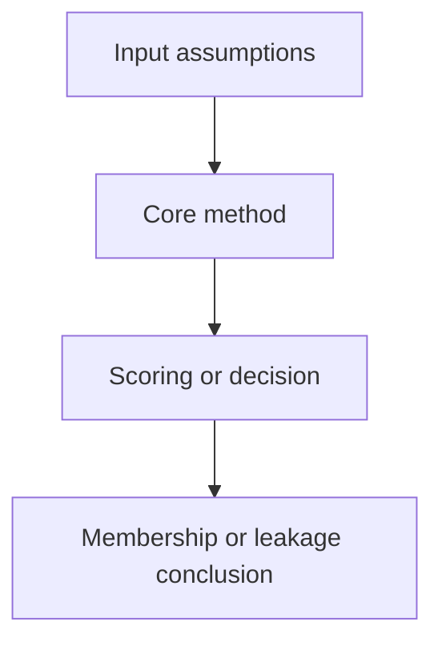

# <Paper Title>

- Title:
- Material Path:
- Primary Track:
- Venue / Year:
- Threat Model Category:
- Core Task:
- Open-Source Implementation:
- Report Status:

## Executive Summary

## Bibliographic Record

## Research Question

## Problem Setting and Assumptions

## Method Overview

## Method Flow

## Key Technical Details

## Experimental Setup

## Main Results

## Strengths

## Limitations and Validity Threats

## Reproducibility Assessment

## Relevance to DiffAudit

## Recommended Figure

## Extracted Summary for `paper-index.md`
