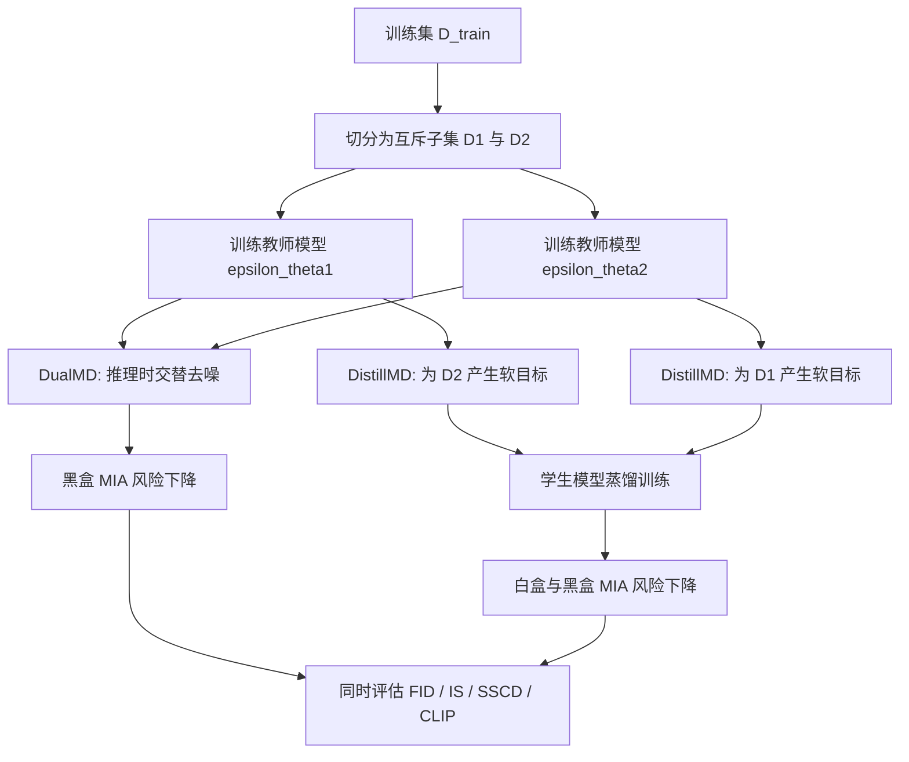
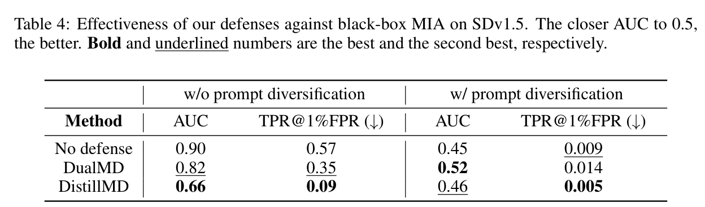

# Dual-Model Defense: Safeguarding Diffusion Models from Membership Inference Attacks Through Disjoint Data Splitting

- Title: Dual-Model Defense: Safeguarding Diffusion Models from Membership Inference Attacks Through Disjoint Data Splitting
- Material Path: `references/materials/survey/2024-arxiv-dual-model-defense-diffusion-membership-inference-disjoint-data-splitting.pdf`
- Primary Track: `survey`
- Venue / Year: `arXiv 2024 preprint`
- Threat Model Category: `diffusion model membership inference defense under white-box and black-box settings`
- Core Task: `通过训练于互斥数据子集的双模型推理与蒸馏流程，削弱扩散模型的成员推断信号`
- Open-Source Implementation: 论文正文未给出作者自己的公开代码仓库；实验描述明确依赖 `diffusers`、`SecMI`、`PIA` 与 Wen 等人的公开实现
- Report Status: `complete`

## Executive Summary

这篇论文研究的不是新的攻击，而是扩散模型在已经被证明存在成员推断风险之后，是否可以用更贴近扩散推理机制的训练范式来降低这种风险。作者提出两条路线：其一是 `DualMD`，即把训练集切成两个互斥子集，分别训练两个模型，并在推理时交替使用二者去噪；其二是 `DistillMD`，即让两个教师模型给对方未见过的数据生成软目标，再蒸馏出一个学生模型。论文的中心判断是，成员推断可利用的核心信号来自训练成员与非成员之间的过拟合间隙，而双模型互斥训练可以主动压缩这部分间隙。

从结果看，`DistillMD` 在白盒场景下更强。在 DDPM 的四个无条件数据集上，SecMIA 与 PIA 的 AUC 可从 `0.83` 至 `0.96` 降到 `0.56` 至 `0.61` 区间；在 SDv1.5 的白盒实验中，加入 prompt diversification 后，SecMIA 的 AUC 从 `0.99` 降到 `0.44`，TPR@1%FPR 从 `1.00` 降到 `0.01`。但在文本到图像黑盒场景下，论文自己也承认仅靠训练防御并不充分，prompt diversification 才是关键条件；此时 `DualMD` 与 `DistillMD` 的优势更多体现为在隐私与生成质量之间取不同平衡。

对 DiffAudit 而言，这篇论文的重要性在于它把“扩散模型成员推断风险主要由过拟合驱动”这一直觉，转写为可操作的防御框架，并进一步把成员推断防御与 memorization 缓解联系起来。它不直接扩展项目的攻击能力边界，但很适合作为 survey 里的防御对照基线，也有助于说明在解释黑盒结果时为什么必须同时审视提示词过拟合与生成质量退化。

## Bibliographic Record

- Title: Dual-Model Defense: Safeguarding Diffusion Models from Membership Inference Attacks Through Disjoint Data Splitting
- Authors: Bao Q. Tran, Viet Nguyen, Anh Tran, Toan Tran
- Venue / year / version: arXiv preprint, 2024
- Local PDF path: `<DIFFAUDIT_ROOT>/Research/references/materials/survey/2024-arxiv-dual-model-defense-diffusion-membership-inference-disjoint-data-splitting.pdf`
- Source URL: [https://arxiv.org/abs/2410.16657](https://arxiv.org/abs/2410.16657)

## Research Question

论文试图回答两个紧密相关的问题。第一，是否可以针对扩散模型设计一种不同于常规正则化或差分隐私的成员推断防御，使训练成员和非成员之间的可分信号显著下降。第二，如果防御过程真正压低了成员推断可利用的过拟合信号，这种机制是否也会同步缓解 diffusion memorization。论文覆盖的威胁模型包括白盒 MIA 与黑盒 MIA，但两类场景的防御形式不同：白盒主要依赖蒸馏学生模型，黑盒则主要依赖双模型交替推理。

## Problem Setting and Assumptions

- Access model: 白盒攻击者可访问模型参数或内部梯度并运行 SecMIA、PIA；黑盒攻击者仅观察生成样本，采用 Pang and Wang 2023 的文本引导攻击。
- Available inputs: 原始训练集 `D_train`、按半数切分得到的 `D_1` 与 `D_2`、无条件 DDPM 或条件 SDv1.5、对条件模型还需要 prompt diversification 产生的多提示词。
- Available outputs: 两个教师模型、可选的蒸馏学生模型、白盒与黑盒 MIA 指标，以及 FID、IS、SSCD、CLIP score。
- Required priors or side information: 方法默认可重新训练或微调目标扩散模型，并可把训练集做互斥切分；黑盒实验还隐含依赖已知文本提示词与固定采样流程。
- Scope limits: 论文没有给出严格形式化隐私保证；对条件模型的黑盒结论强依赖 prompt diversification，且实验只在 Pokemon 微调场景上展开。

## Method Overview

方法的起点是一个简单判断：如果成员样本在去噪误差上系统性低于非成员样本，攻击者就能利用这个间隙完成成员推断。因此作者不直接修改攻击器，而是修改训练范式。首先把训练集拆成两个互斥子集，各自训练一个标准扩散模型。这样，对于任一成员样本，总存在另一个没有见过它的模型，可把它当作近似测试样本处理。

在 `DistillMD` 中，学生模型不再拟合真实噪声，而是拟合来自“未见过该样本”的教师模型输出。作者认为，这样学生在成员样本上的输出会更接近它对非成员样本的输出，从而缩小训练成员与测试样本的损失差。`DualMD` 则不再额外训练学生，而是在推理时交替调用两个教师模型，让一个模型对另一个模型可能出现的训练样本吸附倾向做“纠偏”。

对于条件扩散模型，作者额外引入 prompt diversification。原因是即使图像集合被互斥切开，不同子集里的文本提示仍可能共享词汇模式，导致两个模型都对提示风格过拟合。论文因此用图像描述模型为每张训练图像生成多个提示，并在训练时随机抽取，以削弱条件侧的成员信号。

## Method Flow

## Key Technical Details

论文保留了标准扩散训练目标，并把防御建立在成员与非成员去噪误差间隙之上。标准噪声预测损失为：

$$
L(\theta)=\mathbb{E}_{x_0,\epsilon,t}\left[\left\|\epsilon-\epsilon_\theta(x_t,t)\right\|^2\right].
$$

作者将成员推断可利用的过拟合现象写成成员损失不高于测试损失的经验不等式，并进一步把防御目标表述为缩小二者差值：

$$
\min_{\epsilon_\theta}\ \mathbb{E}\left[\left\|\epsilon_\theta(x_{\mathrm{train}},c_{\mathrm{train}},t)-\epsilon\right\|-\left\|\epsilon_\theta(x_{\mathrm{test}},c_{\mathrm{test}},t)-\epsilon\right\|\right].
$$

`DistillMD` 的关键替换是把真实噪声标签改成教师模型在“非成员视角”下给出的软目标：

$$
L_{\mathrm{distill}}(\theta)=\mathbb{E}_{x_0,t}\left[\left\|\operatorname{stopgrad}\!\left(\epsilon_{\mathrm{teacher}}(x_t,t)\right)-\epsilon_\theta(x_t,t)\right\|^2\right].
$$

实现上最重要的不是公式表面，而是教师选择规则。若样本来自 `D_1`，则使用在 `D_2` 上训练的教师给出目标；反之亦然。这样学生不会直接拟合成员样本对应的真实噪声标签。论文还给出 `DualMD` 的自校正推理直觉，但这一部分更像机制解释而不是严格证明。

## Experimental Setup

- Datasets: 无条件实验使用 `CIFAR10`、`CIFAR100`、`Tiny-ImageNet`、`STL10-Unlabeled`；条件实验与 memorization 实验使用 `Pokemon`。
- Model families: 无条件部分从头训练 `DDPM`；条件部分在 `Stable Diffusion v1.5` 上微调。
- Baselines: `No defense` 为原始模型；攻击侧使用 `SecMIA`、`PIA` 与 Pang and Wang 2023 的黑盒攻击；memorization 对比使用 Wen et al. 2024。
- Metrics: 防御效果用 `AUC` 与 `TPR@1%FPR`，其中 AUC 越接近 `0.5` 越好；生成质量用 `FID` 与 `IS`；memorization 额外使用 `SSCD` 与 `CLIP score`。
- Evaluation conditions: 每个数据集被均分为 member 与 non-member；DDPM 统一训练 `780,000` iterations，batch size `128`，learning rate `2e-4`；SDv1.5 微调 `20,000` iterations，batch size `16`，learning rate `1e-5`；黑盒攻击对每个提示生成 `3` 张图像并采用 `50` 步 DDIM 采样。

## Main Results

- 白盒无条件结果最稳定。Table 2 显示，在 CIFAR10、CIFAR100、Tiny-ImageNet 和 STL10-Unlabeled 上，`DistillMD` 将 SecMIA 的 AUC 从 `0.93/0.96/0.96/0.94` 降到 `0.59/0.61/0.57/0.58`，同时把 TPR@1%FPR 压到 `0.02` 至 `0.03`。
- 白盒条件结果也较强。Table 3 中，带 prompt diversification 时，SecMIA 从 `AUC 0.99, TPR 1.00` 下降到 `AUC 0.44, TPR 0.01`；PIA 从 `0.61, 0.03` 下降到 `0.50, 0.02`。这说明蒸馏路线在白盒条件模型上有效，但改善明显依赖提示词处理。
- 黑盒条件结果需要谨慎解释。Table 4 表明，无 prompt diversification 时，`DistillMD` 能把 AUC 从 `0.90` 降到 `0.66`，`DualMD` 降到 `0.82`；加入 prompt diversification 后，`No defense` 已经达到 `0.45`，`DualMD` 为 `0.52`，`DistillMD` 为 `0.46`。因此，论文关于黑盒防御有效的结论不能脱离 prompt overfitting 这一前提单独成立。
- 质量与 memorization 结果揭示了方法分工。Table 1 显示在 Pokemon 上 `DualMD` 的 FID 为 `0.26`，优于 `DistillMD` 的 `0.44`；Table 5 显示 `DistillMD` 把 SSCD 从 `0.60` 降到 `0.27`，略优于 Wen 等人的 `0.28`，同时 CLIP score 升至 `0.28`。

## Strengths

- 方案直接利用扩散模型“多步推理、可交替去噪”的结构特征，而不是简单移植分类模型防御。
- 把白盒、黑盒和 memorization 三类结果放在同一框架下讨论，便于理解过拟合是共同来源。
- 实验覆盖无条件 DDPM 与条件 SDv1.5，说明作者确实尝试处理两类扩散场景，而非只在单一小模型上报喜。
- 论文给出足够具体的训练超参数和所依赖的外部开源基线，复核门槛低于只给概念性描述的防御论文。

## Limitations and Validity Threats

- 论文没有给出差分隐私式的可验证保证，全部结论都建立在经验攻击指标上，严格意义上仍是经验防御。
- 条件黑盒结果的因果归因不够干净。带 prompt diversification 时，`No defense` 已经接近随机猜测，因此难以把隐私改进完全归因到 `DualMD` 或 `DistillMD` 本身。
- `DualMD` 需要同时保存并调用两个教师模型，推理开销与部署复杂度都高于单模型方案。
- 训练集被硬性二分，在数据稀缺时会损伤教师模型能力；论文结尾也承认这是质量退化的重要来源。
- `DualMD` 的“自校正”解释主要是机制性直觉，缺少更强的理论分析来说明交替去噪何以稳定压低黑盒成员信号。

## Reproducibility Assessment

复现这篇论文至少需要四类资产：可训练 DDPM 与可微调 SDv1.5 的环境、与论文一致的训练集二分与 member/non-member 划分、`SecMIA`/`PIA`/黑盒文本引导攻击的可运行实现、以及 `FID`、`IS`、`SSCD`、`CLIP` 的评测管线。论文附录已经给出关键训练超参数，并明确说明白盒与 memorization 实验所依赖的外部代码来源，因此工程入口是存在的。

但当前报告认为，忠实复现依然不轻。首先，`DualMD` 与 `DistillMD` 都要求从训练流程层面改造模型，而不是后处理式防御。其次，条件模型部分还涉及 prompt diversification，这会引入额外的 caption 生成与数据组织工作。就 DiffAudit 当前仓库的角色而言，这篇论文更适合作为 survey 中的防御路线索引，而不是现成可复用的攻击实验脚手架。

## Relevance to DiffAudit

这篇论文对 DiffAudit 的价值主要有三点。第一，它提供了一个明确的防御参照物，说明若成员信号确实源自过拟合，则切断成员与真实噪声标签的直接耦合是一条可行路线。第二，它提醒项目在解读黑盒 MIA 结果时不能只看单个 AUC 数字，而必须同时检查提示词过拟合、采样流程和生成质量是否已经改变了问题本身。第三，它把成员推断与 diffusion memorization 放进统一叙事，这对 DiffAudit 后续撰写 survey 或路线总览时很有用，因为它能把“隐私泄露”和“训练样本复现”联系起来，而不必把两者当作完全分离的话题。

## Recommended Figure

- Figure page: `9`
- Crop box or note: `100 455 508 575`，裁切第 9 页的 Table 4，仅保留黑盒 MIA 结果表及标题，不包含上下正文
- Why this figure matters: 这张表最集中地展示了论文在条件扩散黑盒场景下的真实结论边界。一方面它给出 `DualMD`、`DistillMD` 与 `No defense` 的直接数值比较；另一方面它也清楚显示 prompt diversification 对结论有决定性影响，因此比方法示意图更适合支撑科学解读。
- Local asset path: `../assets/survey/2024-arxiv-dual-model-defense-diffusion-membership-inference-disjoint-data-splitting-key-figure-p9.png`

## Extracted Summary for `paper-index.md`

这篇论文讨论扩散模型的成员推断防御问题。作者认为，扩散模型之所以会泄露成员信息，核心原因在于模型对训练样本的过拟合使成员与非成员之间出现稳定的去噪误差间隙，因此攻击者能够在白盒或黑盒场景下利用这一差异完成成员判定。

方法上，论文提出两条基于互斥数据切分的路线。`DualMD` 将训练集切成两个不相交子集，分别训练两个模型，并在推理时交替使用它们进行去噪；`DistillMD` 则利用“未见过该样本”的教师模型输出作为软目标蒸馏学生模型。实验表明，`DistillMD` 对白盒 MIA 的缓解最明显，而在文本到图像黑盒场景中，prompt diversification 是防御是否成立的关键前提。

对 DiffAudit 来说，这篇论文的重要性不在于扩展攻击能力，而在于提供防御侧的系统对照。它说明扩散隐私风险与过拟合、prompt overfitting、以及 memorization 之间存在直接联系，因此适合被纳入项目的 survey 叙事，用来解释为什么某些成员信号会出现，以及哪些训练级改造可能压低这些信号。
