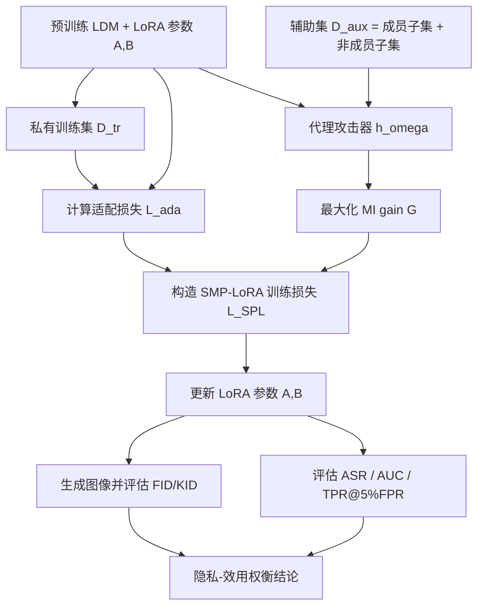
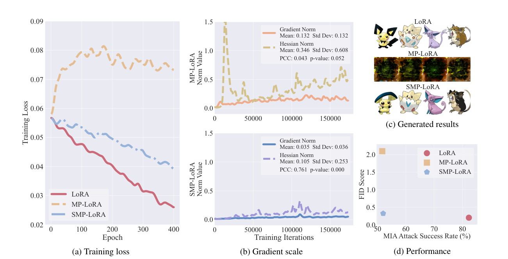

# Privacy-Preserving Low-Rank Adaptation Against Membership Inference Attacks for Latent Diffusion Models

- Title: Privacy-Preserving Low-Rank Adaptation Against Membership Inference Attacks for Latent Diffusion Models
- Material Path: `references/materials/survey/2025-aaai-privacy-preserving-lora-membership-inference-latent-diffusion-models.pdf`
- Primary Track: `survey`
- Venue / Year: `AAAI 2025`
- Threat Model Category: `white-box membership inference defense for LoRA-adapted latent diffusion models; supplementary evaluation under black-box and white-box gradient-based MI`
- Core Task: `在 LoRA 微调 latent diffusion model 时同时优化适配效果与成员隐私保护`
- Open-Source Implementation: 作者在论文首页给出代码仓库：[WilliamLUO0/StablePrivateLoRA](https://github.com/WilliamLUO0/StablePrivateLoRA)
- Report Status: `complete`

## Executive Summary

这篇论文讨论的是一个很具体但工程上非常现实的问题：当研究者或产品团队用 LoRA 在私有图像数据上微调 latent diffusion model 时，模型可能暴露成员推断信号，使攻击者判断某个图像-文本对是否出现在微调训练集中。论文把问题放在 LDM 的轻量适配场景，而不是从头训练，因此与现实中的个性化微调、私有数据定制和小样本适配流程直接相关。

论文先提出 MP-LoRA，将 LoRA 适配损失与代理成员推断器的 MI gain 放到同一个 min-max 隐私博弈中共同优化。作者随后报告，这个直接加和的目标虽然能降低攻击成功率，却经常破坏训练稳定性和生成质量。理论上，作者用 relaxed smoothness 条件说明 MP-LoRA 的 Hessian norm 不受 gradient norm 约束；经验上，Figure 1b 给出的相关系数也显示 MP-LoRA 的梯度与局部光滑性几乎不相关。

在此基础上，论文提出 SMP-LoRA，把 MI gain 从加法惩罚改为分母项，使目标函数变成“适配损失 / (1 - 隐私项)”的比值优化。论文报告该改动在 Pokemon、CelebA 变体、AFHQ 和 MS-COCO 上都能把 ASR、AUC、TPR 压到接近随机水平，同时保持接近原始 LoRA 的 FID/KID。对 DiffAudit 而言，这篇论文的重要性不在于给出新的攻击路线，而在于说明 LoRA 微调本身就是成员泄露的重要触发点，并提供了一个可用于对照实验和防御叙事的强基线。

## Bibliographic Record

- Title: Privacy-Preserving Low-Rank Adaptation Against Membership Inference Attacks for Latent Diffusion Models
- Authors: Zihao Luo, Xilie Xu, Feng Liu, Yun Sing Koh, Di Wang, Jingfeng Zhang
- Venue / year / version: AAAI 2025
- Local PDF path: `D:/Code/DiffAudit/Project/references/materials/survey/2025-aaai-privacy-preserving-lora-membership-inference-latent-diffusion-models.pdf`
- Source URL: [https://doi.org/10.1609/aaai.v39i6.32628](https://doi.org/10.1609/aaai.v39i6.32628)

## Research Question

论文试图回答两个相互耦合的问题。第一，LoRA 微调后的 latent diffusion model 是否会在私有训练集上泄露足以支撑成员推断的信号。第二，如果把成员隐私保护直接写进 LoRA 适配目标，是否能在不显著牺牲生成质量的前提下削弱这种泄露。论文的主威胁模型是白盒 loss-based 成员推断：防御者假定攻击者可以读取目标模型的适配损失，并利用辅助数据训练代理攻击器；附加实验再考察黑盒攻击和白盒 gradient-based 攻击。

## Problem Setting and Assumptions

- Access model: 主设定为白盒。代理攻击模型 `h_\omega` 可访问目标 LDM 在样本上的适配损失。
- Available inputs: 私有训练集 `D_tr`、由半数成员样本和等量本地非成员样本组成的辅助集 `D_aux = D_aux^m \cup D_aux^{nm}`、预训练 Stable Diffusion v1.5、文本条件编码器。
- Available outputs: 防御后的 LoRA 适配参数，以及基于攻击模型得到的 ASR、AUC、TPR@5%FPR 和生成质量指标 FID/KID。
- Required priors or side information: 需要本地非成员数据来构造辅助集，需要能够训练代理攻击器，还需要知道 LoRA 微调流程和目标模型损失。
- Scope limits: 论文主要针对 LoRA 适配的 LDM；虽然扩展到 full fine-tuning 和 DreamBooth，但没有系统覆盖 Textual Inversion、Hypernetwork 等其他个性化方法，也不处理模型反演等更强泄露形式。

## Method Overview

方法由两层优化组成。内层先训练一个代理成员推断器 `h_\omega`，它输入的是目标 LDM 在某个图像-文本对上的适配损失，输出该样本属于训练集成员的概率。外层再更新 LoRA 参数 `A, B`，目标是在保留生成能力的同时压低这个攻击器能获得的 MI gain。

MP-LoRA 的朴素做法是把适配损失和隐私损失线性相加。论文认为，这会把“生成质量目标”和“成员隐私目标”硬性叠加到同一梯度中，导致局部光滑性不受控制，训练经常卡在次优点甚至直接失去生成能力。SMP-LoRA 的改动是把 MI gain 放进分母，让优化更像在约束攻击收益下最小化任务损失。作者的理论解释是，这样得到的目标其 Hessian norm 可以被 gradient norm 约束，从而更容易稳定收敛。

从执行流程看，每个训练迭代先用 `D_aux` 中的成员/非成员 batch 更新攻击器，再从 `D_tr` 抽取新 batch 计算 `L_SPL`，最后更新 LoRA 参数。论文报告的核心信号不是简单“多一个正则项”，而是“目标函数形状发生变化”，这一点是其理论与实验都围绕的关键。

## Method Flow

## Key Technical Details

论文沿着三个层次定义目标。第一层是 LDM 的标准去噪适配损失；第二层是代理攻击器在辅助集上的成员推断收益；第三层是把两者结合形成 MP-LoRA 和 SMP-LoRA 的训练目标。当前报告认为，真正需要保留的是这三个公式之间的关系，而不是单独记忆某个超参数。

$$
\ell_{\mathrm{ada}}(x,y;t,\epsilon,f_\theta)=\left\|\epsilon-f_\theta(z_t,t,\tau_\phi(y))\right\|_2^2
$$

$$
\min_{\{B,A\}}\left(L_{\mathrm{ada}}(f_{\bar{\theta}+BA},D_{\mathrm{tr}})+\lambda \max_{\omega} G\!\left(h_\omega,D_{\mathrm{aux}},f_{\bar{\theta}+BA}\right)\right)
$$

$$
L_{\mathrm{SPL}}=\frac{L_{\mathrm{ada}}(f_{\bar{\theta}+BA},D_{\mathrm{tr}})}{1-\lambda \cdot G\!\left(h_\omega,D_{\mathrm{tr}},f_{\bar{\theta}+BA}\right)+\delta}
$$

其中，`G` 由代理攻击器在 `D_aux` 上对成员与非成员的对数似然组成，本质上是一个二分类 MI gain。论文进一步给出 relaxed smoothness 分析：MP-LoRA 对应的 `L_1 = 0`，意味着 Hessian norm 与 gradient norm 不呈正相关；SMP-LoRA 则得到 `L'_1 > 0`，因此作者主张其局部光滑性可被梯度约束。实现上，算法每轮先升 `\omega`、再降 `A,B`，因此训练依赖一个可用的本地辅助攻击数据集，而不是纯粹无监督防御。

## Experimental Setup

- Datasets: Pokemon、CelebA Small、CelebA Large、CelebA Gender、CelebA Varying，以及更大的 CelebA Large 5X、AFHQ Large 5X、MS-COCO Large 5X。
- Model families: 预训练 Stable Diffusion v1.5；主方法为 LoRA、MP-LoRA、SMP-LoRA；扩展到 full fine-tuning 与 DreamBooth。
- Attack models: 主评测使用基于 loss 的白盒代理攻击器；附加评测包括 Wu et al. 2022 的黑盒语义攻击与 Pang et al. 2023 的白盒 gradient-based 攻击。
- Metrics: 隐私侧使用 ASR、AUC、TPR@5%FPR；生成质量使用 FID 与 KID。论文特别强调 AUC 越接近 0.5 越好，而不是越低越好。
- Evaluation conditions: 主表结果基于 3 个随机种子独立运行的均值与标准误；攻击器 `h_\omega` 和独立评估攻击器 `h'` 都是 3 层 MLP，使用 Adam 优化；辅助集按成员与非成员均衡采样。

## Main Results

- 在 Table 1 中，Pokemon 上原始 LoRA 的 ASR 为 `82.27%`，SMP-LoRA 降到 `51.97%`，同时 FID 仅从 `0.20` 上升到 `0.32`；MP-LoRA 虽然 ASR 也接近随机，但 FID 恶化到 `2.10`。
- 在 CelebA Large 上，SMP-LoRA 将 ASR 从 `87.83%` 降到 `48.83%`，`|AUC-0.5|/0.5` 从 `0.87` 降到 `0.19`，FID 仅从 `0.52` 变为 `0.60`。这说明其隐私收益不是以完全失效的生成质量换来的。
- 在更大的 5X 数据集上，SMP-LoRA 依然有效。例如 MS-COCO Large 5X 上，ASR 从 `80.40%` 降到 `46.10%`，AUC 偏离量降到 `0.14`，但 FID 从 `0.37` 增至 `0.72`，存在可接受但非零的效用代价。
- 附录实验表明，该思路能迁移到 full fine-tuning 和 DreamBooth；同时，相比梯度裁剪和梯度归一化，SMP-LoRA 的生成质量明显更稳。论文还报告其对黑盒与白盒 gradient-based MI 也有一定缓解作用，但优势弱于主设定中的 loss-based 白盒攻击。

## Strengths

- 把 LoRA 微调场景中的成员隐私问题明确化，问题定义与现实个性化微调流程高度贴近。
- 理论与实验对应关系较完整：从 relaxed smoothness 分析出发，再用梯度范数、Hessian 范数和相关系数做经验验证。
- 主结果不仅看攻击成功率，也同步报告 FID/KID，避免把“防住了攻击”建立在模型已经失效的前提上。
- 给出公开代码链接，降低了复核其训练流程与超参数的门槛。

## Limitations and Validity Threats

- 主防御目标是白盒 loss-based MI；对更强或不同形态的泄露，如模型反演、训练样本提取，并未系统处理。
- 方法依赖能够构造 `D_aux` 的本地非成员样本与代理攻击器，这在真实部署里可能不是总能满足的前提。
- 系数 `\lambda` 的选择主要依赖经验调参。附录显示它直接影响隐私-效用权衡，但论文没有给出原则化选取方法。
- 扩展实验虽覆盖 full fine-tuning 和 DreamBooth，但仍集中在少数数据集与配置，跨模型架构泛化性尚未被充分证明。
- 论文把 relaxed smoothness 作为稳定性的主要理论解释，但其与最终隐私收益之间仍然存在从优化性质到攻击表现的推断链条，当前报告认为这部分仍有进一步实证空间。

## Reproducibility Assessment

复现这篇论文至少需要四类资产：可运行的 Stable Diffusion v1.5/LoRA 训练环境、按论文构造的成员/非成员辅助数据集、代理攻击器与独立评估攻击器实现、以及 FID/KID/ASR/AUC/TPR 的完整评测脚本。论文首页给出了公开代码仓库，这明显优于只给公式不给实现的论文。

但忠实复现仍然不轻。首先，辅助集 `D_aux` 的构造细节、各 CelebA 子集切分与 5X 数据集准备会直接影响结果。其次，训练需要同时跑 LoRA 适配和攻击器优化，算力和工程复杂度都高于普通推理型 MIA 论文。当前 DiffAudit 仓库中我没有检索到本地 SMP-LoRA/MP-LoRA 实现痕迹，因此仓库目前更像“文献归档与路线图覆盖”，尚未覆盖该防御路线的实验复现。

## Relevance to DiffAudit

这篇论文对 DiffAudit 的价值主要体现在三点。第一，它补上了“为什么 LoRA 微调会带来成员泄露，以及能否在训练时主动抑制”的防御视角，可作为主线攻击报告的对照材料。第二，它说明评估扩散隐私时不能只盯攻击 AUC，还必须同步观察生成质量，否则很容易把训练失败误判为隐私保护成功。第三，它把 latent diffusion、LoRA、white-box loss-based MI 这三个关键词绑定在一起，适合在 DiffAudit 后续叙事中作为“轻量微调风险与防御”的代表论文。

## Recommended Figure

- Figure page: `2`
- Crop box or note: `45 35 565 300`，仅裁切 Figure 1 面板区域，排除正文段落与大部分图注。
- Why this figure matters: 该图同时展示了训练损失轨迹、梯度/Hessian 相关性、生成样例与隐私-效用散点，是论文“MP-LoRA 不稳定而 SMP-LoRA 稳定”的最集中证据。
- Local asset path: `../assets/survey/2025-aaai-privacy-preserving-lora-membership-inference-latent-diffusion-models-key-figure-p2.png`

## Extracted Summary for `paper-index.md`

这篇论文关注 latent diffusion model 在 LoRA 微调场景下的成员推断风险。作者指出，虽然 LoRA 以参数高效著称，但一旦在私有图像数据上做适配，模型仍可能泄露足以判断某个样本是否属于训练集的成员信号，因此轻量微调并不天然等于隐私安全。

论文先提出 MP-LoRA，把适配损失和代理成员推断器的 MI gain 写成 min-max 目标；随后发现这种直接加和的设计会导致优化不稳定。为此作者提出 SMP-LoRA，把 MI gain 放入分母形成比值型目标，并从局部光滑性分析与多组实验中论证该目标比 MP-LoRA 更稳定，能够在多个数据集上把 ASR、AUC 和 TPR 压到接近随机水平，同时基本保持 LoRA 的生成质量。

对 DiffAudit 来说，这篇论文的意义在于它提供了一个与 LoRA 微调直接相关的防御对照基线，也提醒团队在解读扩散隐私结果时必须同时看攻击指标和生成质量指标。它不直接扩展主线攻击能力，但非常适合支撑“轻量微调为何会泄露、以及训练时如何缓解”这一研究叙事。
