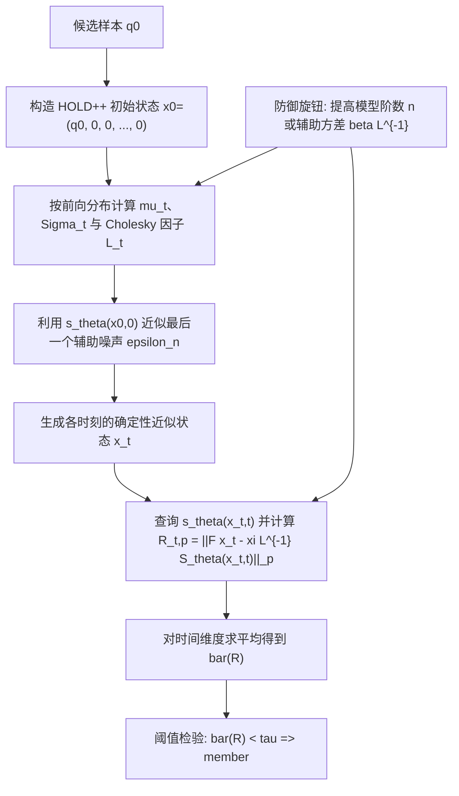
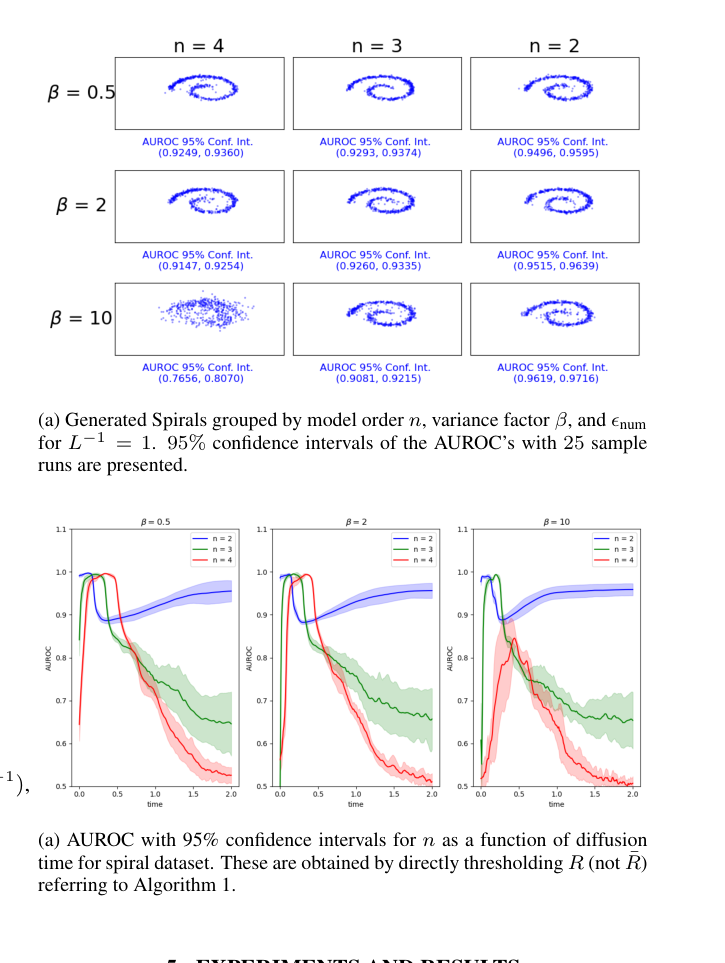

# Defending Diffusion Models Against Membership Inference Attacks via Higher-Order Langevin Dynamics

- Title: Defending Diffusion Models Against Membership Inference Attacks via Higher-Order Langevin Dynamics
- Material Path: `<DIFFAUDIT_ROOT>/Research/references/materials/survey/2025-arxiv-defending-diffusion-models-membership-inference-higher-order-langevin-dynamics.pdf`
- Primary Track: `survey`
- Venue / Year: `arXiv 2025 (v2; submitted to IEEE according to the PDF front matter)`
- Threat Model Category: `Defense against gray-box membership inference on diffusion models, centered on PIA-style score access`
- Core Task: `Use critically-damped higher-order Langevin dynamics to reduce membership leakage while preserving generative quality`
- Open-Source Implementation: `Official code link stated in the paper: https://github.com/bensterl15/MIAHOLD`
- Report Status: `completed`

## Executive Summary

这篇论文研究的不是如何进一步增强成员推断攻击，而是如何从扩散动力学本身出发削弱扩散模型对成员推断的暴露面。作者将防御目标设定为 `PIA` 这类依赖 score 网络的灰盒成员推断，并指出，虽然扩散模型通常比 GAN 更不容易被做 MIA，但在敏感数据场景下仍然存在可利用信号，因此仅依赖“扩散模型天然更安全”的经验判断并不充分。

论文提出的核心做法是把标准扩散过程替换为 critically-damped higher-order Langevin dynamics (`HOLD++`)。该过程在原始数据变量之外再引入速度、加速度等辅助变量，使前向扩散更早混入外部随机性。作者的论点是：一旦成员推断攻击依赖于可近似重建的确定性轨迹，那么这些辅助变量就会破坏这种确定性，从而降低 `PIA` 的判别能力。论文同时给出一个 R\'enyi differential privacy 角度的上界分析，但作者并未把防御效果简单归结为 DP，而是强调“辅助变量导致的非确定性 score 结构”本身就是额外的防御来源。

实验覆盖 Swiss Roll toy dataset 与 LJ Speech 语音数据。论文报告显示，更高的模型阶数 `n` 与更高的初始辅助方差 `\beta L^{-1}` 往往会降低 AUROC，使 `PIA` 更接近随机猜测；在 LJ Speech 上，`n=2` 相比 `n=1` 多个 epoch 同时得到更低 AUROC 与更优 FID。对 DiffAudit 而言，这篇论文的价值主要不在于它已经给出一个现成的主线审计基线，而在于它提供了一个清晰的“防御机制假设”: 通过改变扩散轨迹的可确定性，而不是只在训练时加 DP-SGD 或正则项，也可能系统性压低成员泄露。

## Bibliographic Record

- Title: Defending Diffusion Models Against Membership Inference Attacks via Higher-Order Langevin Dynamics
- Authors: Benjamin Sterling, Yousef El-Laham, Monica F. Bugallo
- Venue / year / version: arXiv preprint, 2025, arXiv:2509.14225v2
- Local PDF path: `<DIFFAUDIT_ROOT>/Research/references/materials/survey/2025-arxiv-defending-diffusion-models-membership-inference-higher-order-langevin-dynamics.pdf`
- Source URL: `https://arxiv.org/abs/2509.14225` ; DOI metadata inside PDF points to `https://doi.org/10.48550/arXiv.2509.14225`

## Research Question

论文试图回答两个相互关联的问题。第一，在连续时间扩散模型上，是否可以不依赖传统的 `DP-SGD` 训练框架，而改用更高阶 Langevin 动力学来削弱成员推断攻击的可行性。第二，如果把攻击者固定为 `PIA` 这一类依赖 score 网络、并通过近似确定性轨迹构造攻击统计量的灰盒对手，那么 `HOLD++` 中额外的辅助变量是否会天然削弱这种攻击所需的确定性。

论文的部署语境更接近“攻击者能够访问训练好的 score 网络并对候选样本运行推断，但不能重训模型”的灰盒防御分析，而不是严格黑盒场景。其核心问题因此不是“扩散模型是否会泄露成员”这一宽泛命题，而是“在 PIA 这类主流灰盒攻击面下，改变动力学阶数是否足以降低可利用成员信号”。

## Problem Setting and Assumptions

攻击者输入是候选数据点 `q_0`，并可调用训练后的 score 网络 `s_\theta(x_t,t)`。论文默认攻击者知道所使用的扩散动力学形式，并能据此构造 `HOLD++` 版 `PIA` 攻击统计量；这意味着其访问模型介于黑盒与白盒之间，更接近需要中间 score 查询能力的灰盒设定。

在防御侧，前向过程不再只扩散原始数据变量，而是把状态写成 `x_0=(q_0,p_0,s_0,\ldots)`，其中辅助变量来自高斯先验。攻击实施时，作者为了维持“确定性攻击”设定，把辅助变量初始化为零，并把除最后一个辅助分量外的随机噪声也置零。这一设定本身很重要，因为它说明：论文并不是在比较一个完全最优的攻击者，而是在比较 `PIA` 在 `HOLD++` 结构下还能保留多少有效性。

额外先验包括 `HOLD++` 参数 `\gamma_1,\ldots,\gamma_{n-1},\xi`、方差因子 `\beta L^{-1}` 以及用于数值稳定的 `\epsilon_{\text{num}}`。理论部分还假设相邻数据点之间的最大差异可以用 sensitivity 上界表示。范围限制也很明确：实验规模较小，且真实语音实验只比较 `n=1` 和 `n=2`，并未充分探索更高阶模型在复杂数据上的训练稳定性。

## Method Overview

方法的第一步是把普通扩散模型换成 `HOLD++` 前向 SDE。直观上，模型不再只对“位置”做扩散，而是在更高维状态空间中联合扩散位置和若干辅助变量。作者认为这会让外部随机性更早、更充分地混入样本表示，使攻击者难以仅凭初始点和一个近似确定性轨迹恢复出足够稳定的成员信号。

第二步是把 `PIA` 攻击度量迁移到 `HOLD++`。在普通连续扩散中，`PIA` 主要利用 score 网络对前向/反向漂移差的刻画来构造 jump-size 式指标；而在 `HOLD++` 中，真正被网络建模的只剩最后一个辅助变量的 score，因此攻击者只能以简化形式估计 `x_t`，再计算新的 `R_{t,p}`。这意味着攻击流程仍然可运行，但它依赖的确定性信息被显著削弱。

第三步是理论分析。作者给出 `f(x)=e^{Ft}x+\eta` 形式的随机机制，并证明其满足一个 R\'enyi differential privacy 上界；随后再论证该上界在 `t=0` 处最坏，并说明隐私损失近似受 `\epsilon_{\text{num}}` 控制。但论文没有声称“已有紧的最终隐私保证”，而是更谨慎地说：DP 上界与辅助变量造成的非确定性一起解释了为什么更高阶动力学能抑制 `PIA`。

## Method Flow

## Key Technical Details

论文给出的 `HOLD++` 前向过程可以写成线性 SDE `dx_t = F x_t dt + G dw`，其解析均值与协方差是方法的基础。攻击者必须先用这些闭式量构造各时刻的近似状态，否则 `PIA` 无法直接迁移到更高阶动力学：

$$
\mu_t = \exp(Ft)x_0,\qquad
\Sigma_t = L^{-1}I + \exp(Ft)\left(\Sigma_0 - L^{-1}I\right)\exp(Ft)^\top.
$$

在此基础上，作者把 `PIA` 的 jump-size 度量改写到 `HOLD++` 上。由于真正被 score 网络学习的是最后一个辅助变量的分量，所以攻击度量会退化为一个只在末端子空间注入 score 的形式：

$$
x_t = \mu_t + L_t\epsilon,\qquad
R_{t,p} = \left\|F x_t - \xi L^{-1} S_\theta(x_t,t)\right\|_p,\qquad
\bar R = \frac{1}{n_{\text{time}}}\sum_{k=1}^{n_{\text{time}}} R[k].
$$

理论部分最值得保留的是 RDP 上界与其含义。论文先证明 joint mechanism 的 R\'enyi divergence 上界，再说明 marginal 的隐私损失不会更大；在 `\epsilon_{\text{num}} \ll \beta L^{-1}` 的近似下，上界可整理为：

$$
D_\alpha(P_t(q_t)\|Q_t(q_t))
\le D_\alpha(P_t\|Q_t)
\lesssim \frac{\alpha \Delta_f^2}{2\epsilon_{\text{num}}}.
$$

这组公式对应的关键结论并不是“隐私保证已经完全解决”，而是三个更有限、但更可信的技术点。第一，`HOLD++` 允许前向分布闭式计算，因此攻击和防御都能被解析化。第二，辅助变量使攻击者只能确定性恢复最后一个辅助分量，削弱了 `PIA` 的信息完备性。第三，RDP 上界表明初始数值扰动越大，理论隐私损失越小，但这会与数值稳定和样本质量形成张力。

## Experimental Setup

实验分为 toy dataset 与真实语音两部分。Swiss Roll 部分使用不重叠的训练集和验证集，固定 `L^{-1}=1`，改变模型阶数 `n`、方差因子 `\beta` 与 `\epsilon_{\text{num}}`，每组独立运行 `25` 次以报告 AUROC 的 `95%` 置信区间，训练 `40,000` epochs。网络结构是带 ReLU 和 layer normalization 的全连接前馈网络，总深度 `15` 层。

真实数据实验使用 LJ Speech 与 Grad-TTS。作者选择该任务的原因是：连续版 `PIA` 曾在该模型上展示过有效性，而且 mel-spectrogram 上的数据增强不像图像翻转那样自然。该部分主要比较 `n=1` 与 `n=2`；更高阶模型作者尝试过，但因训练困难未纳入结果。评估指标包括 `PIA` 的 AUROC 和 FID。论文同时明确提醒，FID 所用 Inception 网络是图像模型而不是语音专用评估器，因此这里只能把 FID 视为粗略质量代理。

## Main Results

Swiss Roll 结果支持论文的主论点。图 1a 显示，在固定 `L^{-1}=1` 的条件下，提高模型阶数 `n` 与增大 `\beta` 一般会降低 AUROC，使攻击从接近完美区分逐步退向接近随机猜测。图 2a 进一步表明，较高阶模型的隐私脆弱性更局域于早期 diffusion time，而不是在全时间轴上持续保持高可区分性。

LJ Speech 结果更具有应用意义。表 1 中，`n=2` 在多个 epoch 同时优于 `n=1` 的 AUROC 与 FID，例如 `60` epoch 时 FID 从 `94.31` 降到 `62.57`，AUROC 从 `0.686` 降到 `0.481`；`90` epoch 时分别从 `102.50/0.869` 改善到 `65.20/0.525`；`180` epoch 时也保持 `57.43/0.696` 优于 `89.18/0.949`。这说明至少在该语音设置下，更高阶动力学并不一定迫使隐私与质量二选一。

不过，论文最强的结论仍然是“趋势性结论”而非“普适最优结论”。一方面，作者承认在 CIFAR-10 上未能得到显著高于 `0.5` 的 AUROC，这反而说明连续扩散模型本身可能已经较抗 MIA；另一方面，真实任务只比较了 `n=1,2`，因此还不足以证明更高阶数在更复杂数据和模型家族上一定继续收益。

## Strengths

- 论文把防御问题直接对准已有灰盒基线 `PIA`，而不是只给抽象隐私主张，因此问题设定较具体。
- 理论与实验衔接较好：前向分布闭式推导、RDP 上界和 AUROC/FID 实验共同支撑“辅助变量可降低成员泄露”的论点。
- 结果不只展示隐私改善，还讨论了模型阶数、方差、样本质量之间的多维 trade-off，没有把防御说成无代价。
- 在 LJ Speech 上出现了 `n=2` 同时改善质量和隐私的结果，这比单纯“隐私提升但质量下降”的防御论文更有辨识度。

## Limitations and Validity Threats

- 实验规模偏小，toy dataset 与单一语音数据集不足以证明该方法在主流图像扩散模型上的普适性。
- 真实任务中更高阶 `n>2` 因训练困难被省略，说明方法的工程可扩展性仍是未解决问题。
- 论文没有直接与 `DPDM`、知识蒸馏或正则化防御做同条件对比，因此“优于现有防御”的结论并未真正建立。
- FID 在 LJ Speech 上借用了图像 Inception 网络，评估信号存在明显 domain mismatch。
- RDP 推导主要给 joint mechanism 上界，再借 marginals 不增性下推到目标变量；该界偏保守，不能直接等价为紧的实际成员隐私保证。
- 攻击适配过程把辅助变量与前 `n-1` 个噪声分量设为零，这有利于保持确定性，但也意味着评估的是一个特定版本的 `PIA`，而非所有可能攻击者。

## Reproducibility Assessment

复现这篇论文至少需要三类资产：`HOLD++` 训练实现、适配后的 `PIA` 攻击脚本，以及 Swiss Roll / LJ Speech 的完整训练与评估配置。论文正文明确给出公开代码仓库 `MIAHOLD`，因此从“是否存在作者实现”这一点看，复现条件优于许多只给算法描述的论文。

就当前 DiffAudit 仓库而言，我检索到了这篇论文在 `references/materials/paper-index.md` 中的 survey 条目，但没有看到与 `HOLD++`、`MIAHOLD` 或更高阶 Langevin 防御直接对应的实现脚本、实验配置或结果资产。因此，当前仓库对该路线的覆盖更接近“已索引的防御分支材料”，而不是可立即运行的复现链路。

今天真正阻碍 faithful reproduction 的因素主要有三个：第一，需要先拿到作者实现并确认其依赖环境；第二，需要把 `PIA` 适配到 `HOLD++` 的攻击流程独立拆出，便于与现有灰盒基线比较；第三，需要重新审视评估协议，尤其是语音任务上的质量指标，避免沿用图像 FID 带来的解释偏差。

## Relevance to DiffAudit

这篇论文对 DiffAudit 的价值首先在于补足“防御叙事”的方法层，而不是直接增强现有攻击主线。当前仓库的主执行路线明显仍偏黑盒、灰盒与白盒攻击证据生产；相比之下，这篇工作提供的是一个结构性防御思路，即通过改变扩散动力学的阶数和辅助变量设计，主动削弱成员信号的可确定性。

从方法论角度看，它对项目有两个具体启发。第一，成员泄露不一定只能通过训练正则或数据分割来缓解，采样/动力学设计本身也可以成为防御杠杆。第二，如果未来 DiffAudit 需要做“攻击-防御对照报告”，那么 `PIA` 在 `HOLD++` 上的失效程度可以作为一个很有解释力的案例，因为它直接对应现有灰盒路线中的 score-based 审计假设。

但也应明确边界：这篇论文更适合作为 survey 与研究版图中的“防御代表”，而不是当前仓库的短期实现优先级。原因不是它不重要，而是它依赖新的训练动力学和额外工程资产，距离现有攻击主线的最短实现路径较远。

## Recommended Figure

- Figure page: `3`
- Crop box or note: `page 3, clip = (300, 60, 590, 445); cropped to the right-column composite result region containing the Swiss Roll sample grids and AUROC-vs-time curves`
- Why this figure matters: `它把论文最重要的两条证据放在同一图块里：上半部分显示更高阶 n 与更高 beta 下生成分布和 AUROC 置信区间的对应关系，下半部分显示成员推断脆弱性如何随 diffusion time 分布，并体现高阶模型的攻击优势更弱、更局域。相比第 4 页单独的表格，这个图更完整地支撑“动力学阶数改变会影响隐私泄露形态”这一主张。`
- Local asset path: `../assets/survey/2025-arxiv-defending-diffusion-models-membership-inference-higher-order-langevin-dynamics-key-figure-p3.png`

## Extracted Summary for `paper-index.md`

这篇论文讨论扩散模型的成员推断防御问题，重点不是设计更强攻击，而是回答在 `PIA` 这类依赖 score 网络的灰盒攻击下，是否可以通过改变扩散动力学本身来降低成员泄露。作者把问题放在敏感训练数据场景中，认为扩散模型虽然相对更抗 MIA，但仍然不能默认安全。

论文提出使用 critically-damped higher-order Langevin dynamics (`HOLD++`) 取代普通扩散过程，在状态空间中引入速度、加速度等辅助变量，让外部随机性更早混入轨迹，从而破坏 `PIA` 所依赖的确定性近似。理论上，作者给出一个基于 R\'enyi differential privacy 的上界分析；实验上，在 Swiss Roll 和 LJ Speech 上观察到更高的模型阶数与更大的辅助方差通常会降低 AUROC，而在 LJ Speech 中 `n=2` 还多次同时优于 `n=1` 的 FID 与 AUROC。

对 DiffAudit 而言，这篇论文更适合作为防御路线和机制分析的代表材料，而不是当前主线攻击基线。它的直接价值在于提供一个很清晰的研究命题：成员隐私的缓解不一定只能靠训练正则化，也可以通过改变扩散轨迹的可确定性来实现，这对未来构建攻击-防御对照叙事很有帮助。
