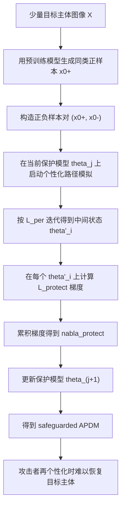
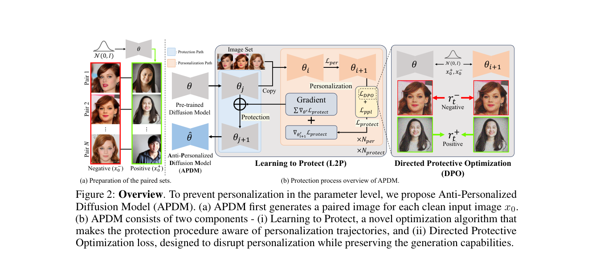

# Perturb a Model, Not an Image: Towards Robust Privacy Protection via Anti-Personalized Diffusion Models

- Title: Perturb a Model, Not an Image: Towards Robust Privacy Protection via Anti-Personalized Diffusion Models
- Material Path: `D:/Code/DiffAudit/Project/references/materials/survey/2025-arxiv-perturb-a-model-not-an-image-anti-personalized-diffusion-models.pdf`
- Primary Track: `survey`
- Venue / Year: `NeurIPS 2025 (arXiv v1, 2025-11-03)`
- Threat Model Category: `防御 / 模型级 anti-personalization / 未授权个性化阻断`
- Core Task: `在不依赖图像投毒的前提下，通过更新扩散模型参数阻止特定主体被个性化`
- Open-Source Implementation: `https://github.com/KU-VGI/APDM`
- Report Status: `complete`

## Executive Summary

这篇论文关注的是个性化文生图扩散模型的隐私防护问题。作者指出，DreamBooth、Custom Diffusion 一类方法虽然只需少量目标主体图像即可完成个性化，但这也使得攻击者能够利用公开照片、偶然抓拍或混入少量干净图像来构造未授权个性化模型。既有防护方法主要依赖对训练图像施加对抗扰动，但论文认为这一路线在现实部署中存在根本缺陷：用户无法保证其全部相关图像都被投毒，攻击者可以通过干净图像或简单变换绕过，且服务提供方也难以把责任外包给普通用户。

作者因此把防护对象从“输入图像”转移到“模型参数”，提出 Anti-Personalized Diffusion Models（APDM）。其核心由两部分组成：一是 Direct Protective Optimization（DPO），用成对的正负样本直接引导模型压制目标主体的个性化能力，同时保留通用生成能力；二是 Learning to Protect（L2P），在保护训练过程中显式模拟未来的个性化轨迹，再沿该轨迹累积保护梯度，使防护更新能够针对迭代式个性化过程做前瞻性适配。

从 DiffAudit 的角度看，这篇论文的重要性不在于成员推断，而在于它系统化展示了“模型级防护”如何替代“数据级投毒”成为更可部署的扩散模型隐私保护路线。论文同时给出了理论分析、算法设计和多组鲁棒性实验，为后续将 DiffAudit 的攻击视角扩展到服务提供方可执行的防护视角提供了直接参照。

## Bibliographic Record

- Title: Perturb a Model, Not an Image: Towards Robust Privacy Protection via Anti-Personalized Diffusion Models
- Authors: Tae-Young Lee, Juwon Seo, Jong Hwan Ko, Gyeong-Moon Park
- Venue / year / version: NeurIPS 2025, arXiv:2511.01307v1, 2025-11-03
- Local PDF path: `D:/Code/DiffAudit/Project/references/materials/survey/2025-arxiv-perturb-a-model-not-an-image-anti-personalized-diffusion-models.pdf`
- Source URL: `https://arxiv.org/abs/2511.01307`

## Research Question

论文试图回答的问题是：当攻击者能够拿到少量目标主体图像并使用 DreamBooth 类方法进行个性化时，是否可以不再依赖图像投毒，而是直接在预训练扩散模型参数层面注入防护能力，从而稳定阻止对特定主体的未授权个性化。其默认部署场景偏向服务提供方侧，即平台在收到用户的保护请求后，应直接更新底座模型，使后续针对该主体的个性化训练失效，同时尽量不损伤模型对其他主体和一般文本提示的生成能力。

## Problem Setting and Assumptions

访问模型方面，防护方拥有预训练文生图扩散模型及一个很小的目标主体图像集合，能够直接更新模型参数；攻击方随后拿到这个被保护后的模型，并尝试用常规个性化损失继续针对同一主体进行微调。论文不再要求防护方控制互联网中的全部照片，也不要求用户对每张图像施加扰动。输入是少量目标主体图像与对应文本类别信息，输出是一个 safeguarded model。所需先验包括：已知目标主体所属的大类提示词，如 `person`、`dog`；可访问预训练模型生成的同类正样本；可运行个性化训练过程以模拟攻击者轨迹。范围限制在个性化文生图扩散模型，重点验证 DreamBooth 路线，未讨论闭源 API、在线黑盒服务或跨模态检索链路下的防护效果。

## Method Overview

方法首先针对每张待保护的目标图像构造一个正负样本对。负样本就是包含待保护主体的图像，正样本则由预训练模型根据类提示词生成，代表“应当保留的通用类分布”。在此基础上，DPO 不再像图像投毒那样最大化个性化损失，而是借鉴偏好优化思想，让模型在保护训练期间更偏好正样本、抑制负样本，从而把“保留一般类能力”和“移除特定主体能力”统一到同一个偏好目标中。

仅有 DPO 仍不足以处理个性化训练的迭代性，因为攻击者的 DreamBooth 微调会沿参数空间不断前进。L2P 因此把“未来的个性化过程”显式嵌入保护循环：先沿个性化路径滚动若干步，得到一串中间模型状态；再在这些状态上计算保护损失梯度并累加；最后用累积梯度更新当前保护模型。这样，保护目标不再是某个静态参数点，而是对整条潜在个性化轨迹做提前干预。

## Method Flow

## Key Technical Details

论文先回顾标准扩散训练与个性化训练，再指出把图像投毒损失直接搬到参数空间会带来梯度方向冲突，难以同时兼顾“压制目标主体个性化”和“维持通用生成质量”。作者用 Proposition 1 与 Theorem 1 说明，朴素目标 `-L_simple^per + L_ppl` 的收敛条件互相矛盾，因此需要新的保护目标。

APDM 的第一条核心公式是个性化扩散模型的基本训练目标：

$$
L_{\mathrm{simple}}^{\mathrm{per}}
=
\mathbb{E}_{x_0,t,c_{\mathrm{per}},\epsilon \sim \mathcal{N}(0,I)}
\left\|
\epsilon_\theta(x_t,t,c_{\mathrm{per}})-\epsilon
\right\|_2^2.
$$

第二条核心公式是 DPO 损失。它把正样本与负样本映射到相对奖励差，再通过 logistic 目标迫使模型偏向正样本、远离目标主体：

$$
\mathcal{L}_{\mathrm{DPO}}
=
-\mathbb{E}_{x_0^+,x_0^-,c,t,\epsilon \sim \mathcal{N}(0,I)}
\log \sigma\!\left(-\beta (r^+ - r^-)\right),
$$

其中

$$
r^\pm
=
\left\|
\epsilon_\theta(x_t^\pm,t,c)-\epsilon
\right\|_2^2
-
\left\|
\epsilon_\phi(x_t^\pm,t,c)-\epsilon
\right\|_2^2.
$$

第三条核心公式来自 L2P：作者在模拟的个性化轨迹上逐点求保护梯度并累加，再更新保护模型，

$$
\nabla_{\mathrm{protect}}=\sum_{i=1}^{N_{\mathrm{per}}}\nabla_i,
\qquad
\theta_{j+1}=\theta_j-\gamma_{\mathrm{protect}}\nabla_{\mathrm{protect}}.
$$

这里的关键实现要求有三点。第一，正样本与负样本需要一一配对；第二，保护训练必须显式访问个性化路径中的中间状态，而不是只在初始参数处优化；第三，`β`、`N_per`、`N_protect` 直接决定保护强度与生成质量的折中。

## Experimental Setup

论文在 Stable Diffusion 1.5 和 2.1 上实验，分辨率为 512x512。个性化参考方法主要是 DreamBooth，附录中补充了 Custom Diffusion 结果。防护基线包括 AdvDM、Anti-DreamBooth、SimAC 与 PAP，均属于图像投毒范式。保护效果指标使用 DINO 作为相似度度量，DINO 越低表示越难恢复目标主体；使用 BRISQUE 评估图像质量，值越高在本文设定下表示对攻击者生成结果的破坏越强。模型保真度则通过 FID、CLIP、TIFA 和 GenEval 在 MS-COCO 2014 验证集上评估。训练数据来自 DreamBooth 数据集和 Anti-DreamBooth 人脸数据集；优化器为 AdamW，`γ_per = γ_protect = 5e-6`，`β = 1`，`N_per = 20`，`N_protect = 800`。作者报告单张 RTX A6000 约需 9 GPU 小时完成一次保护。

## Main Results

最强的主结论来自 Table 1 与 Figure 3。面对 `person` 与 `dog` 两类目标，APDM 在仅使用干净图像的设定下仍显著优于所有图像投毒基线：其 DINO 分别为 0.1375 和 0.0959，而 DreamBooth 参考值为 0.6994 和 0.6056，说明个性化后生成结果与目标主体的相似度被大幅压低。与此同时，BRISQUE 达到 40.25 和 60.74，也明显高于基线，表明攻击者得到的输出更失真、更难用。

保真度方面，APDM 相比原始 Stable Diffusion 仅带来有限退化。Table 2 中 FID 从 25.98 上升到 28.85，CLIP 从 0.2878 降到 0.2853，TIFA 从 78.76 降到 75.91，GenEval 从 0.4303 降到 0.4017。论文据此主张，APDM 在保留一般生成能力和文本对齐能力上代价可接受。Table 3 进一步显示，被保护模型对其他主体仍可继续个性化，说明它不是简单的整体性模型破坏。

鲁棒性结论主要依赖额外实验。Table 8 显示，即便输入换成由 Anti-DreamBooth 生成的扰动图像，APDM 仍可维持 DINO 0.1702、BRISQUE 40.20；Table 9 显示在加入 4 到 12 张未见图像后，保护性能只发生有限下降。对应地，论文的核心论断不是“最强攻击下绝对不可破”，而是“模型级防护比数据级投毒更不依赖输入条件，并更适合现实部署”。

## Strengths

- 论文把防护目标从图像样本转向模型参数，问题设定更贴近服务提供方真实可执行的防护责任。
- 理论部分不是装饰性分析，而是明确用收敛性矛盾论证了朴素参数级迁移方案为什么行不通，从而为 DPO 的必要性提供支撑。
- 方法设计把偏好优化和轨迹感知更新结合起来，技术上比单纯“再加一个正则项”更完整。
- 实验同时覆盖保护效果、模型保真度、对其他主体的可个性化性、对扰动输入和未见图像的泛化，证据链相对完整。

## Limitations and Validity Threats

- 论文的攻击面主要围绕 DreamBooth / Custom Diffusion 风格个性化微调，尚未覆盖 LoRA、adapter、蒸馏式 personalization 或闭源服务接口，外推时需要谨慎。
- 指标解释依赖作者设定。尤其 BRISQUE 在这里被当作“攻击者输出失真”的佐证，但它并不能直接等价于隐私保护成功率。
- 鲁棒性虽然考虑了干净图像、扰动图像和未见图像数量变化，但没有证明面对更强攻击者时仍能保持同等级别的阻断，例如混合提示工程、跨模型迁移或更长训练预算。
- 保护训练需要直接修改模型参数并运行多轮模拟个性化，部署成本高于单次图像投毒；论文报告约 9 GPU 小时，但未充分讨论大规模多主体请求下的系统吞吐。

## Reproducibility Assessment

复现实验需要论文代码、Stable Diffusion 1.5/2.1 权重、DreamBooth 与 Anti-DreamBooth 数据集、DINO 与 BRISQUE 评估实现，以及完整的个性化训练脚本。论文已公开代码仓库，这显著降低了方法级复现难度。当前 DiffAudit 仓库已经覆盖了大量扩散模型隐私攻击与防护文献索引，因此在路线归档和对比分析层面已有承接基础；但若要忠实复现 APDM，还缺少面向 subject-driven personalization 的训练与评估流水线、保护后再个性化的自动化实验脚本，以及对 DINO/BRISQUE/FID/CLIP/TIFA/GenEval 的统一评测封装。真正的阻塞项不在论文可读性，而在工程成本与实验算力。

## Relevance to DiffAudit

这篇论文对 DiffAudit 的价值在于扩展叙事边界。当前项目主线更多围绕成员推断、记忆化和归因等“识别风险”问题，而 APDM 代表另一条与之相邻但不同的路线：当系统已经暴露出可被个性化滥用的能力时，平台是否能够直接在模型侧植入“拒绝对某主体个性化”的机制。它不能替代成员推断研究，但能补上“发现风险之后如何部署防护”的部分。

从路由归类上看，该文更适合作为 `survey/defense` 交叉材料，而不是直接并入 black-box / gray-box / white-box 成员推断主线。它提供的最关键启发是：现实世界约束可能迫使我们把问题从“样本级攻击与防御”改写为“服务方可执行的参数级控制”。这对 DiffAudit 在撰写全景综述、构建产品方向叙事以及解释防护可部署性时都很有价值。

## Recommended Figure

- Figure page: `5`
- Crop box or note: `page 5, clip 40 40 575 270`
- Why this figure matters: `Figure 2 同时展示了配对样本构造、L2P 的双路径优化和 DPO 的正负偏好机制，是整篇论文最紧凑的方法总览，比单独的结果表更适合在综述中说明“模型级防护”的结构性创新。`
- Local asset path: `../assets/survey/2025-arxiv-perturb-a-model-not-an-image-anti-personalized-diffusion-models-key-figure-p5.png`

## Extracted Summary for `paper-index.md`

这篇论文讨论的是个性化扩散模型的隐私保护问题。作者认为，现有基于图像投毒的防护方法依赖不现实的前提，例如要求用户控制全部相关图像，而且在攻击者混入少量干净图像或施加简单变换时容易失效，因此难以满足真实平台侧的防护需求。

论文提出 Anti-Personalized Diffusion Models（APDM），把防护对象从输入图像转到模型参数。其核心由 Direct Protective Optimization（DPO）和 Learning to Protect（L2P）组成：前者通过正负样本对直接压制目标主体的个性化能力，后者通过模拟未来个性化轨迹来累积保护梯度。实验表明，APDM 在 `person` 和 `dog` 等主体上显著优于 AdvDM、Anti-DreamBooth、SimAC、PAP 等图像投毒基线，同时只带来有限的通用生成能力退化。

对 DiffAudit 而言，这篇论文的重要性在于它代表了一条与成员推断不同但强相关的“模型级防护”路线。它说明当扩散模型已经具备可被滥用的个性化能力时，服务提供方可以直接通过参数更新部署针对特定主体的保护机制，这为项目后续整合攻击分析与可部署防护叙事提供了高价值参考。
