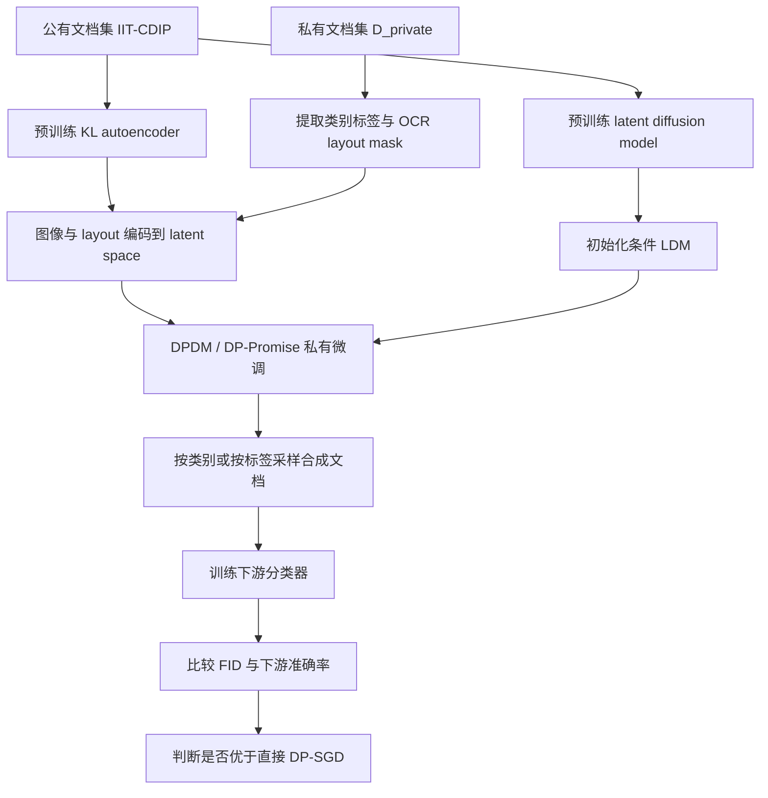
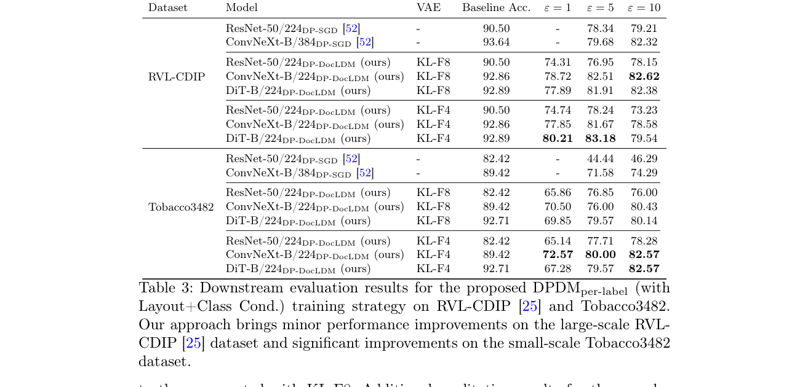

# DP-DocLDM: Differentially Private Document Image Generation using Latent Diffusion Models

- Title: DP-DocLDM: Differentially Private Document Image Generation using Latent Diffusion Models
- Material Path: `references/materials/survey/2025-icdar-dp-docldm-private-document-image-generation-latent-diffusion.pdf`
- Primary Track: `survey`
- Venue / Year: `ICDAR 2025`
- Threat Model Category: `differentially private synthetic document generation for privacy-preserving downstream document classification`
- Core Task: `利用公有文档数据预训练、再对私有文档做差分隐私微调的条件 latent diffusion model 生成可替代真实私有样本的合成文档图像`
- Open-Source Implementation: 论文正文与当前本地索引未给出可核实的公开代码仓库链接
- Report Status: `complete`

## Executive Summary

这篇论文讨论的不是传统意义上的扩散模型成员推断，而是一个更偏防御与替代训练流程的问题：在文档图像分类场景中，真实业务文档往往包含敏感内容，直接对下游分类器做 DP-SGD 训练会带来明显的性能损失与训练成本，因此作者尝试先生成满足差分隐私约束的合成文档，再用这些合成样本训练普通分类器。

核心方法是 DP-DocLDM。作者先在大规模公有文档图像集 IIT-CDIP 上预训练 KL 正则自编码器和 latent diffusion model，再在私有数据集上执行差分隐私微调。模型既可做类别条件生成，也可额外接收 OCR 提取的版式二值掩码作为 layout condition。私有训练阶段作者比较了 DPDM 和 DP-Promise，两者都在 latent diffusion 的 fine-tuning 上施加样本级 DP，并最终输出按类别生成的合成文档图像。

论文的主结论是：对 RVL-CDIP 这类较大数据集，DP-DocLDM 相比直接 DP-SGD 训练只带来小幅但可见的收益；对 Tobacco3482 这类小规模数据集，先生成私有合成数据再训练分类器的路线明显更优。以 Table 3 为例，Tobacco3482 上 ConvNeXt-B 在 `ε=10` 时从 DP-SGD 的 `74.29%` 提升到 DP-DocLDM 的 `82.57%`。对 DiffAudit 而言，这篇论文重要之处在于它提供了一条“用扩散模型做私有数据替代”的防御叙事与对照基线，但它并不直接扩展扩散成员推断攻击能力。

## Bibliographic Record

- Title: DP-DocLDM: Differentially Private Document Image Generation using Latent Diffusion Models
- Authors: Saifullah Saifullah, Stefan Agne, Andreas Dengel, Sheraz Ahmed
- Venue / year / version: ICDAR 2025 conference paper
- Local PDF path: `<DIFFAUDIT_ROOT>/Research/references/materials/survey/2025-icdar-dp-docldm-private-document-image-generation-latent-diffusion.pdf`
- Source URL: [https://doi.org/10.1007/978-3-032-04627-7_6](https://doi.org/10.1007/978-3-032-04627-7_6)

## Research Question

论文试图回答的精确问题是：能否在严格样本级差分隐私约束下，利用 conditional latent diffusion model 为私有文档图像数据集生成类别可控、版式合理、足以支撑下游分类训练的合成替代数据，并使该替代路线在效用上优于直接对分类器施加 DP-SGD。其默认部署前提是，训练方可以访问公有文档数据用于预训练，并能访问私有训练集、类别标签以及通过 OCR 提取的版式信息；隐私保证则集中在私有 fine-tuning 阶段，而非整个公有预训练过程。

## Problem Setting and Assumptions

- Access model: 防御者完全控制生成模型与下游分类器训练流程，目标是在私有 fine-tuning 阶段实现样本级 `(ε, δ)`-DP。
- Available inputs: 公有文档数据集 IIT-CDIP Test Collection 1.0，私有数据集 RVL-CDIP 与 Tobacco3482，类别标签，OCR 提取的 line-level layout mask，以及预训练 KL autoencoder / latent diffusion backbone。
- Available outputs: 私有数据对应的类别条件合成文档图像、FID 指标、以及用合成数据训练得到的下游分类准确率。
- Required priors or side information: 需要存在与目标任务相关的公有文档预训练数据；需要标签驱动的 class-conditional 或 per-label 训练；需要 Tesseract OCR 生成版式掩码。
- Scope limits: 论文只评估 document classification，不覆盖文档关键信息抽取、布局分析等更复杂任务，也没有直接评估成员推断、重建或样本提取攻击。

## Method Overview

方法由三段组成。第一段是在公有数据上预训练表示与生成骨干。作者先训练 KL-reg autoencoder，把高分辨率文档图像压缩到 latent space，再在 latent 空间上预训练 diffusion model。预训练设置不仅比较无条件模型，还比较类别条件与“类别 + OCR 版式”联合条件模型。

第二段是在私有数据上做差分隐私微调。作者分别尝试 class-conditional fine-tuning 和 per-label fine-tuning，并在优化时使用 DPDM 或 DP-Promise。布局条件的实现方式是：把 OCR 生成的二值版式图编码到 latent space，再与带噪图像 latent 拼接；类别条件则通过 class embedding 注入到 timestep embedding 中。最终目标不是直接发布私有分类器，而是发布一个可从私有分布中采样的受 DP 约束生成器。

第三段是把生成器产出的合成文档作为训练集，按常规流程训练 ResNet-50、ConvNeXt-B 或 DiT-B 分类器。论文因此把效用评估放在“synthetic-to-downstream”链路上，而不是把 diffusion model 本身的 loss 或 sample quality 当作唯一目标。

## Method Flow

## Key Technical Details

论文的生成部分仍然沿用标准扩散前向过程，只是计算发生在 latent space。作者首先把文档图像编码为 `z_0`，随后在任意时间步通过闭式公式获得 `z_t`。这一步的重要性在于：文档图像的高频纹理被压缩后，模型更容易集中学习版式与语义结构，而不是逐像素细节。

$$
x_t = \sqrt{\bar{\alpha}_t} x_0 + \sqrt{1-\bar{\alpha}_t}\,\epsilon,\quad \epsilon \sim \mathcal{N}(0, I)
$$

在条件 latent diffusion 训练中，作者把类别条件 `c` 与 layout mask `m` 同时引入噪声预测网络。类别嵌入加到时间嵌入中，layout mask 则先经同一编码器 `E` 映射到 latent space，再与带噪 latent 连接。与无条件目标相比，这一步是论文最关键的建模改造，因为实验表明 layout conditioning 对最终类别可分性和样本多样性贡献最大。

$$
\min_{\theta}\ \mathbb{E}_{t,\epsilon,z_0 \sim E(D_{\mathrm{public}})} \left\| \epsilon - \epsilon_{\theta}(z_t, t, c, E(m)) \right\|_2^2
$$

私有优化部分采用 DPDM / DP-Promise。附录给出的 DPDM 伪代码显示，作者会为每个样本采样多个噪声尺度并做 noise multiplicity 平均，再执行梯度裁剪和高斯噪声注入；这也是论文能够在不改变整体 privacy budget 的情况下提升 diffusion 训练稳定性的关键实现点。主实验中作者冻结 timestep embedding，仅训练约 `32M` 参数，并使用 `C=0.01`、batch size `1096`、learning rate `3e-4`。

$$
\tilde{l}_i = \frac{1}{K}\sum_{k=1}^{K}\lambda(\sigma_{ik})\left\|D_{\theta}(x_i+n_{ik}, \sigma_{ik}) - x_i\right\|_2^2
$$

## Experimental Setup

- Datasets: 公有预训练数据为 IIT-CDIP Test Collection 1.0；私有评测数据为 RVL-CDIP 与 Tobacco3482。
- Model families: KL-F8 与 KL-F4 autoencoder；latent diffusion 预训练配置包括 `Uncond.+Unaug.`、`Uncond.+Aug.`、`Class Cond.`、`Layout+Class Cond.`。
- Private training strategies: `DPDMCFG`、`DPDMper-label`、`DP-PromiseCFG`、`DP-Promiseper-label`。
- Downstream classifiers: ResNet-50/224、ConvNeXt-B/224 或 /384、DiT-B/224。
- Metrics: 生成质量用 FID；最终效用用下游分类准确率。
- Evaluation conditions: 第一阶段固定在 RVL-CDIP 上比较训练策略；第二阶段选择最佳配置后，在 `ε ∈ {1,5,10}` 上做最终评测。私有训练阶段 RVL-CDIP 训练 50 个 epoch，Tobacco3482 训练 250 个 epoch；采样时使用 200-step DDPM sampler。

## Main Results

- Stage 1 的核心结论是，`Layout+Class Cond.` 明显优于仅类别条件或无条件预训练。RVL-CDIP 上，`DPDMper-label + Layout+Class Cond. + KL-F4` 的下游准确率达到 `77.73%`，`DP-Promiseper-label + Layout+Class Cond. + KL-F4` 达到 `78.44%`，明显高于无条件设置。
- 论文最终没有选用表面上最优的 `DP-Promiseper-label` 作为主线，是因为作者指出它在其他设置下会出现更高 FID，且需要为不同场景手工调节噪声倍率 `σ`。因此最终评测采用了更稳定的 `DPDMper-label + Layout+Class Cond.`。
- 在 RVL-CDIP 上，DP-DocLDM 相比直接 DP-SGD 只呈现小幅收益。例如 ConvNeXt-B 在 `ε=5` 与 `ε=10` 时分别达到 `82.51%` 与 `82.62%`，相对 DP-SGD 的 `79.68%` 与 `82.32%` 有轻微提升；DiT-B 在 `ε=1` 时达到 `80.21%`，是该设置下的最好结果之一。
- 论文最强的结果出现在小规模 Tobacco3482。ConvNeXt-B 在 `ε=5` 与 `ε=10` 时分别从 DP-SGD 的 `71.58%`、`74.29%` 提升到 `80.00%`、`82.57%`；ResNet-50 也从 `44.44%`、`46.29%` 提升到 `77.71%`、`78.28%`。因此“用私有合成数据替代直接私有训练”这一叙事主要由小样本场景支撑。
- 生成质量方面，KL-F4 在两个数据集上的 FID 都显著优于 KL-F8，例如 RVL-CDIP 在 `ε=10` 时为 `4.69` 对 `11.98`。但更好的视觉质量并不总能转化为更好的下游分类效果，说明视觉逼真度不是该路线的充分效用指标。

## Strengths

- 问题定义清晰，直接回应“真实私有文档无法方便用于标准训练”这一高约束场景，而不是抽象讨论通用图像生成。
- 把公有预训练、layout conditioning、差分隐私 fine-tuning 与下游分类评估串成完整链路，实验流程闭环较完整。
- 明确比较了多种预训练条件与两种 DP 训练算法，能够解释为什么最终配置不是简单地“谁的表格数字最高就选谁”。
- 在 Tobacco3482 这类小规模数据上给出相对强的效用改善，说明生成式替代训练在数据稀缺文档场景中确有现实价值。

## Limitations and Validity Threats

- 论文主要证明的是“在 DP 约束下还能训练出有用的合成替代数据”，而不是直接证明对成员推断、重建或提取攻击的经验抗性，因此其安全性论证主要依赖 DP 定义而非攻击实验。
- 公有预训练严重依赖大规模 IIT-CDIP，这意味着方法的成功部分建立在强公有先验之上；若缺少同域公有文档数据，结论未必成立。
- per-label private fine-tuning 实际上相当于为不同类别维护独立模型，这会增加工程复杂度，也默认标签质量较高且类别边界明确。
- KL-F4 在视觉质量上更优，但其下游分类效果并不稳定，说明当前评估还没有完全解释“生成保真度”和“分类可用性”之间的关系。
- 论文没有给出可核实的公开实现链接，且 DP-Promise 需要场景化调参，降低了严格复现的可操作性。

## Reproducibility Assessment

忠实复现至少需要以下资产：IIT-CDIP Test Collection 1.0 公有文档数据、RVL-CDIP 与 Tobacco3482 私有评测集、KL autoencoder 预训练流程、带类别与 OCR layout 条件的 latent diffusion 训练代码、DPDM / DP-Promise 优化实现、RDP / GDP privacy accountant，以及生成后再训练多种分类器的评测脚本。由于论文采取“生成器训练 + 合成数据采样 + 下游分类器训练”的串联流程，算力和工程耦合度都显著高于只做攻击打分的 DiffAudit 论文路线。

当前 DiffAudit 仓库并未覆盖该路线的实现，至少我没有在目标范围内发现对应训练脚本或实验产物。最主要的阻塞项是：缺少公开代码、缺少超大规模公有文档预训练管线、缺少 OCR layout 条件构造与私有 accountant 细节封装。因此，这篇论文更适合作为 survey / defense 线索和对照叙事，而不是短期可直接落地的复现实验。

## Relevance to DiffAudit

这篇论文与 DiffAudit 的关系更接近“防御和替代训练路线综述”而非主线攻击论文。它提醒我们，在扩散模型隐私讨论中，不应只把问题表述为成员推断，也可以把扩散模型当作一种隐私保护数据合成器，用来绕开对真实敏感文档的直接训练。

具体到项目叙事，这篇论文可以支撑两个点。第一，若要比较“直接 DP 训练分类器”和“先做私有生成再做常规训练”的路线，DP-DocLDM 是一个相对完整的文档场景案例。第二，它说明在小样本、高敏感度文档任务中，生成式替代训练可能比直接 DP-SGD 更有吸引力；但由于它没有做扩散成员推断攻击评测，因此不能被误记为 DiffAudit 的攻击主线证据。

## Recommended Figure

- Figure page: `14`
- Crop box or note: `45 248 570 500`，裁切 Table 3 主结果区域与图注，排除页内大段正文与 Table 2。
- Why this figure matters: 该表直接比较了 DP-DocLDM 与直接 DP-SGD 在两个数据集、三种隐私预算和多种分类器下的最终下游准确率，是论文“在小规模私有文档数据上更适合走合成替代路线”的核心证据。我已直接检查裁切后的 PNG，可见表格主体与关键数字清晰可读。
- Local asset path: `../assets/survey/2025-icdar-dp-docldm-private-document-image-generation-latent-diffusion-key-figure-p14.png`

## Extracted Summary for `paper-index.md`

这篇论文研究如何在文档图像分类场景下，用满足差分隐私约束的合成文档替代真实私有训练数据。作者指出，直接对下游分类器施加 DP-SGD 往往带来较大性能损失，因此更可行的问题是先训练一个私有生成器，再把真实敏感文档替换为合成数据用于常规训练。

方法上，作者提出 DP-DocLDM：先在大规模公有文档数据上预训练 KL autoencoder 和 conditional latent diffusion model，再在私有 RVL-CDIP 与 Tobacco3482 上用 DPDM 或 DP-Promise 做差分隐私微调。模型同时使用类别条件与 OCR 提取的 layout mask，并比较 class-conditional 与 per-label 两类私有训练策略。实验显示，`Layout+Class Cond. + per-label` 最有效，且在小规模 Tobacco3482 上，相比直接 DP-SGD 能显著提升下游分类准确率。

对 DiffAudit 来说，这篇论文更适合作为 defense / survey 侧的重要参照，而不是攻击路线本身。它说明扩散模型不仅可能泄露训练数据，也可以被用作私有数据替代器；同时，它为“直接私有训练”与“先私有生成再常规训练”的路线比较提供了一个具体、可引用的文档场景案例。
