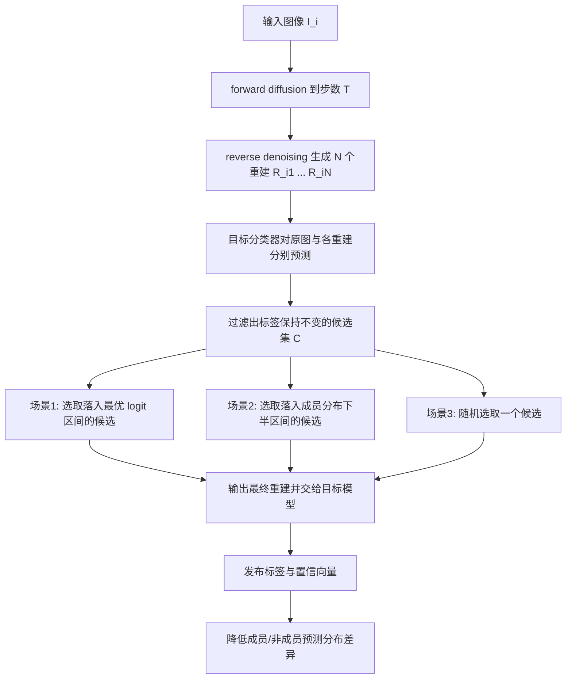
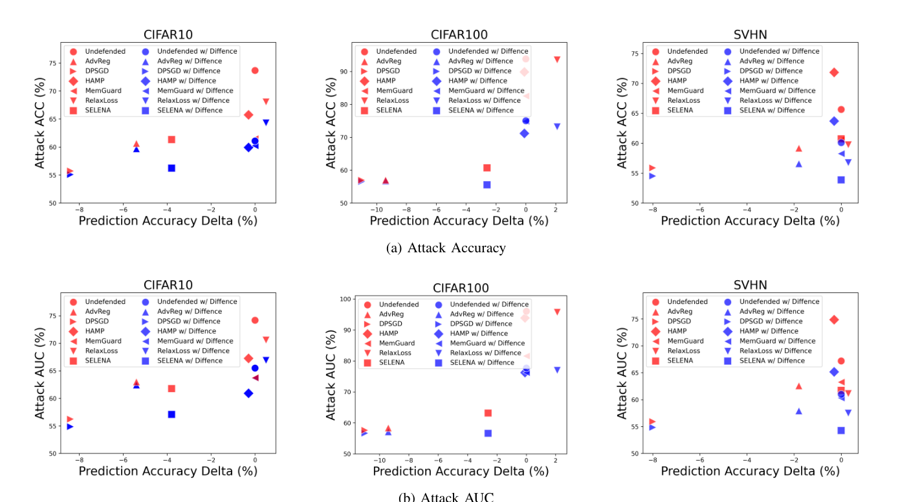

# DIFFENCE: Fencing Membership Privacy With Diffusion Models

- Title: DIFFENCE: Fencing Membership Privacy With Diffusion Models
- Material Path: `references/materials/survey/2025-ndss-diffence-fencing-membership-privacy-diffusion-models.pdf`
- Primary Track: `survey`
- Venue / Year: `NDSS 2025`
- Threat Model Category: `black-box membership inference defense for image classifiers; diffusion-based pre-inference defense with adaptive attacker assumption`
- Core Task: `在不修改目标分类器训练和输出接口的前提下，通过扩散重建削弱成员与非成员之间的预测分布差异`
- Open-Source Implementation: 主文未给出公开仓库链接；当前报告未在 PDF 正文中发现代码 URL
- Report Status: `completed`

## Executive Summary

这篇论文研究图像分类模型的成员推断防御，而不是扩散模型本身的成员推断攻击。作者关注的核心矛盾是：现有训练期防御和后处理防御往往要么改训练流程，要么篡改输出置信度，从而牺牲可部署性或模型效用。DIFFENCE 的切入点是把防御前移到推理输入侧，在样本进入目标分类器之前先做扩散式重建，使成员样本与非成员样本都被映射到“模型未直接见过但语义相近”的新样本上。

方法上，作者使用 diffusion model 对输入图像先加噪再去噪，并为每个输入生成多个重建候选；之后只保留预测标签与原图一致的候选，以避免准确率下降，再按防御者可用先验选择最终重建。论文把部署条件分成三个场景：同时拥有部分成员与非成员参考集、仅拥有成员参考集、以及完全不知道任何样本成员身份。作者的主要主张是，这一过程能显著缩小成员与非成员的 confidence、entropy 和 parametric logit 分布差异，从而压低黑盒 MIA 成功率。

实验上，论文在 CIFAR-10、CIFAR-100、SVHN、CelebA 和 UTKFace 上评估了六类攻击、六类既有防御以及多种模型架构。作者报告，在 ResNet18 的基准设置中，DIFFENCE 对未防御模型平均降低 15.8% 攻击准确率和 14.0% 攻击 AUC；与 SELENA 组合时仍可再降 9.3% 和 10.0%。同时，模型标签准确率保持不变，ECE 与原模型接近，额外推理开销平均约 57ms。对 DiffAudit 而言，这篇论文的价值在于它明确展示了“分布差异对齐”这一防御路线，并给黑盒成员推断评估提供了一个重要的输入侧对照基线。

## Bibliographic Record

- Title: DIFFENCE: Fencing Membership Privacy With Diffusion Models
- Authors: Yuefeng Peng, Ali Naseh, Amir Houmansadr
- Venue / year / version: NDSS 2025 conference paper; PDF metadata 同时标记 `arXiv:2312.04692v3`
- Local PDF path: `D:/Code/DiffAudit/Research/references/materials/survey/2025-ndss-diffence-fencing-membership-privacy-diffusion-models.pdf`
- Source URL: [https://doi.org/10.14722/ndss.2025.230298](https://doi.org/10.14722/ndss.2025.230298)

## Research Question

论文试图回答的问题是：如果攻击者只能黑盒访问目标分类器输出，但能够自适应地按同样方式处理查询样本，防御者是否仍能在不改目标模型训练过程、也不篡改输出向量的情况下，显著削弱成员推断攻击。更具体地说，作者把问题建模为“如何消除成员与非成员的预测分布差异”，并把该差异视为黑盒 MIA 的主要可利用信号。

## Problem Setting and Assumptions

- Access model: 攻击者黑盒访问目标分类器输出向量，可知晓防御机制与模型架构，并能以同一 diffusion model 预处理自己的训练样本，因此实验中的攻击是自适应攻击。
- Available inputs: 防御者拥有目标分类器、一个可用的 diffusion model，以及待保护输入样本；场景 1 还要求少量已知成员与非成员参考样本，场景 2 要求少量已知成员，场景 3 不要求成员身份先验。
- Available outputs: 目标分类器最终预测标签与置信向量；中间重建样本和内部激活默认不向攻击者公开。
- Required priors or side information: 论文假设不存在经由 diffusion 重建结果或模型中间态的额外泄露；同时假设攻击者掌握部分已知成员/非成员样本以直接训练攻击器，而非必须训练 shadow models。
- Scope limits: 方法只直接缓解非 label-only 的黑盒 MIA，不试图改变标签输出，因此不能单独解决 label-only 攻击；实验对象也是图像分类模型，而非文本到图像扩散生成模型。

## Method Overview

DIFFENCE 的流程可以概括为“先重建，再筛选，再分类”。给定输入图像，系统先用 forward diffusion 在步数 `T` 处加入高斯噪声，再通过 reverse denoising 得到重建图像。由于单个重建样本质量不稳定，作者为每个输入生成 `N` 个候选重建，并把目标分类器作用到每个候选上。

接下来，防御只保留那些预测标签与原始输入一致的候选，这一步保证标签层面的模型效用不被破坏。若防御者有更强先验，就进一步在这些候选中选择使成员与非成员预测分布更靠近的样本。场景 1 通过最小化成员与非成员 logit 分布的 Jensen-Shannon divergence 来选取目标区间；场景 2 只根据成员分布设定区间 `[min(logit_mem), mean(logit_mem)]`；场景 3 则在标签一致候选中随机选取。

作者强调 DIFFENCE 的关键不是“用扩散模型增强输入”，而是“用扩散模型洗掉高频细节并缩窄 prediction distribution gap”。因为它工作在 pre-inference 阶段，所以既可以单独部署，也可以与 SELENA、HAMP、MemGuard 等训练期或后处理防御级联。

## Method Flow

## Key Technical Details

论文把成员泄露信号的一部分写成参数化置信度 `logit`，并据此分析成员与非成员的预测分布差异：

$$
\phi(p) = \log \left(\frac{p}{1-p}\right), \qquad p = \max(f(x))
$$

用于重建输入的 forward diffusion 采用标准 DDPM 闭式表达：

$$
x_t = \sqrt{\bar{\alpha}_t} x_0 + \sqrt{1-\bar{\alpha}_t}\,\epsilon
$$

最终输出来自标签保持约束下的候选选择：

$$
P_i = \operatorname{select}\left(\left\{ f(R_{ij}) \mid f(R_{ij}) = f(I_i),\ j = 1,\ldots,N \right\}\right)
$$

其中 `select` 在三个场景下含义不同。场景 1 的技术关键是用少量已知成员与非成员重建样本估计 logit 分布，并搜索一个使 JS divergence 最小的区间；场景 2 只依赖成员分布，因此更弱；场景 3 连成员标签都没有，只能随机选。论文还指出，小 `T` 值主要改动高频细节而尽量保持低频语义不变，这是其“保语义、改细节”假设的频域解释。另一个重要实现细节是，作者默认 `N=30`、`T=160`，并允许直接使用公开预训练 diffusion model，而不要求与目标分类器同分布同数据训练。

## Experimental Setup

- Datasets: CIFAR-10、CIFAR-100、SVHN，以及高分辨率的 CelebA 和 UTKFace。
- Model families: 主实验目标分类器为 ResNet18；附录扩展到 DenseNet121、VGG16 和 ViT。
- Baselines: 六类攻击包括 NN-based attack、loss、confidence、entropy、modified entropy 和 LiRA；六类防御包括 AdvReg、MemGuard、SELENA、RelaxLoss、HAMP、DP-SGD。
- Metrics: 隐私侧报告 attack accuracy、attack AUC；在 SVHN 上还用 LiRA 报告 `TPR@0.1%FPR` 和 `TNR@0.1%FNR`；效用侧除测试准确率外，还评估 ECE 以判断置信向量是否仍有意义。
- Evaluation conditions: 默认训练 100 epoch，Adam 优化器，batch size 128；DIFFENCE 使用标准 DDPM，通常为每个样本生成 `N=30` 个重建，扩散步数 `T=160`。论文同时评估了使用 ImageNet 预训练 diffusion model 的跨数据分布部署。

## Main Results

论文最强的结果来自 Scenario 1。作者报告，在 ResNet18 上跨三个基准数据集平均看，DIFFENCE 对未防御模型可降低 15.8% 攻击准确率和 14.0% 攻击 AUC；对 HAMP、RelaxLoss、SELENA 也分别继续带来显著下降。Table III 还显示，即便在更弱的场景 2 和场景 3 下，平均 attack AUC 和 attack accuracy 仍普遍优于未加 DIFFENCE 的对应设置。

在低误报区评估中，DIFFENCE 也不是只改善平均 AUC。论文在 SVHN 上报告，Scenario 3 对未防御模型可把 `TPR@0.1%FPR` 和 `TNR@0.1%FNR` 分别降低 63.9% 和 56.8%；与其他六个防御级联时，`TPR@0.1%FPR` 平均仍可继续下降 52.8%。这说明它对极低 FPR 区间的隐私风险也有实质影响。

效用方面，作者强调两点。第一，DIFFENCE 通过标签一致性筛选避免了分类准确率下降。第二，它没有像某些输出扰动防御那样明显损坏置信向量：未防御模型与三种 DIFFENCE 场景的平均 ECE 分别为 0.139、0.142、0.126、0.131，差异很小。进一步地，使用 ImageNet 公开 diffusion model 时，CelebA 上平均 attack AUC 和 attack accuracy 仍分别下降 6.2% 和 6.0%，UTKFace 上分别下降 9.5% 和 9.9%，说明该方法不必严格依赖同分布自训练扩散模型。

## Strengths

- 提出明确的 pre-inference 防御范式，避免修改目标模型训练过程或输出接口，部署边界清晰。
- 把“缩小 prediction distribution gap”作为统一解释框架，并用 confidence、entropy、parametric logit、ECE、低 FPR 指标等多种证据支撑。
- 兼容既有训练期和后处理防御，形成可级联的组合式防御路径，而不是替换式防御。
- 实验覆盖数据集、模型架构、攻击类型和防御基线较广，并额外验证了异分布公开 diffusion model 的可用性。

## Limitations and Validity Threats

- 方法显式保持原始预测标签不变，因此对 label-only 攻击没有直接缓解作用；论文对此是承认而非解决。
- 场景 1 和场景 2 依赖少量成员身份先验，真实部署时未必稳定可得；场景 3 的效果也明显弱于场景 1。
- 论文假设 diffusion 重建结果和目标模型中间表示不可被攻击者访问，这一隔离前提若不成立，可能引入新的泄露面。
- 额外推理开销虽低于 MemGuard，但仍需 diffusion reconstruction，多次生成 `N` 个候选会带来非零时延。
- 研究对象是图像分类成员推断，不应直接外推到 text-to-image diffusion model 的成员推断审计。

## Reproducibility Assessment

忠实复现这篇论文需要四类核心资产：目标分类器训练代码与数据划分、可运行的 DDPM 或兼容 diffusion model、完整的自适应攻击与防御基线实现、以及针对多个场景的样本选择逻辑。若复现低 FPR 的 LiRA 结果，还需要训练大量 shadow models，计算成本不低。

代码可得性目前偏弱。主文未给出公开仓库链接，当前报告也未在 PDF 正文中读到代码 URL。就 DiffAudit 仓库现状而言，本次检索只命中 `references/materials/paper-index.md` 与 `references/materials/manifest.csv` 中的索引项，未发现已落地的 DIFFENCE 复现实验代码路径。因此当前仓库可视为已完成文献建档，但尚不能据此认定该路线已经被实验复现。

## Relevance to DiffAudit

这篇论文对 DiffAudit 的意义主要在防御叙事与评测基线，而不在于扩展新的攻击能力。它把黑盒成员推断问题重新表述为“成员与非成员预测分布能否被输入重建抹平”，这与 DiffAudit 当前围绕可观测统计量做审计的思路高度相关，但方向相反，因而适合作为对照面。

更具体地说，DIFFENCE 说明很多有效 MIA 特征并不只来自模型是否过拟合，还来自成员与非成员在 confidence/logit 分布上的系统差异；只要这些差异被前置重建压平，即使不改模型权重，也能明显降低攻击成功率。对 DiffAudit 的 survey 组织而言，这有助于把“攻击特征是什么”与“哪些防御直接针对这些特征”连接起来。

## Recommended Figure

- Figure page: `9`
- Crop box or note: `30 35 585 345`，仅保留 Figure 5 的六个散点子图和小标题，不包含下方表格与正文。
- Why this figure matters: 这是论文最直接的主结果图。它把三个数据集、两个核心隐私指标，以及“原防御”和“加入 DIFFENCE 后”的位置关系放在同一平面上，直观展示了在几乎不损伤预测准确率的前提下，攻击 accuracy 与 AUC 如何整体向更低方向移动。
- Local asset path: `../assets/survey/2025-ndss-diffence-fencing-membership-privacy-diffusion-models-key-figure-p9.png`

## Extracted Summary for `paper-index.md`

这篇论文研究图像分类模型的成员推断防御，目标是在不改目标模型训练流程、也不篡改输出接口的情况下，削弱黑盒攻击者利用成员与非成员预测分布差异进行推断的能力。作者把问题定义为 pre-inference defense：在样本进入目标分类器前先做扩散式重建，让模型面对的是语义相近但细节被改写的新输入。

方法上，DIFFENCE 对每个输入先做 forward diffusion 与 reverse denoising，生成多个重建候选，再只保留预测标签与原图一致的候选，以避免准确率下降。若防御者有更强先验，就在这些候选中挑选能更好缩小成员与非成员 logit 分布差异的样本。论文报告该方法可在多个数据集和既有防御之上继续降低 attack accuracy、attack AUC 以及低 FPR 区间的攻击能力，同时基本保持分类准确率和置信校准。

对 DiffAudit 来说，这篇论文的重要性在于它提供了一条与攻击视角互补的输入侧防御路线，并明确指向成员推断最常利用的统计差异究竟是什么。它不直接扩展 DiffAudit 的攻击面，但非常适合作为 survey 中“预测分布差异如何被主动压平”的代表性防御论文，也能为后续比较黑盒审计与防御效果提供统一参照。
