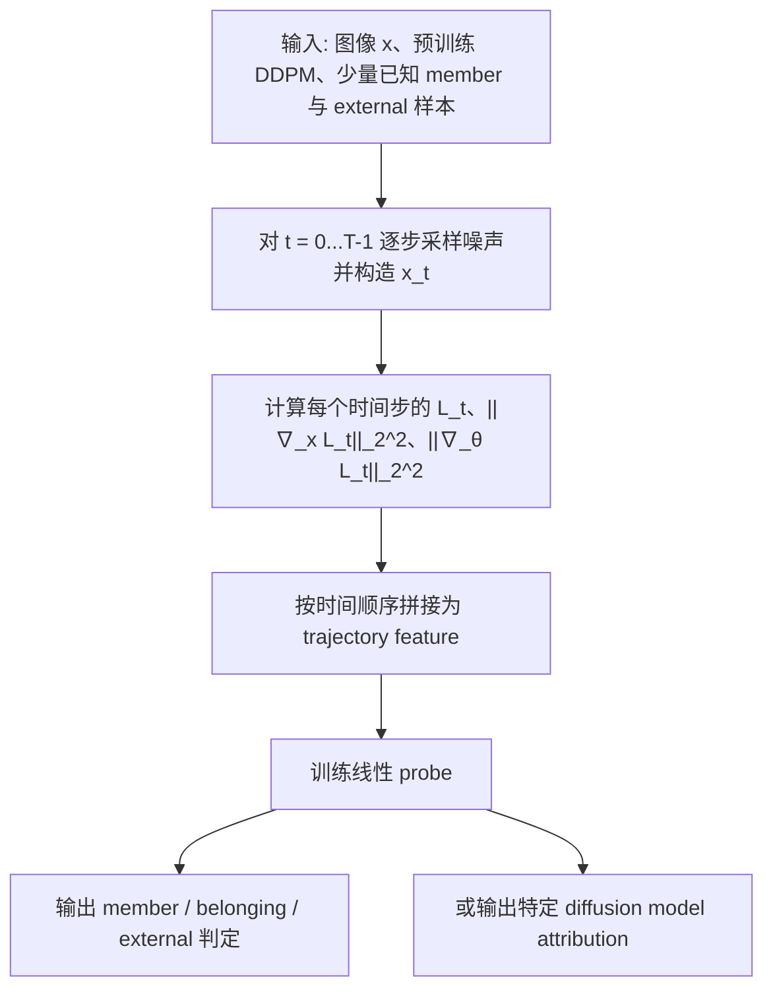
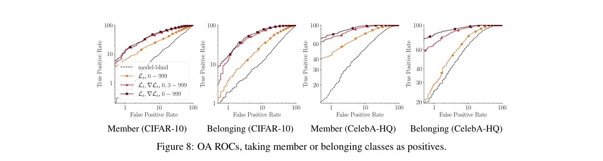

# Tracing the Roots: Leveraging Temporal Dynamics in Diffusion Trajectories for Origin Attribution

- Title: Tracing the Roots: Leveraging Temporal Dynamics in Diffusion Trajectories for Origin Attribution
- Material Path: `references/materials/survey/2025-neurips-tracing-the-roots-origin-attribution-diffusion-trajectories.pdf`
- Primary Track: `survey`
- Venue / Year: NeurIPS 2025
- Threat Model Category: White-box diffusion provenance analysis for membership inference and origin attribution
- Core Task: 基于整条 diffusion trajectory 的特征，区分 member、belonging 与 external，并进一步做特定扩散模型归因
- Open-Source Implementation: 主文未给出公开仓库链接；论文 checklist 声称代码与数据开放，但具体实现位置需结合 supplemental material 进一步核实
- Report Status: completed

## Executive Summary

本文研究的是一个比传统 MIA 更宽的来源判定问题：给定一个预训练扩散模型和一张图像，图像究竟来自该模型训练集、该模型的新生成样本，还是外部数据。作者认为，如果只做 member / non-member 二分类，会把“模型自己生成但并非训练样本”的 belonging 数据误判进来，因此需要把 membership inference 与 model attribution 统一到同一 provenance 框架下讨论。

核心方法不是继续在某个单一去噪时刻上做 loss thresholding，而是把整条扩散轨迹当作可判别对象。作者对每个时间步提取 denoising loss、输入梯度范数和参数梯度范数，再把这些时间序列拼接成 trajectory feature，最后只用线性 probe 做分类。论文因此直接挑战了 diffusion MIA 文献中流行的 “Goldilocks zone” 假说，即只有中间若干去噪步最有用。

实验上，作者先证明现有 threshold-based MIA 在更真实的 setting 下并不稳健：它既无法把 training member 和 model-generated data 可靠区分开，也可能在存在分布偏移时被不访问模型的 naive baseline 超过。随后，基于全轨迹特征的方法在 CIFAR-10 与 CelebA-HQ 上取得更高的 OA 指标，并给出据作者所述首个直接作用于 diffusion 的 white-box model attribution 结果。

对 DiffAudit 而言，这篇论文的重要性不在于给出一个现成可落地的黑盒审计方案，而在于它重新定义了扩散审计的判别空间。它提醒我们：若评估协议没有显式纳入 belonging 类别、没有控制分布偏移、也没有与 model-blind baseline 比较，则单纯的 MIA 指标很容易被误读。

## Bibliographic Record

- Title: Tracing the Roots: Leveraging Temporal Dynamics in Diffusion Trajectories for Origin Attribution
- Authors: Andreas Floros, Seyed-Mohsen Moosavi-Dezfooli, Pier Luigi Dragotti
- Venue / year / version: NeurIPS 2025 conference version
- Local PDF path: `references/materials/survey/2025-neurips-tracing-the-roots-origin-attribution-diffusion-trajectories.pdf`
- Source URL: `https://arxiv.org/abs/2411.07449`

## Research Question

论文试图回答的精确问题是：在白盒访问扩散模型内部信号、且仅掌握少量 member 样本子集的前提下，是否可以用 diffusion trajectory 的时间动态统一解决三类判定，即 member、belonging 和 external 的来源归属，以及更细粒度的特定模型归因。作者明确把这一问题放在责任追踪、训练数据审计和合成内容归责场景下讨论，而不是一般性的图像分类问题。

## Problem Setting and Assumptions

访问模型方面，作者假设白盒访问，可读取 DDPM 内部 denoising loss 与梯度信号；这意味着方法不是黑盒 API 攻击。可用输入包括目标图像、预训练 DDPM、少量 member 子集、external 数据，以及模型生成的 belonging 样本。可用输出是二分类或三分类 logits。关键先验包括：已知模型架构和训练范式，能够在每个时间步重复查询模型，并能在开发阶段拿到一个小比例 member 集。范围限制也很明确：论文主要评估 off-the-shelf DDPM，在受控 external set 上验证，不覆盖大型基础模型、严格黑盒 setting 或强对抗扰动环境。

## Method Overview

方法分两层。第一层是轨迹特征提取：对同一图像在多个扩散时间步注入噪声，计算每个时间步的 denoising loss，并进一步计算该 loss 对输入与模型参数的梯度范数。第二层是判别学习：把所有时间步的统计量串联成一个长向量，用线性分类器做 member-external MIA、member-belonging-external OA，或特定模型归因。论文的关键主张是，判别信号并不集中在某个局部 “最佳时间窗”，而是分布在整条轨迹的全局动态里。

## Method Flow

## Key Technical Details

论文把最终分类器写成简单线性探针：

$$
l(x;\epsilon_\theta) = W \cdot f(x;\epsilon_\theta) + b
$$

其中单时间步的基本量是 denoising loss：

$$
L_t = \left\| \epsilon_\theta\!\left(\sqrt{\bar{\alpha}_t}x + \sqrt{1-\bar{\alpha}_t}\epsilon, t\right) - \epsilon \right\|_2^2,\quad \epsilon \sim \mathcal{N}(0, I)
$$

作者最终使用的轨迹特征是跨时间步拼接的三类统计量：

$$
f(x;\epsilon_\theta) = \bigcup_{t=0}^{T-1} \left\{ L_t,\ \|\nabla_x L_t\|_2^2,\ \|\nabla_\theta L_t\|_2^2 \right\}
$$

技术上最关键的不是分类头，而是特征设计和评估协议。论文指出，若只在某个时间步上阈值化 $L_t$，方法既会把 belonging 数据误当 member，也会在有分布偏移时被不访问模型的 ResNet18 baseline 超过。相反，把时间上下文保留下来后，即便只用线性 probe，也能显著提升稳定性。

## Experimental Setup

主要数据集与模型包括：CIFAR-10 DDPM、CelebA-HQ 256 DDPM；external set 分别采用 CIFAR-10.1 与 FFHQ。OA 与模型归因实验还引入 DDIM、WaveDiff、DDGAN 生成样本作为开放世界测试对象。默认开发预算是每类 1000 个样本，特征标准化后使用线性分类器，优化器为 AdamW，batch size 50，训练 100 个 epoch，学习率 1e-3，StepLR 每 5 个 epoch 衰减 0.8。指标涵盖 AUC、TPR @ 1% FPR、ASR，以及模型归因的 class-balanced accuracy。

## Main Results

第一，传统 threshold-based MIA 在更严格语境下并不可靠。表 1 与图 1、2 显示，model-generated 样本往往取得比真实 member 更低的 loss，因此单纯阈值化 $L_t$ 无法审计 synthetic data。表 2 进一步表明，在 CelebA-HQ 对 FFHQ 的分布偏移场景下，naive model-blind baseline 的 AUC 为 94.4，反而超过 Matsumoto 等方法的 85.2 与 Kong 等方法的 62.5。

第二，作者对 “Goldilocks zone” 的反驳是有实证支撑的。表 3 表明，在固定 query budget 下，把时间步均匀分布到整条轨迹上，比只取局部区间更有效；表 4 则显示其方法在 CIFAR-10 与 CIFAR-100 的 intraclass shift 设定下，平均 TPR @ 1% FPR 分别达到 12.0±2.93 与 9.4±2.50，高于 GSA2 的 9.1±1.64 与 2.6±1.10。

第三，在统一的 OA 任务中，全特征版本达到较强结果。表 6 中，CIFAR-10 上 AUC / TPR @ 1% FPR / ASR 为 86.5 / 15.9 / 71.1，CelebA-HQ 256 上为 99.3 / 86.5 / 94.1。进一步的表 7 显示，white-box trajectory feature 还能用于 DDPM model attribution，平均 class-balanced accuracy 在 CIFAR-10 与 CelebA-HQ 上分别到达 75.5 和 76.5，但对 DDGAN、DDIM 仍存在明显失败案例。

## Strengths

- 明确指出 diffusion MIA 文献常见评测协议没有把 belonging 类纳入问题定义，因而会高估阈值法的实用性。
- 用统一 provenance 视角把 membership inference、origin attribution 与数据抽取线索连接起来，问题表述比单点攻击更完整。
- 采用极简线性 probe，因而性能增益更能归因于 trajectory feature 本身，而不是大容量分类器。
- 同时评估 interclass shift 与 intraclass shift，并引入 model-blind baseline，实验对比更有辨识力。

## Limitations and Validity Threats

- 方法依赖白盒访问与少量 member 子集，这一假设对很多现实闭源模型并不成立。
- 论文没有给出为什么梯度范数必然携带来源指纹的理论解释，核心结论仍主要依赖经验结果。
- 评估对象集中在 DDPM 与受控数据集，尚未证明能泛化到更大规模 latent diffusion 或 foundation model。
- 推理代价接近 diffusion inference，本质上比多数已有 MIA 更慢。
- 模型归因在 DDGAN、DDIM 上出现明显失败例，说明“统一 provenance”距离稳健工具还有差距。

## Reproducibility Assessment

忠实复现至少需要：可访问中间梯度的 DDPM 检查点、member 子集、external 数据集、目标模型生成样本、稳定的多时间步特征提取管线，以及足够的 GPU 预算。主文未直接给出代码仓库 URL，虽然 checklist 声称代码与数据可开放获取，但仍需补查 supplemental material 才能定位具体实现。就当前 DiffAudit 仓库而言，已存在该论文的 `manifest.csv` 与 `paper-index.md` 索引记录，但未见对应的 trajectory feature 提取或 OA 复现实验脚本，因此目前只能视为文献路线已建档，尚未进入可执行复现阶段。

## Relevance to DiffAudit

这篇论文对 DiffAudit 的直接价值有三点。第一，它把“扩散隐私审计”从 member / non-member 二元问题推进到 member / belonging / external 三元来源判定，能帮助我们重构 survey 叙事。第二，它强调分布偏移和 naive baseline 对解释 MIA 指标的重要性，这对后续评审黑盒或灰盒方法很关键。第三，它提出的 trajectory-level white-box 特征提供了一个与黑盒 query 路线完全不同的上界参考，有助于界定 DiffAudit 在不同 access model 下的能力边界。

## Recommended Figure

- Figure page: 8
- Crop box or note: `16 50 596 205` (PDF points), 裁切为 Figure 8 的 ROC 区域与标题，不包含正文
- Why this figure matters: 该图直接展示 unified origin attribution 的核心证据。四个 ROC 子图同时覆盖 member 与 belonging 两类正样本、两个数据集，并把 trajectory 特征与 model-blind baseline 放在同一坐标系下比较，比方法示意图更能支撑论文的主结论。
- Local asset path: `docs/paper-reports/assets/survey/2025-neurips-tracing-the-roots-origin-attribution-diffusion-trajectories-key-figure-p8.png`

## Extracted Summary for `paper-index.md`

这篇论文讨论扩散模型的来源判定问题，不再把任务局限为传统 member / non-member membership inference，而是要求同时区分训练成员、模型新生成样本和外部样本，并进一步考虑特定模型归因。作者认为，如果不显式建模 belonging 类别，就会把很多并非训练数据的模型生成样本错误解释成 member，从而误读扩散模型的隐私风险。

方法上，作者不再依赖某个单独时间步的 denoising loss 阈值，而是沿整条 diffusion trajectory 提取跨时间步特征，包括 $L_t$、$\|\nabla_x L_t\|_2^2$ 和 $\|\nabla_\theta L_t\|_2^2$，再用线性 probe 做分类。实验表明，这种全轨迹表征比局部 “Goldilocks zone” 思路更稳健，也能在统一的 origin attribution 任务中超过 naive model-blind baseline，并给出据作者所述首个直接面向 diffusion 的 white-box model attribution 结果。

对 DiffAudit 来说，这篇论文的意义在于校正评估口径，而不只是提供一个新分数。它说明扩散审计若不控制分布偏移、不比较 model-blind baseline、也不把 belonging 纳入标签空间，就容易高估 MIA 的实际解释力；同时，它为白盒路线提供了一个 trajectory-level 的上界参考，能帮助项目区分黑盒、灰盒和白盒审计的能力边界。
