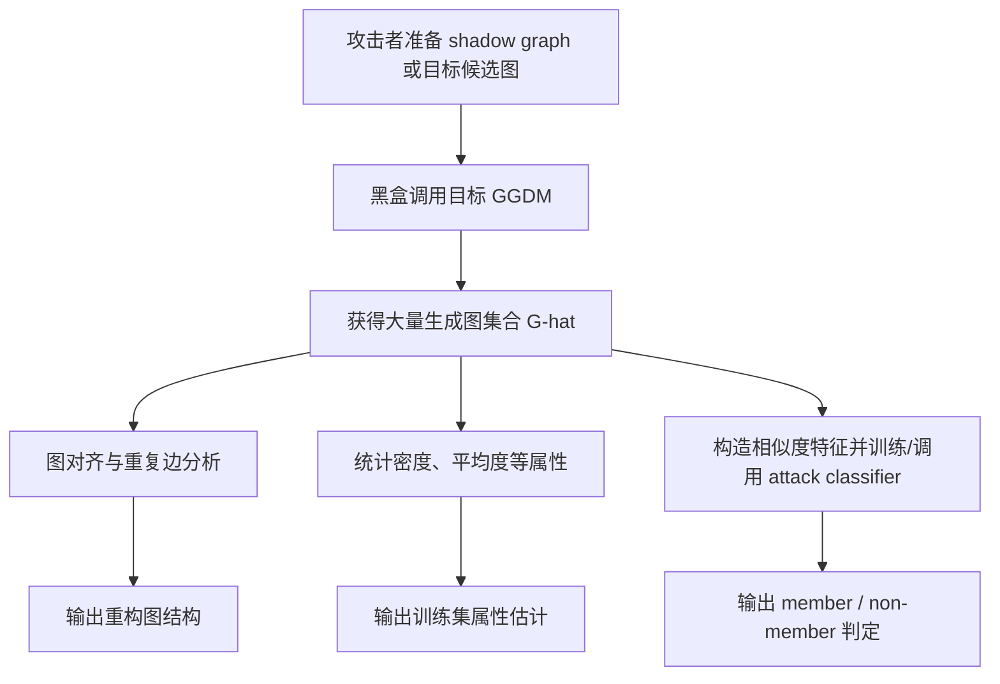
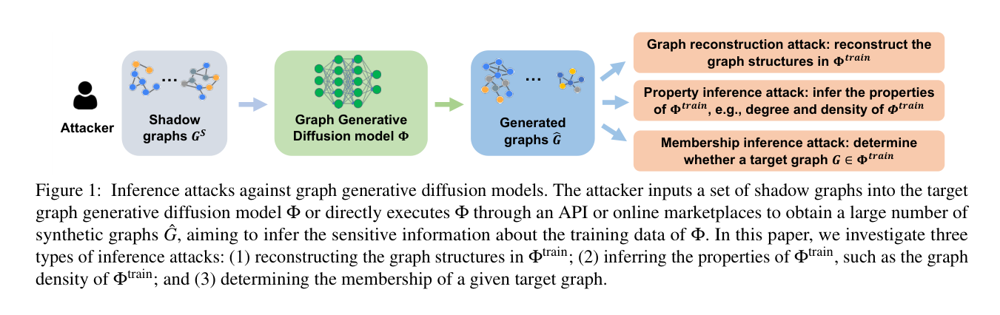

# Inference Attacks Against Graph Generative Diffusion Models

- Title: `Inference Attacks Against Graph Generative Diffusion Models`
- Material Path: `<DIFFAUDIT_ROOT>/Research/references/materials/survey/2026-arxiv-inference-attacks-graph-generative-diffusion-models.pdf`
- Primary Track: `survey`
- Venue / Year: `arXiv / 2026 (arXiv:2601.03701v1)`
- Threat Model Category: `black-box privacy inference against graph generative diffusion models, covering graph reconstruction, property inference, and membership inference`
- Core Task: `仅凭目标 GGDM 的生成图输出，恢复训练图结构、估计训练集统计属性，并判断给定图是否属于训练成员`
- Open-Source Implementation: `论文给出 Zenodo 代码归档链接：https://zenodo.org/records/17946102`
- Report Status: `complete`

## Executive Summary

这篇论文讨论的不是图像扩散模型，而是图生成扩散模型（graph generative diffusion models, GGDMs）的训练数据泄露问题。作者的中心问题是：当攻击者只能黑盒访问一个图生成扩散模型，且只能获得其输出的生成图集合时，是否仍然可以反推出训练数据中的敏感信息。围绕这个问题，论文系统提出了三类攻击：图重构攻击、属性推断攻击和成员推断攻击，并将其统一放入同一 black-box 威胁模型中评估。

方法设计的关键点在于，作者没有沿用图分类或图嵌入场景下常见的 logits、embedding 或梯度特征，而是直接从 GGDM 生成出的图集合中构造可操作信号。图重构攻击利用生成图之间的图对齐与边交集来恢复训练图结构；属性推断攻击直接统计生成图的密度、平均度等属性并近似训练集分布；成员推断攻击则训练 shadow model，并利用输入图与生成图之间、以及生成图彼此之间的结构相似度构造攻击特征。实验覆盖三类 GGDM、六个真实图数据集，并额外给出两类基于边翻转的防御。

结果上，论文报告图重构攻击的 F1 最高可达 0.99，成员推断在同数据集 shadow/target 设定下 AUC 最高可达 0.999，在跨数据集 transfer 设定下仍可达到 0.895；属性推断对平均度和密度的误差也很小。对 DiffAudit 而言，这篇论文最重要的价值不在于可直接迁移到图像扩散审计，而在于它证明了“仅凭生成样本集合”这一弱输出接口，仍可能泄露训练集结构与统计信息，因此可作为扩散隐私审计中 black-box 路线的重要参照。

## Bibliographic Record

- Title: `Inference Attacks Against Graph Generative Diffusion Models`
- Authors: `Xiuling Wang, Xin Huang, Guibo Luo, Jianliang Xu`
- Venue / year / version: `arXiv preprint, January 7 2026, arXiv:2601.03701v1`
- Local PDF path: `<DIFFAUDIT_ROOT>/Research/references/materials/survey/2026-arxiv-inference-attacks-graph-generative-diffusion-models.pdf`
- Source URL: `https://arxiv.org/abs/2601.03701`

## Research Question

论文试图回答三个彼此关联的问题：第一，目标 GGDM 生成出的图是否会暴露训练图的具体结构；第二，这些生成图是否足以泄露训练集的统计属性，如平均度、密度和属性分布；第三，在只有黑盒访问的条件下，攻击者能否判断给定图是否出现在目标模型的训练集中。作者把这一问题放在 MLaaS 或模型市场场景下讨论，即攻击者可通过 API 或在线平台调用目标 GGDM，但无法访问参数、梯度或中间去噪表示。

## Problem Setting and Assumptions

- Access model: 攻击者仅有黑盒访问，只能向目标 GGDM 提交 shadow graph、部分图或随机图，并获得其生成图输出。
- Available inputs: 目标图或 shadow graph，自定义构造的 shadow dataset，以及目标模型返回的生成图集合。
- Available outputs: 一组可进一步做结构比较、属性统计和相似度计算的生成图。
- Required priors or side information: 对成员推断而言，攻击者需要 shadow graph，并假设可用相同服务训练 shadow model；图重构与属性推断不要求读取目标模型内部状态。
- Scope limits: 论文聚焦图生成扩散模型，不讨论图像或文本到图像扩散模型；所有攻击依赖生成图质量与结构可比性，若目标服务只暴露高度过滤后的图摘要，则攻击前提会削弱。

## Method Overview

论文把三类攻击都建立在“先获得大量生成图，再从输出图集合中抽取结构信号”这一共同框架上。图重构攻击先从目标 GGDM 获得大量生成图，然后对每个生成图寻找最相似的另一张生成图，借助图对齐方法匹配节点，再把相同位置上重复出现的边视为更可能属于训练图的稳定结构。作者的基本假设是，如果模型记住了某些训练图，它会重复生成若干结构相近的样本。

属性推断攻击比图重构更直接。攻击者不再试图恢复单个训练图，而是把生成图看作训练集分布的近似采样，直接在这些生成图上计算密度、平均度、三角形数量和 arboricity 等统计量，并进一步估计它们在不同分桶区间中的分布比例。该攻击几乎不依赖复杂学习器，核心是验证生成图的统计分布是否足够贴近训练集。

成员推断攻击最复杂。攻击者先基于 shadow graph 训练 shadow GGDM，再向 shadow model 输入 member 与 non-member shadow graph，收集其生成图。随后使用 Anonymous Walk Embeddings 将图映射为向量，并构造两类相似度特征：一类衡量输入图与其生成图之间的相似度，另一类衡量由同一输入图生成的样本彼此之间的相似度。最后，攻击者使用这些特征训练 MLP、RF 或 LR 分类器，并把同样的特征提取流程应用到目标图与目标 GGDM 上，输出成员判断。

## Method Flow

## Key Technical Details

图重构攻击的核心不是直接把某张生成图当作训练图，而是先在生成图集合中为每个图寻找对齐后最相近的“同伴”图。论文用 REGAL 做节点对齐，并以平均节点表示差异最小作为最近邻选择准则：

$$
\hat{g}_j=\arg\min_{g_j}\frac{1}{|V_i|}\sum_{u\in V_i}\mathrm{Diff}\!\left(Y_i(u),Y_j(\hat{u})\right).
$$

随后，作者不采用边并集，而是采用边交集来恢复更稳定的结构，这对应其图重构步骤中最关键的保守设计：

$$
\{V_i^{\mathrm{rec}}\}=\{V_i\},\qquad \{E_i^{\mathrm{rec}}\}=\{E_i\}\cap\{\hat{E}_j\}.
$$

成员推断的 distinctive point 在于，作者并不依赖目标模型的 loss 或梯度，而是构造“生成样本内部相似度”特征。对同一个 shadow 图生成的 $N$ 个样本，攻击特征可写为

$$
A_i^{\mathrm{train}}
=
\left[
\big\|_{k\in\{1,2,3,4\}}
\mathrm{sim}_k\!\left(\mathrm{emb}(\hat{g}_{i,p}^{S}),\mathrm{emb}(\hat{g}_{i,q}^{S})\right)
\right]_{0\le p<q\le N},
$$

其中四种相似度分别是点积、余弦相似度、基于欧氏距离的差异以及 Jensen-Shannon divergence。这个设计的含义是：如果输入图是 member，模型更可能围绕它生成一簇彼此相似的图；若是 non-member，生成图内部结构会更分散。防御部分则进一步引入 saliency-map 估计边和非边的重要性，只翻转最不重要的条目，以在攻击防护与图生成效用之间取得更好的平衡。

## Experimental Setup

实验使用六个真实图数据集，覆盖分子、蛋白质、引用网络和社交网络四类领域，包括 `MUTAG`、`QM9`、`ENZYMES`、`Ego-small`、`IMDB-BINARY` 和 `IMDB-MULTI`。目标模型选用三类代表性 GGDM：score-based 的 `EDP-GNN`、SDE-based 的 `GDSS` 和 DDPM-based 的 `Digress`。训练时按 `0.7/0.1/0.2` 划分 train/validation/test，并采用早停。

图重构与属性推断实验中，作者对每个目标模型和每个数据集直接生成 `1,000` 张图，再分别执行对齐恢复与属性统计。图重构评估使用 precision、recall、F1，以及 exact match 覆盖率和 `F1 > 0.75` 覆盖率。属性推断评估的是推断值与真实训练集统计量之间的绝对差，并考察不同分桶 `k={5,10}` 下的分布差异。

成员推断实验把原始数据对半划分为 member 与 non-member，并对每个输入图通过 shadow model 生成 `100` 张图来构造特征。作者评估两种 setting：同数据集 non-transfer，以及 shadow/target 来自不同数据集的 dataset transfer。指标包括 accuracy、AUC 和 `TPR@0.1FPR`。防御实验则设置扰动比例 `r∈{0,0.1,0.3,0.5,0.7,0.9}`，并与 DP-SGD 及随机翻转生成图两个基线比较。

## Main Results

第一，图重构攻击确实能从 GGDM 的输出图中恢复训练图结构。表 3 显示，在六个数据集和三类模型上，作者方法的 F1 最高达到 `0.99`，exact match 覆盖率最高达到 `0.21`，而 `F1 > 0.75` 的覆盖率最高达到 `0.36`。这些数字说明攻击并非只能得到模糊近似，而是在部分样本上可以恢复到非常接近训练图的结构。

第二，属性推断攻击虽然非常直接，但效果并不弱。表 4 显示，平均度误差最高不超过 `0.312`，平均密度误差最高不超过 `0.049`；例如在 `IMDB-MULTI` 上，`EDP-GNN` 的平均度误差仅为 `0.005`。这表明 GGDM 的生成图在总体统计意义上已经足够接近训练集，以至于攻击者无需访问模型内部状态即可恢复训练分布特征。

第三，成员推断是全文最强的结果之一。作者报告在 non-transfer 设定下，AUC 最高达到 `0.999`；在 transfer 设定下，仍然可以达到 `0.895`。同时，利用生成图内部相似度的 `Ours-2` 在多数设置中优于 `Ours-1`。防御方面，图 7 和图 8 表明两种基于最不重要边翻转的防御在攻击性能下降到无效区间时，模型效用下降通常小于 `0.05`，优于 DP 与随机翻转基线。

## Strengths

- 论文把图重构、属性推断和成员推断放入同一个 GGDM black-box 威胁模型中，问题版图比单一 MIA 论文更完整。
- 方法设计针对图结构输出做了专门适配，例如 REGAL 对齐和 Anonymous Walk Embeddings，而不是简单照搬图像扩散攻击。
- 实验覆盖三种 GGDM 机制和六个数据集，并额外评估 data transfer setting，使结论不只停留在单一数据分布内。
- 防御部分没有只报“攻击下降”，而是显式绘制 defense-utility trade-off，便于判断其实用性。

## Limitations and Validity Threats

- 这篇论文研究的是图生成扩散模型，而 DiffAudit 当前主线更接近图像或文本到图像扩散，因此其攻击特征与评估协议不能直接平移到现有主线路线。
- 成员推断虽然针对目标模型是黑盒，但仍假设攻击者拥有 shadow graph，并能借助同类服务训练 shadow GGDM，这一先验在现实部署中可能较强。
- 图重构的最强结果并不代表大规模普遍精确恢复；exact match 覆盖率最高只有 `0.21`，说明攻击成功更像“部分样本高命中”而非全面重建。
- 防御依赖额外的 saliency 估计流程，并在缺失节点特征或标签时使用身份矩阵或 one-hot 度数作为替代，这些近似可能影响可重复性与泛化性。
- 论文公开了 Zenodo 代码归档，但开放科学部分明确提到会限制部分高风险组件，因此完整复现成员推断实现仍可能存在缺口。

## Reproducibility Assessment

若要忠实复现，至少需要三类 GGDM 的训练代码与可运行配置、六个图数据集的规范预处理、REGAL 图对齐实现、Anonymous Walk Embeddings 管线、shadow model 训练脚本，以及防御中用于边重要性估计的 GCN/节点分类模块。论文在正文中给出了较完整的指标、数据划分、生成数量和攻击流程，因此方法级复现实验是可组织的。

开源方面，论文给出了 `https://zenodo.org/records/17946102`，这比只在附录口头承诺更强，但 Open Science 章节同时说明某些高风险组件可能不会完整放出，因此复现者需要预期在成员推断细节上补足工程实现。就本次任务可见范围而言，DiffAudit 仓库已具备 PDF、报告模板与截图脚本，但未见该论文对应的实验资产或图域 GGDM 审计代码，因此当前更适合作为路线调研材料，而不是可立即执行的复现基线。

## Relevance to DiffAudit

这篇论文对 DiffAudit 的直接意义在于，它提供了一个强证据：即便模型只输出一组生成样本，不暴露 logits、embedding 或梯度，训练数据仍可能通过输出集合的内部重复性和统计稳定性被反推出去。这一观察对 black-box diffusion audit 很重要，因为它提醒我们不要把“只看最终样本”误当作天然安全。

但其适用性也应严格限定。论文处理的是图结构对象，攻击中用到的 REGAL、AWE、图密度和平均度等信号都具有图域特性，不能直接迁移到图像扩散模型。因此，这篇论文更适合作为 DiffAudit survey 中的“结构化生成模型对照案例”，用于拓展 threat model 叙述和 black-box 泄露机制认知，而不是当前图像路线的直接实现蓝本。

## Recommended Figure

- Figure page: `4`
- Crop box or note: `35 55 575 225` (PDF points), 裁切到 Figure 1 与其说明文字，不包含后续正文
- Why this figure matters: 该图最紧凑地展示了整篇论文的统一威胁模型，即攻击者通过黑盒调用 GGDM 获得生成图后，可同时执行图重构、属性推断和成员推断。相比单独的结果表，它更适合作为报告中的“总览图”，能先准确界定攻击面与任务边界。
- Local asset path: `docs/paper-reports/assets/survey/2026-arxiv-inference-attacks-graph-generative-diffusion-models-key-figure-p4.png`

## Extracted Summary for `paper-index.md`

这篇论文研究图生成扩散模型的训练数据泄露问题，核心关注点是：当攻击者只能黑盒访问目标模型、只能拿到其生成图集合时，是否仍然能恢复训练图结构、估计训练集统计属性，或判断某个图是否属于训练成员。作者把这一问题放在模型市场和 MLaaS 场景下讨论，因此强调的是弱访问条件下的真实输出泄露，而不是依赖内部 logits 或梯度的强攻击。

方法上，论文统一提出三类攻击。图重构攻击通过 REGAL 对齐生成图并取重叠边恢复训练图结构；属性推断攻击直接在生成图上统计密度、平均度等量来近似训练集分布；成员推断攻击则训练 shadow model，并利用输入图与生成图之间、以及生成图彼此之间的结构相似度构造攻击特征。实验表明，图重构 F1 最高可达 0.99，成员推断在同分布设定下 AUC 最高可达 0.999，跨数据集设定下仍有 0.895，同时作者还提出了两类基于最不重要边翻转的防御。

对 DiffAudit 来说，这篇论文的意义主要体现在 black-box 叙事层面：它证明了“只暴露最终生成样本集合”并不等于安全，训练数据的结构和统计信息仍可能从输出分布中被反推出去。不过论文研究对象是图生成扩散模型，很多具体特征与评估量都带有图域专属性，因此它更适合作为结构化生成模型的 survey 参照，而不是当前图像扩散审计路线的直接实现模板。
