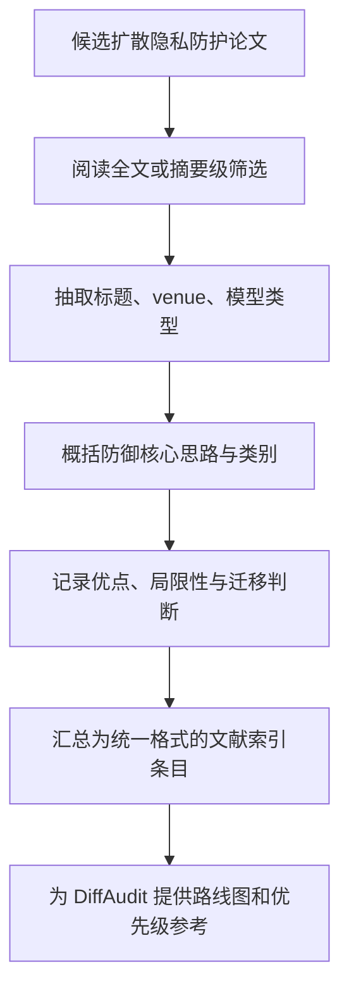
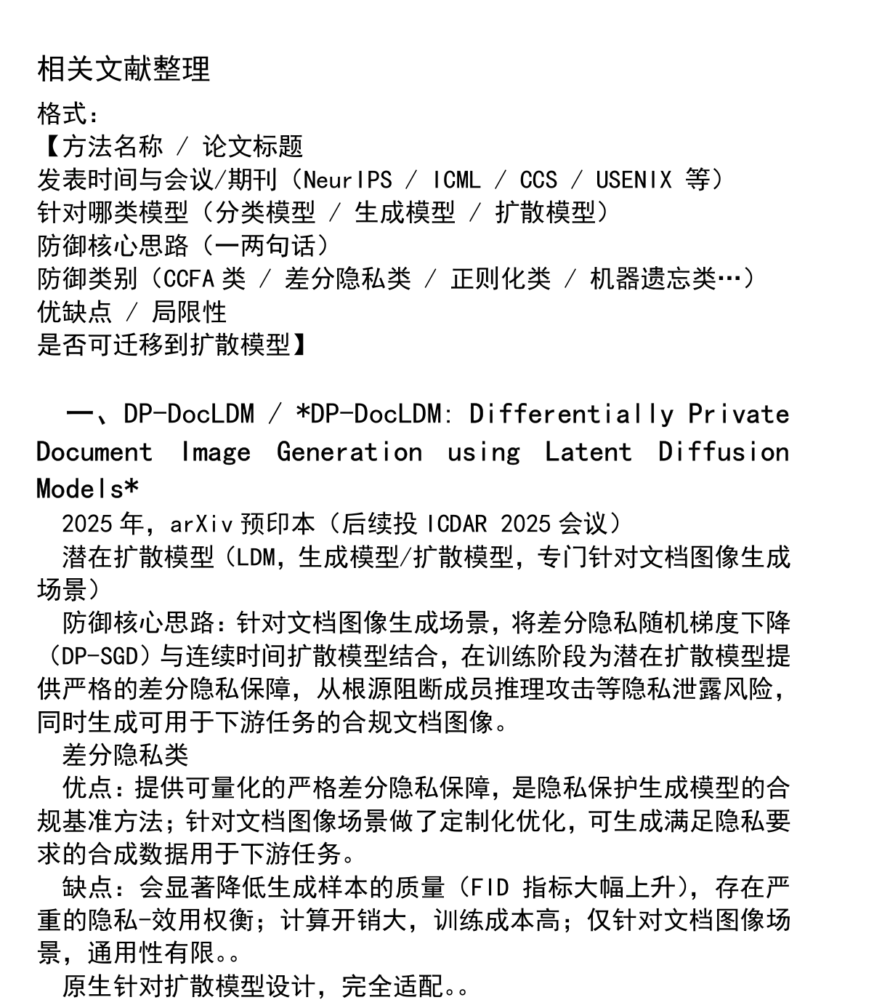

# 扩散模型隐私防护文献索引整理材料阅读报告

- Title: 扩散模型隐私防护文献索引整理材料阅读报告
- Material Path: `references/materials/survey/survey-index-diffusion-privacy-literature.pdf`
- Primary Track: `survey`
- Venue / Year: `未署名整理材料；PDF 元数据显示生成时间为 2026-04-04`
- Threat Model Category: `扩散模型成员推断防御文献索引，覆盖训练阶段、推理阶段与结构层面的混合防御路线`
- Core Task: `按方法名称、模型类型、防御核心思路、类别、优缺点与可迁移性整理扩散模型隐私防护文献`
- Open-Source Implementation: `不适用；该材料自身不是算法论文，也未给出代码仓库`
- Report Status: `complete`

## Executive Summary

这份 PDF 不是标准的研究论文，而是一份内部性质较强的文献整理材料。正文标题为“相关文献整理”，全文共 4 页，核心目标是将扩散模型隐私防护相关工作压缩成统一格式的索引条目，而不是提出新的方法、实验或理论。当前报告据 PDF 正文判断，这份材料的主要用途是为后续调研、路线图梳理和项目汇报提供快速检索入口。

材料当前收录了 7 条与扩散模型成员推断防御相关的路线，覆盖差分隐私训练、LoRA 微调防御、双模型数据拆分与蒸馏、推理前输入预处理、朗之万动力学扰动、图扩散显著性扰动，以及 anti-personalized diffusion models。每条记录都包含方法标题、发表信息、目标模型类型、防御思路、类别、优缺点以及“是否可迁移到扩散模型”的结论，因此它更接近半结构化索引，而非可直接复现实验的技术文档。

对 DiffAudit 而言，这份材料的价值在于它把防御路线压缩成了可浏览的调查表，可以快速判断哪些工作原生针对扩散模型、哪些工作仅在特定子场景成立，以及哪些方法适合纳入黑盒、白盒和训练阶段防御叙事。但需要明确的是，材料中的结论强度取决于原始论文是否被准确阅读和转述；该 PDF 自身不提供统一实验、统一指标或统一复现协议，因此只能作为二级索引入口，不能替代原论文阅读。

## Bibliographic Record

- Title: 相关文献整理
- Authors if available: 正文未署名；PDF metadata 中 `/Author` 为 `233 Delicious`，当前报告将其视为整理者或本地生成账号，而非规范作者列表
- Venue / year / version: 未见期刊、会议或版本声明；更像项目内部使用的索引材料；PDF metadata 创建时间为 `2026-04-04`
- Local PDF path: `D:/Code/DiffAudit/Project/references/materials/survey/survey-index-diffusion-privacy-literature.pdf`
- Source URL: 未在材料中给出

## Research Question

这份材料试图回答的问题不是“某一防御方法是否有效”，而是“当前与扩散模型成员推断防御相关的代表性工作有哪些，它们分别属于什么防御范式，以及是否适合迁移到 DiffAudit 的扩散模型语境”。因此，它面向的是文献筛选与路线归类，而不是单篇算法验证。

在威胁模型层面，材料默认讨论的是成员推断或训练数据隐私泄露风险，覆盖黑盒、白盒以及训练阶段泄露缓解等不同场景，但并未为每条文献单独建立严格统一的攻击能力定义。当前报告据正文推断，该材料的目标是建立“防御路线图”，而不是建立统一 threat model taxonomy。

## Problem Setting and Assumptions

- Access model: 该材料本身不执行攻击或防御实验，而是汇总原始论文对黑盒、白盒、训练阶段和推理阶段场景的主张。
- Available inputs: 已发表论文、arXiv 预印本、会议信息，以及整理者对模型类型、防御类别和优缺点的人工概括。
- Available outputs: 7 条索引记录，每条记录给出方法名称、发表时间与 venue、目标模型、防御思路、类别、优缺点和迁移结论。
- Required priors or side information: 需要整理者事先读过原论文，并能理解差分隐私、LoRA、知识蒸馏、推理扰动和图扩散等概念。
- Scope limits: 材料聚焦“扩散模型隐私防护”，主要围绕成员推断防御；不提供统一 benchmark，不含原始实验数据，也没有对每篇论文做等深度核验。

## Method Overview

这份材料的方法本质上是人工文献编目。第一页先给出统一模板，规定每条文献都要按“方法名称 / 论文标题、发表时间与 venue、模型类型、防御核心思路、防御类别、优缺点、是否可迁移到扩散模型”的顺序记录。其后各页按条目顺序填入具体文献。

从执行流程看，整理者先选择与扩散隐私防护有关的论文，再抽取最小必要事实，并进一步做一次面向 DiffAudit 的归纳压缩。这里真正被利用的信号不是公式或数值，而是方法机制、部署阶段与迁移性判断。换言之，该材料不是“方法学论文”，而是“方法学索引”。

## Method Flow

## Key Technical Details

这份材料没有给出需要保留的显式数学定义、损失函数或统计判别式，因此当前报告不引入 LaTeX 公式。其关键技术信息体现在“分类维度”而不是“算法表达式”：一是按训练阶段、推理阶段和结构拆分区分防御介入位置；二是按差分隐私、对抗正则化、数据拆分蒸馏、动力学扰动、显著性扰动等范式区分机制；三是对每条路线给出“是否可迁移到扩散模型”的明确判断。

其中最有信息量的细节不是单篇论文的摘要句，而是该索引把不同方法放在同一框架下比较。例如 MP-LoRA 被归入对抗正则化类，Diffence 被归入推理阶段扰动类，DualMD/DistillMD 被归入数据拆分加蒸馏路线，APDM 被视为模型对抗扰动类。这种统一标注方式方便后续在 DiffAudit 中做路由归档。

## Experimental Setup

该材料本身不是实验论文，因此没有自己的数据集、模型、基线和度量设置。它引用的实验条件分散在各原始论文中，且条目之间没有统一 benchmark。当前报告据 PDF 正文可确认的只有：材料覆盖了潜在扩散模型、一般扩散模型、文档图像扩散模型与图扩散模型等不同对象，并且试图区分训练时防御与推理时防御。

因此，如果后续需要把这份索引转化为可比较的技术评审，还必须回到原论文补齐统一字段，例如攻击设置、指标、模型规模、是否公开代码，以及对扩散图像主线是否直接适用。

## Main Results

- 材料当前索引了 7 条路线，且大多数条目被整理者标记为“原生针对扩散模型设计”或“完全适配”。
- 条目覆盖的防御谱系较完整，至少包含差分隐私训练、LoRA 微调防御、双模型防御、输入预处理、动力学扰动和模型对抗扰动。
- 材料反复强调“可迁移到扩散模型”的判断，这说明它的直接用途不是做综述写作，而是为项目选路线。
- 当前报告认为最强的信息不是单条优缺点，而是该索引已经隐含给出了一个防御分类表，可直接支撑 DiffAudit 的 survey 叙事骨架。

## Strengths

- 使用统一模板组织文献，信息密度高，适合快速查找。
- 明确区分方法类别、模型类型和可迁移性，便于工程选型。
- 同时纳入顶会论文、预印本和特定子领域工作，覆盖面比只看正式发表论文更完整。
- 每条记录都压缩为可直接复用的短说明，便于后续转写到项目文档或状态汇报。

## Limitations and Validity Threats

- 该材料不是原始研究论文，所有技术判断都经过二次转述，存在摘要失真风险。
- 各条目深度不一致，且缺少统一指标、统一实验条件和统一证据强度说明。
- 部分条目明显跨越不同子场景，例如图扩散模型工作被直接讨论其向图像扩散迁移，这一判断仍需回到原论文核实。
- 材料未给出原文链接、代码链接或 DOI，降低了即时追溯性。
- PDF metadata 与正文都没有规范作者与版本信息，说明它更适合用作工作底稿，不适合作为正式引文来源。

## Reproducibility Assessment

这份材料本身不涉及可执行算法，因此不存在“复现该 PDF 结论”的狭义实验流程；真正需要复现的是它所索引的 7 篇论文。要做到这一点，至少需要补齐原论文 PDF、代码仓库、评测协议、数据集说明和攻击设定。当前材料只给出压缩后的方法判断，不足以直接启动 faithful reproduction。

对 DiffAudit 来说，它已经覆盖了“防御文献路线图”这一层面的前置工作，但还没有覆盖“证据落地”。如果仓库后续要把这些防御工作纳入正式路线，就必须把此索引进一步拆成单篇报告，并补上实验条件和证据链。

## Relevance to DiffAudit

这份索引材料与 DiffAudit 的相关性很直接。第一，它把扩散模型成员推断防御路线集中到一个短文档中，可以作为 survey 轨道的入口页。第二，它已经内含一套初步 taxonomy，适合映射到 DiffAudit 当前的黑盒、白盒、训练阶段和部署阶段讨论框架。第三，它能帮助团队快速识别哪些路线值得深入，例如原生扩散模型防御、LoRA 场景防御和无需重训练的推理前防御。

但当前报告也要强调边界：这份材料只能支持“先做路线筛查”，不能支持“直接下结论”。如果后续要据此更新研究状态或产品判断，仍应回到各原论文做逐篇验证。

## Recommended Figure

- Figure page: `1`
- Crop box or note: `70 50 560 600`；该材料没有原生图表，当前报告改为裁切“索引模板说明 + 首条文献条目”区域，以最小文本块展示材料结构
- Why this figure matters: 这块区域同时展示了文献整理模板、分类字段和一条完整实例，能够直接证明该 PDF 的材料属性是“索引型综述底稿”，而不是单篇论文正文
- Local asset path: `../assets/survey/survey-index-diffusion-privacy-literature-key-figure-p1.png`

## Extracted Summary for `paper-index.md`

这份材料处理的问题不是提出新的扩散模型隐私防护算法，而是整理当前与扩散模型成员推断防御相关的代表性文献。它把多篇论文压缩为统一格式的索引条目，记录方法名称、模型类型、防御思路、防御类别、优缺点以及是否可迁移到扩散模型。

材料的核心贡献是建立了一个便于浏览的防御路线索引，而不是给出新的实验结论。当前版本共列出 7 条路线，覆盖差分隐私训练、LoRA 微调防御、双模型拆分与蒸馏、推理前扰动、朗之万动力学扰动、图扩散显著性扰动和 anti-personalized diffusion models，并对每条路线给出简要迁移判断。

对 DiffAudit 来说，这份材料的价值在于它可以作为 survey 轨道的快速入口，帮助团队确定哪些防御工作值得逐篇深读和后续复现。与此同时，它只是二级文献索引，不能替代原论文证据，因此适合做路线导航，不适合直接作为最终技术结论来源。
