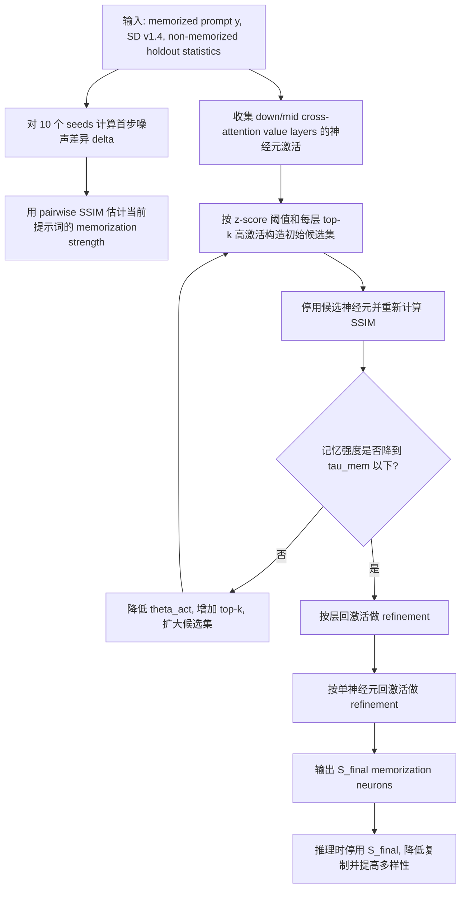
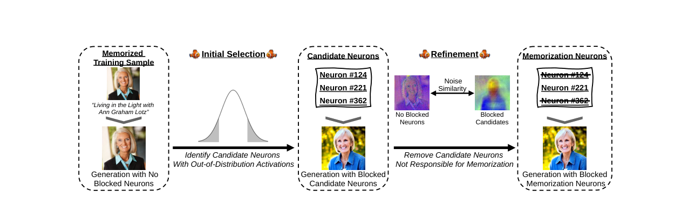

# Finding NeMo: Localizing Neurons Responsible For Memorization in Diffusion Models

- Title: `Finding NeMo: Localizing Neurons Responsible For Memorization in Diffusion Models`
- Material Path: `references/materials/white-box/2024-neurips-finding-nemo-localizing-memorization-neurons-diffusion-models.pdf`
- Primary Track: `white-box`
- Venue / Year: `NeurIPS 2024`
- Threat Model Category: 白盒训练样本记忆定位与干预
- Core Task: 在 `Stable Diffusion v1.4` 的 cross-attention value layers 中定位承载特定训练样本记忆的神经元，并通过失活这些神经元缓解复制
- Open-Source Implementation: `https://github.com/ml-research/localizing_memorization_in_diffusion_models`
- Report Status: 已完成

## Executive Summary

本文研究的问题不是“扩散模型是否会记住训练图像”，而是“这种记忆具体位于模型内部何处”。作者针对 `Stable Diffusion v1.4` 提出 `NEMO`，试图把训练样本记忆定位到 cross-attention 层中的单个神经元级别，并验证停用这些神经元是否可以减少训练图像复制。

方法上，`NEMO` 采用两阶段定位。第一阶段使用非记忆提示词上的激活统计构造每个神经元的基线分布，再对记忆提示词计算 z-score，配合每层 top-k 高激活神经元形成候选集合。第二阶段不再只看激活异常，而是直接用首步去噪噪声差异的结构相似性来检验这些候选神经元是否真正支撑了记忆复制。

论文报告的核心发现是：许多 verbatim memorization 只需要极少量神经元，甚至单个神经元即可触发；在作者数据上，verbatim 记忆的中位定位结果是 `4±3` 个神经元，template memorization 为 `21±18` 个。停用定位出的神经元后，`SSCDGen` 显著下降而 `ACLIP` 基本不变，说明复制被压制而文本对齐没有明显退化。对 DiffAudit 而言，这篇工作的重要性在于它提供了一个强白盒、可干预、可因果验证的记忆定位路线，不再停留在黑盒检测层面。

## Bibliographic Record

- Title: `Finding NeMo: Localizing Neurons Responsible For Memorization in Diffusion Models`
- Authors: Dominik Hintersdorf, Lukas Struppek, Kristian Kersting, Adam Dziedzic, Franziska Boenisch
- Venue / year / version: `NeurIPS 2024` conference paper
- Local PDF path: `references/materials/white-box/2024-neurips-finding-nemo-localizing-memorization-neurons-diffusion-models.pdf`
- Source URL: `https://proceedings.neurips.cc/paper_files/paper/2024/file/a102dd5931da01e1b40205490513304c-Paper-Conference.pdf`

## Research Question

论文试图回答两个紧密相关的问题。第一，扩散模型对特定训练样本的记忆是否可以被精确定位到模型内部的小规模神经元子集，而不是分散在整网中。第二，如果这些神经元能够被定位，那么直接停用它们能否在不显著损伤生成质量和文本对齐的前提下，缓解训练图像复制。

其默认威胁模型是强白盒设置。分析者需要访问完整的 `U-Net`、cross-attention 模块、单神经元激活、层级名称以及前向干预能力。论文关注的是公开发布后的模型风险，因此作者强调仅靠输入端防护或部署期监控不足以提供永久缓解。

## Problem Setting and Assumptions

- Access model: 完整白盒访问，需要读取并修改 `Stable Diffusion v1.4` 的 cross-attention value layers。
- Available inputs: 记忆提示词、非记忆 holdout 提示词、不同随机种子下的一步去噪噪声差异、各神经元激活统计。
- Available outputs: 候选记忆神经元集合、精炼后的记忆神经元集合，以及停用这些神经元后的生成结果与指标变化。
- Required priors or side information: 需要一组可确认的 memorized prompts；需要在大规模非记忆提示词上预计算每个神经元的均值与标准差；需要知道哪些层属于 down-block 和 mid-block 的 value mappings。
- Scope limits: 论文主要分析 `Stable Diffusion v1.4`；搜索空间限制在 cross-attention 的 value layers；对 template memorization 的缓解明显比 verbatim memorization 更难。

## Method Overview

`NEMO` 的出发点是，记忆提示词在首步去噪时会表现出比普通提示词更稳定的轨迹，而且这种稳定性会伴随某些神经元激活的异常偏移。作者首先对 10 个随机种子的首步噪声差异进行比较，把不同种子下的一致性视为记忆强度代理。随后，他们在目标提示词上收集各层神经元激活，并与非记忆 holdout 集合上得到的均值和标准差比较，初步筛出分布外激活神经元。

初筛阶段故意偏宽松。若当前候选神经元被停用后，记忆强度仍高于阈值，算法就逐步降低激活阈值，并向每层加入更多高绝对激活的 top-k 神经元。这样得到的集合仍包含假阳性，因此第二阶段继续做因果过滤：先按层回激活、后按单神经元回激活，只保留那些一旦恢复就会让记忆强度重新上升的神经元。最终得到的是对特定提示词负责的 memorization neurons。

## Method Flow

## Key Technical Details

论文将定位任务建立在标准扩散去噪和 cross-attention 计算之上。作者并不是直接比较最终生成图，而是比较第一步去噪时的噪声差异 `\delta = \epsilon_\theta(x_T, T, y) - x_T`，因为他们经验上观察到记忆提示词在这一步已经表现出稳定结构。记忆分数通过不同种子之间的 `SSIM` 计算，阈值设为非记忆 holdout 集上最大 pairwise `SSIM` 的均值加一个标准差，主文使用 `\tau_{mem} = 0.428`。

$$
x_{t-1} = \frac{1}{\sqrt{\alpha_t}}\left(x_t - \frac{1-\alpha_t}{\sqrt{1-\bar{\alpha}_t}}\epsilon_\theta(x_t, t, y)\right)
$$

$$
\mathrm{Attention}(Q,K,V) = \mathrm{softmax}\left(\frac{QK^\top}{\sqrt d}\right)V,\quad Q = z_t W_Q,\ K = y W_K,\ V = y W_V
$$

$$
z_i^{(l)}(y) = \frac{a_i^{(l)}(y) - \mu_i^{(l)}}{\sigma_i^{(l)}}
$$

作者最终只在 down-block 与 mid-block 的 value layers 中搜索记忆神经元。原因不是 value layers 唯一参与记忆，而是停用 value neurons 能直接阻断文本条件信息流，且对 prompt alignment 的损害小于停用 key layers。初筛从 `\theta_{act}=5` 开始，每轮减 `0.25`，同时扩大每层 top-k。精炼阶段则通过“回激活某层/某神经元，看记忆分数是否重新越过阈值”的方式排除假阳性。

## Experimental Setup

- Datasets: `500` 个 memorized LAION prompts，来自 Wen et al.；`50,000` 个非记忆 LAION prompts 用于估计 `\tau_{mem}`；`COCO` prompts 用于图像质量评估。
- Model families: 主实验集中于 `Stable Diffusion v1.4`；作者也检查了 `Stable Diffusion v2` 和 `DeepFloyd IF`，但未找到可用的 properly memorized prompts。
- Baselines: prompt embedding adjustment（Wen et al. 2024）、attention scaling（Ren et al. 2024）、adding random tokens（Somepalli et al. 2023）、同层随机神经元停用。
- Metrics: `SSCDOrig`、`SSCDGen`、`DSSCD`、`ACLIP`、`FID`、`CLIP-FID`、`KID`。
- Evaluation conditions: 检测阶段默认不使用 classifier-free guidance；图像示例使用 `50` 个 DDIM steps 和 guidance scale `7`；多数指标跨 `10` 个 seeds 统计，质量指标跨 `5` 个 seeds 统计；运行为 `float16`。

## Main Results

- `NEMO` 对 verbatim memorization 的定位非常稀疏。论文报告中位需要停用 `4±3` 个神经元，而 template memorization 为 `21±18` 个。
- 与“全部神经元激活”相比，停用 `NEMO` 定位到的神经元后，verbatim 样本的 `SSCDGen` 从 `1.0±0.0` 降到 `0.10±0.07`，template 样本从 `1.0±0.0` 降到 `0.05±0.04`。这说明生成结果不再稳定复制训练图像。
- `ACLIP` 在主要对比中基本维持在 `0.31` 左右，说明缓解复制并未明显破坏文本语义对齐。随机停用同层神经元则几乎不起作用，支持“不是任意剪掉一些神经元都行，而是存在特定记忆神经元”的结论。
- 论文进一步报告，`28` 个 verbatim prompts 可以定位到单个神经元，约三分之二的 verbatim prompts 由不超过 `5` 个神经元触发。这是全文最强的结构性证据之一。
- 质量实验显示，即使累计停用多达 `750` 个高频记忆神经元，`FID`、`KID`、`CLIP-FID` 的波动仍然较小，支持“记忆定位剪枝不必显著伤害整体生成质量”的结论。

## Strengths

- 论文给出的是定位与干预一体化方案，而不是仅做 memorized prompt 检测，因而更接近可操作的模型修复路线。
- 方法完全基于前向计算，不依赖梯度，适合在算力或显存受限环境下运行，并且一旦定位完成，部署时几乎没有额外推理开销。
- 实验不只报告是否缓解复制，还同时报告多样性、文本对齐和图像质量，从而避免“靠彻底破坏模型来降低复制”的伪有效结果。
- Appendix 中提供了逐算法描述、运行时间、消融和层级分析，使方法机理比很多只给经验启发的扩散安全论文更透明。

## Limitations and Validity Threats

- 结论主要建立在 `Stable Diffusion v1.4` 上。作者明确写到在 `Stable Diffusion v2` 和 `DeepFloyd IF` 上没有找到足够强的 memorized prompts，因此跨模型泛化仍未被充分验证。
- 方法要求强白盒访问和一组大规模非记忆 holdout 统计，这使其更像研究型分析工具，而不是弱访问场景下的通用审计方案。
- template memorization 更分散、更难缓解；附录中存在超过 `100` 个记忆神经元的提示词，说明“少量神经元即可解释一切”并不是普适事实。
- 搜索空间被限制在 cross-attention value layers。论文将其解释为最有效的干预位点，但这不等于模型中其他模块不参与记忆复制链条。
- 文中存在轻微文档一致性问题：正文指出 neuron `#221` 与多个 podcast cover prompt 相关，但 Appendix `Figure 11` 的文字说明重复写成了 neuron `#25`。这不改变主结论，但说明附录排版存在疏漏。

## Reproducibility Assessment

复现实验所需资产相对明确：`Stable Diffusion v1.4` 权重、Wen et al. 提供的 memorized prompts、LAION 相关样本与原图 URL、作者开源代码、GPU 环境，以及对 cross-attention value layers 的 hook 与停用实现。论文还给出了 Docker、硬件环境、算法伪代码和阈值设置，因此从论文到代码的映射较完整。

代码是公开的，但训练图像本身未被打包进仓库，而是只保留源 URL，这会给完全复现 `SSCDOrig` 和部分人工核验带来额外准备成本。另一个现实阻塞是数据与模型访问条件：如果没有可靠的 memorized prompts 列表和原图回收流程，就只能复现方法框架，难以复现论文中的核心数字。

结合当前 DiffAudit 仓库检索结果，仓库已经在 `workspaces/white-box/signal-access-matrix.md` 和 `references/materials/paper-index.md` 中把 `Finding NeMo` 作为 white-box 记忆定位路线记录下来，但未检索到对应的实现脚本或 hook 管线。因此，当前仓库对这篇论文的覆盖更接近“路线规划与资料索引”，尚未进入可执行复现实验阶段。

## Relevance to DiffAudit

这篇论文与 DiffAudit 的直接关系不在传统 membership inference 分数设计，而在白盒因果定位。它回答的是：如果扩散模型真的复制了训练样本，是否可以把责任归因到可操作的局部神经元集合。对当前项目而言，这为 white-box 路线提供了不同于 loss-based、score-based 或 output-based 审计的内部证据。

更具体地说，论文把可观测信号压缩为两类：一类是首步去噪噪声差异的一致性，另一类是 cross-attention value neuron 的异常激活。这与 DiffAudit 当前白盒工作区里对 `activations` 和 `cross-attention` 信号访问的规划是对齐的，因此可作为后续设计 hook、稀疏干预和层级消融实验的参考框架。

但它也提示了一条边界：`Finding NeMo` 更适合作为“记忆定位与验证”的扩展路线，而不是最先落地的低成本复现入口，因为它对模型内部访问、层级命名、神经元干预和 memorized prompt 数据准备都有较高要求。这一点与当前仓库对白盒路线的规划记录是一致的。

## Recommended Figure

- Figure page: `2`
- Crop box or note: `50 38 560 185`（PDF points，已直接检查渲染 PNG；该裁切能够隔离 Figure 1 主体，无需保留整页正文）
- Why this figure matters: 该图把论文最核心的两阶段流程压缩在一张图里，明确展示了“异常激活初筛 -> 候选神经元 -> 噪声相似性精炼 -> 最终记忆神经元 -> 停用后不再复制”的完整因果链，比单独的结果图更适合作为论文代表图。
- Local asset path: `../assets/white-box/2024-neurips-finding-nemo-localizing-memorization-neurons-diffusion-models-key-figure-p2.png`

## Extracted Summary for `paper-index.md`

这篇论文研究的是扩散模型训练样本记忆的内部定位问题。作者不满足于检测某个 prompt 是否会复现训练图像，而是进一步追问这种记忆是否能够在模型内部被精确归因到少量神经元，目标场景是对公开发布的 text-to-image diffusion model 做强白盒分析与干预。

论文提出 `NEMO` 两阶段算法：先利用非记忆提示词上的激活统计，对记忆提示词中的 cross-attention value neurons 做分布外激活筛选，并加入每层高激活 top-k 神经元形成候选集；再利用首步去噪噪声差异的 `SSIM` 一致性做层级和单神经元精炼。实验报告 verbatim 记忆通常只涉及极少量神经元，中位数为 `4±3`，停用这些神经元后可显著降低 `SSCDGen`，同时基本保持 `ACLIP` 和图像质量。

对 DiffAudit 而言，这篇工作的意义在于把 white-box 路线从“检测模型是否记忆”推进到“定位并干预哪些内部单元在承载记忆”。它为后续的 activation hook、cross-attention 层级消融、定向剪枝和因果验证提供了一个明确框架，也说明扩散模型的训练样本复制并不一定是全局分布式现象，而可能集中在可操作的局部神经元子集上。
