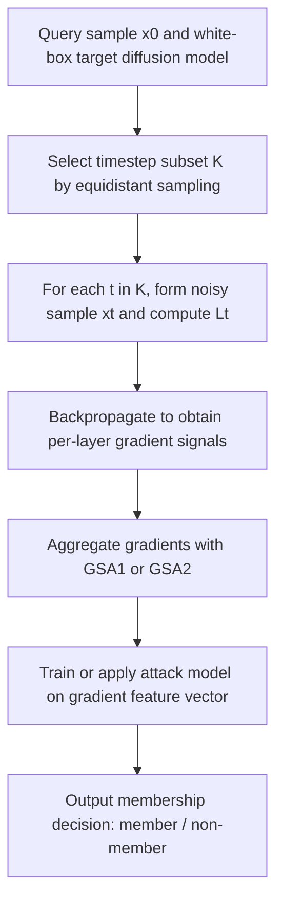
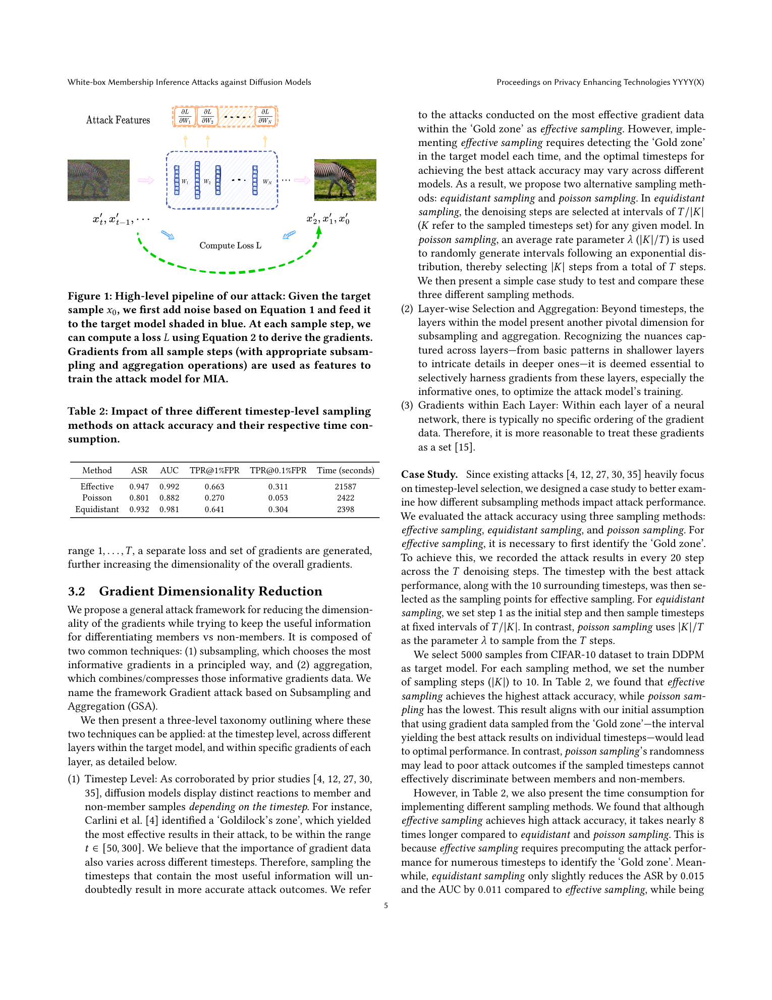

# White-box Membership Inference Attacks against Diffusion Models

- Title: White-box Membership Inference Attacks against Diffusion Models
- Material Path: `references/materials/white-box/2025-local-mirror-white-box-membership-inference-diffusion-models.pdf`
- Primary Track: `white-box`
- Venue / Year: `arXiv v3 / 2024`
- Threat Model Category: `White-box membership inference against diffusion models with access to model parameters and per-sample gradients`
- Core Task: `Determine whether a query sample belongs to the training set of an unconditional or conditional diffusion model using gradient-based attack features`
- Open-Source Implementation: `Official code is available at https://github.com/py85252876/GSA`
- Report Status: `Complete`

## Executive Summary

这篇论文研究扩散模型的白盒成员推断攻击。作者关注的问题不是训练数据重构，而是在攻击者拿到目标模型结构、参数，并且在条件扩散模型场景下掌握全部条件模态时，能否判断一个查询样本是否属于训练集。论文把这一设定视为现实威胁，因为公开 checkpoint 与模型架构已经很常见，尤其是在 HuggingFace 一类开放分发场景中。

方法上的关键转折是把既有白盒扩散 MIA 常用的 loss 特征替换为 gradient 特征。作者认为，单个样本在多个 timestep 上都会产生 loss，而仅依赖 loss 阈值容易混淆“复杂成员样本”和“简单非成员样本”。为此，论文提出 `GSA` 框架，对多个 timestep 的梯度做 subsampling 与 aggregation，并给出两个实例化攻击：`GSA1` 先对多个 timestep 的 loss 求平均再反传一次，以换取更高效率；`GSA2` 对每个采样 timestep 分别反传并对梯度向量求平均，以保留更多信息。

实验覆盖 CIFAR-10、ImageNet、MS COCO 上的 DDPM 与 Imagen。论文报告的结果极强，例如在 CIFAR-10 上，`GSA1` 和 `GSA2` 的 AUC 都达到 `0.999`，明显高于同条件下 loss-based 对照 `LSA*` 的 `0.909`；等距 timestep 采样几乎保留了有效采样的精度，但把时间成本从 `21587s` 降到 `2398s`。对 DiffAudit 而言，这篇论文是 white-box 路线的重要上界参考，因为它同时回答了“为什么梯度比 loss 更强”以及“这一路线在工程上真正卡在哪里”。

## Bibliographic Record

- Title: White-box Membership Inference Attacks against Diffusion Models
- Authors: Yan Pang, Tianhao Wang, Xuhui Kang, Mengdi Huai, Yang Zhang
- Venue / year / version: arXiv:2308.06405v3, 2024-11-21
- Local PDF path: `D:/Code/DiffAudit/Project/references/materials/white-box/2025-local-mirror-white-box-membership-inference-diffusion-models.pdf`
- Source URL: `https://arxiv.org/abs/2308.06405`

## Research Question

论文试图回答两个直接相关的问题。第一，在扩散模型成员推断中，白盒攻击是否应继续沿用 loss 作为核心特征，还是应转向能更完整反映模型响应差异的 gradient。第二，如果改用 gradient，是否可以在无条件扩散模型与文本条件扩散模型上同时取得稳定而高精度的攻击效果。

其威胁模型假设攻击者拥有目标模型的白盒访问权限，包括架构细节、具体参数，以及对查询样本执行前向与反向传播的能力；在条件扩散模型场景下，攻击者还知道与样本相关的全部模态，例如图文对。论文把这一设定视为公开模型分发环境中的强但现实的隐私上界。

## Problem Setting and Assumptions

- Access model: 白盒。攻击者可访问目标扩散模型的结构、参数，并对查询样本执行逐 timestep 的前向与反向传播。
- Available inputs: 查询样本 `x_0`，扩散 timestep，条件模型所需全部条件模态，以及用于训练影子模型和攻击模型的数据。
- Available outputs: 每个采样 timestep 的 loss、对应梯度，以及按层聚合后的梯度特征向量。
- Required priors or side information: 需要影子模型来构造成员/非成员特征分布；论文使用 XGBoost 或 MLP 作为攻击模型。
- Scope limits: 论文不处理严格黑盒 API 环境；攻击效果依赖样本级梯度接口与较高权限访问。

## Method Overview

作者首先回顾既有扩散模型白盒 MIA 的常见做法，即在不同 timestep 上计算 loss，再用阈值或 LiRA 式分布完成成员判定。问题在于，最佳 loss 区间随模型与数据集变化，攻击者往往需要额外搜索所谓的 “Gold zone”，而且 loss 只是标量，无法充分表达样本在网络各层上的局部响应差异。

论文据此提出 `GSA`，即 `Gradient attack based on Subsampling and Aggregation`。其第一步是 timestep-level subsampling。作者比较 effective sampling、Poisson sampling 和 equidistant sampling 后认为，effective sampling 精度最高但预搜索成本过大，而 equidistant sampling 只损失很少精度却大幅降低时间消耗，因此更适合作为主实验设置。第二步是 aggregation。对每个采样 timestep，论文不直接保留上亿维原始梯度，而是把每层参数梯度压缩为 `\ell_2` 范数，再按层拼接。

在这一框架下，`GSA1` 先对选中 timestep 的 loss 求均值，再进行一次反向传播，得到单个按层梯度向量；`GSA2` 则对每个 timestep 分别反传，再对多个按层梯度向量做均值聚合。前者偏效率，后者偏保真。论文并不声称这两个实例化穷尽了设计空间，而是把它们当作效率与效果之间的两个代表点。

## Method Flow

## Key Technical Details

论文建立在标准 DDPM 前向加噪与噪声预测损失之上。对真实样本 `x_0`，第 `t` 步加噪样本为：

$$
x_t = \sqrt{\bar{\alpha}_t}x_0 + \sqrt{1-\bar{\alpha}_t}\,\epsilon_t.
$$

对应训练目标是最小化噪声预测误差：

$$
L_t(\theta)=\mathbb{E}_{x_0,\epsilon_t}\left[\left\|\epsilon_t-\epsilon_\theta\!\left(\sqrt{\bar{\alpha}_t}x_0+\sqrt{1-\bar{\alpha}_t}\epsilon_t,\ t\right)\right\|_2^2\right].
$$

作者进一步把梯度展开为：

$$
\nabla_\theta L_t(\theta, x)=2\left(\epsilon_\theta(x_t,t)-\epsilon_t\right)^\top \nabla_\theta \epsilon_\theta(x_t,t).
$$

论文的关键论点是，gradient 不仅包含误差项 `\epsilon_\theta(x_t,t)-\epsilon_t`，还包含与具体输入相关的局部响应 `\nabla_\theta \epsilon_\theta(x_t,t)`。因此，即使两个样本有相同数值的 loss，它们也可能对应不同的梯度。当前报告据此推断，gradient 在白盒扩散 MIA 中比 scalar loss 更适合作为判别特征。

实现上，`GSA1` 的核心是对 `K` 中各 timestep 的 `L_t` 求均值，再做一次反向传播；`GSA2` 则对每个 `t \in K` 单独求梯度，再对多个梯度向量取平均。两者都把每层参数梯度压缩成 `\ell_2` 范数表示，以避免直接操作上亿维原始梯度。论文还给出经验结论：在其设置下，采样 `|K|=10` 已足以接近最优。

## Experimental Setup

- Datasets: CIFAR-10、ImageNet、MS COCO。
- Model families: DDPM 与 Imagen；前两者覆盖无条件扩散模型，后者覆盖文本条件扩散模型。
- Baselines: Baseline threshold loss attack、LiRA、Strong LiRA，以及与 `GSA` 同采样设置但只用 loss 特征的 `LSA*`。
- Metrics: ASR、AUC、`TPR@1%FPR`、`TPR@0.1%FPR`。
- Evaluation conditions: 比较 timestep 采样策略、影子/目标模型训练程度差异、扩散步数、图像分辨率、layer-wise 梯度截断，以及多种防御策略。
- Default parameters: 通道数均为 `128`，扩散步数 `1000`，学习率 `1e-4`，batch size `64`；CIFAR-10 与 ImageNet 训练 `400` epochs，Imagen 训练 `600000` steps。

## Main Results

- 在 CIFAR-10 上，`GSA1` 达到 `ASR 0.993 / AUC 0.999 / TPR@1%FPR 99.7% / TPR@0.1%FPR 82.9%`，`GSA2` 达到 `0.988 / 0.999 / 97.88% / 58.57%`；同条件下 `LSA*` 仅为 `ASR 0.830 / AUC 0.909`。
- 在跨数据集总表中，`GSA1` 在 CIFAR-10、ImageNet、MS COCO 上的 AUC 分别为 `0.999 / 0.999 / 0.997`，`GSA2` 分别为 `0.999 / 0.999 / 0.999`，显著优于 loss-based 对照。
- timestep 采样实验表明，effective sampling 的 `ASR/AUC` 为 `0.947/0.992`，但耗时 `21587s`；equidistant sampling 为 `0.932/0.981`，耗时仅 `2398s`，说明无需先搜索 “Gold zone” 也能维持接近最优的效果。
- Imagen 实验显示，提高采样频率与目标模型训练程度都会提升攻击成功率；论文报告 `|K|=10` 时，`GSA2` 的成功率接近 `100%`。
- 防御实验显示，`DP-SGD` 与 `RandAugment` 能把 `GSA1/GSA2` 的 `ASR` 和 `AUC` 压到接近随机猜测，但较弱的数据增强如 `RandomHorizontalFlip` 与 `Cutout` 无法充分抑制梯度攻击。
- layer-wise 消融说明，无需提取全部层梯度即可逼近峰值效果；论文报告约 `80%` 顶层累计梯度已足够达到最高攻击精度。

## Strengths

- 方法贡献明确，真正解释了为什么在扩散模型白盒设定下，gradient 可能比 loss 更强。
- 实验同时覆盖 DDPM 与 Imagen，避免把结论局限在小规模无条件模型上。
- 论文不仅比较攻击精度，也比较采样策略与运行时间，为工程折中提供了直接依据。
- `GSA1` 与 `GSA2` 的结构清楚，分别对应“单次反传节省成本”和“逐步反传保留信息”两种可实现端点。
- 附带防御与 layer-wise 消融，使论文不只停留在“攻击有效”，还给出了一定边界条件。

## Limitations and Validity Threats

- 攻击前提很强，要求拿到目标模型参数并执行样本级反向传播；这对很多商业托管模型并不成立。
- 论文虽然给出 gradient 优于 loss 的理论直觉，但核心仍是经验性论证，而非严格最优判别证明。
- 忠实复现需要影子模型、目标模型、样本级梯度接口与较长训练过程，成本显著高于 loss-only 基线。
- Imagen 实验虽说明大模型上攻击仍有效，但正文没有把全部训练与系统优化细节公开到可直接逐项复现的粒度。
- 防御结果也提示该路线和过拟合强相关，因此高精度数值对数据增强、正则化和隐私训练策略都可能敏感。

## Reproducibility Assessment

忠实复现至少需要四类资产：目标 DDPM 或 Imagen 的训练代码与 checkpoint、与论文对齐的成员/非成员划分、可提取样本级梯度并按层聚合的实现，以及影子模型和攻击模型的完整训练流程。虽然论文提供了官方代码仓库，但要得到与文中接近的数值，仍需把训练配置、数据拆分和评估脚本全部对齐。

就当前 DiffAudit 仓库而言，已经存在同题论文的 published 版本报告与 `paper-index` 条目，因此文献层面的路线覆盖是存在的；但在本次检查范围内，我没有看到 `GSA` 的可执行复现实验资产或结果文件。当前报告据此判断，仓库对该路线的状态更接近“研究已索引、实现未落地”。

因此，当前最现实的阻塞并不是“缺算法说明”，而是“缺足够接近论文设定的执行资产”。若目标只是 literature-level 对齐，这篇论文已经足够清楚；若要进入 faithful reproduction，仍需补齐模型权重、训练日志、数据拆分与大模型梯度提取基础设施。

## Relevance to DiffAudit

这篇论文对 DiffAudit 的意义，在于它为 white-box 路线提供了一个强上界参考。相比黑盒或灰盒扩散 MIA，`GSA` 明确展示：一旦攻击者拿到参数和梯度接口，成员信号会显著增强，甚至在多组设置下接近完美区分。对项目叙事而言，它适合作为“高权限条件下扩散模型隐私泄露强度”的代表工作。

它也直接影响工程优先级。若 white-box 路线要从文献进入原型，优先级不应放在重新发明 attack score，而应先打通 per-sample gradient extraction、layer selection 与 timestep sampling 三个基础模块。论文已经说明，等距采样和顶部层截断能显著降低成本，因此初版原型没有必要一开始就追求全量 timestep 与全层梯度。

同时，这篇论文也提醒 DiffAudit 不应把 white-box 结果误读成普适部署结论。其攻击强度来自高权限假设，因此它更适合作为 upper bound、机制分析与路线标杆，而不是直接代表生产环境中的可达攻击面。

## Recommended Figure

- Figure page: 5
- Crop box or note: Cropped `Figure 1` using PDF clip box `25 75 315 320`; the crop keeps the schematic and its caption while excluding surrounding正文
- Why this figure matters: 该图最直接展示了论文的方法闭环，即对同一样本在多个 timestep 上求 loss、反传梯度，再把聚合后的梯度送入攻击模型；它比结果图更适合作为 white-box 路线的结构概览
- Local asset path: `docs/paper-reports/assets/white-box/2025-local-mirror-white-box-membership-inference-diffusion-models-key-figure-p5.png`

## Extracted Summary for `paper-index.md`

这篇论文研究扩散模型的白盒成员推断问题，目标是在攻击者掌握目标模型参数、结构以及条件模态信息时，判断一个查询样本是否属于训练集。作者把这一问题放在公开 checkpoint 已普遍可得的背景下讨论，并将其视为扩散模型隐私风险分析的强权限场景。

论文提出 `GSA` 框架，用梯度而不是 loss 作为攻击特征，并通过 timestep subsampling 与 layer-wise aggregation 降低维度和成本。作者给出 `GSA1` 与 `GSA2` 两个实例化方法，并报告它们在 DDPM 和 Imagen 上都能取得很高的成员推断精度；在 CIFAR-10 上，`GSA1/GSA2` 的 AUC 达到 `0.999`，明显高于同条件下的 loss-based 对照。

它对 DiffAudit 的价值在于为 white-box 路线提供了强上界参考，同时也明确指出复现该路线所需的关键资产是 checkpoint、训练配置和样本级梯度接口。换言之，这篇论文既是 white-box 方向的重要文献支点，也把后续工程工作的真实阻塞项暴露得很清楚。
