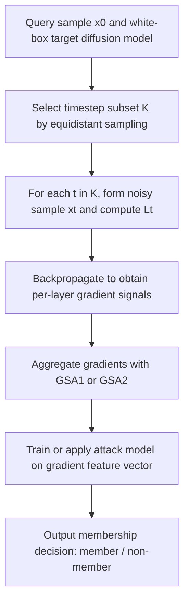
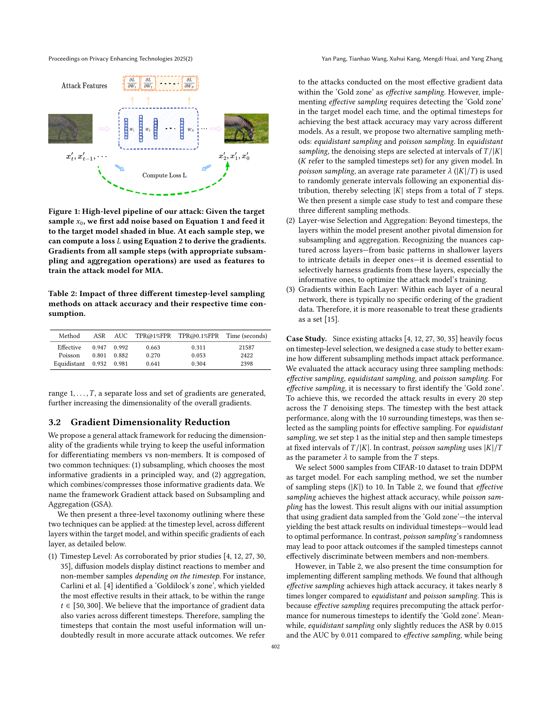

# White-box Membership Inference Attacks against Diffusion Models

- Title: White-box Membership Inference Attacks against Diffusion Models
- Material Path: `references/materials/white-box/2025-popets-white-box-membership-inference-diffusion-models.pdf`
- Primary Track: `white-box`
- Venue / Year: PoPETs 2025(2)
- Threat Model Category: White-box membership inference against diffusion models with access to model parameters and per-sample gradients
- Core Task: Determine whether a query sample belongs to the training set of an unconditional or conditional diffusion model by using gradient-based attack features
- Open-Source Implementation: Official code is available at <https://github.com/py85252876/GSA>
- Report Status: Complete

## Executive Summary

这篇论文研究扩散模型的白盒成员推断攻击。作者关注的问题不是“能否从输出图像中重建训练样本”，而是更直接的隐私判定问题：当攻击者掌握目标扩散模型的结构与参数，并且在条件模型场景下还知道全部条件模态时，是否能够判断某个样本是否出现在训练集中。论文认为，相比黑盒与灰盒设定，白盒路线更贴近公开 checkpoint 与模型卡普遍可得的现实环境，因此值得作为扩散模型隐私分析的强上界。

方法上的核心转折是把既有白盒扩散 MIA 常用的 loss 特征，替换成更高维的 gradient 特征。作者指出，单个样本在扩散过程的多个 timestep 上都会产生 loss，而仅凭 loss 阈值容易混淆“复杂成员样本”和“简单非成员样本”。为此，论文提出 `GSA` 框架，即对多个 timestep 的梯度进行 subsampling 与 aggregation，并给出两个实例化攻击：`GSA1` 先对多个 timestep 的 loss 求平均再反传一次，以换取更高效率；`GSA2` 对每个采样 timestep 分别反传并对梯度向量再求平均，以保留更多信息。

论文在 CIFAR-10、ImageNet、MS COCO 上评估 DDPM 与 Imagen，报告的攻击效果极强。以 CIFAR-10 为例，`GSA1` 和 `GSA2` 的 AUC 都达到 `0.999`，显著高于同条件下的 loss-based 对照 `LSA*` 的 `0.909`；`GSA1` 的 `TPR@1%FPR` 达到 `99.7%`。论文同时显示，等距 timestep 采样几乎保留了 effective sampling 的精度，却把时间成本从 `21587s` 降到 `2398s`。对 DiffAudit 而言，这篇论文定义了 white-box 路线的强参考点：它既给出“梯度比 loss 更强”的经验结论，也明确暴露出可复现性的关键瓶颈，即样本级梯度接口、目标 checkpoint 与训练配置。

## Bibliographic Record

- Title: White-box Membership Inference Attacks against Diffusion Models
- Authors: Yan Pang, Tianhao Wang, Xuhui Kang, Mengdi Huai, Yang Zhang
- Venue / year / version: Proceedings on Privacy Enhancing Technologies, 2025(2)
- Local PDF path: `D:/Code/DiffAudit/Project/references/materials/white-box/2025-popets-white-box-membership-inference-diffusion-models.pdf`
- Source URL: <https://doi.org/10.56553/popets-2025-0068>

## Research Question

论文试图回答两个相互关联的问题。第一，在扩散模型成员推断中，白盒攻击是否应继续沿用 loss 作为核心特征，还是应转向能更完整反映模型响应差异的 gradient。第二，如果改用 gradient，是否能够在无条件扩散模型与文本条件扩散模型上同时取得稳定且高精度的攻击结果。

其威胁模型假设攻击者拥有目标模型的白盒访问权限，包括架构细节和具体参数；在条件扩散模型场景下，攻击者还知道与样本关联的全部条件模态，例如图文对。论文将该设定视为现实的原因是公开发布模型结构与 checkpoint 已很常见，因此成员推断不再局限于黑盒 API 环境。

## Problem Setting and Assumptions

- Access model: 白盒。攻击者可访问目标扩散模型的结构、参数，并能对查询样本执行前向与反向传播。
- Available inputs: 查询样本 `x_0`；扩散 timestep；条件模型所需的全部模态信息；可训练的影子模型与攻击模型。
- Available outputs: 每个采样 timestep 的 loss、对应梯度，以及按层聚合后的梯度特征向量。
- Required priors or side information: 需要影子模型来生成成员/非成员特征分布；论文使用 XGBoost 或 MLP 作为攻击模型。
- Scope limits: 论文主要证明白盒梯度特征的有效性，不处理严格黑盒环境；攻击成立依赖能拿到样本级梯度，且论文未给出对更受限部署形态的替代接口。

## Method Overview

作者首先回顾既有扩散模型 MIA 的特征选择问题。既有白盒方法大多在不同 timestep 上计算 loss，然后用阈值或 LiRA 分布进行成员判定。但扩散模型的单样本会在多个 timestep 上产生不同 loss，最佳区间随数据集与模型变化而变化，因此攻击者往往需要额外代价去搜索所谓的 “Goldilock's zone”。论文据此提出：与其反复寻找最优 loss timestep，不如直接利用白盒可得的 gradient，因为 gradient 同时编码了当前误差项与模型在该输入处的局部响应。

`GSA` 框架的第一步是 timestep-level subsampling。论文比较了 effective sampling、Poisson sampling 和 equidistant sampling，结论是 effective sampling 精度最高，但预搜索成本过高；equidistant sampling 只带来很小的精度下降，却显著节省时间，因此被用于后续主实验。第二步是 aggregation。对于每个采样 timestep，论文不保留所有原始梯度元素，而是对每层参数梯度取 `\ell_2` 范数，把高维梯度压缩成按层排列的统计量。

在此基础上，论文给出两个实例化。`GSA1` 对选中 timestep 的 loss 先求平均，再进行一次反向传播，得到单个按层梯度向量；它牺牲部分信息，但效率更高。`GSA2` 则对每个 timestep 分别反传，形成多个按层梯度向量后再求平均，因此保留了更多 timestep 级别差异。作者把这两种方法解释为效率与效果之间的两个端点，而不是对 `GSA` 设计空间的穷尽。

## Method Flow

## Key Technical Details

论文的方法建立在扩散模型的标准前向加噪和噪声预测损失上。对真实样本 `x_0`，第 `t` 步加噪样本写作：

$$
x_t = \sqrt{\bar{\alpha}_t} x_0 + \sqrt{1-\bar{\alpha}_t}\,\epsilon_t.
$$

对应的训练目标是最小化噪声预测误差：

$$
L_t(\theta)=\mathbb{E}_{x_0,\epsilon_t}\left[\left\|\epsilon_t-\epsilon_\theta\!\left(\sqrt{\bar{\alpha}_t}x_0+\sqrt{1-\bar{\alpha}_t}\epsilon_t,\ t\right)\right\|_2^2\right].
$$

作者进一步展开梯度，得到其依赖于误差项与样本处局部响应的形式：

$$
\nabla_\theta L_t(\theta, x)=2\left(\epsilon_\theta(x_t,t)-\epsilon_t\right)^\top \nabla_\theta \epsilon_\theta(x_t,t).
$$

这一定义是论文从 loss 过渡到 gradient 的理论依据。当前报告的理解是：相同 loss 数值并不意味着相同梯度，因为梯度还包含 `\nabla_\theta \epsilon_\theta(x_t,t)` 这一与具体输入相关的 Jacobian 项。论文据此主张，gradient 比 scalar loss 更能区分成员与非成员。

实现上，`GSA1` 的关键是先对 `K` 中各 timestep 的 `L_t` 求均值，再做一次反向传播；`GSA2` 则对每个 `t \in K` 单独计算梯度并做均值聚合。两者都把每层参数梯度压缩成 `\ell_2` 范数表示，从而避免直接使用上亿维原始梯度。论文还给出一个经验性结论：在其实验中，采样 `|K|=10` 已经足以接近最优，继续增加频率收益有限。

## Experimental Setup

- Datasets: CIFAR-10、ImageNet、MS COCO。前两者用于无条件 DDPM，MS COCO 用于 Imagen 文本到图像模型。
- Model families: DDPM 与 Imagen；论文同时把 unconditional 与 conditional diffusion model 都纳入实验。
- Default parameters: 通道数均为 `128`，扩散步数 `1000`，学习率 `1e-4`，batch size `64`；CIFAR-10 与 ImageNet 训练 `400` epochs，Imagen 训练 `600000` steps。
- Training data size / resolution: CIFAR-10 为 `8000 / 32x32`，ImageNet 为 `8000 / 64x64`，MS COCO 为 `30000 / 64x64`。
- Baselines: Baseline threshold loss attack、LiRA、Strong LiRA，以及与 `GSA` 同采样设置但只用 loss 特征的 `LSA*`。
- Metrics: ASR、AUC、`TPR@1%FPR`、`TPR@0.1%FPR`。
- Evaluation conditions: 论文比较 timestep 采样方法、影子/目标模型训练程度差异、扩散步数、图像分辨率、layer-wise 梯度截断，以及多种防御策略；实验使用两块 NVIDIA A100 GPU。

## Main Results

- 在 CIFAR-10 基准上，`GSA1` 达到 `ASR 0.993 / AUC 0.999 / TPR@1%FPR 99.7% / TPR@0.1%FPR 82.9%`，`GSA2` 达到 `0.988 / 0.999 / 97.88% / 58.57%`。同条件下 `LSA*` 仅有 `ASR 0.830 / AUC 0.909`，表明梯度特征明显强于 loss 特征。
- 在 timestep 采样策略上，effective sampling 的 `ASR/AUC` 为 `0.947/0.992`，但耗时 `21587s`；equidistant sampling 为 `0.932/0.981`，耗时仅 `2398s`。论文因此把等距采样视为更合理的主设置。
- t-SNE 可视化表明，当目标模型训练达到默认轮次后，成员与非成员的梯度表示分离明显。论文据此将“gradient captures richer sample-specific response”作为主要经验结论。
- 在 Imagen 大模型上，增加采样频率与目标模型训练程度都会提高攻击成功率；论文声称 `|K|=10` 时 `GSA2` 的成功率接近 `100%`。
- 防御实验显示，`DP-SGD` 与 `RandAugment` 能把 `GSA1/GSA2` 的 `ASR` 和 `AUC` 压到接近随机猜测，但较弱的数据增强如 `RandomHorizontalFlip` 与 `Cutout` 仍无法充分抑制梯度攻击。
- layer-wise 消融显示，无需提取全部层的梯度即可逼近峰值效果；论文报告从顶层向下累计，约 `80%` 层已经足以达到最高攻击精度，这对后续工程优化有直接意义。

## Strengths

- 方法贡献明确，真正解释了为什么在扩散模型白盒场景下，gradient 可以成为比 loss 更强的攻击特征。
- 实验覆盖无条件 DDPM 与条件 Imagen，说明结论并非只针对小规模闭集模型成立。
- 既比较攻击精度，也比较采样策略与运行时间，为后续工程折中提供了可复用依据。
- `GSA1` 与 `GSA2` 的设计非常清楚，分别对应“单次反传节省成本”和“逐步反传保留信息”两种可实现端点。
- 防御与 layer-wise 消融都做了补充，使论文不只停留在“攻击有效”，而是提供了可操作的边界条件。

## Limitations and Validity Threats

- 论文的攻击前提较强，要求拿到目标模型参数并执行样本级反向传播；这对商业托管模型或封闭服务通常不成立。
- 文中虽给出 gradient 优于 loss 的理论直觉，但其核心仍是经验性论证，而非严格最优判别证明。
- 复现实验依赖影子模型、目标模型、样本级梯度接口和较长训练过程，成本远高于只算 loss 的基线。
- Imagen 实验虽然说明大模型上攻击仍然有效，但正文没有把全部训练细节与系统优化策略公开到可直接复现的粒度。
- 防御结果也提示该路线和过拟合强相关，因此论文中的高精度可能对数据增强、正则化和隐私训练策略敏感。

## Reproducibility Assessment

忠实复现至少需要四类资产：第一，目标 DDPM 或 Imagen 的训练代码与 checkpoint；第二，能与论文设置对齐的成员/非成员划分；第三，可提取样本级梯度并按层聚合的实现；第四，与论文一致的影子模型训练与攻击模型训练流程。虽然论文给出了代码仓库，但要得到与文中接近的数值，仍需完整重建训练与评估管线。

就当前 DiffAudit 仓库状态而言，这篇论文已经被列为 `white-box lead`，状态是 `research-ready`，但还没有对应的 runnable plan 或 evidence 产物。仓库现有阻塞项写得很直接：缺可访问 checkpoint、缺训练配置、缺样本级梯度或激活接口。当前报告认为这一状态与论文需求是吻合的，因为 `GSA` 的关键优势恰好建立在这些高权限接口之上。

因此，当前最现实的复现阻塞不是“没有算法说明”，而是“没有足够接近论文设定的执行资产”。若只做 literature-level 对齐，这篇论文已经足够清楚；若要进入 faithful reproduction，仍需要补齐模型权重、训练日志、数据拆分和大模型梯度提取基础设施。

## Relevance to DiffAudit

这篇论文对 DiffAudit 的意义在于，它为 white-box 路线给出了当前非常强的上界参考。相比黑盒或灰盒扩散 MIA，`GSA` 明确展示了：一旦拿到参数和梯度接口，成员信号会显著增强，甚至在多组设置下接近完美区分。对于 DiffAudit 的路线叙事，这篇论文可以作为“高权限条件下隐私泄露强度”的代表工作。

它还为后续工程设计提供两个直接启发。第一，若 white-box 路线要从理论走向可运行实验，优先级不应放在重新发明 attack score，而应先打通 per-sample gradient extraction、layer selection 与 timestep sampling 这三个基础模块。第二，论文已经说明等距采样和顶部层截断能显著降低成本，因此 DiffAudit 后续若做 prototype，不必一开始就追求全量 timestep 与全层梯度。

同时，这篇论文也提醒 DiffAudit 不要把 white-box 成果误读成普适部署结论。因为其攻击强度来自高权限假设，所以它更适合作为 upper bound、机制分析和路线标杆，而不是直接代表生产环境中的可达攻击面。

## Recommended Figure

- Figure page: 5
- Crop box or note: Cropped `Figure 1` using PDF clip box `30 75 310 305`; the crop keeps the schematic and the explanatory caption, because the bare symbols alone are not self-explanatory
- Why this figure matters: 该图最直接展示了论文的方法闭环，即对同一样本在多个 timestep 上求 loss、反传梯度、再把聚合后的梯度送入攻击模型；它比结果图更适合作为 white-box 路线的结构概览
- Local asset path: `docs/paper-reports/assets/white-box/2025-popets-white-box-membership-inference-diffusion-models-key-figure-p5.png`

## Extracted Summary for `paper-index.md`

这篇论文研究扩散模型的白盒成员推断问题，目标是在攻击者掌握目标模型参数、结构以及条件模态信息时，判断某个查询样本是否属于训练集。作者把这一问题放在公开 checkpoint 已普遍可得的现实背景下讨论，并将其视为扩散模型隐私风险分析的强权限场景。

论文提出 `GSA` 框架，用梯度而不是 loss 作为攻击特征，并通过 timestep subsampling 与 layer-wise aggregation 降低维度和成本。作者给出 `GSA1` 与 `GSA2` 两个实例化方法，并报告在 DDPM 和 Imagen 上都能取得很高的成员推断精度；在 CIFAR-10 上，`GSA1/GSA2` 的 AUC 达到 `0.999`，显著高于同条件下的 loss-based 对照。

它对 DiffAudit 的价值在于为 white-box 路线提供了强上界参考，同时也明确指出复现该路线所需的关键资产是 checkpoint、训练配置和样本级梯度接口。换言之，这篇论文既是 white-box 方向的重要文献支点，也把后续工程工作的真实阻塞项暴露得很清楚。
