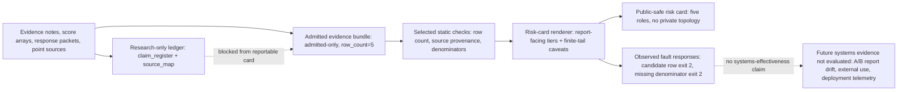

# Direction D Draft: Independent Artifact Contract and Consumer Boundary

## Assigned Research Team

| Role | Owner | Responsibility |
| --- | --- | --- |
| Systems lead | Contract architecture lead | Owns architecture, threat model, and admission-state semantics. |
| Contract engineer | Bundle validation lead | Owns bundle schema, export checks, validation, and reproducibility hooks. |
| Report/product lead | Report correctness lead | Owns user-facing report diagrams, risk-card copy, and UI-safe language. |
| Public-boundary critic | Public-boundary critic | Blocks private topology, unsupported product claims, and candidate promotion. |

## Working Paper

| Field | Draft choice |
| --- | --- |
| Title | An Artifact Contract for Safe Consumption of Diffusion Privacy Evidence |
| Target type | Independent artifact-contract/demo/report-correctness package; systems paper only after measured prevention or use evidence |
| Venue posture | Artifact track, demo track, software-engineering-for-ML venue; applied systems only after report-renderer drift reduction, external-use, or deployment/demo evidence. Selected fault-injection supports the artifact/demo package but is not enough by itself for systems-effectiveness claims. |
| Current artifact | Artifact-contract appendix/demo draft; not a full systems-paper track without a passing promotion gate |

## Abstract

Membership inference scores are not automatically safe to consume in privacy
reports. A score may be valid under a narrow experiment, candidate-only under a
research boundary, or non-portable because artifacts lack row binding. This
paper describes an artifact contract that turns diffusion privacy results into
machine-checkable evidence bundles and report-correctness obligations.
Direction D is self-contained as an artifact-contract paper: the contract
records target identity, split semantics, metric provenance, finite-tail
denominators, artifact provenance, boundary language, and admission state. The
exported bundle and existing checks encode a reportable mixed-strength
consumption contract: three rows are replay-admitted, while recon and GSA are
source-documented point estimates with narrower report wording. Strong
candidates such as H2 output-cloud geometry and Tracing the Roots
remain visible only as manually blocked examples in the vetted card; this does
not evaluate automatic enforcement at the Research-output boundary. Deployment enforcement,
external adoption, and measured prevention of report drift are not evaluated in
the current evidence bundle.

## Controlling Thesis

The artifact contribution is safe consumption by contract, not deployed
enforcement or proven user-impact reduction. A report generator should not
decide from AUC alone. It should
decide from a bundle that encodes whether a claim is admitted, candidate,
support-only, or blocked, and what finite-tail and provenance caveats must be
shown to users. Initial bundle and risk-card fault injections are now observed,
but without report-drift, external-use, or deployment evidence, this remains an
artifact/demo report-correctness package rather than a full systems paper.
The current report-language A/B check is a direct phrase smoke, not a semantic
verifier or measured report-drift evaluation.

Path convention: command and artifact paths in this draft are relative to the
`Research/` repository root.

## Current Artifact/Demo Packet

This packet is the current D-line submission surface. It is intentionally an
artifact/demo packet, not a systems-effectiveness result.

| Packet item | Current artifact | What it proves now | What it does not prove |
| --- | --- | --- | --- |
| Architecture figure | [`direction-d-architecture.svg`](direction-d-architecture.svg) | The reportable bundle, checks, renderer, public card, and future systems-evidence boundary can be explained without private topology. | Deployed enforcement or external adoption. |
| Public-safe risk card | `workspaces/implementation/artifacts/admitted-risk-card.md` | The admitted bundle can render five role-separated report rows with replay/source tiers and finite-tail caveats. | That candidates are safe to report, or that users interpret the card correctly. |
| Risk-card renderer check | `scripts/render_admitted_risk_card.py --check` | The current card renders, and selected invalid inputs such as candidate replacement, missing denominator, and private source fields are rejected. | General semantic report verification or measured drift reduction. |
| Public-surface guard | `scripts/check_public_surface.py` and `run_pr_checks.py` | Current public text and synthetic direct-promotion phrases are checked against private-surface and candidate-promotion leakage. | Complete natural-language safety for arbitrary future reports. |
| Fault-injection table | Minimum fault-injection table below. | Selected bundle/risk card renderer faults have observed rejection behavior and can support artifact/demo correctness claims. | Systems effectiveness, report-renderer A/B drift reduction, or deployment governance. |

## Contribution Claims

| Claim | Evidence anchor | Boundary |
| --- | --- | --- |
| D-C1: Machine-checkable bundles can encode replay/source tiers and admitted/candidate separation. | `admitted-evidence-bundle.json`, public-surface checks | Current reportable set has five rows only, with mixed replay strength; enforcement is not evaluated. |
| D-C2: Candidate visibility and consumer-boundary admission must be separate states. | H2 and Tracing Roots boundary notes | No Runtime row promotion or deployed-enforcement claim. |
| D-C3: Finite-tail semantics require report language. | TPR@0.1%FPR denominators | Not calibrated sub-percent risk. |
| D-C4: Selected structural and report-language checks reject selected invalid inputs. | Existing bundle checks, `scripts/render_admitted_risk_card.py --check`, and observed injected-fault exits | These checks support artifact/demo correctness only; report-drift reduction, external use, deployment evidence, and broad systems effectiveness are not evaluated. |

## Manuscript Spine

| Section | Draft content |
| --- | --- |
| Introduction | Show how a correct research score can become an incorrect product/report claim when consumed without boundary metadata. |
| Threat Model | Define research producer, reportable bundle, existing check path, report renderer, consumer, stale artifact, and unsupported candidate promotion. |
| Contract Design | Define schema fields: target identity, split semantics, metrics, finite-tail denominator, provenance, boundary language, admission state. |
| Artifact Bridge | Explain export, validation, public-surface checks, and why candidates remain research-only. |
| Boundary Examples | Five reportable rows, H2 blocked candidate, Tracing Roots feature packet, weak bounded scouts. |
| Artifact Checks | Static bundle-completeness, public-surface hygiene, reportable-row tier preservation, finite-tail denominator checks, and observed bundle/risk-card fault blocking; report-drift responses remain unmeasured. |
| Public-Safe Card | Demonstrate a generated five-role risk card with report-facing tiers and candidate exclusion. |
| Limitations | Needs report-renderer A/B drift reduction, external-use, or deployment evidence to become a full systems paper; existing selected fault-injection supports artifact/demo claims only. |

## Standalone Version Definition

This version should read as:

> We package the evidence-contract methodology as a machine-readable artifact
> contract, specify report-correctness checks, and show how a public-safe report
> should preserve admitted/candidate boundaries. This is an independent
> artifact-contract paper version.

It should not read as:

> This is a deployed enforcement study with proven user-impact reduction.

The current evidence supports an artifact/demo report-correctness package, not
a full systems-effectiveness paper. A systems paper requires measured
prevention or use evidence: report-renderer A/B drift checks, external use, or
deployment evaluation. The selected bundle and risk card fault-injection rows
are necessary evidence for the demo package, but they do not by themselves
establish systems effectiveness.

## Hard Go / No-Go Promotion Gate

Direction D should be written as an artifact/demo/report-correctness package
until report-renderer A/B drift reduction, semi-external use, or public-safe
deployment/demo enforcement is observed. Current selected fault-injection is
artifact/demo evidence only. Without measured report-surface or use evidence,
the decision is no-go for full systems framing and no-go for claims that the
contract has reduced report drift, been externally adopted, or governed a
deployed system.

| Evidence class | Passing evidence | Current state | Claim allowed now |
| --- | --- | --- | --- |
| Fault-injection | Inject candidate promotion, missing denominator, row-count drift, unsafe source field, or overclaiming language and show the contract/report path rejects or flags the selected cases. | Generated matrix `papers/diffaudit-evidence-paper/versions/direction-d-report-correctness-fault-injection.md`: 28 selected expected outcomes pass, with four renderer mutations rejected, direct candidate/support promotions flagged, metadata-only promotion mutations flagged, and clean boundary language accepted. | We can claim selected report-surface fault checks for an artifact/demo package, not systems effectiveness or report-renderer drift reduction. |
| Report-drift | Compare unconstrained and contract-governed report paths and show fewer unsupported claims under the contract. | Not evaluated as a drift-reduction study. Boundary no-drift audits exist for 2026-05-12 and 2026-05-15; the 2026-06-08 matrix includes selected direct-promotion snippets and the generated card as a guarded output. | We can claim selected direct-phrase guard and boundary synchronization audits, not quantified drift reduction. |
| External-use | A competition report, third-party reviewer, or non-Research author uses the bundle and records allowed vs blocked claims. | Not collected. | We can describe intended users, not adoption. |
| Deployment evidence | Public-safe demo or deployment telemetry shows the contract governs report inputs without exposing private topology. | Not collected. | We can show architecture, not deployed enforcement. |

## Two-Level Promotion Gate

| Gate level | Required artifacts | Current decision |
| --- | --- | --- |
| Artifact/demo gate | Public-safe risk card, fault-injection matrix, no-private-surface scan, recorded admitted-bundle check, and rendered architecture figure. | Passed for selected static bundle/public-surface checks, generated risk card check, the nine-case selected-fault matrix, and a static architecture SVG. Editorial integration is still needed before submission. |
| Systems/tool-paper gate | Report-renderer A/B drift reduction, semi-external use, or public-safe deployment/demo enforcement. | Not passed. Bundle-level fault-injection and consumer-boundary no-drift audits exist, but no report-renderer A/B drift reduction, external-use, or deployment evidence exists; no systems-effectiveness claim. |

The fault-injection path is the preferred first observed evidence because it is
cheap, public-safe, and directly tests the artifact contract. External use and
deployment evidence are higher cost and easier to contaminate with private
topology.

## Existing Consumer-Drift Evidence

Direction D can cite existing report-boundary audits as observed evidence that
the admitted-only consumer boundary stayed synchronized during candidate churn.
This is weaker than a renderer A/B drift-reduction evaluation, but stronger
than a schema-only artifact description.

| Audit | Trigger | Observed result | Claim allowed |
| --- | --- | --- | --- |
| `docs/evidence/admitted-consumer-drift-audit-20260512.md` | Candidate closures and hold decisions after SecMI, I-B, I-C, H2/simple-distance, CLiD, and related work. | Validators/exporters passed; admitted bundle remained `admitted-only` with `row_count=5`; excluded candidates stayed non-consumable. | Existing checks preserved the admitted-only boundary for that audit window. |
| `docs/evidence/admitted-consumer-drift-audit-20260515.md` | Watch, watch-plus, support-only, candidate-only, defense, cross-modal, score-packet, paper-source, withdrawn, and artifact-incomplete lines. | Validators/exporters passed; admitted bundle stayed five reviewed consumer rows; recent excluded lines did not produce Platform product rows or Runtime schema changes. | Candidate churn did not drift into the consumer bundle under the audited checks. |

The paper must not turn these audits into user-impact, external-adoption, or
deployed-enforcement claims. They are report-boundary synchronization evidence.

## Generated Public-Safe Risk Card

This card is the candidate artifact/demo surface. It is generated from the
admitted bundle at `workspaces/implementation/artifacts/admitted-risk-card.md`
and checked by `scripts/render_admitted_risk_card.py --check`. It intentionally
shows only five bounded report roles.

| Card field | Public-safe wording |
| --- | --- |
| Scope banner | "DiffAudit case-study bundle for diffusion privacy evidence consumption." |
| Role banner | "Rows are role-separated. Three rows are replay-admitted from row/target-score arrays; two rows are source-documented point estimates. This is not a cross-access leaderboard." |
| Candidate banner | "Candidate and support-only rows, including H2 output-cloud geometry, Tracing Roots, ReDiffuse, CommonCanvas, MIDST, CLiD, weak scouts, and source-confounded packets, are not public reportable audit rows." |
| Finite-tail banner | "TPR@low-FPR values are finite packet readouts, not calibrated continuous sub-percent risk estimates." |
| Public-surface banner | "No private topology, local machine paths, real domains, secrets, or unreleased raw artifact paths are included." |

| Report role | Evidence tier | Public metric line | Caveat required on card |
| --- | --- | --- | --- |
| Black-box public-subset risk | Source-documented point estimate | Recon DDIM public-100 AUC `0.837`, TPR@0.1%FPR `0.11` | Finite packet over `100` public nonmembers; no sidecar interval or real-world deployment claim. |
| Gray-box primary risk | Row-score replay | PIA GPU512 AUC `0.841339`, TPR@0.1%FPR `0.011719` | Row replay over `512` nonmembers; finite empirical tail only. |
| Gray-box defense comparator | Row-score replay | PIA + stochastic-dropout AUC `0.828075`, TPR@0.1%FPR `0.009766` | Comparator only; not validated privacy protection. |
| White-box upper-bound comparator | Source-documented point estimate | GSA AUC `0.998192`, TPR@0.1%FPR `0.432` | Upper-bound comparator only; no access-level winner or interval/dominance claim. |
| Target-score defense bridge | Target-score replay | DPDM W-1 AUC `0.488783`, TPR@0.1%FPR `0.0` | Defense bridge; not a final benchmark or general privacy guarantee. |

The card's first correctness property is exclusion: H2, Tracing Roots,
ReDiffuse, CommonCanvas, MIDST, CLiD, weak scouts, and source-confounded packets
must stay out of the public reportable row set unless their admission state
changes in the shared claim register and source map.

| Renderer check | Observed response | Claim allowed |
| --- | --- | --- |
| Current admitted bundle | Renderer check passes and emits the five-row card. | The card is synchronized with the admitted bundle. |
| H2 candidate replaces an admitted row | Renderer exits `2` with `risk card refuses non-admitted row`. | Candidate rows are rejected from the public card. |
| Missing nonmember denominator | Renderer exits `2` with `risk-card row ... missing nonmember denominator`. | Finite-tail rows require an explicit denominator. |
| Private source field in a risk card row | Renderer exits `2` with `contains private surface`. | Local path leakage is rejected before public card rendering. |
| Internal `runtime-smoke` label | The card reports `target-score replay` rather than exposing the internal label. | Public evidence tiers are report-facing, not runtime-internal. |

## Section-Level Draft Skeleton

| Section | Claim to make | Required evidence | Text boundary |
| --- | --- | --- | --- |
| 1. Introduction | Correct research scores can become unsafe report claims when boundary metadata is dropped. | Current admitted/candidate evidence examples. | Do not imply deployed enforcement. |
| 2. Threat Model | The risk is unsupported promotion, stale artifacts, missing denominators, and private/public surface confusion. | Claim register and public-surface checks. | Use abstract components only. |
| 3. Artifact Contract | The bundle records admission state, replay/source tier, metrics, finite tails, provenance, and boundary language. | reportable bundle and validation scripts. | Encoding, not proof of runtime prevention. |
| 4. Contract Checks | Existing bundle/check paths identify which missing fields and unsafe report inputs should be rejected or flagged. | Existing static checks plus observed bundle-level fault injections. | Report-drift prevention claim requires report-surface tests; do not add a new validator framework for symmetry. |
| 5. Blocked Promotion Examples | H2 and Tracing Roots show why candidates must stay research-only. | H2 and Tracing Roots evidence boundaries. | Do not describe them as product features. |
| 6. Report Example | A public-safe risk card can display reportable rows with replay/source caveats. | Existing reportable rows and finite-tail denominators. | No private paths, topology, domains, or deployment details. |

## Figure and Table Plan

| Asset | Purpose |
| --- | --- |
| Artifact-contract architecture diagram | Shows research artifacts flowing into the reportable bundle, existing checks, and report renderer. |
| Bundle schema table | Defines machine-checkable fields and user-facing meaning. |
| Admission-state state machine | Shows admitted, candidate, support-only, blocked, and watch-only transitions. |
| Fault-injection evaluation table | Tests checks that catch unsupported public/report claims. |
| Risk-card example | Demonstrates finite-tail and boundary language in a consumer report. |

Rendered figure asset: [`direction-d-architecture.svg`](direction-d-architecture.svg).

Architecture diagram source for the artifact/demo version:

## Minimum Fault-Injection Table Before Submission

| Injected fault | Existing check path to reuse | Expected response to be tested | Observed response |
| --- | --- | --- | --- |
| Candidate row inserted into the reportable/admitted output path | `scripts/export_admitted_evidence_bundle.py --check` and claim-register state checks | Validator or report renderer should reject, hide, flag, or force a caveat. | Observed 2026-05-27: temp bundle with injected H2 candidate row exits `2` with `admitted evidence bundle is out of sync`. |
| Candidate row replaces an admitted risk-card row | `scripts/render_admitted_risk_card.py --check` | Renderer should reject the public card rather than caveat the candidate as reportable. | Observed 2026-05-27: temp risk-card bundle exits `2` with `risk card refuses non-admitted row`. |
| Missing low-FPR denominator | `_tail_nonmember_count` extraction and bundle metric completeness checks | Validator or report renderer should reject the finite-tail metric or force a caveat. | Observed 2026-05-27: temp source table with recon denominator removed exits `2` with `needs a recoverable nonmember denominator`. |
| Missing low-FPR denominator in the risk-card bundle | `scripts/render_admitted_risk_card.py --check` | Renderer should reject the card before emitting finite-tail wording. | Observed 2026-05-27: temp risk-card bundle exits `2` with `risk-card row ... missing nonmember denominator`. |
| Absolute local/private path in source field | `scripts/render_admitted_risk_card.py --check` plus `scripts/check_public_surface.py` | Renderer or public-surface hygiene should reject the export before a public card leaks local paths. | Observed 2026-05-27: synthetic risk-card bundle with a private source field exits via renderer validation with `contains private surface`; current tracked public surface passes. |
| Row-count or replay-tier drift from expected reportable bundle | `scripts/export_admitted_evidence_bundle.py --check` | Validator should flag bundle drift. | Observed 2026-05-27: temp bundle with one row removed exits `2` with `admitted evidence bundle is out of sync`. |
| Source-provenance drift in an admitted row | `scripts/export_admitted_evidence_bundle.py` selector source check | Export should reject mismatched source provenance before writing a bundle. | Observed 2026-05-27: temp source table with PIA source changed exits `2` with `source drift`. |
| Direct candidate-promotion phrase | `claim_register.md` plus PDF/markdown forbidden-text scan | Report-language check should flag candidate-boundary leakage. | Observed 2026-05-27: `scripts/check_public_surface.py` scans `main.tex`, the D brief/draft, and the generated risk card markdown for direct candidate-as-admitted/reportable language covering H2, Tracing the Roots, ReDiffuse, CommonCanvas, MIDST, CLiD, weak scouts, and source-confounded packets. `run_pr_checks.py` also checks synthetic promotion phrases while the current generated risk card text is clean. This is a direct phrase smoke, not a general semantic verifier or measured drift reduction. |

## Evidence Required Before Full Systems-Paper Promotion

| Evidence | Minimum acceptable form |
| --- | --- |
| Fault-injection | A table of injected faults with expected and observed contract/report responses, including unsupported promotion and finite-tail miswording cases. Bundle-level candidate insertion, row removal, missing denominator, and source drift are now observed; risk card renderer candidate replacement, missing-denominator rejection, and private-source rejection are also observed. Direct candidate-as-admitted/reportable language injection is covered by the direct-phrase scan, and the current generated risk card text is checked as the guarded side of a tiny report-language A/B smoke. These rows support artifact/demo correctness checks; full report-renderer A/B drift remains future work for systems claims. |
| External or semi-external use | A competition report, third-party review, or non-Research author using a bundle to produce a report and recording allowed vs blocked claims. |
| Report-drift evaluation | Existing 2026-05-12 and 2026-05-15 audits show admitted-only boundary synchronization across candidate churn. A stronger systems claim still needs before/after or fault-injection table evidence from a report renderer showing blocked candidate promotion, finite-tail miswording, row-count or replay-tier drift, candidate insertion into the reportable/admitted output path, or UI/report overclaiming. |
| Public-safe report example | A risk card that contains admitted rows, boundary language, and finite-tail caveats without private topology or local paths. |
| Deployment evidence | Public-safe demo or deployment record showing schema, export, validation flow, and report surface only; no real domains, SSH aliases, secrets, or private machine topology. |

## Team Work Order

| Team member | Next useful action | Explicit non-action |
| --- | --- | --- |
| Systems lead | Reframe the paper around artifact contract and report-correctness threats. | Do not claim deployed runtime enforcement. |
| Contract engineer | Maintain the minimal fault-injection table and map each observed response to existing bundle/check or report-language checks. | Do not add a new validator framework unless existing checks cannot express the fault. |
| Report/product lead | Maintain the generated public-safe risk card using reportable rows only, with replay/source caveats. | Do not include private topology, real domains, local paths, secrets, or candidate-as-feature language. |
| Public-boundary critic | Block any systems-paper promotion until measured prevention evidence exists. | Do not accept "schema exists" as a systems evaluation. |

## Review Risks and Fixes

| Risk | Fix |
| --- | --- |
| Looks like product documentation. | Tie every system feature to a measurement error it is meant to prevent, then require observed fault-injection or drift evidence before claiming prevention. |
| No systems-promotion evidence. | Add fault-injection, report-drift, external-use, or deployment evidence before full systems-paper submission. |
| Leaks private deployment detail. | Keep topology, secrets, domains, and local machine paths out of public text. |
| Candidate rows creep into product claims. | Treat H2 and Tracing Roots as blocked examples, not feature launches. |

## Go / No-Go

| Decision | Condition |
| --- | --- |
| Proceed with Markdown artifact/demo preparation | Current state supports contract/report-boundary drafting, not submission. |
| Submit as artifact/demo package | Requires editorial integration of the rendered architecture figure plus the existing public-safe bundle/risk card example and observed fault-injection table rows; systems-effectiveness still requires report-drift, external-use, or deployment evidence. |
| Promote to full systems paper | Allowed only after report-renderer A/B drift reduction, external-use, or public-safe deployment/demo evidence is observed and reviewed; selected fault-injection alone is not enough. |
| Stop | If it only restates schema without showing measurable report-correctness benefit. |
